# Eventual Consistency

## Table of Contents
- [Introduction](#introduction)
- [Understanding Consistency Models](#understanding-consistency-models)
- [The CAP Theorem](#the-cap-theorem)
- [What is Eventual Consistency?](#what-is-eventual-consistency)
- [How Eventual Consistency Works](#how-eventual-consistency-works)
- [Consistency Patterns](#consistency-patterns)
- [Conflict Resolution Strategies](#conflict-resolution-strategies)
- [Implementing Eventual Consistency](#implementing-eventual-consistency)
- [Challenges and Solutions](#challenges-and-solutions)
- [Use Cases and Examples](#use-cases-and-examples)
- [Monitoring and Testing](#monitoring-and-testing)
- [Best Practices](#best-practices)
- [Trade-offs](#trade-offs)

## Introduction

Eventual consistency is a consistency model used in distributed systems where updates to a system will propagate to all nodes eventually, but not necessarily immediately. It's a fundamental concept in building scalable, highly available distributed applications.

**Key Concept:** The system guarantees that if no new updates are made to a given data item, eventually all accesses to that item will return the last updated value.

**Why It Matters:**
- Enables massive scale and high availability
- Reduces latency for global applications
- Allows systems to remain operational during network partitions
- Powers many modern distributed systems (DNS, CDNs, NoSQL databases)

**Related Documents:**
- See [database_scaling.md](./database_scaling.md) for scaling strategies that use eventual consistency
- See [horizontal_scaling.md](./horizontal_scaling.md) for distributed system architectures
- See [caching_strategies.md](./caching_strategies.md) for cache consistency patterns
- See [message_queues.md](./message_queues.md) for async processing with eventual consistency

## Understanding Consistency Models

Consistency models define rules for how and when updates to data become visible across a distributed system.

### Strong Consistency (Immediate Consistency)

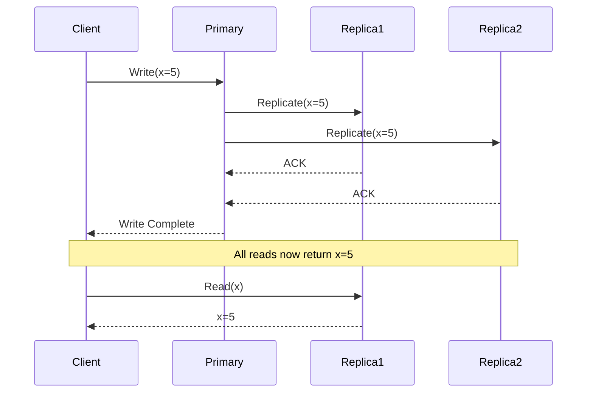
```mermaid
sequenceDiagram
    participant Client
    participant Primary
    participant Replica1
    participant Replica2
    
    Client->>Primary: Write(x=5)
    Primary->>Replica1: Replicate(x=5)
    Primary->>Replica2: Replicate(x=5)
    Replica1-->>Primary: ACK
    Replica2-->>Primary: ACK
    Primary-->>Client: Write Complete
    Note over Client,Replica2: All reads now return x=5
    Client->>Replica1: Read(x)
    Replica1-->>Client: x=5
```

**Characteristics:**
- All nodes see the same data at the same time
- Writes are not confirmed until all replicas are updated
- Read operations always return the most recent write
- High consistency, but at cost of availability and latency

**Example:** Traditional RDBMS transactions (PostgreSQL, MySQL)

### Eventual Consistency

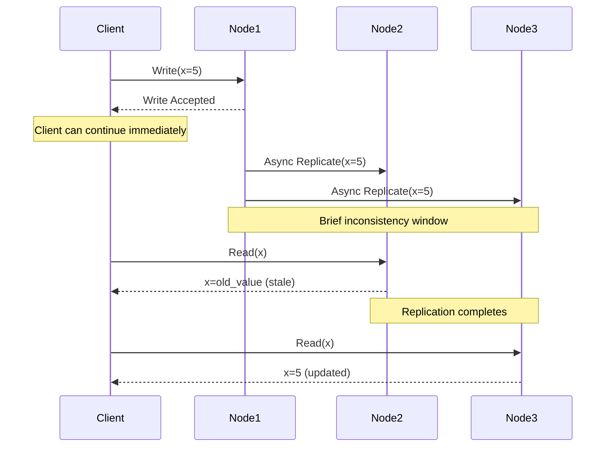
```mermaid
sequenceDiagram
    participant Client
    participant Node1
    participant Node2
    participant Node3
    
    Client->>Node1: Write(x=5)
    Node1-->>Client: Write Accepted
    Note over Client: Client can continue immediately
    
    Node1->>Node2: Async Replicate(x=5)
    Node1->>Node3: Async Replicate(x=5)
    
    Note over Node1,Node3: Brief inconsistency window
    
    Client->>Node2: Read(x)
    Node2-->>Client: x=old_value (stale)
    
    Note over Node2,Node3: Replication completes
    
    Client->>Node3: Read(x)
    Node3-->>Client: x=5 (updated)
```

**Characteristics:**
- Updates propagate asynchronously
- Temporary inconsistencies between nodes
- High availability and low latency
- Eventually all nodes converge to same state

**Example:** DynamoDB, Cassandra, DNS, CDNs

### Other Consistency Models

**Causal Consistency:**
- Preserves cause-and-effect relationships
- If operation A causes operation B, all nodes see A before B
- Weaker than strong, stronger than eventual

**Read-Your-Writes Consistency:**
- User always sees their own updates
- Other users may see stale data
- Good for user experience

**Monotonic Reads:**
- Once a user reads a value, they never see an older value
- Prevents "going back in time"
- Important for user experience

**Session Consistency:**
- Consistency within a single session
- Different sessions may see different states
- Common in web applications

## The CAP Theorem

The CAP theorem states that a distributed system can only guarantee two of three properties:

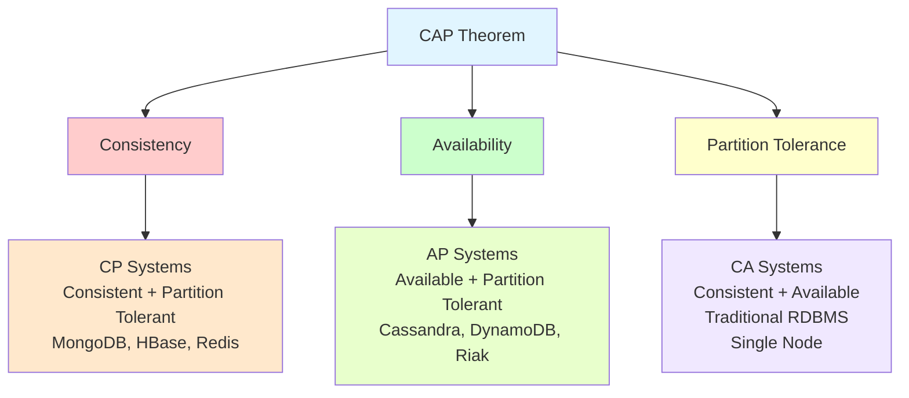
```mermaid
graph TD
    A[CAP Theorem] --> B[Consistency]
    A --> C[Availability]
    A --> D[Partition Tolerance]
    
    B --> E[CP Systems<br/>Consistent + Partition Tolerant<br/>MongoDB, HBase, Redis]
    C --> F[AP Systems<br/>Available + Partition Tolerant<br/>Cassandra, DynamoDB, Riak]
    D --> G[CA Systems<br/>Consistent + Available<br/>Traditional RDBMS<br/>Single Node]
    
    style A fill:#e1f5ff
    style B fill:#ffcccc
    style C fill:#ccffcc
    style D fill:#ffffcc
    style E fill:#ffe8cc
    style F fill:#e8ffcc
    style G fill:#f0e8ff
```

### The Three Properties

**Consistency (C):**
- All nodes see the same data at the same time
- Every read receives the most recent write
- Strong consistency guarantees

**Availability (A):**
- Every request receives a response (success or failure)
- System remains operational
- No downtime

**Partition Tolerance (P):**
- System continues to operate despite network failures
- Can handle communication breakdowns between nodes
- Essential for distributed systems

### CAP in Practice

**Reality:** Network partitions will happen, so you must choose between Consistency and Availability during partitions.

**CP Systems (Choose Consistency):**
- Sacrifice availability during partitions
- Return errors rather than stale data
- Use cases: Banking, inventory systems, booking systems

**AP Systems (Choose Availability):**
- Sacrifice consistency during partitions
- Always return a response (may be stale)
- Use cases: Social media, content delivery, analytics

**CA Systems:**
- Only achievable in single-node systems
- Not viable for distributed systems
- Network partitions are inevitable

## What is Eventual Consistency?

### Core Principles

**1. Convergence:**
- All replicas will eventually converge to the same state
- Given enough time without new updates
- No guarantee on how long it takes

**2. Asynchronous Propagation:**
- Updates spread through the system over time
- No blocking for replication
- Low latency for write operations

**3. Conflict Resolution:**
- System must handle conflicting updates
- Automated or application-level resolution
- Various strategies available

### The Consistency Window

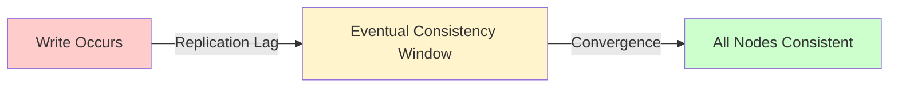
```mermaid
graph LR
    A[Write Occurs] -->|Replication Lag| B[Eventual Consistency Window]
    B -->|Convergence| C[All Nodes Consistent]
    
    style A fill:#ffcccc
    style B fill:#fff4cc
    style C fill:#ccffcc
```

**Factors Affecting Window Size:**
- Network latency and bandwidth
- System load and replication backlog
- Number of replicas
- Geographic distribution
- Replication strategy

**Typical Windows:**
- Same datacenter: Milliseconds to seconds
- Cross-region: Seconds to minutes
- Global distribution: Minutes (rare cases)

## How Eventual Consistency Works

### Basic Replication Flow

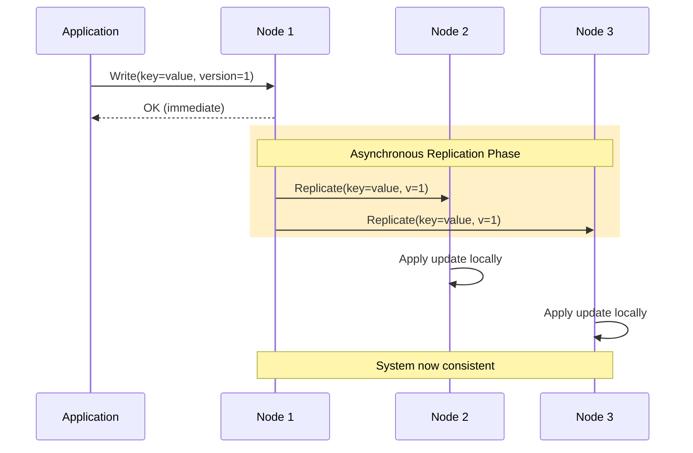
```mermaid
sequenceDiagram
    participant App as Application
    participant N1 as Node 1
    participant N2 as Node 2
    participant N3 as Node 3
    
    App->>N1: Write(key=value, version=1)
    N1-->>App: OK (immediate)
    
    rect rgb(255, 240, 200)
    Note over N1,N3: Asynchronous Replication Phase
    N1->>N2: Replicate(key=value, v=1)
    N1->>N3: Replicate(key=value, v=1)
    end
    
    N2->>N2: Apply update locally
    N3->>N3: Apply update locally
    
    Note over N1,N3: System now consistent
```

### Version Vectors and Timestamps

**Vector Clocks:**
Track causality of updates across distributed systems

```javascript
// Conceptual representation
{
    node1: 5,  // Node 1 has seen 5 updates
    node2: 3,  // Node 2 has seen 3 updates
    node3: 7   // Node 3 has seen 7 updates
}
```

**Logical Timestamps:**
- Lamport timestamps: Total ordering of events
- Version numbers: Simple incrementing counters
- Hybrid logical clocks: Combine physical and logical time

### Anti-Entropy Mechanisms

**1. Gossip Protocols:**
- Nodes periodically exchange state with random peers
- Updates spread through the system like gossip
- Self-healing and resilient

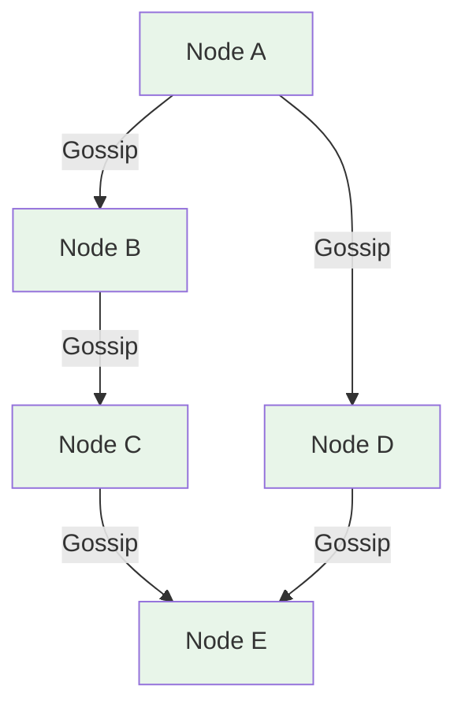
```mermaid
graph TD
    A[Node A] -->|Gossip| B[Node B]
    B -->|Gossip| C[Node C]
    A -->|Gossip| D[Node D]
    C -->|Gossip| E[Node E]
    D -->|Gossip| E
    
    style A fill:#e8f5e9
    style B fill:#e8f5e9
    style C fill:#e8f5e9
    style D fill:#e8f5e9
    style E fill:#e8f5e9
```

**2. Merkle Trees:**
- Hierarchical hash trees for efficient comparison
- Quickly identify differences between replicas
- Used by Cassandra, DynamoDB

**3. Read Repair:**
- Detect inconsistencies during read operations
- Automatically repair stale replicas
- Transparent to application

**4. Hinted Handoff:**
- Store writes temporarily when node is down
- Replay when node comes back online
- Ensures no data loss

**Reference:** See [message_queues.md](./message_queues.md) for async message propagation patterns.

## Consistency Patterns

### Write Patterns

#### Fire-and-Forget

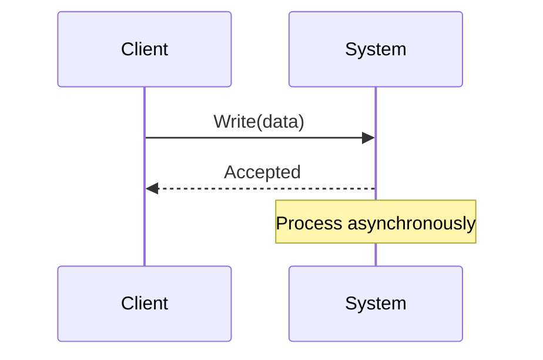
```mermaid
sequenceDiagram
    participant Client
    participant System
    
    Client->>System: Write(data)
    System-->>Client: Accepted
    Note over System: Process asynchronously
```

- Fastest write performance
- No confirmation of replication
- Risk of data loss
- Use case: Non-critical logs, metrics

#### Write-Behind (Lazy Replication)

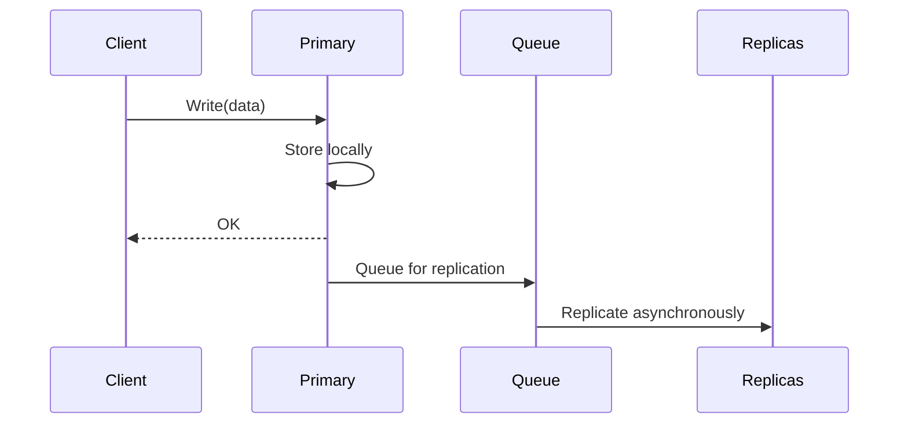
```mermaid
sequenceDiagram
    participant Client
    participant Primary
    participant Queue
    participant Replicas
    
    Client->>Primary: Write(data)
    Primary->>Primary: Store locally
    Primary-->>Client: OK
    Primary->>Queue: Queue for replication
    Queue->>Replicas: Replicate asynchronously
```

- Low latency writes
- Guaranteed durability on primary
- Async replication to followers
- Use case: Most eventually consistent systems

#### Quorum Writes

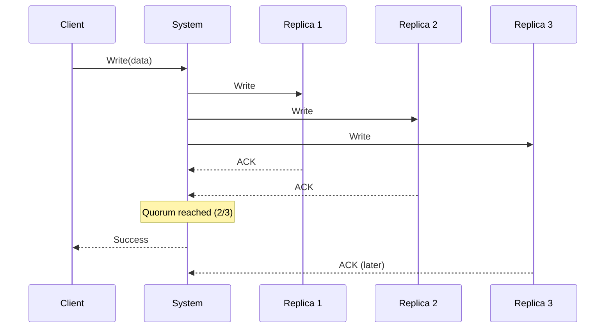
```mermaid
sequenceDiagram
    participant Client
    participant System
    participant R1 as Replica 1
    participant R2 as Replica 2
    participant R3 as Replica 3
    
    Client->>System: Write(data)
    System->>R1: Write
    System->>R2: Write
    System->>R3: Write
    
    R1-->>System: ACK
    R2-->>System: ACK
    Note over System: Quorum reached (2/3)
    System-->>Client: Success
    
    R3-->>System: ACK (later)
```

- Write confirmed when W replicas acknowledge
- Tunable consistency (W value)
- Balance between consistency and latency
- Use case: Configurable consistency requirements

### Read Patterns

#### Read from Any Node

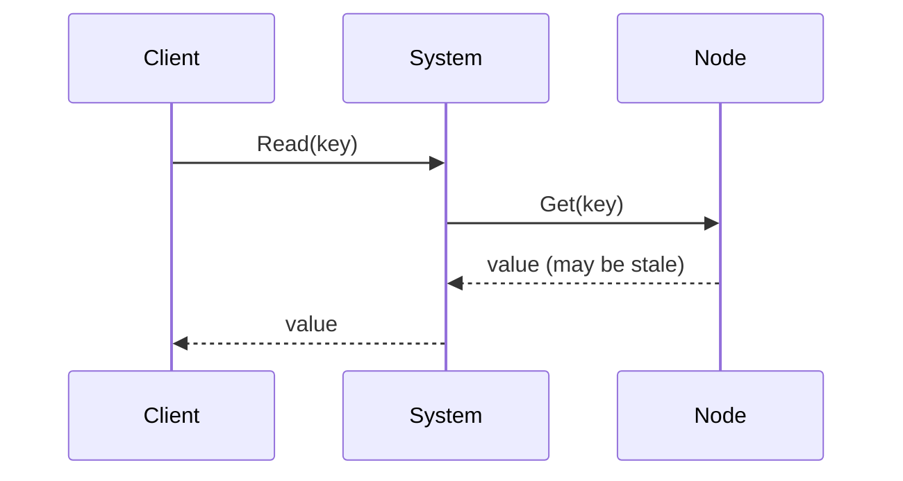
```mermaid
sequenceDiagram
    participant Client
    participant System
    participant Node
    
    Client->>System: Read(key)
    System->>Node: Get(key)
    Node-->>System: value (may be stale)
    System-->>Client: value
```

- Lowest latency
- May return stale data
- Highest availability
- Use case: Social feeds, recommendations

#### Read from Quorum

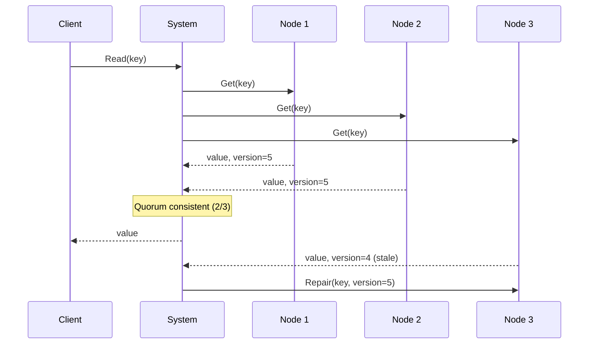
```mermaid
sequenceDiagram
    participant Client
    participant System
    participant N1 as Node 1
    participant N2 as Node 2
    participant N3 as Node 3
    
    Client->>System: Read(key)
    System->>N1: Get(key)
    System->>N2: Get(key)
    System->>N3: Get(key)
    
    N1-->>System: value, version=5
    N2-->>System: value, version=5
    Note over System: Quorum consistent (2/3)
    System-->>Client: value
    
    N3-->>System: value, version=4 (stale)
    System->>N3: Repair(key, version=5)
```

- Read from R replicas
- Higher consistency
- Increased latency
- Use case: When consistency is more important

#### Read Repair

- Detect inconsistencies during reads
- Update stale replicas in background
- Transparent to application
- Gradually improves consistency

**Reference:** See [database_scaling.md](./database_scaling.md) for read/write splitting patterns.

## Conflict Resolution Strategies

When multiple nodes accept conflicting updates, conflicts must be resolved.

### 1. Last Write Wins (LWW)

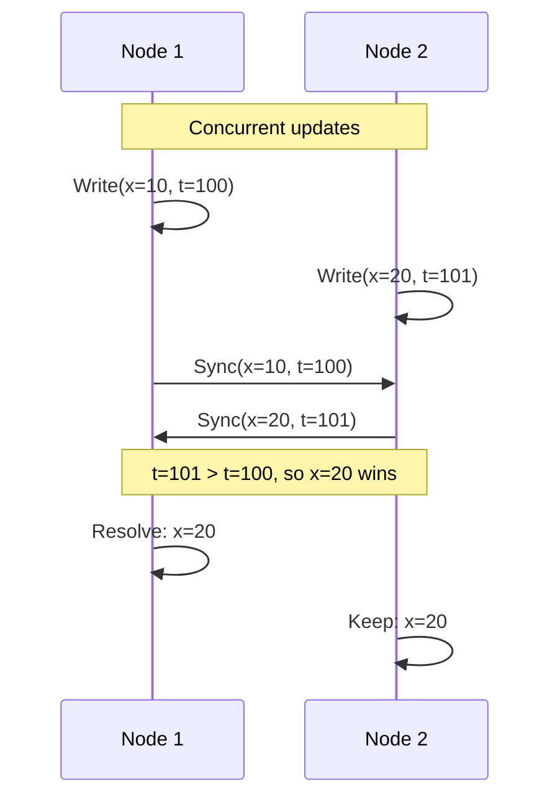
```mermaid
sequenceDiagram
    participant N1 as Node 1
    participant N2 as Node 2
    
    Note over N1,N2: Concurrent updates
    N1->>N1: Write(x=10, t=100)
    N2->>N2: Write(x=20, t=101)
    
    N1->>N2: Sync(x=10, t=100)
    N2->>N1: Sync(x=20, t=101)
    
    Note over N1,N2: t=101 > t=100, so x=20 wins
    N1->>N1: Resolve: x=20
    N2->>N2: Keep: x=20
```

**Approach:**
- Use timestamps to determine winner
- Most recent write wins
- Simple to implement

**Pros:**
- Easy conflict resolution
- No application logic needed
- Works well for simple data

**Cons:**
- Data loss (earlier writes discarded)
- Clock synchronization issues
- Not suitable for all use cases

**Use Cases:**
- Session data
- Cache entries
- Non-critical updates

### 2. Version Vectors (Multi-Value)

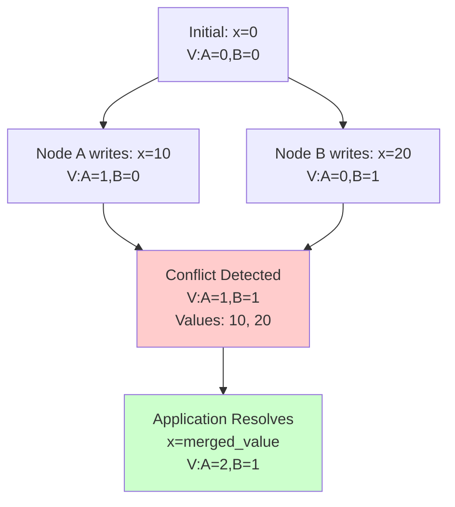
```mermaid
graph TD
    A[Initial: x=0<br/>V:A=0,B=0] --> B[Node A writes: x=10<br/>V:A=1,B=0]
    A --> C[Node B writes: x=20<br/>V:A=0,B=1]
    
    B --> D[Conflict Detected<br/>V:A=1,B=1<br/>Values: 10, 20]
    C --> D
    
    D --> E[Application Resolves<br/>x=merged_value<br/>V:A=2,B=1]
    
    style D fill:#ffcccc
    style E fill:#ccffcc
```

**Approach:**
- Track causality with vector clocks
- Keep multiple conflicting versions
- Application resolves conflicts

**Pros:**
- No data loss
- Captures causality accurately
- Flexible resolution strategies

**Cons:**
- Complex implementation
- Application must handle conflicts
- Storage overhead

**Use Cases:**
- Shopping carts (merge items)
- Collaborative editing
- Complex business logic

### 3. Operational Transformation (OT)

**Approach:**
- Transform operations to be commutative
- Apply operations in any order
- Reach same final state

**Example: Text Editing**
```javascript
// Conceptual example
User1: Insert("Hello", position=0)
User2: Insert("World", position=0)

// Transform operations so they commute
// Final state: "HelloWorld" or "WorldHello"
// (depending on transformation rules)
```

**Pros:**
- Automatic conflict resolution
- Suitable for real-time collaboration
- Maintains user intent

**Cons:**
- Complex algorithms
- Specific to operation types
- Transformation rules can be intricate

**Use Cases:**
- Google Docs, collaborative editing
- Real-time collaboration tools
- Multiplayer games

### 4. CRDTs (Conflict-Free Replicated Data Types)

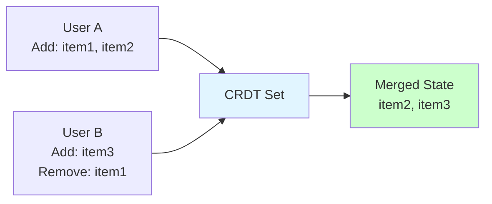
```mermaid
graph LR
    A[User A<br/>Add: item1, item2] --> C[CRDT Set]
    B[User B<br/>Add: item3<br/>Remove: item1] --> C
    
    C --> D[Merged State<br/>item2, item3]
    
    style C fill:#e1f5ff
    style D fill:#ccffcc
```

**Approach:**
- Data structures designed to automatically merge
- Operations are commutative, associative, idempotent
- No conflicts by design

**Common CRDTs:**
- **Counters:** Increment/decrement merge automatically
- **Sets:** Add-wins or remove-wins semantics
- **Registers:** Last-write-wins or multi-value
- **Maps:** Key-value with CRDT values
- **Lists:** Ordered sequences with conflict resolution

**Pros:**
- Automatic merging
- No application-level conflict resolution
- Mathematical guarantees

**Cons:**
- Limited data structure types
- Some operations difficult to express
- Metadata overhead

**Use Cases:**
- Distributed counters (likes, votes)
- Collaborative data structures
- Offline-first applications

### 5. Application-Level Resolution

**Approach:**
- Store all conflicting versions
- Present to user or business logic
- Custom resolution rules

**Example: E-commerce Cart**
```javascript
// Conceptual approach
function resolveCartConflict(version1, version2) {
    // Merge items from both carts
    return union(version1.items, version2.items);
}
```

**Pros:**
- Full control over resolution
- Business-logic aware
- Can involve users when needed

**Cons:**
- More complex application code
- May require user interaction
- Inconsistent resolution logic

**Use Cases:**
- E-commerce shopping carts
- Document management
- Business-critical data

## Implementing Eventual Consistency

### Architecture Patterns

#### Event Sourcing

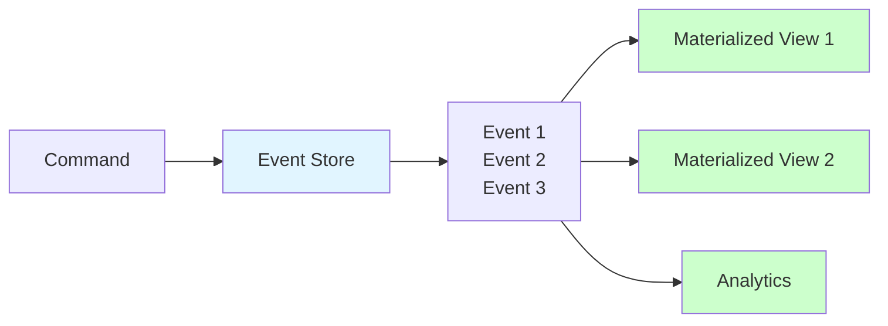
```mermaid
graph LR
    A[Command] --> B[Event Store]
    B --> C[Event 1<br/>Event 2<br/>Event 3]
    C --> D[Materialized View 1]
    C --> E[Materialized View 2]
    C --> F[Analytics]
    
    style B fill:#e1f5ff
    style D fill:#ccffcc
    style E fill:#ccffcc
    style F fill:#ccffcc
```

**Approach:**
- Store events, not current state
- Rebuild state by replaying events
- Multiple read models from same events

**Benefits:**
- Full audit trail
- Time travel (replay to any point)
- Multiple projections from same data
- Natural eventual consistency

**Challenges:**
- Event schema evolution
- Storage requirements
- Replay performance

**Reference:** See [message_queues.md](./message_queues.md) for event-driven architectures.

#### CQRS (Command Query Responsibility Segregation)

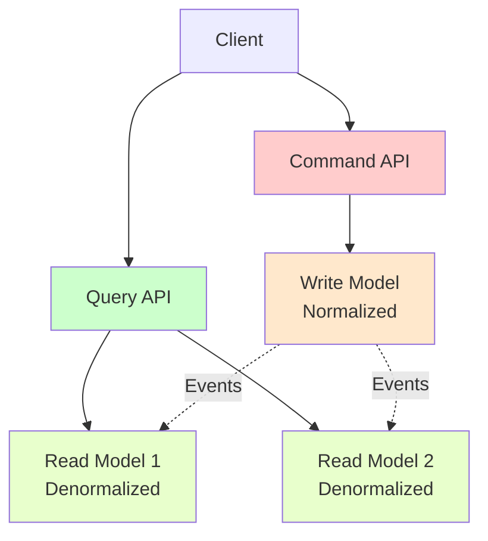
```mermaid
graph TD
    A[Client] --> B[Command API]
    A --> C[Query API]
    
    B --> D[Write Model<br/>Normalized]
    C --> E[Read Model 1<br/>Denormalized]
    C --> F[Read Model 2<br/>Denormalized]
    
    D -.->|Events| E
    D -.->|Events| F
    
    style B fill:#ffcccc
    style C fill:#ccffcc
    style D fill:#ffe8cc
    style E fill:#e8ffcc
    style F fill:#e8ffcc
```

**Approach:**
- Separate models for reads and writes
- Optimize each independently
- Async synchronization between models

**Benefits:**
- Independent scaling of reads/writes
- Optimized data models
- Flexible consistency requirements

**Challenges:**
- Increased complexity
- Data synchronization
- Dual model maintenance

### Database Replication Strategies

#### Async Replication

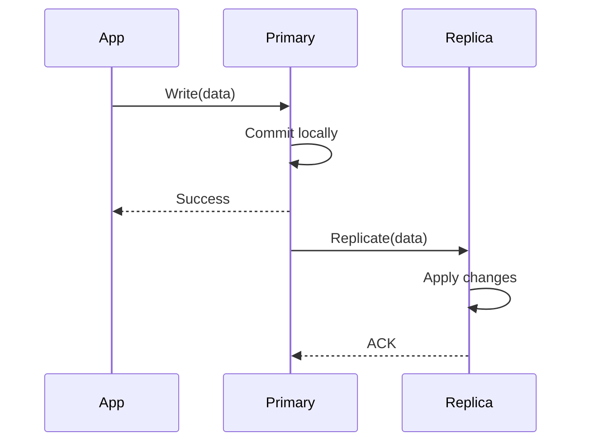
```mermaid
sequenceDiagram
    participant App
    participant Primary
    participant Replica
    
    App->>Primary: Write(data)
    Primary->>Primary: Commit locally
    Primary-->>App: Success
    
    Primary->>Replica: Replicate(data)
    Replica->>Replica: Apply changes
    Replica-->>Primary: ACK
```

- Default for eventual consistency
- Low latency writes
- Replication lag possible

#### Multi-Master Replication

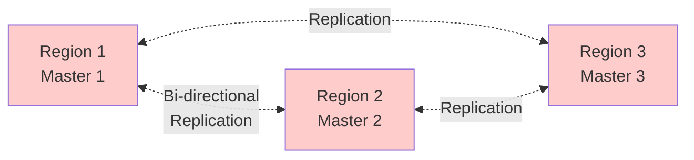
```mermaid
graph LR
    A[Region 1<br/>Master 1] <-.->|Bi-directional<br/>Replication| B[Region 2<br/>Master 2]
    A <-.->|Replication| C[Region 3<br/>Master 3]
    B <-.->|Replication| C
    
    style A fill:#ffcccc
    style B fill:#ffcccc
    style C fill:#ffcccc
```

- Multiple nodes accept writes
- Conflict resolution required
- High availability

**Reference:** See [database_scaling.md](./database_scaling.md) for detailed replication patterns.

### Distributed Cache Patterns

#### Cache-Aside with TTL

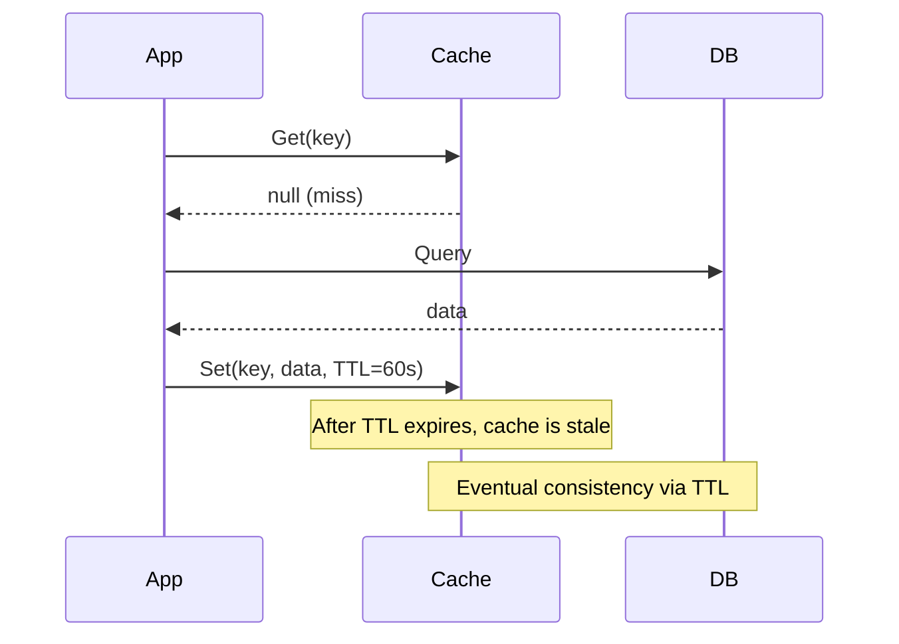
```mermaid
sequenceDiagram
    participant App
    participant Cache
    participant DB
    
    App->>Cache: Get(key)
    Cache-->>App: null (miss)
    App->>DB: Query
    DB-->>App: data
    App->>Cache: Set(key, data, TTL=60s)
    
    Note over Cache: After TTL expires, cache is stale
    Note over Cache,DB: Eventual consistency via TTL
```

- Simple eventual consistency
- Data becomes consistent after TTL
- Trade-off between freshness and load

#### Write-Through with Async Propagation

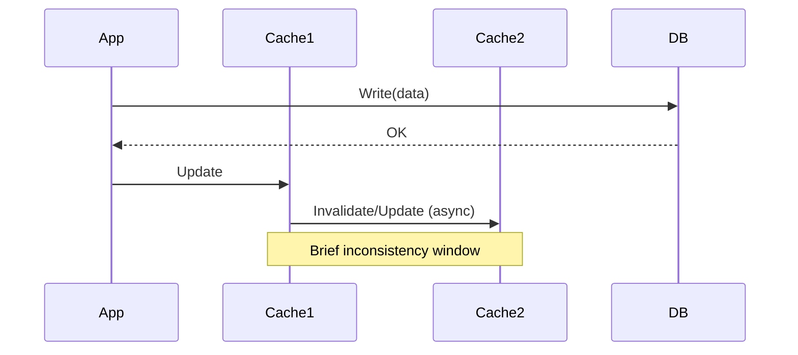
```mermaid
sequenceDiagram
    participant App
    participant Cache1
    participant Cache2
    participant DB
    
    App->>DB: Write(data)
    DB-->>App: OK
    App->>Cache1: Update
    
    Cache1->>Cache2: Invalidate/Update (async)
    
    Note over Cache1,Cache2: Brief inconsistency window
```

- Updates propagate asynchronously
- Better write performance
- Short inconsistency window

**Reference:** See [caching_strategies.md](./caching_strategies.md) for cache consistency patterns.

## Challenges and Solutions

### Challenge 1: Read-Your-Own-Writes

**Problem:** User updates data but doesn't see their own update immediately

```mermaid
sequenceDiagram
    participant User
    participant WriteNode
    participant ReadNode
    
    User->>WriteNode: Update profile
    WriteNode-->>User: Success
    
    User->>ReadNode: View profile
    ReadNode-->>User: Old data (stale)
    
    Note over User: User confused!
```

**Solutions:**

**1. Sticky Sessions:**
- Route user's requests to same node
- That node has latest writes
- Simple but limits load balancing

**2. Read from Master:**
- Read user's own data from write node
- Other users' data from replicas
- Hybrid consistency model

**3. Version Tracking:**
- Return version with write response
- Client sends version with read request
- Only return if replica has that version

**4. Client-Side Caching:**
- Cache write locally in client
- Show cached value immediately
- Eventual server confirmation

### Challenge 2: Monotonic Reads

**Problem:** User sees data regress (newer data, then older data)

```mermaid
sequenceDiagram
    participant User
    participant Replica1
    participant Replica2
    
    User->>Replica1: Read (version=5)
    Replica1-->>User: data (v=5)
    
    User->>Replica2: Read (version=3, stale)
    Replica2-->>User: data (v=3)
    
    Note over User: Data went backwards in time!
```

**Solutions:**

**1. Session Affinity:**
- Route user to same replica
- Guarantees monotonic reads
- Load balancing challenges

**2. Version Vectors:**
- Track last-seen version per client
- Only read from replicas with >= that version
- Increased complexity

**3. Minimum Version Requirement:**
- Client specifies minimum version
- Replica waits if behind
- Increased latency

### Challenge 3: Conflict Detection and Resolution

**Problem:** How to detect and resolve conflicting updates

**Solutions:**

**Detection:**
- Vector clocks for causality
- Timestamps with NTP synchronization
- Application-level version tracking

**Resolution:**
- Automatic: LWW, CRDTs
- Semi-automatic: Business rules
- Manual: User intervention

**Prevention:**
- Pessimistic locking (reduces availability)
- Single-writer principle
- Partitioning to avoid conflicts

### Challenge 4: Unbounded Replication Lag

**Problem:** Replication lag grows indefinitely

**Causes:**
- Network issues
- Overloaded replicas
- Large write bursts

**Solutions:**

**1. Monitoring and Alerting:**
- Track replication lag metrics
- Alert when threshold exceeded
- Automated remediation

**2. Backpressure:**
- Slow down writes if lag grows
- Queue writes during catch-up
- Prevent runaway lag

**3. Capacity Planning:**
- Scale replicas proactively
- Provision for peak loads
- Use auto-scaling

**4. Prioritization:**
- Critical updates first
- Batch non-critical updates
- Throttle low-priority writes

**Reference:** See [auto_scaling.md](./auto_scaling.md) for dynamic capacity management.

### Challenge 5: Testing Eventual Consistency

**Problem:** Difficult to test non-deterministic systems

**Solutions:**

**1. Chaos Engineering:**
- Inject network delays
- Simulate partitions
- Test failure scenarios

**2. Property-Based Testing:**
- Define invariants
- Test various operation sequences
- Verify convergence

**3. Jepsen Testing:**
- Distributed systems testing framework
- Verifies consistency guarantees
- Finds subtle bugs

**4. Synthetic Monitoring:**
- Continuous consistency checks
- Measure replication lag
- Track convergence time

## Use Cases and Examples

### Appropriate Use Cases

#### 1. Social Media Feeds

```mermaid
graph TD
    A[User Posts] --> B[Write to Primary]
    B --> C[Replicate to Region 1]
    B --> D[Replicate to Region 2]
    B --> E[Replicate to Region 3]
    
    C --> F[User Feeds in Region 1]
    D --> G[User Feeds in Region 2]
    E --> H[User Feeds in Region 3]
    
    style B fill:#ffcccc
    style C fill:#e8ffcc
    style D fill:#e8ffcc
    style E fill:#e8ffcc
```

**Why Eventual Consistency:**
- Stale feed posts are acceptable
- High availability critical
- Global scale required
- Low latency for good UX

**Implementation:**
- Posts replicated asynchronously
- Local reads for low latency
- Conflict-free (append-only)

#### 2. DNS (Domain Name System)

**Why Eventual Consistency:**
- Global distribution essential
- Changes infrequent relative to reads
- Short-term inconsistency acceptable
- Propagation time measured in seconds/minutes

**Implementation:**
- TTL-based caching
- Hierarchical replication
- Authoritative servers

#### 3. CDN (Content Delivery Networks)

**Why Eventual Consistency:**
- Content doesn't change frequently
- Geographic distribution critical
- Stale content acceptable for seconds
- Performance trumps consistency

**Implementation:**
- Cache invalidation strategies
- TTL-based expiration
- Pull or push updates

#### 4. Analytics and Reporting

**Why Eventual Consistency:**
- Real-time accuracy not critical
- Aggregate data can be delayed
- Read-heavy workload
- Historical data immutable

**Implementation:**
- Batch processing
- Materialized views
- Periodic synchronization

#### 5. Product Catalog

**Why Eventual Consistency:**
- Products don't change frequently
- Search results can be slightly stale
- High read throughput needed
- Global availability

**Implementation:**
- Async replication
- Cache with TTL
- Periodic full sync

#### 6. User Profiles and Preferences

**Why Eventual Consistency:**
- Profile updates infrequent
- Slight staleness acceptable
- Need global low-latency reads
- Non-critical data

**Implementation:**
- Multi-region replication
- Read from local replica
- Write-behind pattern

### Inappropriate Use Cases

#### 1. Financial Transactions

**Why NOT Eventual Consistency:**
- Money must be correct immediately
- Double-spending must be prevented
- Regulatory requirements
- Strong consistency required

**Better Approach:**
- Strong consistency (ACID)
- Two-phase commit
- Distributed transactions

#### 2. Inventory Management

**Why NOT Eventual Consistency:**
- Overselling must be prevented
- Real-time stock levels critical
- Customer experience impact
- Revenue loss from errors

**Better Approach:**
- Pessimistic locking
- Saga pattern with compensation
- Eventual consistency with reservations

#### 3. Authentication and Authorization

**Why NOT Eventual Consistency:**
- Security critical
- Access must be current
- Privilege escalation risk
- Compliance requirements

**Better Approach:**
- Strong consistency
- Centralized auth service
- Short-lived tokens with refresh

#### 4. Booking and Reservation Systems

**Why NOT Eventual Consistency:**
- Double-booking unacceptable
- Customer satisfaction critical
- Real-time availability needed
- Business impact significant

**Better Approach:**
- Optimistic locking with retry
- Strong consistency for bookings
- Saga pattern for multi-step

#### 5. Collaborative Real-Time Editing

**Why NOT Eventual Consistency (standard):**
- Users see each other's changes immediately
- Conflicts must be resolved gracefully
- User experience critical

**Better Approach:**
- Operational Transformation
- CRDTs
- Specialized consistency models

**Reference:** See case studies in [case-studies/](./case-studies/) for real-world examples.

## Monitoring and Testing

### Key Metrics

#### 1. Replication Lag

```mermaid
graph LR
    A[Primary] -->|Write at T=0| A
    B[Replica 1] -->|Applied at T=50ms| B
    C[Replica 2] -->|Applied at T=200ms| C
    D[Replica 3] -->|Applied at T=500ms| D
    
    style A fill:#ccffcc
    style B fill:#ffffcc
    style C fill:#ffe8cc
    style D fill:#ffcccc
```

**What to Track:**
- Time delay between write and replication
- Bytes behind primary
- Operations behind primary

**Thresholds:**
- Acceptable: <100ms for same region
- Warning: 100ms - 1s
- Critical: >1s

#### 2. Convergence Time

**Definition:** Time for all nodes to reach consistent state after update

**Measurement:**
- Write timestamp to primary
- Poll replicas until all match
- Calculate max time

**Targets:**
- Same datacenter: <1 second
- Cross-region: <5 seconds
- Global: <30 seconds

#### 3. Conflict Rate

**Metrics:**
- Number of conflicts detected
- Conflict resolution time
- Data loss from conflicts (LWW)

**Actions:**
- High conflict rate → review data model
- Consider different conflict resolution
- Partition data to reduce conflicts

#### 4. Stale Read Rate

**Tracking:**
- Reads returning old versions
- Version delta on reads
- User-reported staleness issues

**Mitigation:**
- Adjust replication strategy
- Increase quorum size
- Add read-your-writes consistency

### Testing Strategies

#### 1. Fault Injection

```javascript
// Conceptual approach
function simulateNetworkPartition() {
    // Disconnect node from cluster
    // Perform writes on both sides
    // Heal partition and verify convergence
}

function simulateReplicationLag() {
    // Delay replication by X milliseconds
    // Verify application handles staleness
    // Measure convergence time
}
```

**What to Test:**
- Network partitions
- Node failures
- Slow networks
- Message loss
- Clock skew

**Tools:**
- Toxiproxy (network conditions)
- Chaos Monkey (random failures)
- Pumba (container chaos)

#### 2. Consistency Verification

```javascript
// Conceptual verification
function verifyEventualConsistency() {
    // 1. Write known value to primary
    const writeTime = now();
    primary.write(key, value, version);
    
    // 2. Wait for replication
    sleep(maxReplicationLag);
    
    // 3. Verify all replicas converged
    replicas.forEach(replica => {
        const readValue = replica.read(key);
        assert(readValue === value);
        assert(readValue.version >= version);
    });
    
    // 4. Measure convergence time
    const convergenceTime = now() - writeTime;
    recordMetric('convergence_time', convergenceTime);
}
```

**Verification Patterns:**
- Write-then-read verification
- Cross-replica comparison
- Checksum validation
- Version monotonicity checks

#### 3. Load Testing with Eventual Consistency

**Scenarios:**
- Concurrent writes to same key
- High write throughput during replication lag
- Read-heavy load on stale replicas
- Mixed read/write workloads

**Validation:**
- No data loss
- Convergence within SLA
- Acceptable stale read rate
- System remains available

#### 4. Property-Based Testing

```javascript
// Conceptual properties to test
properties = {
    convergence: "All nodes eventually reach same state",
    monotonicity: "Version numbers always increase",
    causality: "Causal relationships preserved",
    liveness: "System always makes progress",
    safety: "Invariants never violated"
}
```

**Approach:**
- Define system invariants
- Generate random operation sequences
- Verify properties hold
- Find edge cases

**Reference:** See [best_practises.md](./best_practises.md) for testing best practices.

## Best Practices

### 1. Choose the Right Consistency Model

**Decision Framework:**

```mermaid
graph TD
    A[Start] --> B{Strong consistency required?}
    B -->|Yes| C[Use ACID/Strong Consistency]
    B -->|No| D{Can tolerate stale reads?}
    D -->|No| E[Use Session/Causal Consistency]
    D -->|Yes| F{Conflicts possible?}
    F -->|No| G[Use Eventual Consistency<br/>Simple Replication]
    F -->|Yes| H{Can resolve automatically?}
    H -->|Yes| I[Use CRDTs or LWW]
    H -->|No| J[Use Vector Clocks<br/>App-level Resolution]
    
    style C fill:#ffcccc
    style E fill:#ffe8cc
    style G fill:#ccffcc
    style I fill:#ccffcc
    style J fill:#fff4cc
```

**Questions to Ask:**
- What happens if user sees stale data?
- Can the system tolerate temporary inconsistency?
- Are conflicts possible? How to resolve them?
- What's the acceptable consistency window?

### 2. Design for Idempotency

**Why It Matters:**
- Messages may be delivered multiple times
- Retries can cause duplicate operations
- Network issues can cause replay

**Implementation:**

```javascript
// Conceptual idempotent operations
function idempotentUpdate(userId, operation, operationId) {
    // Check if already processed
    if (isProcessed(operationId)) {
        return existingResult(operationId);
    }
    
    // Process operation
    const result = processOperation(userId, operation);
    
    // Record operation ID
    markProcessed(operationId, result);
    
    return result;
}
```

**Idempotency Strategies:**
- Unique operation IDs
- Natural idempotency (SET operations)
- Version-based updates
- Compare-and-swap

### 3. Provide Version Information

**Benefits:**
- Clients can detect staleness
- Enable optimistic locking
- Support conflict resolution
- Improve debugging

**Implementation:**

```javascript
// Response with version information
{
    data: { userId: 123, name: "John" },
    metadata: {
        version: 42,
        timestamp: "2025-10-04T10:30:00Z",
        node: "replica-2",
        lag: "50ms"
    }
}
```

### 4. Implement Health Checks

**Monitor:**
- Replication lag per replica
- Node availability
- Conflict rate
- Write throughput
- Read consistency

**Automated Actions:**
- Remove unhealthy replicas from pool
- Alert on excessive lag
- Trigger auto-scaling
- Initiate failover

### 5. Use Appropriate Conflict Resolution

**Selection Criteria:**

| Scenario | Strategy | Reason |
|----------|----------|--------|
| Immutable data | No resolution needed | No conflicts possible |
| User-specific data | Last-Write-Wins | Simple, user owns their data |
| Shopping cart | Merge (Union) | Preserve all user actions |
| Counter | CRDT Counter | Automatic correct merging |
| Document editing | OT or CRDT | Preserve user intent |
| Critical business data | App-level | Business logic required |

### 6. Set Realistic SLAs

**Define:**
- Maximum replication lag
- Convergence time targets
- Acceptable stale read percentage
- Conflict resolution time

**Example SLAs:**
```
- 99.9% of replications complete within 100ms
- 99% of reads are consistent within 1 second
- Conflicts resolved within 5 seconds
- Global convergence within 30 seconds
```

### 7. Document Consistency Guarantees

**What to Document:**
- Which operations are eventually consistent
- Expected consistency windows
- Conflict resolution strategies
- How to handle stale data in UI

**Example Documentation:**
```markdown
## User Profile Consistency

- **Write Model:** Single-master write to primary region
- **Read Model:** Multi-region eventual consistency
- **Replication Lag:** Typically <100ms, max 5 seconds
- **Conflict Resolution:** Last-Write-Wins based on timestamp
- **Client Behavior:** Cache writes locally, show immediately
- **Staleness Handling:** Show "saving..." indicator
```

### 8. Implement Graceful Degradation

**When Replication Lag Grows:**
- Continue accepting writes
- Show staleness indicator to users
- Offer "refresh" option
- Fall back to primary for critical reads

**User Experience:**
```javascript
// Conceptual UI handling
function displayData(data, metadata) {
    if (metadata.lag > thresholdMs) {
        showStalenessWarning("Data may be slightly outdated");
        offerRefreshButton();
    }
    
    renderData(data);
}
```

### 9. Partition Data Strategically

**Reduce Conflicts By:**
- Tenant-based partitioning (multi-tenant apps)
- User-based partitioning (user-specific data)
- Geographic partitioning (regional data)
- Time-based partitioning (immutable time-series)

**Example:**
```
Users in US-East → Cluster 1
Users in EU → Cluster 2
Users in Asia → Cluster 3

(Cross-region writes rare, minimizes conflicts)
```

### 10. Monitor and Alert

**Critical Alerts:**
- Replication lag exceeds threshold
- Replica completely disconnected
- High conflict rate
- Convergence time degradation
- Data consistency violations

**Dashboard Metrics:**
- Real-time replication lag
- Writes per second
- Conflict resolution rate
- Stale read percentage
- Node health status

**Reference:** See [best_practises.md](./best_practises.md) for operational excellence.

## Trade-offs

### Consistency vs Availability

```mermaid
graph LR
    A[Strong Consistency] -->|More| B[Latency]
    A -->|Less| C[Availability]
    A -->|More| D[Simplicity]
    
    E[Eventual Consistency] -->|Less| B
    E -->|More| C
    E -->|Less| D
    
    style A fill:#ffcccc
    style E fill:#ccffcc
    style B fill:#fff4cc
    style C fill:#e8ffcc
    style D fill:#e8f4ff
```

**Strong Consistency:**
- ✅ Simple mental model
- ✅ No conflict resolution needed
- ✅ Always current data
- ❌ Lower availability during failures
- ❌ Higher latency (coordination overhead)
- ❌ Single point of failure

**Eventual Consistency:**
- ✅ High availability
- ✅ Low latency
- ✅ Fault tolerant
- ✅ Scales horizontally
- ❌ Complex conflict resolution
- ❌ Stale reads possible
- ❌ More complex application logic

### Performance vs Complexity

**Simple Approach (LWW):**
- Fast conflict resolution
- Low storage overhead
- Easy to understand
- **Cost:** Data loss possible

**Complex Approach (Vector Clocks):**
- No data loss
- Accurate causality tracking
- Flexible resolution
- **Cost:** Storage overhead, complex logic

### Latency vs Consistency

```mermaid
graph TD
    A[Low Latency] --> B[Read from Local Replica]
    B --> C[May Get Stale Data]
    
    D[Strong Consistency] --> E[Read from Quorum]
    E --> F[Higher Latency]
    
    G[Hybrid] --> H[Read Local for Non-Critical]
    G --> I[Read Quorum for Critical]
    
    style A fill:#ccffcc
    style D fill:#ffcccc
    style G fill:#fff4cc
```

**Trade-off Strategies:**
- Use eventual consistency for non-critical paths
- Use strong consistency for critical operations
- Let users choose (consistency vs speed)
- Different SLAs per feature

### Storage vs Resolution

**Multi-Version Storage:**
- ✅ No data loss during conflicts
- ✅ Full history for debugging
- ✅ Flexible resolution options
- ❌ Higher storage costs
- ❌ Garbage collection needed
- ❌ More complex queries

**Single-Version Storage:**
- ✅ Lower storage costs
- ✅ Simpler queries
- ✅ Less overhead
- ❌ Information loss
- ❌ Limited resolution options

### Development Complexity vs Operational Simplicity

**Application-Level Consistency:**
- ✅ Full control and flexibility
- ✅ Custom business logic
- ✅ Optimal for use case
- ❌ More development effort
- ❌ Harder to test
- ❌ More bugs possible

**System-Level Consistency:**
- ✅ Transparent to application
- ✅ Less code to write
- ✅ Fewer bugs
- ❌ Less flexible
- ❌ May not fit use case perfectly

**Reference:** See [cost_scaling.md](./cost_scaling.md) for cost implications.

## Hybrid Approaches

### Tunable Consistency

**Example: Cassandra**
```javascript
// Conceptual tunable consistency
const writeConsistency = {
    ONE: "Write to one node",
    QUORUM: "Write to majority",
    ALL: "Write to all replicas"
};

const readConsistency = {
    ONE: "Read from one node",
    QUORUM: "Read from majority",
    ALL: "Read from all replicas"
};

// Per-operation consistency
db.write(key, value, { consistency: 'QUORUM' });
db.read(key, { consistency: 'ONE' });
```

**Benefits:**
- Flexibility per operation
- Balance consistency and performance
- Different SLAs for different data

**Formula for Strong Consistency:**
```
R + W > N

Where:
R = Read quorum size
W = Write quorum size
N = Replication factor
```

### Session Consistency

**Combine eventual and strong consistency:**

```mermaid
graph TD
    A[User Session] --> B{User's Own Data?}
    B -->|Yes| C[Strong Consistency<br/>Read from Primary]
    B -->|No| D[Eventual Consistency<br/>Read from Replica]
    
    style C fill:#ffcccc
    style D fill:#ccffcc
```

**Implementation:**
- Track session writes
- Route user's reads appropriately
- Other users get eventual consistency
- Best of both worlds

### Bounded Staleness

**Azure Cosmos DB Approach:**
- Define maximum staleness
- Either time-based or version-based
- Stronger than eventual, weaker than strong

**Example:**
```
Maximum lag: 10 seconds or 1000 operations
```

**Benefits:**
- Predictable consistency
- Balance between strong and eventual
- Useful for compliance

### Critical Path Optimization

```mermaid
graph TD
    A[Application] --> B{Critical Operation?}
    B -->|Yes| C[Synchronous Write<br/>Strong Consistency]
    B -->|No| D[Async Write<br/>Eventual Consistency]
    
    C --> E[Payment Processing]
    C --> F[Inventory Update]
    
    D --> G[Analytics Event]
    D --> H[Recommendation Update]
    
    style C fill:#ffcccc
    style D fill:#ccffcc
```

**Strategy:**
- Strong consistency for critical paths
- Eventual consistency for non-critical
- Optimize each independently
- Better overall performance

**Reference:** See [horizontal_scaling.md](./horizontal_scaling.md) for distributed system patterns.

## Real-World Examples

### Example 1: Social Media Platform

**Scenario:** Global social network with billions of users

**Consistency Strategy:**

```mermaid
graph TD
    A[User Posts] --> B[Strong Consistency<br/>Post Creation]
    
    C[Feed Generation] --> D[Eventual Consistency<br/>Timeline Updates]
    
    E[Likes/Reactions] --> F[Eventual Consistency<br/>Counter CRDTs]
    
    G[Friend Requests] --> H[Strong Consistency<br/>Relationship Changes]
    
    style B fill:#ffcccc
    style D fill:#ccffcc
    style F fill:#ccffcc
    style H fill:#ffcccc
```

**Implementation:**
- Posts written to primary, replicated globally
- Timelines updated asynchronously
- Like counts use CRDTs for conflict-free merging
- Friend relationships require strong consistency

**Acceptable Inconsistencies:**
- See post with 100 likes, then 99 (replication lag)
- Friend's post appears in feed after 1-2 seconds
- Comment counts slightly off temporarily

**Unacceptable Inconsistencies:**
- Accepting duplicate friend request
- Losing user's original post
- Permanent like count errors

### Example 2: E-Commerce Shopping Cart

**Scenario:** Multi-region e-commerce platform

**Consistency Strategy:**

```javascript
// Conceptual cart merge strategy
function mergeShoppingCarts(cartA, cartB) {
    // Union of items (eventual consistency)
    const mergedItems = [...cartA.items, ...cartB.items];
    
    // Deduplicate and sum quantities
    const cart = {};
    mergedItems.forEach(item => {
        if (cart[item.id]) {
            cart[item.id].quantity += item.quantity;
        } else {
            cart[item.id] = item;
        }
    });
    
    return Object.values(cart);
}
```

**Characteristics:**
- Cart additions always preserved (add-wins)
- Cart removals eventually propagate
- No cart item ever lost
- Quantity conflicts merged automatically

**User Experience:**
- Add item → appears immediately (local)
- Other devices see update within seconds
- Rare conflicts auto-resolved
- User never loses items

### Example 3: DNS System

**Scenario:** Global domain name resolution

**Consistency Model:**
- Hierarchical eventual consistency
- TTL-based cache expiration
- Authoritative sources

**Propagation:**
```
1. Update authoritative nameserver (immediate)
2. Notify secondary nameservers (seconds)
3. Clear caches via TTL (minutes to hours)
4. Global consistency (depends on TTL)
```

**Why It Works:**
- DNS changes infrequent
- TTL provides bounded staleness
- Highly cacheable
- Availability critical

### Example 4: Content Delivery Network

**Scenario:** Global CDN for static assets

```mermaid
graph TD
    A[Origin Server] --> B[CDN Edge 1<br/>US-East]
    A --> C[CDN Edge 2<br/>EU-West]
    A --> D[CDN Edge 3<br/>Asia-Pacific]
    
    E[Cache Miss] --> F[Pull from Origin]
    F --> G[Cache Locally]
    
    style A fill:#ffcccc
    style B fill:#ccffcc
    style C fill:#ccffcc
    style D fill:#ccffcc
```

**Strategy:**
- Pull-based cache population
- TTL-based expiration
- Manual cache invalidation available
- Origin is source of truth

**Consistency:**
- New content: Pull on first request
- Updated content: TTL or manual purge
- Acceptable staleness: Minutes
- Critical updates: Manual invalidation

**Reference:** See [caching_strategies.md](./caching_strategies.md) for CDN caching patterns.

## Migration Strategies

### From Strong to Eventual Consistency

**Phase 1: Dual-Write Pattern**
```mermaid
graph LR
    A[Application] --> B[Strong Consistent DB]
    A --> C[Eventually Consistent DB]
    
    D[Reads] --> B
    
    style B fill:#ffcccc
    style C fill:#ccffcc
```

- Write to both systems
- Read from old system
- Validate new system
- No functionality change yet

**Phase 2: Shadow Reads**
- Write to both
- Read from old system (primary)
- Read from new system (shadow)
- Compare results, log differences

**Phase 3: Gradual Migration**
- Read from new system for % of traffic
- Increase percentage gradually
- Monitor for issues
- Fall back if needed

**Phase 4: Full Cutover**
- All reads from new system
- Decomission old system
- Monitor closely

### Handling Data Migration

**Backfill Strategy:**
```javascript
// Conceptual backfill process
async function backfillEventuallyConsistentDB() {
    const batchSize = 1000;
    let offset = 0;
    
    while (true) {
        // Read batch from old DB
        const records = await oldDB.read(offset, batchSize);
        if (records.length === 0) break;
        
        // Write to new DB (with conflict resolution)
        for (const record of records) {
            await newDB.write(record, {
                conflictResolution: 'preserve-existing'
            });
        }
        
        offset += batchSize;
        
        // Rate limit to avoid overwhelming system
        await sleep(100);
    }
}
```

**Validation:**
- Checksum comparison
- Spot checks random samples
- Monitor error rates
- Automated reconciliation

## Conclusion

Eventual consistency is a powerful tool for building scalable, highly available distributed systems. Success requires:

### Key Principles

1. **Understand Your Requirements**
   - Not all data needs strong consistency
   - Identify critical vs non-critical paths
   - Define acceptable consistency windows

2. **Choose Appropriate Strategies**
   - Match consistency model to use case
   - Use hybrid approaches when needed
   - Consider conflict resolution carefully

3. **Design for Failure**
   - Networks partition
   - Nodes fail
   - Messages get delayed
   - Plan for these scenarios

4. **Monitor and Measure**
   - Track replication lag
   - Measure convergence time
   - Monitor conflict rates
   - Alert on anomalies

5. **Educate Stakeholders**
   - Explain trade-offs clearly
   - Set realistic expectations
   - Document consistency guarantees
   - Train operations teams

### When to Use Eventual Consistency

✅ **Use When:**
- High availability is critical
- Low latency is essential
- Global distribution needed
- Stale data is acceptable
- Scale is a priority

❌ **Avoid When:**
- Financial transactions
- Inventory management
- Strong consistency required by regulations
- Data loss is unacceptable
- Conflicts are frequent and complex

### The Future

**Trends:**
- Better tooling for eventual consistency
- More sophisticated CRDTs
- Hybrid consistency models
- Automated conflict resolution
- Better testing frameworks

**Emerging Patterns:**
- Geo-distributed databases
- Edge computing with sync
- Multi-cloud consistency
- Blockchain-inspired techniques

### Final Thoughts

Eventual consistency is not about accepting "inconsistent" systems—it's about understanding that consistency is a spectrum and choosing the right point on that spectrum for each use case.

The goal is to build systems that are:
- **Fast** for users
- **Available** during failures
- **Scalable** to any size
- **Correct** for the business requirements

**Related Resources:**
- [database_scaling.md](./database_scaling.md) - Database scaling strategies
- [horizontal_scaling.md](./horizontal_scaling.md) - Distributed architectures
- [caching_strategies.md](./caching_strategies.md) - Cache consistency
- [message_queues.md](./message_queues.md) - Async processing
- [load_balancing.md](./load_balancing.md) - Traffic distribution
- [auto_scaling.md](./auto_scaling.md) - Dynamic scaling
- [best_practises.md](./best_practises.md) - Best practices
- [cost_scaling.md](./cost_scaling.md) - Cost optimization

Remember: **"Perfect is the enemy of good enough."** Choose the simplest consistency model that meets your requirements, and scale complexity only when necessary.