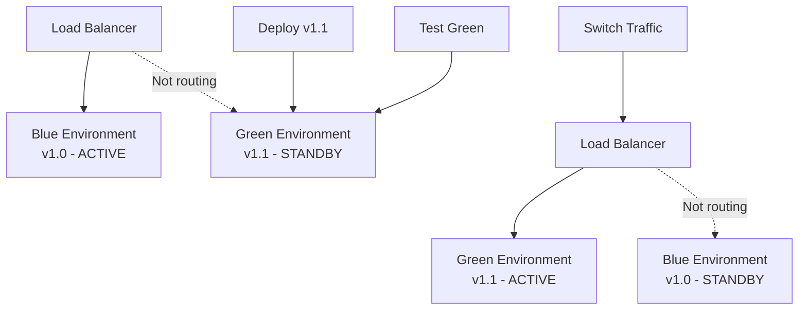

# Horizontal Scaling for API Gateways

## Overview

Horizontal scaling (scaling out) involves adding more instances of API gateway servers to distribute load across multiple machines. Instead of making one server more powerful, you deploy multiple identical servers that work together to handle incoming traffic.

## Theory and Concepts

### What is Horizontal Scaling?

Horizontal scaling distributes workload by:
- **Adding more instances**: Deploy additional gateway servers
- **Load distribution**: Traffic is spread across all instances
- **Independent operation**: Each instance operates autonomously
- **Shared-nothing architecture**: Instances don't share memory or local state


### Core Principles

1. **Statelessness**: Each request can be handled by any instance
2. **Redundancy**: Multiple instances provide fault tolerance
3. **Elasticity**: Add or remove instances based on demand
4. **Linear scalability**: Performance scales proportionally with instances

## When to Use Horizontal Scaling

Horizontal scaling is ideal when:
- **High availability is critical**: No single point of failure
- **Traffic is unpredictable**: Can scale dynamically
- **Growth is unlimited**: No hardware ceiling
- **Global distribution**: Deploy instances in multiple regions
- **Cost optimization at scale**: Commodity hardware is cost-effective

### Advantages Over Vertical Scaling


## Load Distribution Strategies

### 1. Round Robin

Distributes requests sequentially across instances.


**Use Case**: Simple, works well when all instances and requests are similar.

### 2. Least Connections

Routes to the instance with fewest active connections.

```javascript
// Conceptual pattern - not production code
function selectInstance(instances) {
  return instances.reduce((least, current) => {
    return current.activeConnections < least.activeConnections 
      ? current 
      : least;
  });
}
```

**Use Case**: Long-lived connections or varying request processing times.

### 3. Weighted Distribution

Assigns more traffic to more powerful instances.


**Use Case**: Mixed instance sizes or gradual migration scenarios.

### 4. IP Hash / Session Affinity

Routes based on client IP to maintain sticky sessions.

```javascript
// Conceptual pattern
function selectInstanceByIP(clientIP, instances) {
  const hash = hashFunction(clientIP);
  const index = hash % instances.length;
  return instances[index];
}
```

**Use Case**: When sessions must be maintained (though prefer stateless - see [patterns.md](./patterns.md)).

### 5. Geographic Routing

Routes to nearest instance based on client location.


**Use Case**: Global applications requiring low latency (see [architecture.md](./architecture.md)).

## Scaling Patterns

### Auto-Scaling

Automatically adjust instance count based on metrics.


**Scaling Triggers**:
- CPU utilization
- Memory usage
- Request rate
- Response time
- Queue depth

### Predictive Scaling

Scale proactively based on historical patterns.

```javascript
// Conceptual pattern
function calculateRequiredInstances(timeOfDay, dayOfWeek, historicalData) {
  const predictedTraffic = historicalData
    .filter(d => d.timeOfDay === timeOfDay && d.dayOfWeek === dayOfWeek)
    .reduce((sum, d) => sum + d.traffic, 0) / historicalData.length;
  
  return Math.ceil(predictedTraffic / REQUESTS_PER_INSTANCE);
}
```

**Use Case**: Predictable traffic patterns (e.g., business hours, seasonal events).

### Manual Scaling

Deliberately add instances for known events.


**Use Case**: Product launches, Black Friday, scheduled maintenance.

## State Management Challenges

### The Stateless Imperative


**Key Principle**: Any state must be externalized so any instance can handle any request.

### External Session Storage

```javascript
// Conceptual pattern for session management
class SessionManager {
  constructor(redisClient) {
    this.redis = redisClient;
  }
  
  async getSession(sessionId) {
    return await this.redis.get(`session:${sessionId}`);
  }
  
  async setSession(sessionId, data, ttl) {
    await this.redis.setex(`session:${sessionId}`, ttl, JSON.stringify(data));
  }
}
```

**Theory**: Session data stored in Redis is accessible from any gateway instance.

### Distributed Caching

For caching strategies that benefit horizontal scaling, see [caching.md](./caching.md).


### Distributed Rate Limiting

```javascript
// Conceptual pattern using Redis
async function checkRateLimit(clientId, limit, window) {
  const key = `rate:${clientId}:${Math.floor(Date.now() / window)}`;
  const current = await redis.incr(key);
  
  if (current === 1) {
    await redis.expire(key, window);
  }
  
  return current <= limit;
}
```

See [security.md](./security.md) for comprehensive rate limiting strategies.

## Health Checks and Load Balancer Integration

### Health Check Types


### Health Endpoint Design

```javascript
// Conceptual health check endpoint
app.get('/health', async (req, res) => {
  const checks = {
    server: true,
    redis: await checkRedis(),
    database: await checkDatabase(),
    backend: await checkBackend()
  };
  
  const healthy = Object.values(checks).every(c => c === true);
  
  res.status(healthy ? 200 : 503).json({
    status: healthy ? 'healthy' : 'unhealthy',
    checks
  });
});
```

**Theory**: Load balancer removes unhealthy instances, preventing cascading failures.

## Deployment Strategies

### Rolling Updates

Update instances gradually to maintain availability.


**Benefits**: Zero downtime, gradual rollout, easy rollback.

### Blue-Green Deployment

Maintain two identical environments.



**Benefits**: Instant rollback, full testing before cutover.

### Canary Deployment

Route small percentage of traffic to new version.


**Benefits**: Risk mitigation, real-world testing, gradual rollout.

## Performance Considerations

### Network Latency


**Optimization**: Use HTTP/2, connection pooling, and minimize load balancer hops.

### Connection Management

Each instance maintains connection pools to backends:

```javascript
// Conceptual pattern
const connectionPool = {
  maxConnections: 100,
  idleTimeout: 30000,
  keepAlive: true
};

// With 10 instances, total backend connections = 10 * 100 = 1000
```

**Theory**: More instances = more backend connections. Ensure backends can handle the load (see [architecture.md](./architecture.md)).

### Throughput Scaling


**Ideal**: Linear scaling. **Reality**: Slightly sub-linear due to load balancer overhead.

## Monitoring Horizontal Scaling

### Key Metrics

Track these metrics across all instances:


See [monitoring.md](./monitoring.md) for detailed observability strategies.

### Scaling Indicators

**Scale Out When**:
- Average CPU across instances > 70%
- Request queue growing
- Response time degrading
- Error rate increasing

**Scale In When**:
- Average CPU < 30% for sustained period
- Over-provisioned capacity
- Cost optimization needed

## Cost Optimization

### Right-Sizing Instances

```javascript
// Conceptual cost calculator
function calculateInstanceCost(traffic, instanceCapacity, instanceCost) {
  const requiredInstances = Math.ceil(traffic / instanceCapacity);
  const totalCost = requiredInstances * instanceCost;
  const utilizationRate = traffic / (requiredInstances * instanceCapacity);
  
  return { requiredInstances, totalCost, utilizationRate };
}
```

**Strategy**: Balance between performance and cost efficiency.

### Reserved vs Spot Instances


**Best Practice**: Mix instance types to optimize cost while maintaining reliability.

## Integration with Other Components

### Routing Complexity

More instances require sophisticated routing (see [routing.md](./routing.md)):
- Path-based routing
- Header-based routing  
- Service discovery
- Circuit breakers per instance

### Caching Strategy

Horizontal scaling affects caching (see [caching.md](./caching.md)):
- Distributed cache required
- Cache warming strategies
- Consistency considerations

### Security Implications

Multiple instances complicate security (see [security.md](./security.md)):
- Distributed rate limiting
- Centralized authentication
- Certificate management
- DDoS protection

## Hybrid Scaling Approach

Combine vertical and horizontal scaling:


**Strategy**: Vertically scale instances to optimal size, then horizontally scale by adding more instances.

## Best Practices

### 1. Design for Failure

Assume instances will fail:
- Implement graceful shutdown
- Use health checks
- Enable automatic recovery
- Plan for partial outages

### 2. Maintain Statelessness

```javascript
// BAD: Instance-local state
let requestCounter = 0; // Lost when instance dies

// GOOD: External state
await redis.incr('global:request:counter');
```

### 3. Use Service Discovery

Dynamic instance registration:


### 4. Implement Graceful Degradation

When scaling can't keep up:
- Enable circuit breakers (see [patterns.md](./patterns.md))
- Apply rate limiting (see [security.md](./security.md))
- Return cached responses
- Show degraded functionality

### 5. Test Scalability

Regular load testing:
- Identify bottlenecks before production
- Validate auto-scaling policies
- Ensure linear scaling behavior
- Test instance failure scenarios

## Challenges and Solutions

### Challenge 1: Distributed Tracing

**Problem**: Request spans multiple instances.

**Solution**: Implement correlation IDs:
```javascript
// Conceptual pattern
function generateTraceId() {
  return `${instanceId}-${Date.now()}-${randomId()}`;
}
```

### Challenge 2: Log Aggregation

**Problem**: Logs scattered across instances.

**Solution**: Centralized logging system (see [monitoring.md](./monitoring.md)).

### Challenge 3: Configuration Management

**Problem**: Keeping all instances in sync.

**Solution**: 
- External configuration service
- Environment variables
- Configuration management tools

### Challenge 4: Database Connection Limits

**Problem**: Each instance creates connections.

**Solution**:
- Connection pooling
- Database proxy (e.g., PgBouncer)
- Read replicas for scaling reads

## When NOT to Use Horizontal Scaling

Horizontal scaling isn't always the answer:
- **Very low traffic**: Overhead exceeds benefits
- **Tightly coupled state**: Requires expensive synchronization
- **Hardware underutilized**: Vertical scaling is cheaper
- **Development complexity**: Team lacks distributed systems expertise

## Summary

Horizontal scaling provides:
- **Unlimited growth potential**: No hardware ceiling
- **High availability**: Redundancy and fault tolerance
- **Flexibility**: Dynamic scaling with demand
- **Geographic distribution**: Lower latency globally

Key requirements:
- Stateless architecture
- External session/cache storage
- Load balancer infrastructure
- Proper monitoring and auto-scaling

Combined with vertical scaling, horizontal scaling enables systems to handle massive scale while maintaining reliability and performance.

## References

- [scaling.md](./scaling.md) - Overall scaling strategies including vertical
- [architecture.md](./architecture.md) - System design principles
- [patterns.md](./patterns.md) - Design patterns for distributed systems
- [monitoring.md](./monitoring.md) - Observability and metrics
- [caching.md](./caching.md) - Distributed caching strategies
- [security.md](./security.md) - Security in distributed environments
- [routing.md](./routing.md) - Traffic routing strategies
- [pros-cons.md](./pros-cons.md) - Trade-offs and decision framework