# Load Balancing

## Table of Contents
- [Introduction](#introduction)
- [What is Load Balancing?](#what-is-load-balancing)
- [Why Load Balancing Matters](#why-load-balancing-matters)
- [Load Balancing Algorithms](#load-balancing-algorithms)
- [Types of Load Balancers](#types-of-load-balancers)
- [Health Checks and Monitoring](#health-checks-and-monitoring)
- [Session Persistence](#session-persistence)
- [SSL/TLS Termination](#ssltls-termination)
- [Load Balancing Patterns](#load-balancing-patterns)
- [Integration with Other Scalability Concepts](#integration-with-other-scalability-concepts)
- [Common Pitfalls and Best Practices](#common-pitfalls-and-best-practices)

## Introduction

Load balancing is a fundamental technique in system design that distributes incoming network traffic across multiple servers. As systems scale beyond a single server (see [vertical_scaling.md](vertical_scaling.md) for single-server limitations), load balancing becomes essential for achieving high availability, reliability, and optimal resource utilization through [horizontal_scaling.md](horizontal_scaling.md).

## What is Load Balancing?

Load balancing is the process of distributing network traffic or computational workload across multiple servers, network links, or other resources. The component responsible for this distribution is called a **load balancer**.

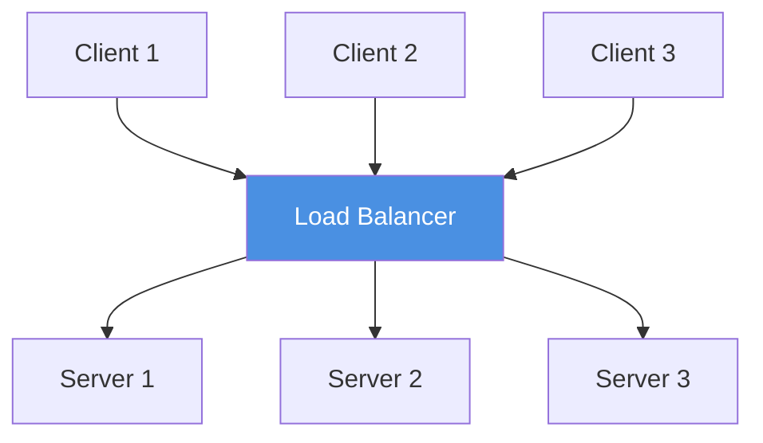
```mermaid
graph TD
    Client1[Client 1]
    Client2[Client 2]
    Client3[Client 3]
    LB[Load Balancer]
    Server1[Server 1]
    Server2[Server 2]
    Server3[Server 3]
    
    Client1 --> LB
    Client2 --> LB
    Client3 --> LB
    
    LB --> Server1
    LB --> Server2
    LB --> Server3
    
    style LB fill:#4a90e2,color:#fff
```

### Key Objectives

1. **Distribute load evenly** - Prevent any single server from becoming overwhelmed
2. **Maximize throughput** - Increase overall system capacity
3. **Minimize response time** - Route requests to the fastest available server
4. **Ensure availability** - Reroute traffic away from failed servers
5. **Enable scalability** - Add or remove servers without downtime

## Why Load Balancing Matters

### Without Load Balancing

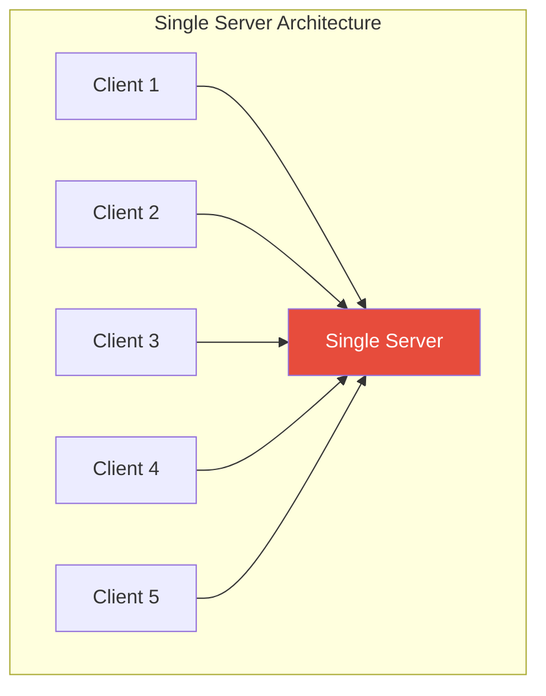
```mermaid
graph TD
    subgraph "Single Server Architecture"
    C1[Client 1] --> S[Single Server]
    C2[Client 2] --> S
    C3[Client 3] --> S
    C4[Client 4] --> S
    C5[Client 5] --> S
    end
    
    style S fill:#e74c3c,color:#fff
```

**Problems:**
- Single point of failure
- Limited by one server's capacity
- No redundancy
- Maintenance requires downtime
- Poor resource utilization

### With Load Balancing

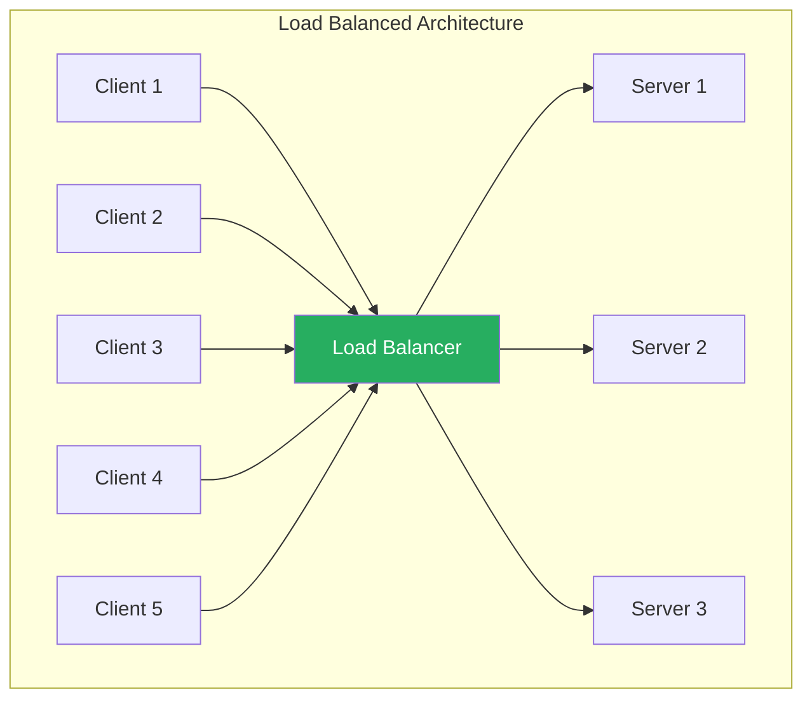
```mermaid
graph TD
    subgraph "Load Balanced Architecture"
    C1[Client 1] --> LB[Load Balancer]
    C2[Client 2] --> LB
    C3[Client 3] --> LB
    C4[Client 4] --> LB
    C5[Client 5] --> LB
    
    LB --> S1[Server 1]
    LB --> S2[Server 2]
    LB --> S3[Server 3]
    end
    
    style LB fill:#27ae60,color:#fff
```

**Benefits:**
- High availability and fault tolerance
- Horizontal scalability (see [horizontal_scaling.md](horizontal_scaling.md))
- Zero-downtime deployments
- Geographic distribution
- Better resource utilization

## Load Balancing Algorithms

### 1. Round Robin

The simplest algorithm that distributes requests sequentially across all servers.

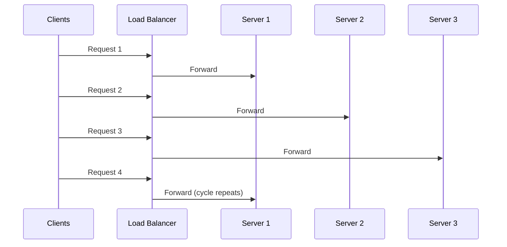
```mermaid
sequenceDiagram
    participant C as Clients
    participant LB as Load Balancer
    participant S1 as Server 1
    participant S2 as Server 2
    participant S3 as Server 3
    
    C->>LB: Request 1
    LB->>S1: Forward
    C->>LB: Request 2
    LB->>S2: Forward
    C->>LB: Request 3
    LB->>S3: Forward
    C->>LB: Request 4
    LB->>S1: Forward (cycle repeats)
```

**Pros:**
- Simple to implement
- Fair distribution
- No server state needed

**Cons:**
- Doesn't consider server load
- Assumes all servers are equal
- Doesn't account for varying request complexity

**Use case:** Homogeneous servers with similar request patterns

### 2. Weighted Round Robin

Similar to round robin but assigns weights to servers based on their capacity.

**Theory:**
```javascript
// Conceptual weight distribution
servers = [
  { name: "Server1", weight: 3, capacity: "High" },
  { name: "Server2", weight: 2, capacity: "Medium" },
  { name: "Server3", weight: 1, capacity: "Low" }
]

// Server1 receives 3 out of every 6 requests
// Server2 receives 2 out of every 6 requests
// Server3 receives 1 out of every 6 requests
```

**Use case:** Heterogeneous infrastructure with varying server capacities (common after [vertical_scaling.md](vertical_scaling.md) of some servers)

### 3. Least Connections

Routes requests to the server with the fewest active connections.

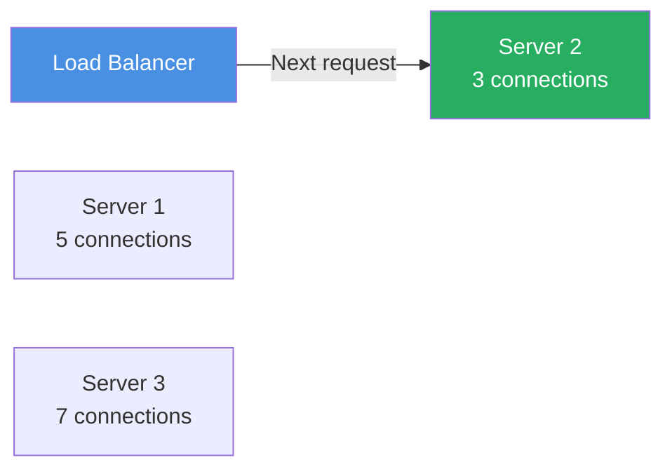
```mermaid
graph LR
    LB[Load Balancer]
    S1[Server 1<br/>5 connections]
    S2[Server 2<br/>3 connections]
    S3[Server 3<br/>7 connections]
    
    LB -->|Next request| S2
    
    style S2 fill:#27ae60,color:#fff
    style LB fill:#4a90e2,color:#fff
```

**Pros:**
- Better for long-lived connections
- Adapts to server load dynamically
- Works well with varying request durations

**Cons:**
- Requires connection state tracking
- Slightly more complex
- May not account for connection weight

**Use case:** Applications with persistent connections (WebSockets, databases)

### 4. Weighted Least Connections

Combines least connections with server capacity weights.

**Theory:**
```javascript
// Connection efficiency calculation
effectiveLoad = activeConnections / serverWeight

// Example:
// Server1: 10 connections, weight 3 → load = 10/3 = 3.33
// Server2: 6 connections, weight 2 → load = 6/2 = 3.0
// Server3: 3 connections, weight 1 → load = 3/1 = 3.0

// Next request goes to Server2 or Server3 (lower load)
```

### 5. Least Response Time

Routes to the server with the fastest response time and fewest active connections.

**Pros:**
- Optimizes user experience
- Accounts for server performance
- Dynamic adaptation

**Cons:**
- Requires continuous monitoring
- More computational overhead
- Can be affected by temporary spikes

**Use case:** Performance-critical applications

### 6. IP Hash / Source Hash

Uses client IP address to determine which server receives the request.

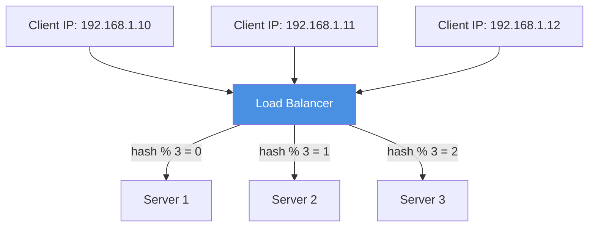
```mermaid
graph TD
    C1[Client IP: 192.168.1.10] --> LB[Load Balancer]
    C2[Client IP: 192.168.1.11] --> LB
    C3[Client IP: 192.168.1.12] --> LB
    
    LB -->|hash % 3 = 0| S1[Server 1]
    LB -->|hash % 3 = 1| S2[Server 2]
    LB -->|hash % 3 = 2| S3[Server 3]
    
    style LB fill:#4a90e2,color:#fff
```

**Theory:**
```javascript
// Consistent routing based on IP
serverIndex = hash(clientIP) % numberOfServers

// Same client IP always routes to same server
```

**Pros:**
- Natural session persistence
- No session state needed at load balancer
- Predictable routing

**Cons:**
- Uneven distribution if client IPs cluster
- Scaling changes routing (see [Consistent Hashing](#consistent-hashing))
- Doesn't adapt to server load

**Use case:** Session-based applications (but see [Session Persistence](#session-persistence) for better approaches)

### 7. Consistent Hashing

An advanced form of hash-based routing that minimizes redistribution when servers are added or removed.

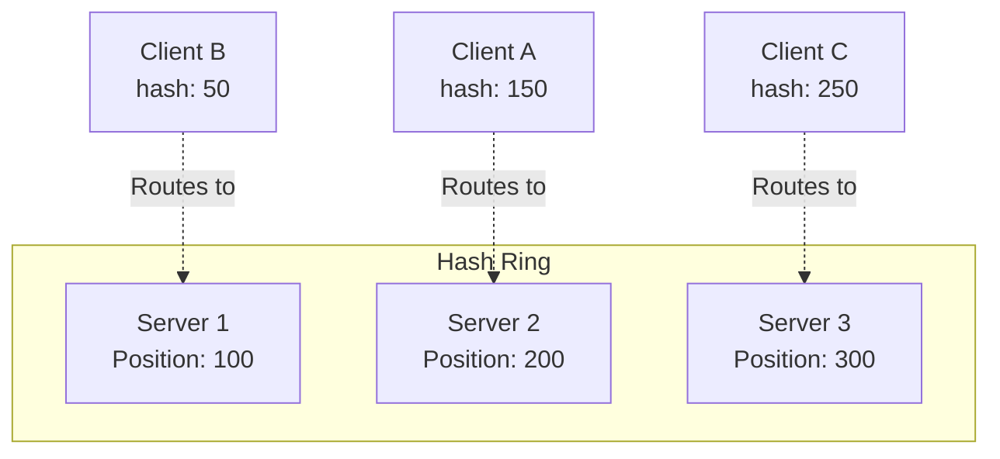
```mermaid
graph TD
    subgraph "Hash Ring"
    S1[Server 1<br/>Position: 100]
    S2[Server 2<br/>Position: 200]
    S3[Server 3<br/>Position: 300]
    end
    
    C1[Client A<br/>hash: 150] -.->|Routes to| S2
    C2[Client B<br/>hash: 50] -.->|Routes to| S1
    C3[Client C<br/>hash: 250] -.->|Routes to| S3
```

**Theory:**
```javascript
// Virtual nodes for better distribution
virtualNodesPerServer = 150

// When adding/removing servers:
// Only ~1/N keys need to be remapped (N = number of servers)
// vs. traditional hashing: ~(N-1)/N keys need remapping
```

**Use case:** Distributed caching (see [caching_strategies.md](caching_strategies.md)), distributed databases (see [database_scaling.md](database_scaling.md))

### 8. Random

Selects a server at random for each request.

**Pros:**
- Extremely simple
- Stateless
- Good distribution over time

**Cons:**
- No intelligence
- Can create temporary imbalances
- Not predictable

**Use case:** Simple services with uniform servers and short requests

## Types of Load Balancers

### Layer 4 (Transport Layer) Load Balancing

Operates at the TCP/UDP level, making routing decisions based on IP addresses and ports.

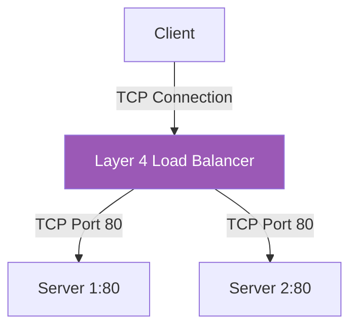
```mermaid
graph TD
    C[Client] -->|TCP Connection| L4[Layer 4 Load Balancer]
    L4 -->|TCP Port 80| S1[Server 1:80]
    L4 -->|TCP Port 80| S2[Server 2:80]
    
    style L4 fill:#9b59b6,color:#fff
```

**Characteristics:**
- Fast and efficient (no payload inspection)
- Lower latency
- Cannot make content-based decisions
- Connection-based routing

**Theory:**
```javascript
// L4 decision factors
{
  sourceIP: "192.168.1.10",
  sourcePort: 54321,
  destinationIP: "10.0.0.1",
  destinationPort: 80,
  protocol: "TCP"
}
// Routes based only on this information
```

**Use case:** High-performance scenarios, TCP/UDP services, minimal latency requirements

### Layer 7 (Application Layer) Load Balancing

Operates at the HTTP level, making intelligent routing decisions based on content.

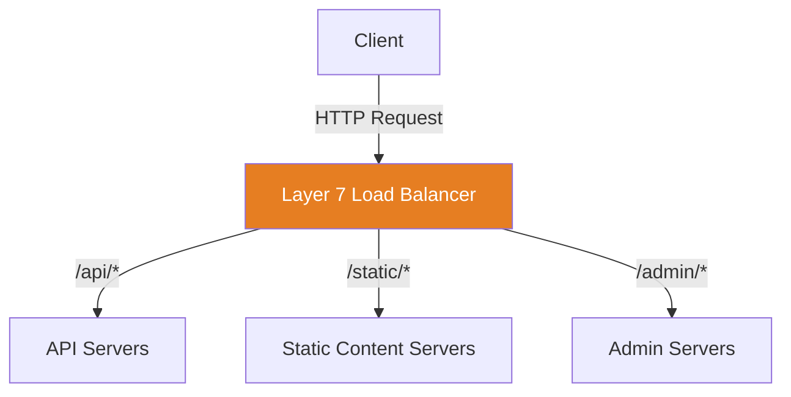
```mermaid
graph TD
    C[Client] -->|HTTP Request| L7[Layer 7 Load Balancer]
    
    L7 -->|/api/*| API[API Servers]
    L7 -->|/static/*| Static[Static Content Servers]
    L7 -->|/admin/*| Admin[Admin Servers]
    
    style L7 fill:#e67e22,color:#fff
```

**Characteristics:**
- Content-aware routing
- Can inspect HTTP headers, cookies, URLs
- SSL/TLS termination
- Higher latency than L4
- More CPU intensive

**Theory:**
```javascript
// L7 decision factors
{
  method: "GET",
  path: "/api/users",
  headers: {
    "Host": "api.example.com",
    "Cookie": "session=abc123",
    "X-Custom-Header": "value"
  },
  queryParams: { limit: 10 }
}
// Can route based on any of this information
```

**Routing examples:**
- URL path-based: `/api/*` → API servers, `/images/*` → CDN
- Header-based: Mobile user-agent → mobile servers
- Cookie-based: Premium users → high-performance servers
- Geographic: Route based on geolocation headers

**Use case:** Microservices architectures, content-based routing, advanced traffic management

### Hardware vs. Software Load Balancers

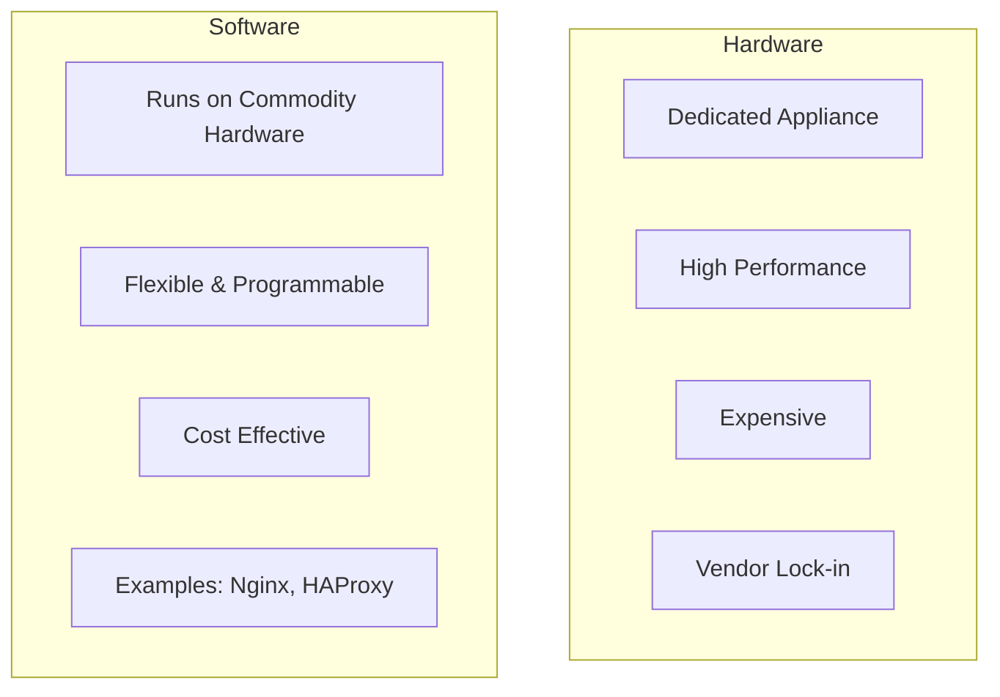
```mermaid
graph TD
    subgraph Hardware
    H1[Dedicated Appliance]
    H2[High Performance]
    H3[Expensive]
    H4[Vendor Lock-in]
    end
    
    subgraph Software
    S1[Runs on Commodity Hardware]
    S2[Flexible & Programmable]
    S3[Cost Effective]
    S4[Examples: Nginx, HAProxy]
    end
```

### Popular Load Balancer Solutions

| Solution | Type | Layer | Best For |
|----------|------|-------|----------|
| **Nginx** | Software | L7 | Web applications, reverse proxy |
| **HAProxy** | Software | L4/L7 | High performance, TCP/HTTP |
| **AWS ELB** | Cloud | L4/L7 | AWS infrastructure |
| **Google Cloud Load Balancing** | Cloud | L4/L7 | GCP infrastructure |
| **F5 BIG-IP** | Hardware | L4/L7 | Enterprise, high traffic |
| **Envoy** | Software | L7 | Microservices, service mesh |
| **Traefik** | Software | L7 | Container orchestration |

## Health Checks and Monitoring

Load balancers must continuously verify server health to avoid routing traffic to failed instances.

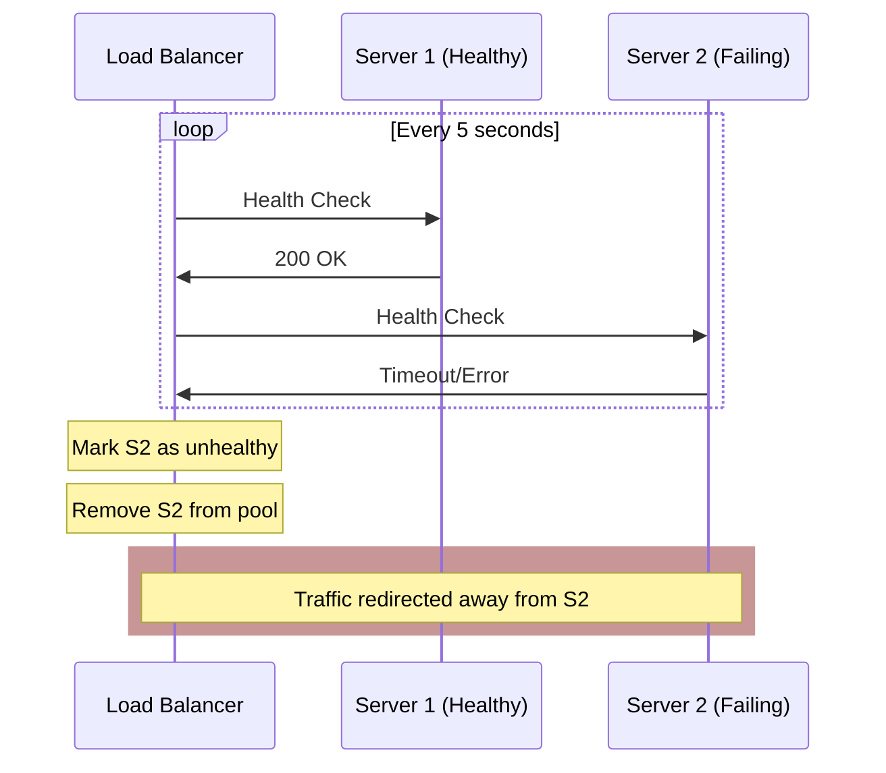
```mermaid
sequenceDiagram
    participant LB as Load Balancer
    participant S1 as Server 1 (Healthy)
    participant S2 as Server 2 (Failing)
    
    loop Every 5 seconds
        LB->>S1: Health Check
        S1->>LB: 200 OK
        LB->>S2: Health Check
        S2->>LB: Timeout/Error
    end
    
    Note over LB: Mark S2 as unhealthy
    Note over LB: Remove S2 from pool
    
    rect rgb(200, 150, 150)
    Note over LB,S2: Traffic redirected away from S2
    end
```

### Types of Health Checks

#### 1. Active Health Checks

The load balancer actively probes servers.

**Theory:**
```javascript
// HTTP health check configuration
healthCheck = {
  protocol: "HTTP",
  path: "/health",
  interval: 5000,        // Check every 5 seconds
  timeout: 2000,         // Wait 2 seconds for response
  unhealthyThreshold: 3, // Mark unhealthy after 3 failures
  healthyThreshold: 2    // Mark healthy after 2 successes
}
```

**Check types:**
- **TCP check:** Can we establish a connection?
- **HTTP check:** Does the endpoint return 200 OK?
- **Deep health check:** Does the app can connect to dependencies (database, [caching_strategies.md](caching_strategies.md), etc.)?

#### 2. Passive Health Checks

Monitor real traffic and detect failures organically.

**Theory:**
```javascript
// Monitor actual requests
if (consecutiveFailures >= threshold) {
  markServerUnhealthy()
  // Temporarily remove from pool
}

// Circuit breaker pattern integration
circuitState = "CLOSED" // Normal
            → "OPEN"    // Too many failures, stop sending traffic
            → "HALF_OPEN" // Try occasional requests
            → "CLOSED"    // Recovered
```

### Health Check Best Practices

1. **Lightweight checks** - Don't overload servers with heavy health checks
2. **Meaningful checks** - Verify actual application health, not just TCP connectivity
3. **Appropriate intervals** - Balance responsiveness vs. overhead
4. **Dependency awareness** - Check critical dependencies (database, cache)
5. **Graceful degradation** - Implement circuit breakers

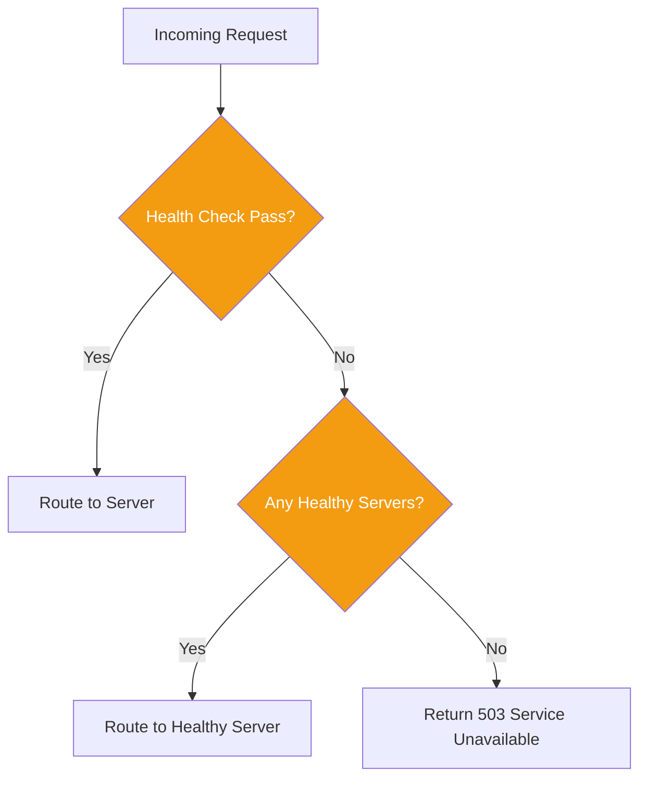
```mermaid
graph TD
    A[Incoming Request] --> B{Health Check Pass?}
    B -->|Yes| C[Route to Server]
    B -->|No| D{Any Healthy Servers?}
    D -->|Yes| E[Route to Healthy Server]
    D -->|No| F[Return 503 Service Unavailable]
    
    style B fill:#f39c12,color:#fff
    style D fill:#f39c12,color:#fff
```

## Session Persistence

Also known as **sticky sessions**, this ensures requests from the same client are routed to the same server.

### The Problem

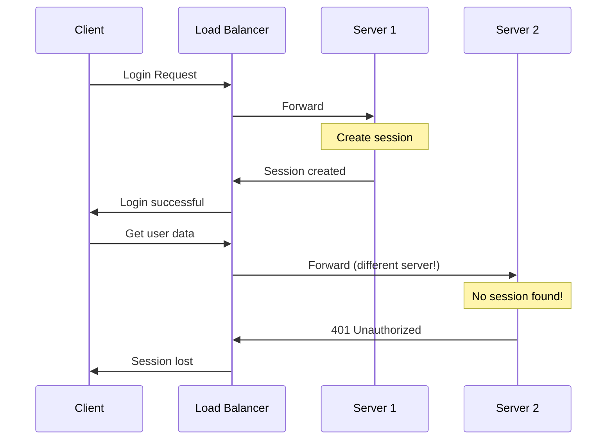
```mermaid
sequenceDiagram
    participant C as Client
    participant LB as Load Balancer
    participant S1 as Server 1
    participant S2 as Server 2
    
    C->>LB: Login Request
    LB->>S1: Forward
    Note over S1: Create session
    S1->>LB: Session created
    LB->>C: Login successful
    
    C->>LB: Get user data
    LB->>S2: Forward (different server!)
    Note over S2: No session found!
    S2->>LB: 401 Unauthorized
    LB->>C: Session lost
```

### Solution 1: Cookie-Based Persistence

```javascript
// Theory: Load balancer injects cookie
response.headers["Set-Cookie"] = "LB_SERVER=server1; Path=/; HttpOnly"

// Subsequent requests include this cookie
// Load balancer reads cookie and routes to server1
```

**Pros:**
- Simple implementation
- Works with L7 load balancers
- Transparent to backend

**Cons:**
- Doesn't work with L4 load balancers
- Cookie manipulation concerns
- Client must accept cookies

### Solution 2: IP Hash Persistence

```javascript
// Same client IP always routes to same server
serverIndex = hash(clientIP) % numberOfServers
```

**Pros:**
- Works with L4 load balancers
- No cookies needed
- Simple

**Cons:**
- Users behind NAT share same IP
- Changes when scaling
- No server failure handling

### Solution 3: Session ID-Based Routing

```javascript
// Extract session ID from request
sessionID = extractFromCookie(request) || extractFromURL(request)
serverIndex = consistentHash(sessionID) % numberOfServers
```

### Solution 4: Centralized Sessions (Recommended)

Instead of relying on load balancer persistence, store sessions externally.

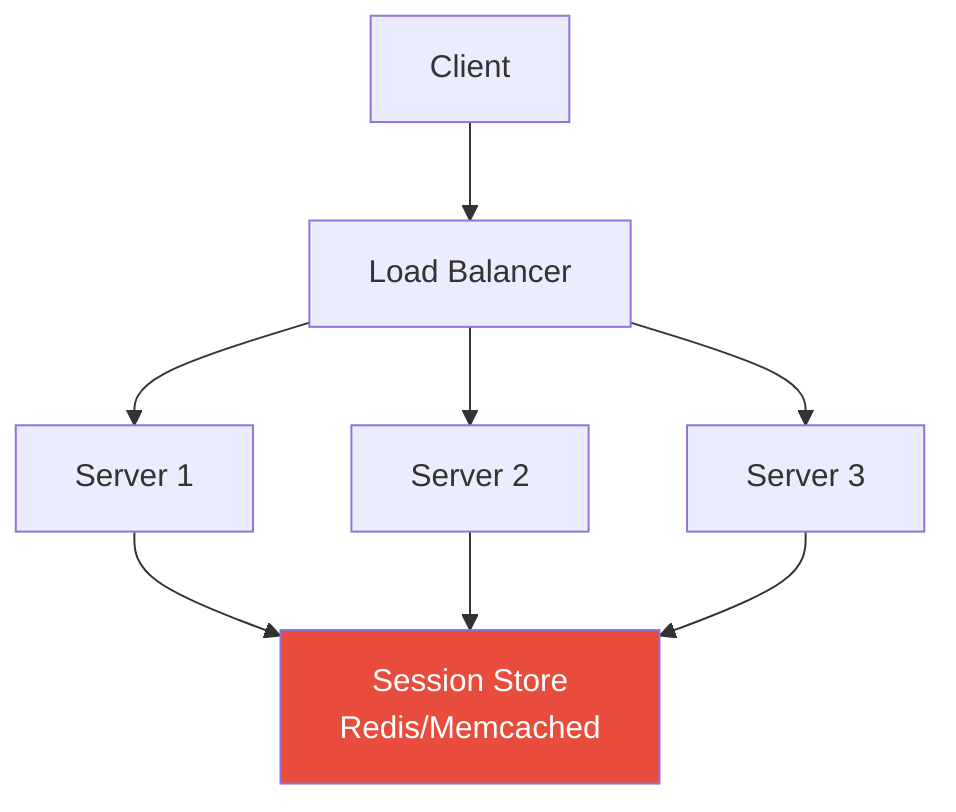
```mermaid
graph TD
    C[Client] --> LB[Load Balancer]
    LB --> S1[Server 1]
    LB --> S2[Server 2]
    LB --> S3[Server 3]
    
    S1 --> Cache[Session Store<br/>Redis/Memcached]
    S2 --> Cache
    S3 --> Cache
    
    style Cache fill:#e74c3c,color:#fff
```

**Benefits:**
- Any server can handle any request
- True stateless servers
- Better fault tolerance
- Enables horizontal scaling (see [horizontal_scaling.md](horizontal_scaling.md))

See [caching_strategies.md](caching_strategies.md) for session store implementation patterns.

**Theory:**
```javascript
// Each server checks centralized session store
sessionData = await redisClient.get(`session:${sessionID}`)

if (!sessionData) {
  return unauthorized()
}

// All servers see same session data
```

## SSL/TLS Termination

Load balancers can handle SSL/TLS encryption/decryption, offloading this CPU-intensive work from backend servers.

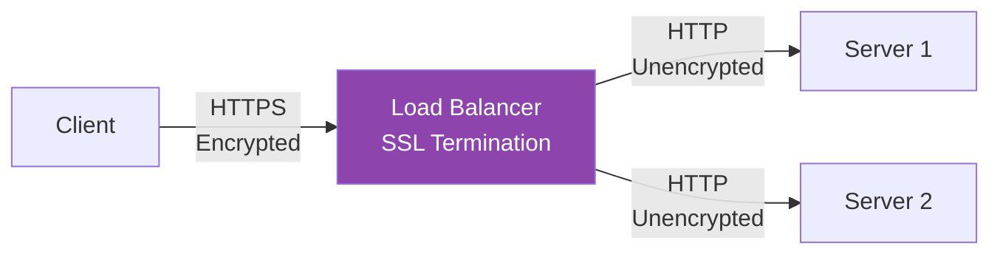
```mermaid
graph LR
    C[Client] -->|HTTPS<br/>Encrypted| LB[Load Balancer<br/>SSL Termination]
    LB -->|HTTP<br/>Unencrypted| S1[Server 1]
    LB -->|HTTP<br/>Unencrypted| S2[Server 2]
    
    style LB fill:#8e44ad,color:#fff
```

### Benefits

1. **Performance:** Encryption/decryption happens once at the load balancer
2. **Certificate management:** Single place to manage certificates
3. **Simplified backend:** Servers don't need SSL configuration
4. **Better caching:** Load balancer can cache decrypted content

### Security Considerations

**Theory:**
```javascript
// SSL termination modes

// 1. Termination (most common)
Client --[HTTPS]--> LoadBalancer --[HTTP]--> Servers

// 2. Pass-through
Client --[HTTPS]--> LoadBalancer --[HTTPS]--> Servers
// Load balancer doesn't decrypt, just routes TCP

// 3. Re-encryption
Client --[HTTPS]--> LoadBalancer --[HTTPS]--> Servers
// Decrypt at LB, re-encrypt to backend
```

**When to use re-encryption:**
- Compliance requirements (end-to-end encryption)
- Untrusted network between LB and servers
- PCI DSS, HIPAA, or similar regulations

**When termination is acceptable:**
- Trusted internal network
- Performance is critical
- Simplified management preferred

## Load Balancing Patterns

### 1. Basic Load Balancing

Single load balancer distributing traffic across multiple servers.

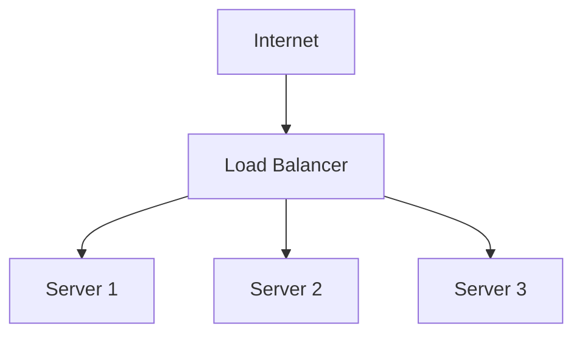
```mermaid
graph TD
    Internet[Internet] --> LB[Load Balancer]
    LB --> S1[Server 1]
    LB --> S2[Server 2]
    LB --> S3[Server 3]
```

**Limitation:** Load balancer is a single point of failure

### 2. Active-Passive Load Balancers

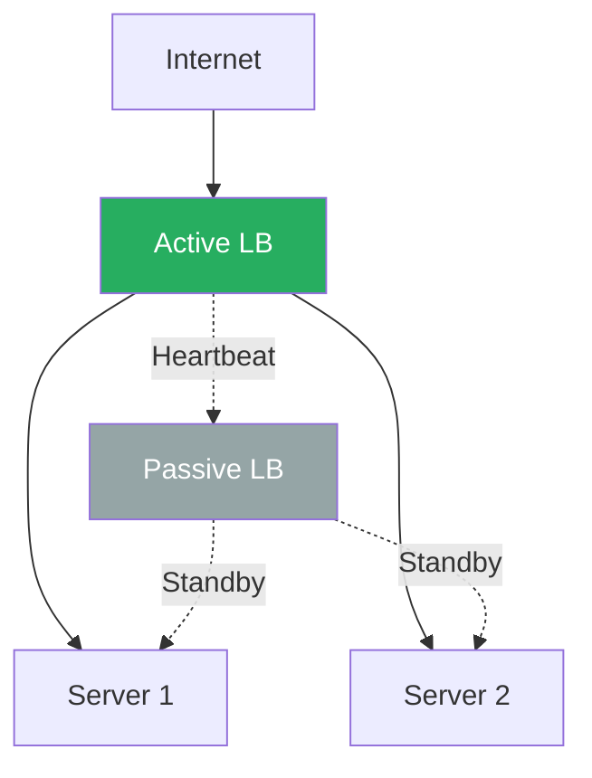
```mermaid
graph TD
    Internet[Internet] --> LB1[Active LB]
    LB1 -.->|Heartbeat| LB2[Passive LB]
    
    LB1 --> S1[Server 1]
    LB1 --> S2[Server 2]
    
    LB2 -.->|Standby| S1
    LB2 -.->|Standby| S2
    
    style LB1 fill:#27ae60,color:#fff
    style LB2 fill:#95a5a6,color:#fff
```

**Behavior:**
- Passive LB monitors active LB via heartbeat
- If active fails, passive takes over (failover)
- Virtual IP (VIP) floats between them

### 3. Active-Active Load Balancers

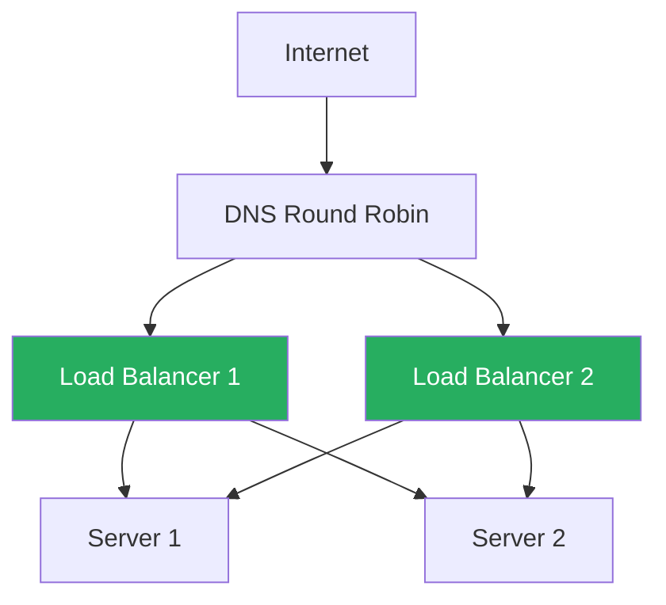
```mermaid
graph TD
    Internet[Internet] --> DNS[DNS Round Robin]
    DNS --> LB1[Load Balancer 1]
    DNS --> LB2[Load Balancer 2]
    
    LB1 --> S1[Server 1]
    LB1 --> S2[Server 2]
    LB2 --> S1
    LB2 --> S2
    
    style LB1 fill:#27ae60,color:#fff
    style LB2 fill:#27ae60,color:#fff
```

**Benefits:**
- No wasted resources
- Higher throughput
- Better fault tolerance

### 4. Global Server Load Balancing (GSLB)

Distribute traffic across geographically distributed data centers.

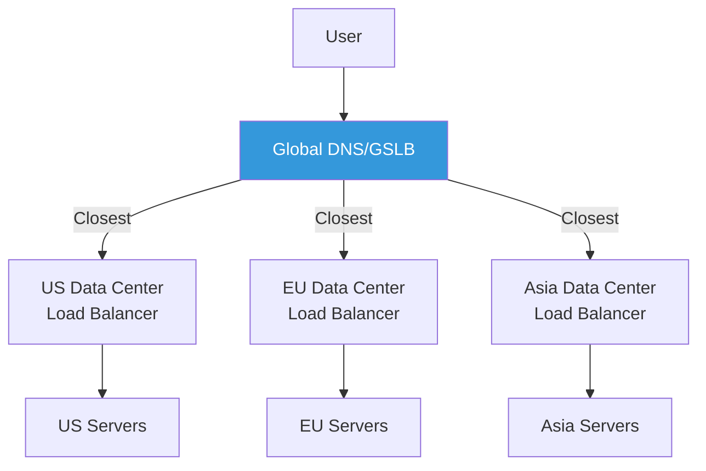
```mermaid
graph TD
    User[User] --> DNS[Global DNS/GSLB]
    
    DNS -->|Closest| US[US Data Center<br/>Load Balancer]
    DNS -->|Closest| EU[EU Data Center<br/>Load Balancer]
    DNS -->|Closest| ASIA[Asia Data Center<br/>Load Balancer]
    
    US --> US1[US Servers]
    EU --> EU1[EU Servers]
    ASIA --> ASIA1[Asia Servers]
    
    style DNS fill:#3498db,color:#fff
```

**Routing factors:**
- Geographic proximity
- Data center health
- Load/capacity
- Cost optimization

**Use case:** Global applications, CDNs, multi-region deployments

### 5. Multi-Tier Load Balancing

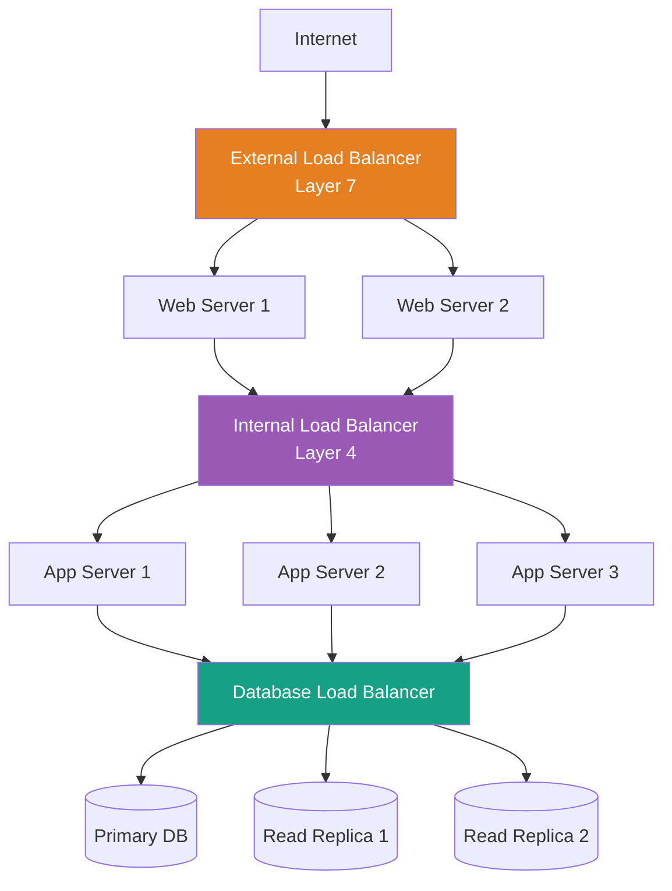
```mermaid
graph TD
    Internet[Internet] --> LB1[External Load Balancer<br/>Layer 7]
    
    LB1 --> Web1[Web Server 1]
    LB1 --> Web2[Web Server 2]
    
    Web1 --> LB2[Internal Load Balancer<br/>Layer 4]
    Web2 --> LB2
    
    LB2 --> App1[App Server 1]
    LB2 --> App2[App Server 2]
    LB2 --> App3[App Server 3]
    
    App1 --> LB3[Database Load Balancer]
    App2 --> LB3
    App3 --> LB3
    
    LB3 --> DB1[(Primary DB)]
    LB3 --> DB2[(Read Replica 1)]
    LB3 --> DB3[(Read Replica 2)]
    
    style LB1 fill:#e67e22,color:#fff
    style LB2 fill:#9b59b6,color:#fff
    style LB3 fill:#16a085,color:#fff
```

**Benefits:**
- Specialized load balancing per tier
- Better security (internal LBs not exposed)
- Independent scaling of each tier

## Integration with Other Scalability Concepts

### Load Balancing + Horizontal Scaling

Load balancing is essential for [horizontal_scaling.md](horizontal_scaling.md) to work effectively.

```mermaid
graph TD
    LB[Load Balancer]
    
    subgraph "Auto Scaling Group"
    S1[Server 1]
    S2[Server 2]
    S3[Server 3]
    S4[Server 4 - Added dynamically]
    end
    
    LB --> S1
    LB --> S2
    LB --> S3
    LB --> S4
    
    Metrics[Metrics:<br/>CPU > 70%] -.->|Trigger| AS[Auto Scaler]
    AS -.->|Add Server| S4
    AS -.->|Register with| LB
```

See [auto_scaling.md](auto_scaling.md) for automatic scaling strategies.

### Load Balancing + Caching

Load balancers can implement caching or route to cache tiers.

```mermaid
graph TD
    LB[Load Balancer<br/>with Cache]
    
    LB -->|Cache Miss| Origin[Origin Servers]
    LB -->|Cached| Client[Client]
    
    style LB fill:#f39c12,color:#fff
```

Alternatively, route requests to dedicated cache servers:

```mermaid
graph TD
    LB[Load Balancer]
    
    LB -->|/api/*| App[Application Servers]
    LB -->|/static/*| Cache[CDN/Cache Servers]
```

See [caching_strategies.md](caching_strategies.md) for detailed caching patterns.

### Load Balancing + Database Scaling

Load balancers can distribute database queries across replicas.

```mermaid
graph TD
    App[Application] --> DBLB[Database Load Balancer]
    
    DBLB -->|Writes| Primary[(Primary DB)]
    DBLB -->|Reads| R1[(Read Replica 1)]
    DBLB -->|Reads| R2[(Read Replica 2)]
    DBLB -->|Reads| R3[(Read Replica 3)]
    
    Primary -.->|Replication| R1
    Primary -.->|Replication| R2
    Primary -.->|Replication| R3
```

See [database_scaling.md](database_scaling.md) for read/write splitting patterns.

### Load Balancing + Message Queues

Load balancers can distribute workers processing messages from queues.

```mermaid
graph TD
    Queue[Message Queue]
    LB[Load Balancer]
    
    Queue --> LB
    LB --> W1[Worker 1]
    LB --> W2[Worker 2]
    LB --> W3[Worker 3]
```

However, message queues often have built-in load distribution. See [message_queues.md](message_queues.md) for patterns.

### Load Balancing + Eventual Consistency

Load balancing can introduce consistency challenges in distributed systems.

**Problem:**
```mermaid
sequenceDiagram
    participant C as Client
    participant LB as Load Balancer
    participant S1 as Server 1
    participant S2 as Server 2
    participant DB as Database
    
    C->>LB: Write Data
    LB->>S1: Forward
    S1->>DB: Update (takes time to replicate)
    
    C->>LB: Read Data
    LB->>S2: Forward
    S2->>DB: Query (stale replica)
    DB->>S2: Old data!
    S2->>C: Stale response
```

**Solutions:**
1. Read from primary after writes (see [database_scaling.md](database_scaling.md))
2. Use sticky sessions for write-then-read scenarios
3. Accept eventual consistency (see [eventual_consistency.md](eventual_consistency.md))
4. Client-side consistency tokens

### Cost Optimization

Load balancing impacts [cost_scaling.md](cost_scaling.md):

```javascript
// Cost considerations
costs = {
  loadBalancerService: "Fixed monthly cost per LB",
  dataTransfer: "Cost per GB transferred through LB",
  healthChecks: "Minimal but accumulates",
  sslCertificates: "Varies by provider",
  
  // Savings from efficiency
  betterResourceUtilization: "Reduce over-provisioning",
  autoScaling: "Add/remove servers based on demand",
  failureHandling: "Reduce downtime costs"
}
```

## Common Pitfalls and Best Practices

### Pitfalls to Avoid

#### 1. Load Balancer as Bottleneck

```mermaid
graph TD
    Many[Many Clients<br/>1000s RPS] --> LB[Single Small<br/>Load Balancer]
    LB --> S[Many Powerful<br/>Servers]
    
    style LB fill:#e74c3c,color:#fff
```

**Solution:**
- Scale load balancers horizontally
- Use cloud-managed load balancers that auto-scale
- Implement GSLB for geographic distribution

#### 2. Ignoring Session State

Using load balancing with stateful sessions without proper handling.

**Solution:**
- Externalize session storage (Redis, Memcached)
- Use JWT tokens for stateless authentication
- Implement sticky sessions only when necessary

#### 3. Poor Health Check Design

```javascript
// Bad: Only checks if server is up
healthCheck = () => {
  return serverIsReachable ? 200 : 500
}

// Good: Checks actual application health
healthCheck = async () => {
  const dbOk = await checkDatabaseConnection()
  const cacheOk = await checkCacheConnection()
  const diskSpace = await checkDiskSpace()
  
  return (dbOk && cacheOk && diskSpace > 10) ? 200 : 500
}
```

#### 4. Not Planning for Failures

```mermaid
graph TD
    A[Single Load Balancer] -->|Fails| B[Complete Outage]
    
    style A fill:#e74c3c,color:#fff
    style B fill:#c0392b,color:#fff
```

**Solution:**
- Always have redundant load balancers
- Implement automatic failover
- Test disaster recovery regularly

#### 5. Suboptimal Algorithm Selection

Using round-robin when servers have different capacities, or least-connections when requests are uniform and short-lived.

**Solution:**
- Match algorithm to workload characteristics
- Monitor and adjust based on actual performance
- Consider weighted algorithms for heterogeneous infrastructure

### Best Practices

#### 1. Use Multiple Layers of Load Balancing

```mermaid
graph TD
    Internet --> GSLB[Global LB<br/>DNS-based]
    GSLB --> R1[Region 1]
    GSLB --> R2[Region 2]
    
    R1 --> L7[L7 LB<br/>Content routing]
    R2 --> L7B[L7 LB<br/>Content routing]
    
    L7 --> L4[L4 LB<br/>Connection routing]
    L7B --> L4B[L4 LB<br/>Connection routing]
    
    L4 --> Servers1[Application Servers]
    L4B --> Servers2[Application Servers]
```

**Benefits:**
- Each layer optimized for its purpose
- Better security (internal layers not exposed)
- Flexible scaling at each tier

#### 2. Implement Proper Monitoring

```javascript
// Essential metrics to track
metrics = {
  // Load balancer metrics
  requestsPerSecond: "Overall traffic volume",
  activeConnections: "Current load",
  responseTime: "Performance indicator",
  errorRate: "Health indicator",
  
  // Per-server metrics
  serverLoad: "Individual server utilization",
  serverHealth: "Health check status",
  connectionCount: "Per-server connections",
  
  // Business metrics
  geographicDistribution: "Where traffic comes from",
  routingDecisions: "Which algorithm choices",
  failoverEvents: "How often servers fail"
}
```

**Theory:**
```javascript
// Alert thresholds
if (errorRate > 5%) {
  alert("High error rate detected")
}

if (averageResponseTime > 500ms) {
  alert("Performance degradation")
}

if (healthyServers < minimumRequired) {
  alert("CRITICAL: Insufficient healthy servers")
}
```

#### 3. Design for Graceful Degradation

```mermaid
graph TD
    A[Normal Operation] -->|Some servers fail| B[Reduced Capacity]
    B -->|More failures| C[Minimal Service]
    C -->|Complete failure| D[Maintenance Page]
    
    A -->|Recovery| A
    B -->|Recovery| A
    C -->|Recovery| B
    D -->|Recovery| C
    
    style A fill:#27ae60,color:#fff
    style B fill:#f39c12,color:#fff
    style C fill:#e67e22,color:#fff
    style D fill:#e74c3c,color:#fff
```

**Implementation theory:**
```javascript
// Graceful degradation levels
if (healthyServers >= optimalCount) {
  return fullFeatureSet()
}
else if (healthyServers >= minimumCount) {
  return reducedFeatureSet()  // Disable non-critical features
}
else if (healthyServers > 0) {
  return criticalFeaturesOnly()  // Only essential operations
}
else {
  return maintenancePage()
}
```

#### 4. Use Connection Draining

When removing a server, allow existing connections to complete gracefully.

```mermaid
sequenceDiagram
    participant LB as Load Balancer
    participant S as Server (Deregistering)
    participant New as New Requests
    
    Note over LB,S: Deregistration started
    LB->>S: Stop sending new requests
    New->>LB: New request arrives
    LB->>S: No new traffic
    
    Note over S: Existing connections continue
    S->>S: Complete in-flight requests
    
    Note over S: All connections closed
    LB->>S: Server fully deregistered
```

**Theory:**
```javascript
// Connection draining configuration
draining = {
  timeout: 300,  // Wait up to 5 minutes
  
  onDeregister: async (server) => {
    server.acceptNewConnections = false
    
    while (server.activeConnections > 0 && timeElapsed < timeout) {
      await wait(1000)
    }
    
    if (server.activeConnections > 0) {
      // Force close remaining connections
      server.forceCloseConnections()
    }
    
    server.shutdown()
  }
}
```

**Use cases:**
- Rolling deployments (see [best_practises.md](best_practises.md))
- Auto-scaling down
- Server maintenance

#### 5. Implement Rate Limiting

Protect backend servers from overload.

```mermaid
graph TD
    C[Client] -->|100 req/sec| LB[Load Balancer<br/>Rate Limiter]
    LB -->|Allows 50 req/sec| S[Servers]
    LB -->|Rejects 50 req/sec| R[429 Too Many Requests]
    
    style LB fill:#e67e22,color:#fff
```

**Theory:**
```javascript
// Rate limiting strategies

// 1. Per-IP rate limiting
rateLimits = {
  perIP: {
    requests: 100,
    window: 60  // 100 requests per 60 seconds
  }
}

// 2. Per-user rate limiting (requires authentication)
rateLimits = {
  perUser: {
    free: { requests: 100, window: 3600 },
    premium: { requests: 1000, window: 3600 }
  }
}

// 3. Global rate limiting (protect backend)
rateLimits = {
  global: {
    requests: 10000,
    window: 1  // 10k RPS max to backend
  }
}
```

#### 6. Use Circuit Breakers

Prevent cascading failures when backend servers are struggling.

```mermaid
stateDiagram-v2
    [*] --> Closed: Normal operation
    Closed --> Open: Too many failures
    Open --> HalfOpen: After timeout
    HalfOpen --> Closed: Success
    HalfOpen --> Open: Failure
    
    note right of Closed
        All requests pass through
        Monitor failure rate
    end note
    
    note right of Open
        Stop sending requests
        Return error immediately
        Save server from overload
    end note
    
    note right of HalfOpen
        Allow limited requests
        Test if server recovered
    end note
```

**Theory:**
```javascript
// Circuit breaker implementation concept
circuitBreaker = {
  state: "CLOSED",
  failureCount: 0,
  failureThreshold: 5,
  timeout: 60000,  // 1 minute
  
  async call(server, request) {
    if (this.state === "OPEN") {
      if (Date.now() - this.openedAt > this.timeout) {
        this.state = "HALF_OPEN"
      } else {
        throw new Error("Circuit breaker is OPEN")
      }
    }
    
    try {
      const response = await server.handle(request)
      
      if (this.state === "HALF_OPEN") {
        this.state = "CLOSED"
        this.failureCount = 0
      }
      
      return response
    } catch (error) {
      this.failureCount++
      
      if (this.failureCount >= this.failureThreshold) {
        this.state = "OPEN"
        this.openedAt = Date.now()
      }
      
      throw error
    }
  }
}
```

#### 7. Plan for Traffic Spikes

```mermaid
graph TD
    subgraph "Normal Traffic"
    N1[1000 RPS] --> LB1[Load Balancer]
    LB1 --> S1[5 Servers]
    end
    
    subgraph "Traffic Spike"
    N2[10000 RPS] --> LB2[Load Balancer]
    LB2 --> S2[20 Servers<br/>Auto-scaled]
    end
    
    subgraph "After Spike"
    N3[1000 RPS] --> LB3[Load Balancer]
    LB3 --> S3[5 Servers<br/>Scaled down]
    end
```

**Strategies:**
- Implement [auto_scaling.md](auto_scaling.md) based on metrics
- Pre-warm infrastructure for predictable spikes
- Use [caching_strategies.md](caching_strategies.md) aggressively
- Consider request queuing (see [message_queues.md](message_queues.md))

#### 8. Security Best Practices

```javascript
// Security considerations
security = {
  // DDoS protection
  ddosProtection: {
    rateLimiting: "Limit requests per IP",
    connectionLimits: "Max connections per client",
    geoBlocking: "Block suspicious regions",
    patternDetection: "Detect attack patterns"
  },
  
  // SSL/TLS
  ssl: {
    protocols: ["TLSv1.2", "TLSv1.3"],  // Only secure versions
    cipherSuites: "Strong ciphers only",
    hsts: "Enforce HTTPS",
    certificateManagement: "Auto-renewal"
  },
  
  // Network security
  network: {
    privateSubnets: "Servers in private network",
    firewalls: "Only allow LB -> Server traffic",
    vpcPeering: "Isolate environments"
  },
  
  // Application security
  application: {
    headerInjection: "Add security headers",
    ipWhitelisting: "For admin endpoints",
    waf: "Web Application Firewall integration"
  }
}
```

#### 9. Documentation and Runbooks

Maintain clear documentation for operational teams:

```javascript
// Essential documentation
documentation = {
  architecture: {
    diagram: "Current load balancing topology",
    algorithms: "Which algorithm used where and why",
    failoverProcedure: "What happens during failures"
  },
  
  operations: {
    addServer: "How to add a new server to the pool",
    removeServer: "How to safely remove a server",
    deployments: "Rolling deployment procedures",
    emergencyProcedures: "What to do during incidents"
  },
  
  monitoring: {
    metrics: "What metrics to watch",
    alerts: "Alert thresholds and responses",
    dashboards: "Key dashboards to monitor"
  },
  
  troubleshooting: {
    commonIssues: "Known problems and solutions",
    debuggingSteps: "How to diagnose issues",
    escalationPath: "When to escalate and to whom"
  }
}
```

#### 10. Testing and Validation

```mermaid
graph TD
    subgraph "Testing Strategy"
    T1[Unit Tests<br/>Algorithm logic]
    T2[Integration Tests<br/>LB + Servers]
    T3[Load Tests<br/>Performance]
    T4[Chaos Tests<br/>Failure scenarios]
    T5[Disaster Recovery<br/>Full failover]
    end
```

**Test scenarios:**
```javascript
// Critical test cases
testScenarios = [
  {
    name: "Server failure handling",
    test: "Kill a server, verify traffic redistributes"
  },
  {
    name: "Load balancer failure",
    test: "Failover to secondary LB"
  },
  {
    name: "Traffic spike",
    test: "10x normal load, verify auto-scaling"
  },
  {
    name: "Slow server",
    test: "One server responds slowly, verify others compensate"
  },
  {
    name: "Network partition",
    test: "Simulate network split between LB and servers"
  },
  {
    name: "Rolling deployment",
    test: "Deploy new version without downtime"
  },
  {
    name: "SSL certificate renewal",
    test: "Renew cert without service interruption"
  },
  {
    name: "Database failover",
    test: "Primary DB fails, verify replica promotion"
  }
]
```

## Real-World Considerations

### Choosing the Right Load Balancing Strategy

```javascript
// Decision framework
decision = (requirements) => {
  if (requirements.traffic === "low" && requirements.servers < 5) {
    return "Simple round-robin with health checks"
  }
  
  if (requirements.sessions === "stateful") {
    return "Sticky sessions OR externalized sessions (preferred)"
  }
  
  if (requirements.servers === "heterogeneous") {
    return "Weighted algorithms (WRR or WLC)"
  }
  
  if (requirements.connections === "long-lived") {
    return "Least connections"
  }
  
  if (requirements.latency === "critical") {
    return "Least response time + L4 load balancing"
  }
  
  if (requirements.geographic === "global") {
    return "GSLB + regional load balancers"
  }
  
  if (requirements.microservices === true) {
    return "Service mesh (Envoy/Istio) + L7 load balancing"
  }
  
  // Default
  return "Weighted round robin with active health checks"
}
```

### Migration Strategy

Moving from single server to load-balanced architecture:

```mermaid
graph TD
    subgraph "Phase 1: Preparation"
    P1[Externalize Sessions]
    P2[Stateless Servers]
    P3[Setup Monitoring]
    end
    
    subgraph "Phase 2: Setup"
    S1[Deploy Load Balancer]
    S2[Configure Health Checks]
    S3[Add Second Server]
    end
    
    subgraph "Phase 3: Migration"
    M1[Route 10% Traffic]
    M2[Route 50% Traffic]
    M3[Route 100% Traffic]
    end
    
    subgraph "Phase 4: Optimization"
    O1[Tune Algorithms]
    O2[Add More Servers]
    O3[Implement Auto-scaling]
    end
    
    P1 --> P2 --> P3 --> S1 --> S2 --> S3 --> M1 --> M2 --> M3 --> O1 --> O2 --> O3
```

### Common Deployment Patterns

#### Blue-Green Deployment

```mermaid
graph TD
    LB[Load Balancer]
    
    subgraph Blue[Blue Environment - Current]
    B1[Server 1v1]
    B2[Server 2v1]
    end
    
    subgraph Green[Green Environment - New]
    G1[Server 1v2]
    G2[Server 2v2]
    end
    
    LB -->|100% traffic| Blue
    LB -.->|0% traffic<br/>Ready to switch| Green
    
    style Blue fill:#3498db,color:#fff
    style Green fill:#27ae60,color:#fff
```

**Process:**
1. Deploy new version to green environment
2. Test green environment
3. Switch load balancer to green (instant cutover)
4. Keep blue as rollback option

#### Canary Deployment

```mermaid
graph TD
    LB[Load Balancer]
    
    subgraph Stable[Stable Version]
    S1[Server 1v1]
    S2[Server 2v1]
    S3[Server 3v1]
    end
    
    subgraph Canary[Canary Version]
    C1[Server 1v2]
    end
    
    LB -->|90% traffic| Stable
    LB -->|10% traffic| Canary
    
    style Stable fill:#3498db,color:#fff
    style Canary fill:#f39c12,color:#fff
```

**Process:**
1. Deploy new version to small subset (5-10%)
2. Monitor metrics, errors, performance
3. Gradually increase traffic to new version
4. Rollback if issues detected

See [best_practises.md](best_practises.md) for detailed deployment strategies.

## Performance Optimization

### Reducing Latency

```javascript
// Latency optimization techniques
optimizations = {
  connectionReuse: {
    description: "Reuse TCP connections to backend",
    savings: "~50-100ms per request"
  },
  
  keepAlive: {
    description: "Maintain persistent connections",
    savings: "Eliminates connection overhead"
  },
  
  proximityRouting: {
    description: "Route to geographically closest server",
    savings: "Varies by distance, can be 100ms+"
  },
  
  bufferSizes: {
    description: "Optimize TCP buffer sizes",
    savings: "Reduce packet retransmissions"
  },
  
  compressionOffload: {
    description: "Compress responses at LB",
    savings: "Reduce transfer time for large responses"
  }
}
```

### Maximizing Throughput

```javascript
// Throughput optimization
throughputOptimizations = {
  connectionPooling: {
    description: "Pool connections to backends",
    benefit: "Reduce connection establishment overhead"
  },
  
  parallelHealthChecks: {
    description: "Check all servers concurrently",
    benefit: "Faster detection of failures"
  },
  
  asyncIO: {
    description: "Non-blocking I/O operations",
    benefit: "Handle more concurrent connections"
  },
  
  hardwareAcceleration: {
    description: "Use dedicated hardware for SSL",
    benefit: "Higher TLS throughput"
  }
}
```

### Resource Optimization

Balance cost vs. performance (see [cost_scaling.md](cost_scaling.md)):

```javascript
// Cost-performance trade-offs
tradeoffs = {
  loadBalancerSize: {
    small: { cost: "$", throughput: "1k RPS" },
    medium: { cost: "$", throughput: "10k RPS" },
    large: { cost: "$$", throughput: "100k RPS" }
  },
  
  healthCheckFrequency: {
    high: { cost: "More bandwidth", benefit: "Faster failure detection" },
    low: { cost: "Less bandwidth", drawback: "Slower failure detection" }
  },
  
  sslTermination: {
    atLB: { cost: "LB CPU", benefit: "Simplified backends" },
    atServer: { cost: "Server CPU", benefit: "End-to-end encryption" }
  }
}
```

## Conclusion

Load balancing is a critical component of scalable system architecture. Key takeaways:

1. **Choose the right algorithm** for your workload characteristics
2. **Implement proper health checks** to ensure traffic goes to healthy servers
3. **Plan for failures** with redundancy and automatic failover
4. **Externalize state** to avoid sticky session dependencies
5. **Monitor continuously** and adjust configuration based on real-world behavior
6. **Integrate with other patterns** (caching, auto-scaling, database replication)
7. **Test failure scenarios** regularly through chaos engineering
8. **Document thoroughly** for operational teams

Load balancing enables:
- **High availability** through redundancy
- **Horizontal scalability** by adding more servers (see [horizontal_scaling.md](horizontal_scaling.md))
- **Better performance** through optimal request distribution
- **Flexibility** for deployments and maintenance
- **Cost optimization** through efficient resource use (see [cost_scaling.md](cost_scaling.md))

As your system grows, load balancing strategy should evolve from simple round-robin to sophisticated multi-tier, geographically distributed systems that integrate with [auto_scaling.md](auto_scaling.md), [caching_strategies.md](caching_strategies.md), and other scalability patterns.

## Further Reading

- [horizontal_scaling.md](horizontal_scaling.md) - Adding more servers effectively
- [auto_scaling.md](auto_scaling.md) - Automatic capacity adjustment
- [caching_strategies.md](caching_strategies.md) - Reduce backend load
- [database_scaling.md](database_scaling.md) - Scale data tier with load balancing
- [message_queues.md](message_queues.md) - Asynchronous load distribution
- [eventual_consistency.md](eventual_consistency.md) - Consistency implications
- [best_practises.md](best_practises.md) - Deployment and operational practices
- [cost_scaling.md](cost_scaling.md) - Cost-effective scaling strategies