# Message Queues

## Table of Contents
- [Introduction](#introduction)
- [What are Message Queues?](#what-are-message-queues)
- [Core Concepts](#core-concepts)
- [Architecture Patterns](#architecture-patterns)
- [Queue Types and Models](#queue-types-and-models)
- [Message Delivery Guarantees](#message-delivery-guarantees)
- [Popular Message Queue Systems](#popular-message-queue-systems)
- [Use Cases](#use-cases)
- [Design Patterns](#design-patterns)
- [Error Handling and Retry Strategies](#error-handling-and-retry-strategies)
- [Monitoring and Observability](#monitoring-and-observability)
- [Performance Optimization](#performance-optimization)
- [Best Practices](#best-practices)
- [Trade-offs and Considerations](#trade-offs-and-considerations)

## Introduction

Message queues are fundamental components in distributed systems that enable asynchronous communication between different parts of an application. They decouple services, improve scalability, and provide reliability through persistent storage of messages.

**Why Message Queues Matter:**
- Enable asynchronous processing
- Decouple system components
- Handle traffic spikes and load smoothing
- Improve fault tolerance and reliability
- Scale services independently
- Process tasks in background

**Related Documents:**
- See [horizontal_scaling.md](./horizontal_scaling.md) for distributed system architectures
- See [eventual_consistency.md](./eventual_consistency.md) for async consistency patterns
- See [database_scaling.md](./database_scaling.md) for database write optimization
- See [auto_scaling.md](./auto_scaling.md) for dynamic scaling with queues
- See [load_balancing.md](./load_balancing.md) for distributing queue consumers

## What are Message Queues?

A message queue is a form of asynchronous service-to-service communication used in serverless and microservices architectures.

### Basic Concept

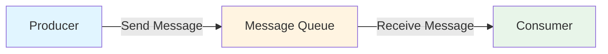

**Key Components:**

1. **Producer (Publisher):**
   - Creates and sends messages
   - Doesn't wait for processing
   - Continues with other work immediately

2. **Message Queue (Broker):**
   - Stores messages temporarily
   - Manages message routing
   - Ensures delivery guarantees
   - Handles retries and failures

3. **Consumer (Subscriber):**
   - Retrieves messages from queue
   - Processes messages
   - Acknowledges completion
   - Can scale independently

### How It Works

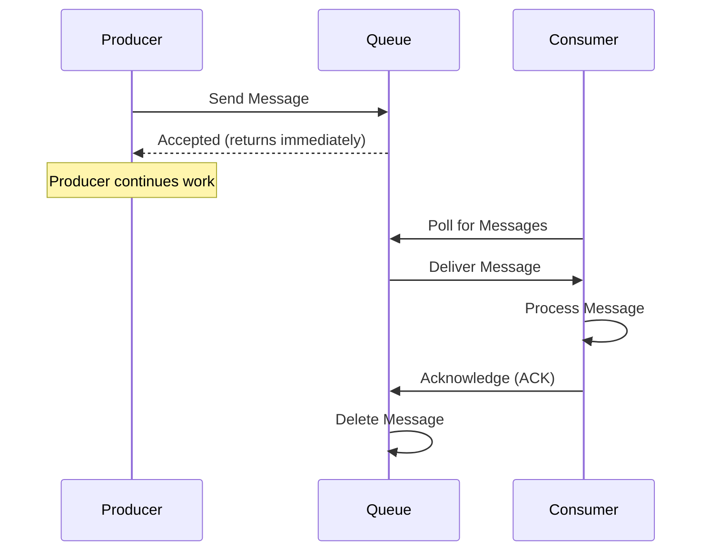

### Benefits Over Direct Communication

**Synchronous (Direct) Communication:**
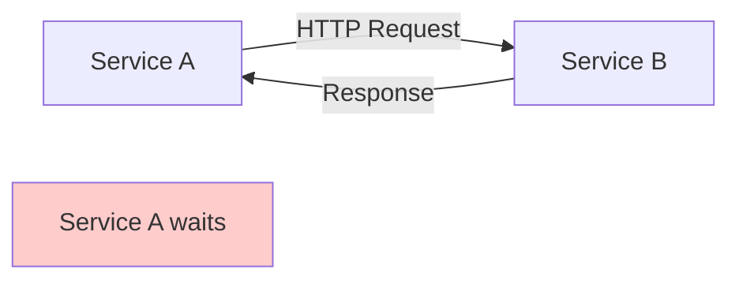

**Problems:**
- Tight coupling between services
- Service A blocked while waiting
- Failure in Service B affects Service A
- Difficult to handle load spikes
- Cascade failures

**Asynchronous (Queue-Based) Communication:**
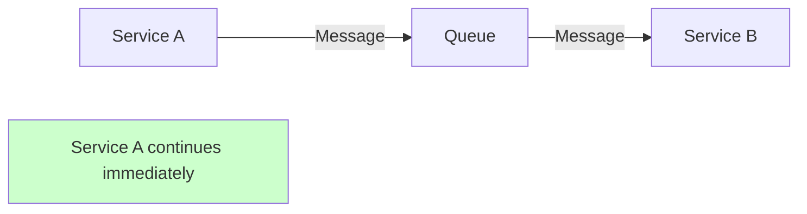

**Advantages:**
- Loose coupling
- Non-blocking operations
- Built-in buffering
- Independent scaling
- Fault tolerance

## Core Concepts

### Messages

A message is a unit of data sent through the queue.

**Message Structure:**
```javascript
// Conceptual message structure
{
    id: "msg-12345",
    timestamp: "2025-10-04T10:30:00Z",
    headers: {
        contentType: "application/json",
        priority: "high",
        source: "order-service"
    },
    body: {
        orderId: "ORD-789",
        userId: "USR-456",
        action: "create_order",
        data: { /* payload */ }
    },
    metadata: {
        retryCount: 0,
        ttl: 3600,
        routing_key: "orders.created"
    }
}
```

**Message Components:**
- **ID:** Unique identifier for deduplication
- **Timestamp:** When message was created
- **Headers:** Metadata (content type, priority, etc.)
- **Body:** Actual payload/data
- **Metadata:** Queue-specific information

### Queues

A queue is a temporary storage location for messages.

**Queue Characteristics:**
- **FIFO (First In, First Out):** Messages processed in order
- **Priority:** Higher priority messages processed first
- **Persistent:** Messages stored on disk
- **Temporary:** Messages deleted after processing
- **Bounded:** Maximum size/message limits

### Topics and Exchanges

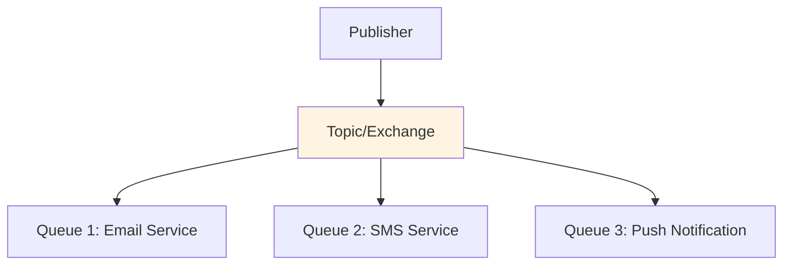

**Topic:**
- Named channel for messages
- Multiple subscribers can listen
- Publish-subscribe pattern
- Messages broadcast to all subscribers

**Exchange:**
- Routes messages to queues
- Different routing strategies
- Topic, Direct, Fanout, Headers
- Used in RabbitMQ

### Dead Letter Queues (DLQ)

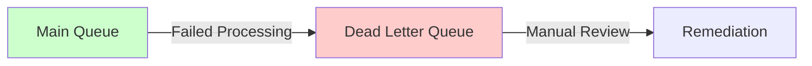

**Purpose:**
- Store messages that fail processing
- Prevent infinite retry loops
- Enable debugging and analysis
- Manual intervention point

**When Messages Go to DLQ:**
- Maximum retry attempts exceeded
- Message processing timeout
- Poison messages (malformed)
- Consumer exceptions

### Message Acknowledgment

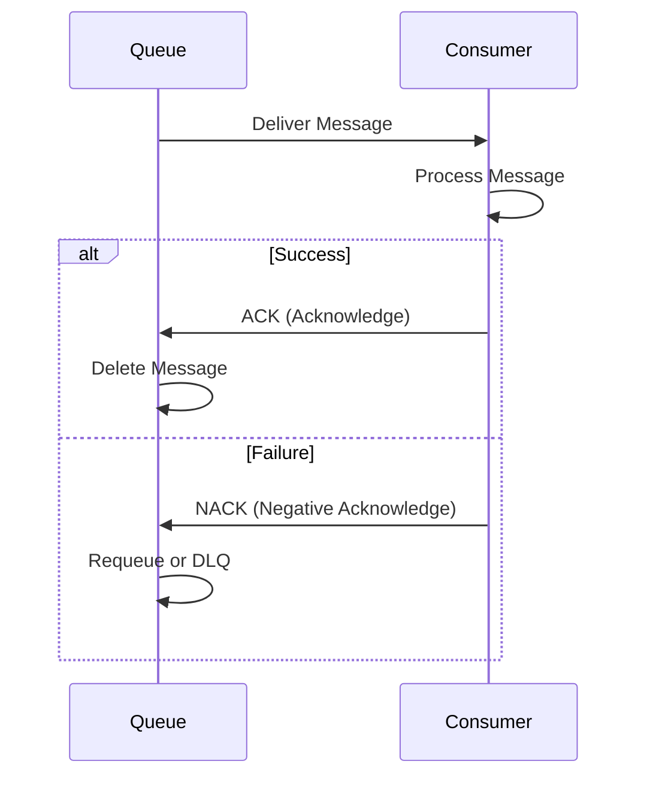

**Acknowledgment Types:**
- **Auto-ACK:** Acknowledge on delivery (risky)
- **Manual ACK:** Acknowledge after processing (safe)
- **Batch ACK:** Acknowledge multiple messages
- **NACK:** Negative acknowledgment (requeue)
- **Reject:** Reject message (send to DLQ)

## Architecture Patterns

### Point-to-Point (Queue Pattern)

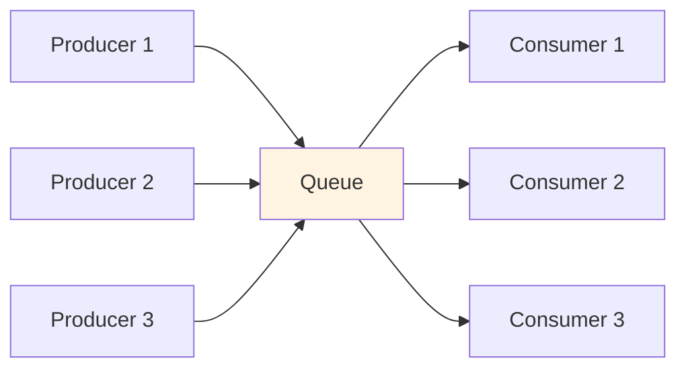

**Characteristics:**
- Each message consumed by one consumer
- Load balancing across consumers
- Competing consumers pattern
- Parallel processing

**Use Cases:**
- Task distribution
- Job processing
- Worker pools
- Background jobs

### Publish-Subscribe (Pub-Sub Pattern)

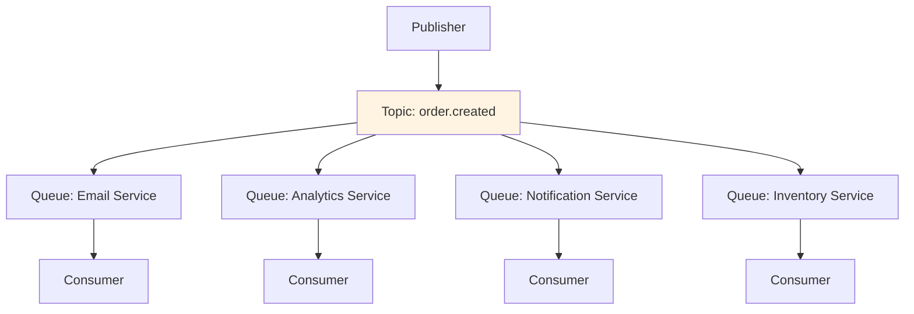

**Characteristics:**
- Each message consumed by all subscribers
- One-to-many communication
- Event-driven architecture
- Decoupled services

**Use Cases:**
- Event notifications
- Broadcasting updates
- Real-time notifications
- System-wide events

### Request-Reply Pattern

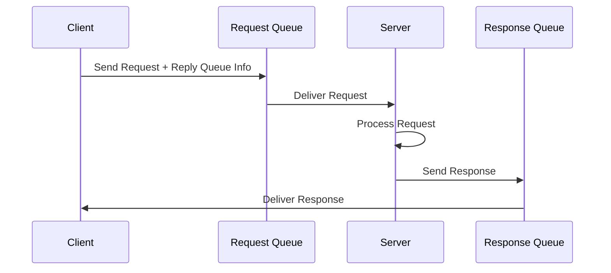

**Characteristics:**
- Asynchronous RPC
- Correlation IDs for matching
- Temporary reply queues
- Non-blocking request/response

**Use Cases:**
- Long-running operations
- Async API calls
- Distributed task processing
- Microservices communication

### Message Router Pattern

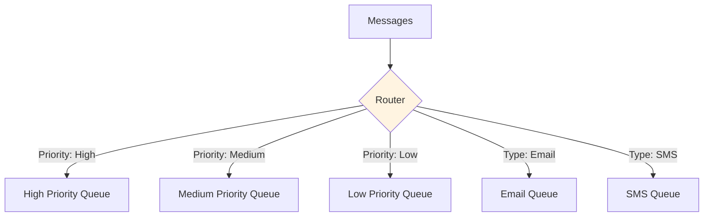

**Routing Strategies:**
- Content-based routing
- Header-based routing
- Priority-based routing
- Geographic routing
- Custom routing logic

### Scatter-Gather Pattern

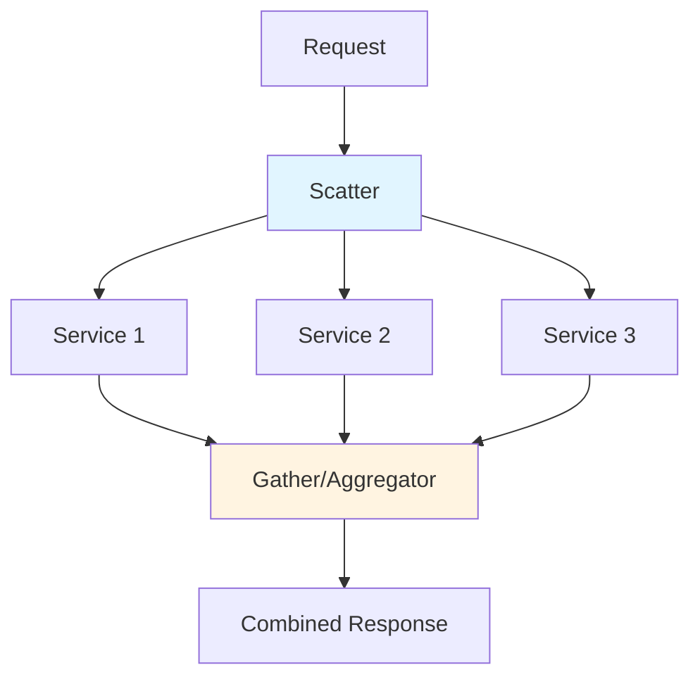

**Characteristics:**
- Request sent to multiple services
- Responses aggregated
- Parallel processing
- Timeout handling

**Use Cases:**
- Price comparison
- Multiple data source queries
- Distributed search
- Fan-out/fan-in operations

**Reference:** See [horizontal_scaling.md](./horizontal_scaling.md) for distributed patterns.

## Queue Types and Models

### Standard Queue (Best-Effort Ordering)

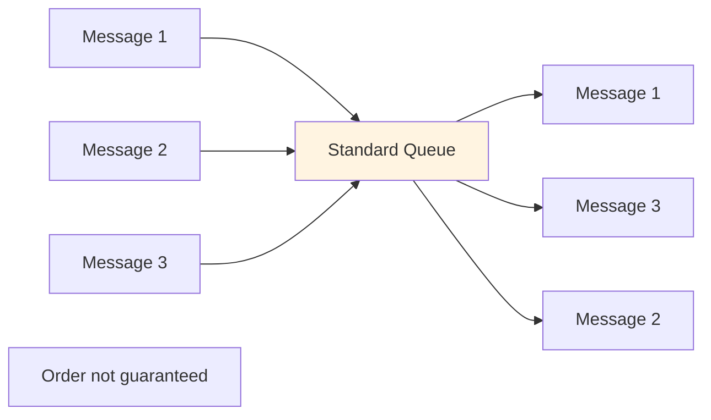

**Characteristics:**
- Unlimited throughput
- At-least-once delivery
- Best-effort ordering
- Higher performance

**Trade-offs:**
- Messages may arrive out of order
- Possible duplicate delivery
- Better for high-throughput

### FIFO Queue (Strict Ordering)

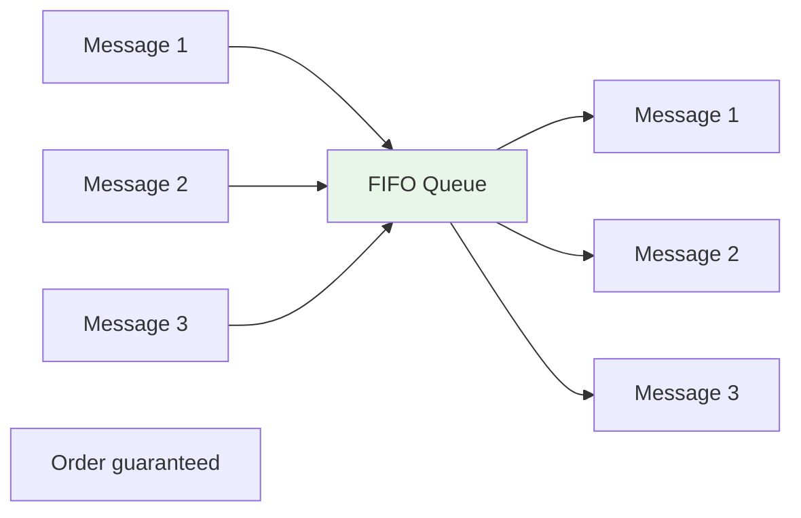

**Characteristics:**
- Exactly-once processing
- Strict message ordering
- Message grouping
- Limited throughput (300-3000 TPS)

**Trade-offs:**
- Lower throughput
- Higher latency
- More expensive
- Ordered delivery guarantees

**Use Cases:**
- Order processing
- Banking transactions
- Sequential operations
- Event sourcing

### Priority Queue

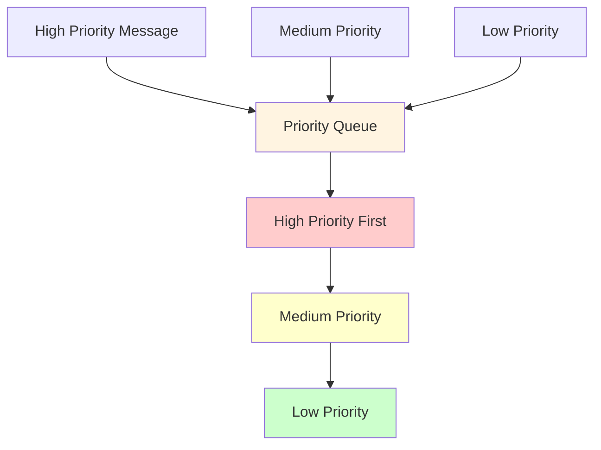

**Characteristics:**
- Messages have priority levels
- Higher priority processed first
- Prevents starvation (configurable)
- Multiple priority levels

**Use Cases:**
- Urgent vs normal tasks
- VIP customer requests
- Critical system events
- Time-sensitive operations

### Delay Queue

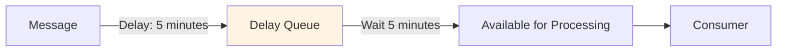

**Characteristics:**
- Messages invisible for delay period
- Scheduled message delivery
- Per-message delay configuration
- Useful for retry logic

**Use Cases:**
- Scheduled tasks
- Retry with exponential backoff
- Delayed notifications
- Rate limiting

### Temporary Queue

**Characteristics:**
- Created dynamically
- Deleted when no longer needed
- Used for request-reply patterns
- Short-lived

**Use Cases:**
- RPC reply queues
- Temporary communication channels
- Session-specific queues

## Message Delivery Guarantees

### At-Most-Once Delivery

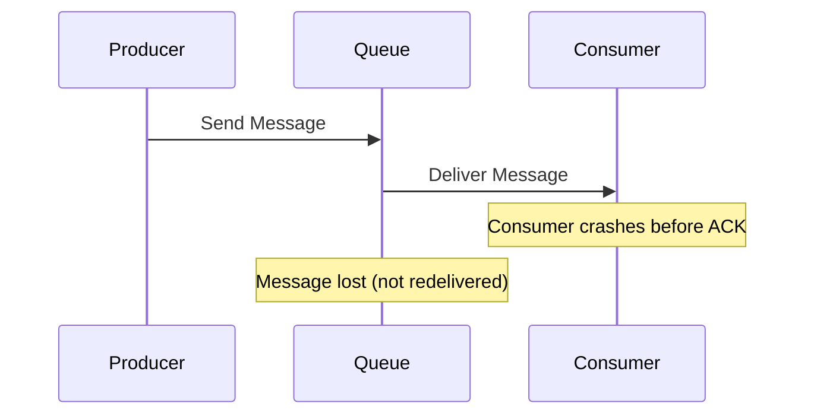

**Characteristics:**
- Fire-and-forget
- No retries
- Message may be lost
- Lowest latency

**Use Cases:**
- Metrics and logging
- Non-critical notifications
- Real-time data where staleness matters more than completeness

### At-Least-Once Delivery

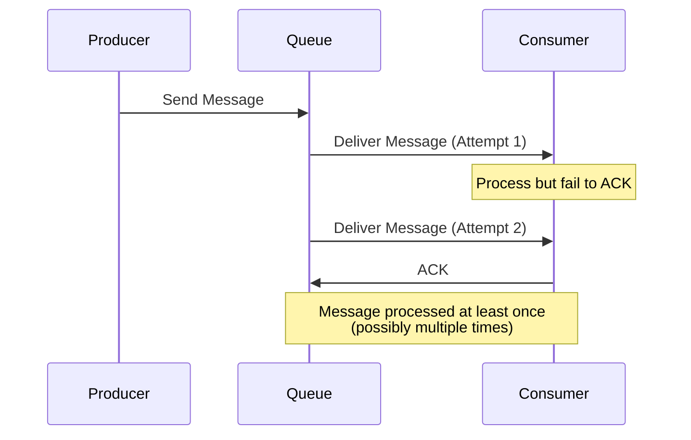

**Characteristics:**
- Guaranteed delivery
- Possible duplicates
- Requires idempotent processing
- Most common guarantee

**Use Cases:**
- Order processing (with idempotency)
- Email sending
- Data synchronization
- Event processing

**Idempotency Example:**
```javascript
// Conceptual idempotent handler
async function processOrder(message) {
    const orderId = message.body.orderId;
    
    // Check if already processed
    if (await isOrderProcessed(orderId)) {
        return; // Skip duplicate
    }
    
    // Process order
    await createOrder(message.body);
    
    // Mark as processed
    await markOrderProcessed(orderId);
}
```

### Exactly-Once Delivery

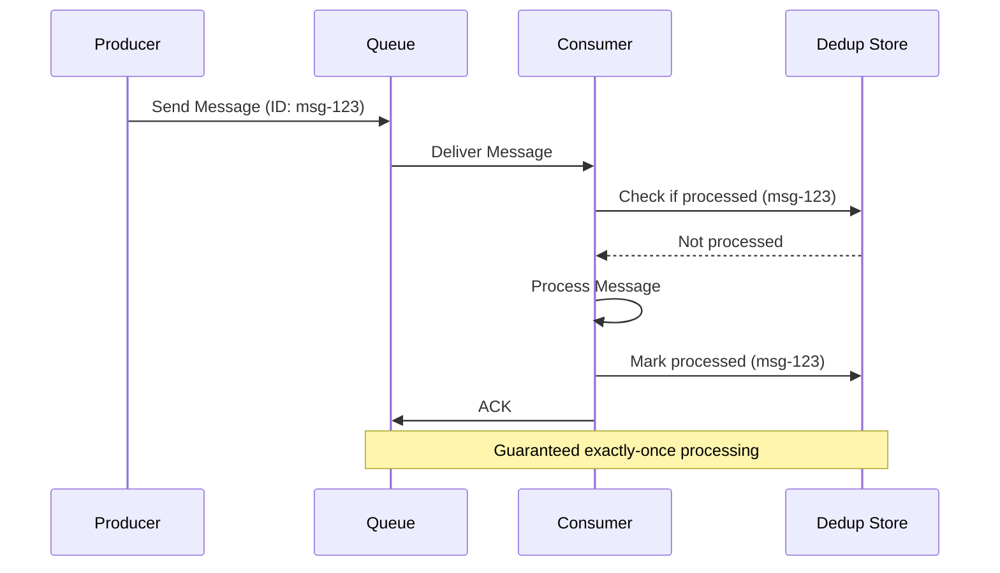

**Characteristics:**
- No duplicates
- Guaranteed delivery
- Complex implementation
- Higher latency/cost

**Implementation Strategies:**
1. **Deduplication Store:**
   - Track message IDs
   - Check before processing
   - Transactional guarantees

2. **Transactional Outbox:**
   - Write to DB and queue atomically
   - Guaranteed consistency
   - No lost messages

3. **Idempotency Keys:**
   - Client-generated unique IDs
   - Server-side deduplication
   - Retry-safe operations

**Use Cases:**
- Financial transactions
- Billing systems
- Inventory management
- Critical business operations

**Reference:** See [eventual_consistency.md](./eventual_consistency.md) for consistency patterns.

## Popular Message Queue Systems

### RabbitMQ

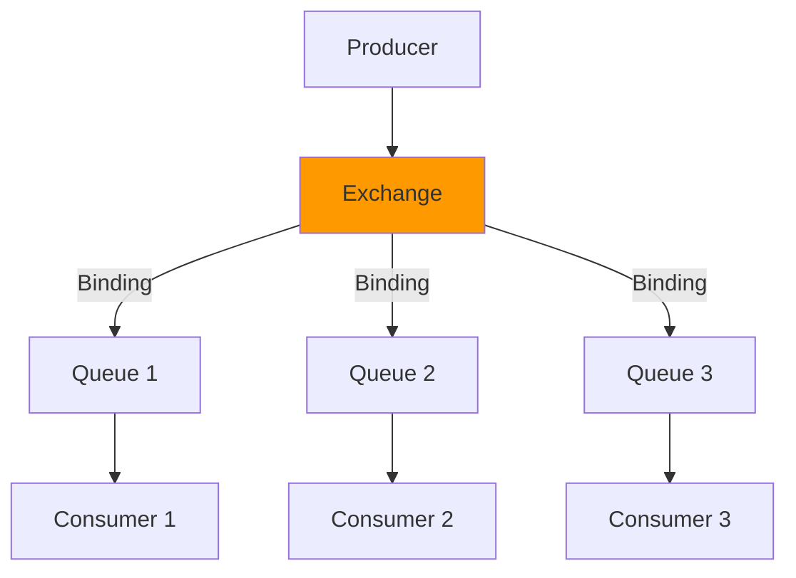

**Key Features:**
- AMQP protocol
- Flexible routing (exchanges)
- Clustering and HA
- Message persistence
- Plugin ecosystem

**Exchange Types:**
- **Direct:** Route by exact routing key
- **Topic:** Route by pattern matching
- **Fanout:** Broadcast to all queues
- **Headers:** Route by message headers

**Pros:**
- Mature and stable
- Rich feature set
- Good documentation
- Active community

**Cons:**
- Complex configuration
- Memory-intensive
- Scalability limits
- Operational overhead

**Best For:**
- Complex routing needs
- Enterprise applications
- Microservices
- Flexible message patterns

### Apache Kafka

```mermaid
graph LR
    P1[Producer] --> T[Topic: orders]
    P2[Producer] --> T
    
    T --> CG1[Consumer Group 1]
    T --> CG2[Consumer Group 2]
    
    CG1 --> C1[Consumer 1]
    CG1 --> C2[Consumer 2]
    
    CG2 --> C3[Consumer 3]
    
    style T fill:#231f20
    style T fill:#000
```

**Key Features:**
- Distributed streaming platform
- High throughput (millions/sec)
- Log-based storage
- Message retention (days/weeks)
- Replay capability

**Architecture:**
- **Topics:** Categories of messages
- **Partitions:** Parallel processing units
- **Consumer Groups:** Load balancing
- **Offsets:** Track consumption position

**Pros:**
- Extremely high throughput
- Durable message storage
- Replay messages
- Stream processing (Kafka Streams)
- Excellent for big data

**Cons:**
- Complex operations
- Not true queue (more like log)
- Steep learning curve
- Resource intensive

**Best For:**
- Event sourcing
- Log aggregation
- Stream processing
- Real-time analytics
- High-volume data pipelines

### Amazon SQS (Simple Queue Service)

```mermaid
graph LR
    A[Producer] --> B[SQS Queue]
    B --> C[Consumer 1]
    B --> D[Consumer 2]
    B --> E[Consumer N]
    
    style B fill:#ff9900
```

**Key Features:**
- Fully managed service
- Unlimited scaling
- Standard and FIFO queues
- Integrated with AWS ecosystem
- Pay-per-use pricing

**Queue Types:**
- **Standard:** Unlimited throughput, best-effort ordering
- **FIFO:** Exactly-once, strict ordering, 300-3000 TPS

**Pros:**
- No infrastructure management
- Auto-scaling
- High availability
- Simple to use
- Cost-effective

**Cons:**
- AWS vendor lock-in
- Limited feature set
- No message routing
- Basic compared to RabbitMQ/Kafka

**Best For:**
- AWS-based applications
- Simple queue requirements
- Managed solution preference
- Serverless architectures

### Redis Pub/Sub and Streams

```mermaid
graph TD
    A[Publisher] --> B[Redis]
    
    B --> C[Subscriber 1]
    B --> D[Subscriber 2]
    B --> E[Subscriber 3]
    
    style B fill:#dc382d
```

**Features:**
- In-memory speed
- Pub/Sub messaging
- Redis Streams (log-like)
- Simple to use
- Multiple data structures

**Pub/Sub:**
- Real-time messaging
- No persistence
- Fire-and-forget
- Very fast

**Streams:**
- Persistent messages
- Consumer groups
- Message acknowledgment
- Kafka-like features

**Pros:**
- Extremely fast
- Simple API
- Low latency
- Multi-purpose (cache + queue)

**Cons:**
- Limited persistence
- Memory constraints
- No advanced routing
- Less features than dedicated MQs

**Best For:**
- Real-time updates
- Simple messaging needs
- Low-latency requirements
- Combined cache + queue use

### Apache ActiveMQ

**Features:**
- JMS-compliant
- Multiple protocols
- Enterprise features
- Clustering support

**Best For:**
- Java applications
- Enterprise integration
- Legacy system integration

### NATS

**Features:**
- Cloud-native messaging
- Extremely lightweight
- High performance
- Simple protocol

**Best For:**
- Microservices
- IoT
- Edge computing
- Cloud-native apps

### Comparison Matrix

| Feature | RabbitMQ | Kafka | SQS | Redis | NATS |
|---------|----------|-------|-----|-------|------|
| **Throughput** | Medium | Very High | High | Very High | Very High |
| **Latency** | Low | Medium | Medium | Very Low | Very Low |
| **Persistence** | Yes | Yes (long-term) | Yes | Optional | Optional |
| **Ordering** | Yes | Yes (per partition) | FIFO only | Yes | No |
| **Routing** | Advanced | Topic-based | None | Simple | Subject-based |
| **Management** | Self/Managed | Self | Managed | Self | Self |
| **Complexity** | Medium | High | Low | Low | Low |
| **Best Use** | Microservices | Event Streaming | AWS Apps | Real-time | Cloud-native |

**Reference:** See [database_scaling.md](./database_scaling.md) for message persistence strategies.

## Use Cases

### 1. Background Job Processing

```mermaid
graph LR
    A[Web App] -->|Create Job| B[Job Queue]
    B --> C[Worker 1]
    B --> D[Worker 2]
    B --> E[Worker N]
    
    C --> F[Process Tasks]
    D --> F
    E --> F
    
    style B fill:#fff4e1
```

**Examples:**
- Image/video processing
- Report generation
- Data export
- Email sending
- File uploads

**Benefits:**
- Non-blocking user experience
- Scalable workers
- Retry failed jobs
- Distribute load

### 2. Microservices Communication

```mermaid
graph TD
    A[Order Service] -->|order.created| B[Event Bus]
    
    B --> C[Payment Service]
    B --> D[Inventory Service]
    B --> E[Notification Service]
    B --> F[Analytics Service]
    
    style B fill:#fff4e1
```

**Benefits:**
- Loose coupling
- Independent deployment
- Service isolation
- Event-driven architecture

**Example Flow:**
```
1. Order Service publishes "order.created" event
2. Payment Service processes payment
3. Inventory Service reserves items
4. Notification Service sends confirmation
5. Analytics Service records metrics
```

### 3. Load Leveling

```mermaid
graph LR
    A[Traffic Spike] -->|1000 req/sec| B[Queue]
    B -->|Constant rate| C[Backend<br/>100 req/sec]
    
    style A fill:#ffcccc
    style B fill:#fff4e1
    style C fill:#ccffcc
```

**Scenario:**
- Black Friday sales
- Sudden traffic spikes
- DDoS protection
- Rate limiting

**Benefits:**
- Protect backend services
- Smooth out load
- Prevent system overload
- Graceful degradation

### 4. Data Pipeline

```mermaid
graph LR
    A[Data Source] --> B[Ingestion Queue]
    B --> C[Transform Service]
    C --> D[Processing Queue]
    D --> E[Enrichment Service]
    E --> F[Output Queue]
    F --> G[Storage/Analytics]
    
    style B fill:#fff4e1
    style D fill:#fff4e1
    style F fill:#fff4e1
```

**Use Cases:**
- ETL processes
- Log aggregation
- Data streaming
- Real-time analytics

### 5. Distributed Transactions (Saga Pattern)

```mermaid
sequenceDiagram
    participant O as Order Service
    participant Q as Queue
    participant P as Payment Service
    participant I as Inventory Service
    
    O->>Q: order.create
    Q->>P: Process Payment
    P->>Q: payment.success
    
    Q->>I: Reserve Inventory
    I->>Q: inventory.reserved
    
    Note over O,I: Transaction Complete
    
    alt Failure Scenario
        I->>Q: inventory.failed
        Q->>P: Compensate: Refund Payment
    end
```

**Benefits:**
- Distributed transaction coordination
- Automatic compensation
- Fault tolerance
- Eventual consistency

**Reference:** See [eventual_consistency.md](./eventual_consistency.md) for saga patterns.

### 6. Event Sourcing

```mermaid
graph LR
    A[Commands] --> B[Event Stream]
    
    B --> C[Event Store]
    C --> D[Read Model 1]
    C --> E[Read Model 2]
    C --> F[Analytics]
    
    style B fill:#fff4e1
    style C fill:#e8f5e9
```

**Benefits:**
- Complete audit trail
- Rebuild state by replaying events
- Multiple projections
- Time travel debugging

### 7. CQRS (Command Query Responsibility Segregation)

```mermaid
graph TD
    A[Client] --> B{CQRS}
    
    B -->|Commands| C[Write Model]
    B -->|Queries| D[Read Model]
    
    C -->|Events| E[Message Queue]
    E --> D
    
    style E fill:#fff4e1
```

**Benefits:**
- Separate read/write optimization
- Independent scaling
- Eventual consistency
- Performance optimization

### 8. Circuit Breaker Pattern

```mermaid
graph LR
    A[Service A] -->|Request| B[Circuit Breaker]
    B -->|If Healthy| C[Queue]
    C --> D[Service B]
    
    B -->|If Unhealthy| E[Fallback/Error]
    
    style B fill:#fff4e1
```

**Benefits:**
- Prevent cascade failures
- Graceful degradation
- Automatic recovery
- System resilience

**Reference:** See [load_balancing.md](./load_balancing.md) for resilience patterns.

## Design Patterns

### Producer Patterns

#### Fire and Forget

```javascript
// Conceptual producer
async function fireAndForget(message) {
    await queue.send(message);
    // Don't wait for confirmation
    return immediately;
}
```

**Characteristics:**
- Fastest throughput
- No delivery guarantee
- Suitable for non-critical messages

#### Confirmed Publishing

```javascript
// Conceptual confirmed publishing
async function confirmedPublish(message) {
    const result = await queue.send(message);
    if (!result.confirmed) {
        throw new Error('Message not confirmed');
    }
    return result;
}
```

**Characteristics:**
- Wait for broker confirmation
- Guaranteed acceptance
- Higher latency

#### Transactional Publishing

```javascript
// Conceptual transactional pattern
async function transactionalPublish(dbData, queueMessage) {
    const transaction = await db.beginTransaction();
    
    try {
        await db.insert(dbData, transaction);
        await queue.send(queueMessage, transaction);
        await transaction.commit();
    } catch (error) {
        await transaction.rollback();
        throw error;
    }
}
```

**Characteristics:**
- Atomic DB + Queue operations
- Strong consistency
- Complex implementation

### Consumer Patterns

#### Single Consumer

```mermaid
graph LR
    A[Queue] --> B[Consumer]
    
    style A fill:#fff4e1
```

**Characteristics:**
- Sequential processing
- Simple implementation
- No parallelism
- Can be bottleneck

#### Competing Consumers

```mermaid
graph LR
    A[Queue] --> B[Consumer 1]
    A --> C[Consumer 2]
    A --> D[Consumer N]
    
    style A fill:#fff4e1
```

**Characteristics:**
- Load balancing
- Parallel processing
- Higher throughput
- Message distribution

**Implementation:**
```javascript
// Conceptual competing consumers
function startWorkerPool(queueName, workerCount) {
    for (let i = 0; i < workerCount; i++) {
        startWorker(queueName, `worker-${i}`);
    }
}

function startWorker(queueName, workerId) {
    queue.consume(queueName, async (message) => {
        await processMessage(message);
        queue.ack(message);
    });
}
```

#### Consumer Groups (Kafka-style)

```mermaid
graph TD
    A[Topic] --> B[Partition 1]
    A --> C[Partition 2]
    A --> D[Partition 3]
    
    E[Consumer Group]
    B --> F[Consumer 1]
    C --> G[Consumer 2]
    D --> H[Consumer 3]
    
    F -.-> E
    G -.-> E
    H -.-> E
    
    style A fill:#000
    style E fill:#fff4e1
```

**Characteristics:**
- Partition-based parallelism
- Ordered processing per partition
- Scalable consumption
- Group coordination

#### Selective Consumer

```javascript
// Conceptual message filtering
async function selectiveConsumer(message) {
    // Only process specific message types
    if (message.type === 'order.created') {
        await processOrder(message);
    } else if (message.type === 'order.cancelled') {
        await cancelOrder(message);
    } else {
        // Ignore other message types
        queue.ack(message);
    }
}
```

**Characteristics:**
- Message filtering
- Type-based routing
- Reduced processing
- More efficient

### Message Patterns

#### Message Expiration

```javascript
// Conceptual message with TTL
const message = {
    body: data,
    properties: {
        expiration: '60000' // 60 seconds
    }
};

queue.send(message);
```

**Use Cases:**
- Time-sensitive data
- Real-time updates
- Cache invalidation
- Session timeouts

#### Message Priority

```javascript
// Conceptual priority handling
const highPriorityMessage = {
    body: urgentData,
    priority: 10 // 0-10 scale
};

const normalMessage = {
    body: normalData,
    priority: 5
};
```

**Processing Order:**
1. High priority messages first
2. Medium priority next
3. Low priority last
4. Within priority: FIFO

#### Message Batching

```javascript
// Conceptual batch processing
async function batchConsumer(batchSize = 100) {
    const messages = await queue.receiveBatch(batchSize);
    
    // Process batch efficiently
    await processBatch(messages);
    
    // Acknowledge all
    await queue.ackBatch(messages);
}
```

**Benefits:**
- Higher throughput
- Reduced network overhead
- Efficient bulk operations
- Database batch inserts

**Trade-offs:**
- Increased latency per message
- Memory usage
- Partial failure handling
- All-or-nothing acknowledgment

#### Correlation ID Pattern

```javascript
// Conceptual request-reply with correlation
async function requestReply(request) {
    const correlationId = generateUUID();
    const replyQueue = createTemporaryQueue();
    
    // Send request with correlation ID
    await queue.send('request-queue', {
        body: request,
        replyTo: replyQueue,
        correlationId: correlationId
    });
    
    // Wait for response
    const response = await queue.receive(replyQueue, {
        filter: `correlationId = '${correlationId}'`,
        timeout: 30000
    });
    
    return response;
}
```

**Use Cases:**
- Request-reply patterns
- Async RPC
- Distributed tracing
- Message tracking

## Error Handling and Retry Strategies

### Retry Mechanisms

#### Immediate Retry

```mermaid
sequenceDiagram
    participant Q as Queue
    participant C as Consumer
    
    Q->>C: Deliver Message
    C->>C: Process (Fails)
    C->>Q: NACK/Reject
    Q->>C: Redeliver Immediately
    C->>C: Process (Success)
    C->>Q: ACK
```

**Characteristics:**
- Instant retry
- Good for transient errors
- Can overwhelm system
- No backoff

**Use Cases:**
- Network blips
- Temporary unavailability
- Quick recovery scenarios

#### Delayed Retry with Exponential Backoff

```mermaid
graph TD
    A[Message Fails] --> B{Retry Count?}
    B -->|Attempt 1| C[Wait 1 second]
    B -->|Attempt 2| D[Wait 2 seconds]
    B -->|Attempt 3| E[Wait 4 seconds]
    B -->|Attempt 4| F[Wait 8 seconds]
    B -->|Max Attempts| G[Send to DLQ]
    
    C --> H[Retry]
    D --> H
    E --> H
    F --> H
    
    style G fill:#ffcccc
```

**Implementation:**
```javascript
// Conceptual exponential backoff
async function processWithRetry(message, maxAttempts = 5) {
    const retryCount = message.metadata.retryCount || 0;
    
    try {
        await processMessage(message);
        await queue.ack(message);
    } catch (error) {
        if (retryCount >= maxAttempts) {
            // Send to DLQ
            await deadLetterQueue.send(message);
            await queue.ack(message);
        } else {
            // Calculate backoff delay
            const delay = Math.pow(2, retryCount) * 1000;
            
            // Requeue with delay
            await queue.send(message.queueName, {
                ...message,
                metadata: {
                    ...message.metadata,
                    retryCount: retryCount + 1
                }
            }, { delay });
            
            await queue.ack(message);
        }
    }
}
```

**Benefits:**
- Prevents system overload
- Allows time for recovery
- Reduces retry storms
- Configurable backoff strategy

#### Retry with Jitter

```javascript
// Conceptual retry with jitter
function calculateBackoffWithJitter(retryCount, baseDelay = 1000) {
    const exponentialDelay = Math.pow(2, retryCount) * baseDelay;
    const jitter = Math.random() * 0.3 * exponentialDelay;
    return exponentialDelay + jitter;
}
```

**Why Jitter:**
- Prevents thundering herd
- Distributes retry timing
- Reduces system spikes
- More resilient

### Dead Letter Queue (DLQ) Strategy

```mermaid
graph TD
    A[Main Queue] -->|Process| B{Success?}
    B -->|Yes| C[ACK & Complete]
    B -->|No| D{Retry Count < Max?}
    D -->|Yes| E[Retry with Backoff]
    D -->|No| F[Send to DLQ]
    
    E --> A
    
    F --> G[DLQ]
    G --> H[Manual Review]
    G --> I[Automated Remediation]
    G --> J[Alerting]
    
    style F fill:#ffcccc
    style G fill:#ffcccc
```

**DLQ Processing:**

```javascript
// Conceptual DLQ monitoring
async function monitorDLQ() {
    const messages = await dlq.receiveAll();
    
    for (const message of messages) {
        // Analyze failure
        const error = message.metadata.lastError;
        
        if (isTransientError(error)) {
            // Retry after fixing issue
            await mainQueue.send(message);
        } else if (isPoisonMessage(message)) {
            // Log and discard
            await logPoisonMessage(message);
            await dlq.delete(message);
        } else {
            // Alert for manual intervention
            await alertTeam(message);
        }
    }
}
```

### Circuit Breaker for Consumers

```mermaid
stateDiagram-v2
    [*] --> Closed
    Closed --> Open: Failure threshold exceeded
    Open --> HalfOpen: After timeout
    HalfOpen --> Closed: Success
    HalfOpen --> Open: Failure
    
    Closed: Normal operation
    Open: Reject all requests
    HalfOpen: Test recovery
```

**Implementation:**
```javascript
// Conceptual circuit breaker
class CircuitBreaker {
    constructor(failureThreshold = 5, timeout = 60000) {
        this.state = 'CLOSED';
        this.failureCount = 0;
        this.failureThreshold = failureThreshold;
        this.timeout = timeout;
    }
    
    async execute(operation) {
        if (this.state === 'OPEN') {
            if (Date.now() - this.openedAt > this.timeout) {
                this.state = 'HALF_OPEN';
            } else {
                throw new Error('Circuit breaker is OPEN');
            }
        }
        
        try {
            const result = await operation();
            this.onSuccess();
            return result;
        } catch (error) {
            this.onFailure();
            throw error;
        }
    }
    
    onSuccess() {
        this.failureCount = 0;
        if (this.state === 'HALF_OPEN') {
            this.state = 'CLOSED';
        }
    }
    
    onFailure() {
        this.failureCount++;
        if (this.failureCount >= this.failureThreshold) {
            this.state = 'OPEN';
            this.openedAt = Date.now();
        }
    }
}
```

**Benefits:**
- Prevents cascade failures
- Automatic recovery
- System protection
- Graceful degradation

### Poison Message Handling

**Poison Message:** A message that repeatedly fails processing and blocks the queue.

**Detection:**
```javascript
// Conceptual poison message detection
function isPoisonMessage(message) {
    const retryCount = message.metadata.retryCount || 0;
    const maxRetries = 10;
    
    return retryCount > maxRetries;
}
```

**Handling Strategies:**

1. **Move to DLQ:** Remove from main queue
2. **Skip and Log:** Acknowledge and log for review
3. **Transform:** Attempt to fix message format
4. **Alert:** Notify team for manual intervention

**Reference:** See [best_practises.md](./best_practises.md) for error handling best practices.

## Monitoring and Observability

### Key Metrics

#### Queue Depth (Messages in Queue)

```mermaid
graph LR
    A[Queue Depth] --> B{Threshold?}
    B -->|Normal| C[0-1000 messages]
    B -->|Warning| D[1000-5000 messages]
    B -->|Critical| E[>5000 messages]
    
    style C fill:#ccffcc
    style D fill:#ffffcc
    style E fill:#ffcccc
```

**What It Indicates:**
- Consumer throughput issues
- Producer rate exceeds consumption
- System bottleneck
- Need for scaling

**Actions:**
- Scale consumers
- Optimize processing
- Throttle producers
- Investigate bottlenecks

#### Message Age (Time in Queue)

**Metric:** Time between message creation and processing

**Thresholds:**
- Normal: <1 second
- Warning: 1-10 seconds
- Critical: >10 seconds

**Causes:**
- Slow consumers
- Insufficient workers
- Processing bottlenecks
- Resource constraints

#### Processing Rate (Messages/Second)

```mermaid
graph TD
    A[Monitoring] --> B[Producer Rate]
    A --> C[Consumer Rate]
    
    B --> D{Comparison}
    C --> D
    
    D -->|Producer > Consumer| E[Queue Growing<br/>Scale Consumers]
    D -->|Consumer > Producer| F[Healthy System]
    D -->|Rates Match| G[Optimal Balance]
    
    style E fill:#ffcccc
    style F fill:#ccffcc
    style G fill:#ccffcc
```

**Key Metrics:**
- Messages published/sec
- Messages consumed/sec
- Messages acknowledged/sec
- Messages rejected/sec

#### Error Rate

**Metrics:**
- Failed processing attempts
- Messages sent to DLQ
- Consumer exceptions
- Retry rate

**Alerting:**
```javascript
// Conceptual error rate alerting
function checkErrorRate(errorCount, totalCount) {
    const errorRate = errorCount / totalCount;
    
    if (errorRate > 0.1) { // 10% error rate
        alertCritical('High error rate detected');
    } else if (errorRate > 0.05) { // 5% error rate
        alertWarning('Elevated error rate');
    }
}
```

#### Consumer Lag (Kafka)

```mermaid
graph LR
    A[Latest Offset] --> B[Current Offset]
    B --> C[Lag = Difference]
    
    C --> D{Lag Size?}
    D -->|< 1000| E[Healthy]
    D -->|1000-10000| F[Warning]
    D -->|> 10000| G[Critical]
    
    style E fill:#ccffcc
    style F fill:#ffffcc
    style G fill:#ffcccc
```

**What It Means:**
- How far behind consumers are
- Backlog size
- Processing capacity
- Need for scaling

#### Throughput and Latency

**Throughput Metrics:**
- Messages/second processed
- Bytes/second transferred
- Batch sizes
- Network utilization

**Latency Metrics:**
- End-to-end latency (producer to consumer)
- Queue wait time
- Processing time
- Network latency

### Distributed Tracing

```mermaid
graph LR
    A[Service A] -->|TraceID: 123| B[Queue]
    B -->|TraceID: 123| C[Service B]
    C -->|TraceID: 123| D[Service C]
    
    E[Tracing System] --> F[Complete Trace View]
    
    style E fill:#e1f5ff
```

**Implementation:**
```javascript
// Conceptual distributed tracing
async function publishWithTracing(message) {
    const traceContext = {
        traceId: currentTraceId(),
        spanId: generateSpanId(),
        parentSpanId: currentSpanId()
    };
    
    await queue.send({
        ...message,
        headers: {
            ...message.headers,
            ...traceContext
        }
    });
}

async function consumeWithTracing(message) {
    const trace = extractTraceContext(message.headers);
    
    startSpan({
        traceId: trace.traceId,
        parentSpanId: trace.spanId,
        operation: 'process-message'
    });
    
    try {
        await processMessage(message);
    } finally {
        endSpan();
    }
}
```

**Benefits:**
- End-to-end visibility
- Performance bottleneck identification
- Error tracking across services
- Dependency mapping

### Dashboards and Alerts

**Essential Dashboard Panels:**

1. **Queue Health:**
   - Queue depth over time
   - Message age distribution
   - Error rate trends

2. **Throughput:**
   - Messages published/consumed
   - Processing rate
   - Batch sizes

3. **Consumer Health:**
   - Active consumers
   - Consumer lag
   - Processing time percentiles

4. **Errors:**
   - Failed messages
   - DLQ size
   - Retry attempts

**Alert Examples:**
```javascript
// Conceptual alerting rules
const alerts = {
    queueDepthCritical: {
        condition: 'queue_depth > 10000',
        severity: 'critical',
        action: 'page_on_call'
    },
    highErrorRate: {
        condition: 'error_rate > 0.05',
        severity: 'warning',
        action: 'notify_team'
    },
    consumerDown: {
        condition: 'active_consumers == 0',
        severity: 'critical',
        action: 'auto_restart'
    },
    dlqGrowing: {
        condition: 'dlq_size > 100',
        severity: 'warning',
        action: 'investigate'
    }
};
```

**Reference:** See [auto_scaling.md](./auto_scaling.md) for metric-based scaling.

## Performance Optimization

### Producer Optimization

#### Batch Publishing

```javascript
// Conceptual batch publishing
async function batchPublish(messages, batchSize = 100) {
    for (let i = 0; i < messages.length; i += batchSize) {
        const batch = messages.slice(i, i + batchSize);
        await queue.sendBatch(batch);
    }
}
```

**Benefits:**
- Reduced network overhead
- Higher throughput
- Better resource utilization
- Lower latency per message

**Trade-offs:**
- Increased memory usage
- Delayed message delivery
- Partial failure complexity

#### Connection Pooling

```javascript
// Conceptual connection pooling
class QueueConnectionPool {
    constructor(size = 10) {
        this.connections = [];
        this.size = size;
        this.initialize();
    }
    
    initialize() {
        for (let i = 0; i < this.size; i++) {
            this.connections.push(createConnection());
        }
    }
    
    async getConnection() {
        // Return available connection
        return this.connections.find(c => c.isAvailable());
    }
}
```

**Benefits:**
- Reuse connections
- Reduced connection overhead
- Better performance
- Resource efficiency

#### Compression

```javascript
// Conceptual message compression
async function publishCompressed(message) {
    const compressed = await compress(message.body);
    
    await queue.send({
        ...message,
        body: compressed,
        headers: {
            ...message.headers,
            encoding: 'gzip'
        }
    });
}
```

**Benefits:**
- Reduced network bandwidth
- Faster transmission
- Lower costs (some cloud providers)
- More messages per second

**Trade-offs:**
- CPU overhead
- Decompression needed
- Not suitable for small messages

### Consumer Optimization

#### Prefetching

```javascript
// Conceptual prefetch configuration
const consumer = queue.createConsumer({
    prefetchCount: 100, // Fetch 100 messages at once
    acknowledgeMode: 'manual'
});
```

**How It Works:**
```mermaid
sequenceDiagram
    participant C as Consumer
    participant Q as Queue
    
    C->>Q: Request messages (prefetch=100)
    Q->>C: Send 100 messages
    
    loop Process locally
        C->>C: Process message 1
        C->>C: Process message 2
        C->>C: Process message N
    end
    
    C->>Q: ACK batch
    C->>Q: Request more messages
```

**Benefits:**
- Reduced network round trips
- Higher throughput
- Better CPU utilization
- Lower latency

**Considerations:**
- Memory usage
- Fair distribution (with multiple consumers)
- Acknowledgment strategy

#### Parallel Processing

```javascript
// Conceptual parallel processing
async function parallelConsumer(concurrency = 10) {
    const semaphore = new Semaphore(concurrency);
    
    queue.consume(async (message) => {
        await semaphore.acquire();
        
        try {
            await processMessage(message);
            await queue.ack(message);
        } finally {
            semaphore.release();
        }
    });
}
```

**Benefits:**
- Better CPU utilization
- Higher throughput
- Reduced processing time
- Scalability

**Trade-offs:**
- Order not guaranteed
- Increased complexity
- Memory pressure
- Resource contention

#### Batch Acknowledgment

```javascript
// Conceptual batch ACK
async function batchAckConsumer() {
    const buffer = [];
    const batchSize = 50;
    
    queue.consume(async (message) => {
        await processMessage(message);
        buffer.push(message);
        
        if (buffer.length >= batchSize) {
            await queue.ackBatch(buffer);
            buffer.length = 0;
        }
    });
}
```

**Benefits:**
- Reduced network calls
- Higher throughput
- Better performance

**Risks:**
- All-or-nothing acknowledgment
- Message loss on crash
- Increased reprocessing on failure

### Queue Optimization

#### Message Size Optimization

**Best Practices:**
- Keep messages small (<256KB)
- Store large payloads externally (S3, etc.)
- Pass references instead of data
- Use compression for large messages

**Example:**
```javascript
// Conceptual reference pattern
async function publishLargeData(data) {
    // Upload to storage
    const url = await s3.upload(data);
    
    // Send reference via queue
    await queue.send({
        type: 'large-data-reference',
        url: url,
        metadata: {
            size: data.length,
            checksum: calculateChecksum(data)
        }
    });
}
```

#### Partitioning (Kafka)

```mermaid
graph TD
    A[Topic] --> B[Partition 0]
    A --> C[Partition 1]
    A --> D[Partition 2]
    
    B --> E[Consumer 1]
    C --> F[Consumer 2]
    D --> G[Consumer 3]
    
    style A fill:#000
```

**Benefits:**
- Parallel processing
- Ordered processing per partition
- Horizontal scalability
- Load distribution

**Partitioning Strategies:**
- Round-robin (default)
- Key-based (same key → same partition)
- Custom partitioner
- Geographic partitioning

#### Message Routing Optimization

```javascript
// Conceptual efficient routing
const router = {
    'order.*': 'order-queue',
    'payment.*': 'payment-queue',
    'notification.*': 'notification-queue'
};

function route(message) {
    const pattern = message.type;
    const queue = router[pattern];
    return queue;
}
```

**Benefits:**
- Reduced cross-queue traffic
- Better resource utilization
- Targeted consumers
- Lower latency

**Reference:** See [horizontal_scaling.md](./horizontal_scaling.md) for partitioning strategies.

## Best Practices

### 1. Design for Idempotency

**Why:** Messages may be delivered multiple times (at-least-once delivery)

**Implementation:**
```javascript
// Conceptual idempotent handler
async function idempotentHandler(message) {
    const messageId = message.id;
    
    // Check if already processed
    if (await isProcessed(messageId)) {
        console.log('Message already processed, skipping');
        return;
    }
    
    // Process message
    const result = await processMessage(message);
    
    // Mark as processed
    await markProcessed(messageId, result);
    
    return result;
}
```

**Strategies:**
- Use unique message IDs
- Store processed IDs in database
- Natural idempotency (SET operations)
- Transactional deduplication

### 2. Implement Proper Error Handling

**Layers of Error Handling:**

```mermaid
graph TD
    A[Message Received] --> B{Try Process}
    B -->|Success| C[ACK]
    B -->|Transient Error| D[Retry with Backoff]
    B -->|Permanent Error| E[Log & Send to DLQ]
    B -->|Poison Message| F[Skip & Alert]
    
    D --> G{Max Retries?}
    G -->|No| B
    G -->|Yes| E
    
    style C fill:#ccffcc
    style E fill:#ffcccc
    style F fill:#ff9999
```

**Error Classification:**
```javascript
// Conceptual error classification
function classifyError(error) {
    if (error instanceof NetworkError) {
        return 'TRANSIENT'; // Retry
    } else if (error instanceof ValidationError) {
        return 'PERMANENT'; // DLQ
    } else if (error instanceof ParseError) {
        return 'POISON'; // Skip
    }
    return 'UNKNOWN'; // Conservative retry
}
```

### 3. Monitor Queue Health

**Critical Metrics:**
- Queue depth
- Message age
- Error rate
- Consumer lag
- Throughput

**Automated Actions:**
```javascript
// Conceptual auto-scaling
async function autoScaleConsumers(queueDepth) {
    const currentConsumers = await getActiveConsumers();
    
    if (queueDepth > 5000 && currentConsumers < 10) {
        await scaleUp(targetConsumers: currentConsumers + 2);
    } else if (queueDepth < 100 && currentConsumers > 2) {
        await scaleDown(targetConsumers: currentConsumers - 1);
    }
}
```

### 4. Use Dead Letter Queues

**DLQ Configuration:**
- Maximum retry attempts
- Message retention period
- Alerting on DLQ messages
- Regular DLQ review process

**DLQ Processing:**
```javascript
// Conceptual DLQ processor
async function processDLQ() {
    const messages = await dlq.receiveAll();
    
    for (const message of messages) {
        // Analyze and categorize
        const category = analyzeFailure(message);
        
        switch (category) {
            case 'FIXABLE':
                await reprocessAfterFix(message);
                break;
            case 'DATA_ISSUE':
                await notifyDataTeam(message);
                break;
            case 'BUG':
                await createTicket(message);
                break;
            default:
                await archiveMessage(message);
        }
    }
}
```

### 5. Set Appropriate Timeouts

**Visibility Timeout:**
- Time message is invisible after delivery
- Should exceed processing time
- Prevents duplicate processing
- Balance between too short and too long

**Example:**
```javascript
// Conceptual timeout configuration
const config = {
    visibilityTimeout: 300, // 5 minutes
    messageRetentionPeriod: 345600, // 4 days
    receiveMessageWaitTime: 20 // Long polling
};
```

### 6. Implement Circuit Breakers

**Protect Downstream Services:**
```javascript
// Conceptual circuit breaker for consumers
const breaker = new CircuitBreaker({
    failureThreshold: 5,
    timeout: 60000,
    resetTimeout: 30000
});

async function processWithCircuitBreaker(message) {
    try {
        await breaker.execute(async () => {
            await callDownstreamService(message);
        });
    } catch (error) {
        if (breaker.isOpen()) {
            // Queue back or DLQ
            await handleCircuitOpen(message);
        } else {
            throw error;
        }
    }
}
```

### 7. Use Message Schemas

**Benefits:**
- Validation
- Versioning
- Documentation
- Contract enforcement

**Schema Example:**
```javascript
// Conceptual message schema
const orderSchema = {
    type: 'object',
    required: ['orderId', 'userId', 'items'],
    properties: {
        orderId: { type: 'string' },
        userId: { type: 'string' },
        items: {
            type: 'array',
            items: {
                type: 'object',
                required: ['productId', 'quantity'],
                properties: {
                    productId: { type: 'string' },
                    quantity: { type: 'number', minimum: 1 }
                }
            }
        },
        total: { type: 'number', minimum: 0 }
    }
};

function validateMessage(message) {
    return validate(message, orderSchema);
}
```

### 8. Implement Graceful Shutdown

```javascript
// Conceptual graceful shutdown
let isShuttingDown = false;

process.on('SIGTERM', async () => {
    console.log('Shutdown signal received');
    isShuttingDown = true;
    
    // Stop accepting new messages
    consumer.pause();
    
    // Wait for in-flight messages
    await consumer.waitForCompletion();
    
    // Close connections
    await consumer.close();
    await queue.disconnect();
    
    process.exit(0);
});
```

**Steps:**
1. Stop accepting new messages
2. Finish processing current messages
3. Acknowledge completed messages
4. Close connections gracefully
5. Exit cleanly

### 9. Log Comprehensive Information

**What to Log:**
```javascript
// Conceptual comprehensive logging
async function processWithLogging(message) {
    const startTime = Date.now();
    
    logger.info('Message received', {
        messageId: message.id,
        type: message.type,
        queueName: message.queueName,
        timestamp: message.timestamp
    });
    
    try {
        const result = await processMessage(message);
        
        logger.info('Message processed successfully', {
            messageId: message.id,
            processingTime: Date.now() - startTime,
            result: result
        });
        
        return result;
    } catch (error) {
        logger.error('Message processing failed', {
            messageId: message.id,
            error: error.message,
            stack: error.stack,
            processingTime: Date.now() - startTime,
            retryCount: message.metadata.retryCount
        });
        
        throw error;
    }
}
```

### 10. Secure Message Content

**Security Measures:**
- Encrypt sensitive data
- Use authentication/authorization
- Validate message sources
- Sanitize input data
- Audit logging

**Encryption Example:**
```javascript
// Conceptual message encryption
async function publishSecure(message) {
    const encrypted = await encrypt(message.body, encryptionKey);
    
    await queue.send({
        ...message,
        body: encrypted,
        headers: {
            ...message.headers,
            encrypted: true,
            algorithm: 'AES-256-GCM'
        }
    });
}

async function consumeSecure(message) {
    if (message.headers.encrypted) {
        const decrypted = await decrypt(message.body, encryptionKey);
        message.body = decrypted;
    }
    
    await processMessage(message);
}
```

**Reference:** See [best_practises.md](./best_practises.md) for comprehensive best practices.

## Trade-offs and Considerations

### Throughput vs Latency

```mermaid
graph LR
    A[High Throughput] -->|Batch Processing| B[Higher Latency per Message]
    C[Low Latency] -->|Individual Processing| D[Lower Throughput]
    
    style A fill:#ccffcc
    style B fill:#ffcccc
    style C fill:#ffffcc
    style D fill:#ffe8cc
```

**High Throughput Strategies:**
- Batch publishing/consuming
- Prefetching
- Compression
- Multiple connections

**Low Latency Strategies:**
- Individual message processing
- No batching
- Priorityqueues
- Dedicated resources

### Ordering vs Scalability

**Strict Ordering:**
- Single consumer per queue
- FIFO queues
- Sequential processing
- Limited scalability

**Scalable Processing:**
- Multiple consumers
- Partitioned queues
- Parallel processing
- Order not guaranteed globally

**Hybrid Approach:**
```javascript
// Conceptual partitioning for ordered scalability
function getPartition(message) {
    // Messages with same key go to same partition
    // Maintains order per key, scales across keys
    return hash(message.userId) % partitionCount;
}
```

### Durability vs Performance

**High Durability:**
- Synchronous disk writes
- Replication before ACK
- Strong consistency
- Higher latency

**High Performance:**
- Async disk writes
- No replication wait
- Eventual consistency
- Lower durability

**Configuration:**
```javascript
// Conceptual durability configuration
const config = {
    // Strict durability
    syncWrites: true,
    replicationFactor: 3,
    acknowledgment: 'all-replicas',
    
    // Or high performance
    syncWrites: false,
    replicationFactor: 1,
    acknowledgment: 'leader-only'
};
```

### Cost vs Reliability

**Cost Optimization:**
- Use standard queues (cheaper)
- Lower message retention
- Fewer replicas
- Shared infrastructure

**High Reliability:**
- FIFO queues (more expensive)
- Long message retention
- Multi-AZ deployment
- Dedicated infrastructure

**Reference:** See [cost_scaling.md](./cost_scaling.md) for cost optimization strategies.

### Complexity vs Flexibility

**Simple Setup:**
- Single queue type
- Basic routing
- Auto-acknowledgment
- Default settings

**Flexible Setup:**
- Multiple queue types
- Complex routing rules
- Manual acknowledgment
- Custom configurations

## Real-World Scenarios

### Scenario 1: E-commerce Order Processing

```mermaid
graph TD
    A[Order Created] --> B[Order Queue]
    
    B --> C[Payment Service]
    B --> D[Inventory Service]
    B --> E[Email Service]
    
    C -->|Success| F[Shipping Queue]
    C -->|Failure| G[Payment DLQ]
    
    D -->|Success| F
    D -->|Failure| H[Inventory DLQ]
    
    F --> I[Shipping Service]
    
    style B fill:#fff4e1
    style F fill:#fff4e1
    style G fill:#ffcccc
    style H fill:#ffcccc
```

**Implementation:**
- FIFO queue for orders (maintain order)
- Parallel processing for independent tasks
- DLQs for failed payments/inventory
- Retry logic with exponential backoff
- Idempotent processing (prevent double charges)

**Message Flow:**
```javascript
// Conceptual order processing
async function processOrder(orderMessage) {
    const orderId = orderMessage.body.orderId;
    
    // Idempotency check
    if (await isOrderProcessed(orderId)) {
        return;
    }
    
    try {
        // Process payment
        await paymentQueue.send({
            orderId: orderId,
            amount: orderMessage.body.total
        });
        
        // Reserve inventory
        await inventoryQueue.send({
            orderId: orderId,
            items: orderMessage.body.items
        });
        
        // Send confirmation email
        await emailQueue.send({
            to: orderMessage.body.userEmail,
            template: 'order-confirmation',
            data: orderMessage.body
        });
        
        await markOrderProcessed(orderId);
    } catch (error) {
        await handleOrderError(orderId, error);
    }
}
```

### Scenario 2: Video Processing Pipeline

```mermaid
graph LR
    A[Upload Complete] --> B[Transcode Queue]
    B --> C[Transcode Worker]
    
    C --> D[Thumbnail Queue]
    C --> E[HD Queue]
    C --> F[SD Queue]
    
    D --> G[Thumbnail Worker]
    E --> H[HD Worker]
    F --> I[SD Worker]
    
    G --> J[Complete Queue]
    H --> J
    I --> J
    
    J --> K[Notify User]
    
    style B fill:#fff4e1
    style D fill:#fff4e1
    style E fill:#fff4e1
    style F fill:#fff4e1
    style J fill:#fff4e1
```

**Characteristics:**
- High-throughput standard queues
- Long-running tasks (minutes to hours)
- Multiple processing stages
- Priority queues for premium users
- Progress tracking

**Implementation:**
```javascript
// Conceptual video processing
async function transcodeVideo(message) {
    const videoId = message.body.videoId;
    const inputUrl = message.body.url;
    
    try {
        // Update status
        await updateVideoStatus(videoId, 'processing');
        
        // Transcode to multiple formats
        const formats = ['thumbnail', '1080p', '720p', '480p'];
        
        for (const format of formats) {
            const output = await transcode(inputUrl, format);
            
            // Queue next stage
            await formatQueue[format].send({
                videoId: videoId,
                outputUrl: output.url,
                format: format
            });
        }
        
        await queue.ack(message);
    } catch (error) {
        await handleTranscodeError(videoId, error);
        await queue.nack(message);
    }
}
```

### Scenario 3: Real-Time Analytics Pipeline

```mermaid
graph TD
    A[User Events] --> B[Ingestion Queue<br/>Kafka Topic]
    
    B --> C[Stream Processor 1]
    B --> D[Stream Processor 2]
    B --> E[Stream Processor N]
    
    C --> F[Aggregation Queue]
    D --> F
    E --> F
    
    F --> G[Analytics DB]
    F --> H[Dashboard]
    F --> I[Alerts]
    
    style B fill:#000
    style F fill:#fff4e1
```

**Characteristics:**
- Kafka for high-throughput ingestion
- Multiple consumer groups
- Real-time processing
- Partitioning for scalability
- Stream processing (windowing, aggregation)

**Implementation:**
```javascript
// Conceptual analytics processing
async function processAnalyticsEvents() {
    const consumer = kafka.consumer({
        groupId: 'analytics-processor',
        sessionTimeout: 30000
    });
    
    await consumer.subscribe({
        topic: 'user-events',
        fromBeginning: false
    });
    
    await consumer.run({
        eachMessage: async ({ message, partition }) => {
            const event = JSON.parse(message.value);
            
            // Process event
            await updateMetrics(event);
            await checkAlerts(event);
            
            // Aggregate for dashboard
            await aggregateEvent(event);
        }
    });
}
```

### Scenario 4: Notification System

```mermaid
graph TD
    A[Notification Request] --> B[Router Queue]
    
    B --> C{Priority?}
    C -->|High| D[High Priority Queue]
    C -->|Normal| E[Normal Queue]
    C -->|Low| F[Low Queue]
    
    D --> G[Email Worker]
    D --> H[SMS Worker]
    D --> I[Push Worker]
    
    E --> G
    E --> H
    E --> I
    
    F --> G
    F --> H
    F --> I
    
    style B fill:#fff4e1
    style D fill:#ffcccc
    style E fill:#ffffcc
    style F fill:#ccffcc
```

**Characteristics:**
- Priority-based routing
- Multiple delivery channels
- Rate limiting per channel
- Retry with exponential backoff
- Delivery status tracking

**Implementation:**
```javascript
// Conceptual notification routing
async function routeNotification(message) {
    const priority = message.body.priority || 'normal';
    const channels = message.body.channels; // ['email', 'sms', 'push']
    
    for (const channel of channels) {
        const queueName = `${channel}-${priority}-queue`;
        
        await queue.send(queueName, {
            userId: message.body.userId,
            content: message.body.content,
            metadata: {
                originalMessageId: message.id,
                timestamp: Date.now(),
                retryCount: 0
            }
        });
    }
}

// Channel-specific processing with rate limiting
async function sendEmail(message) {
    const userId = message.body.userId;
    
    // Check rate limit
    if (await isRateLimited(userId, 'email')) {
        // Delay and requeue
        await queue.send('email-delayed', message, { delay: 60000 });
        return;
    }
    
    try {
        await emailService.send(message.body);
        await recordDelivery(message.id, 'email', 'success');
    } catch (error) {
        await handleEmailError(message, error);
    }
}
```

### Scenario 5: Saga Pattern for Distributed Transactions

```mermaid
sequenceDiagram
    participant O as Orchestrator
    participant Q as Queue
    participant P as Payment
    participant I as Inventory
    participant S as Shipping
    
    O->>Q: order.create
    Q->>P: reserve_payment
    P->>Q: payment.reserved
    
    Q->>I: reserve_inventory
    I->>Q: inventory.reserved
    
    Q->>S: create_shipment
    S->>Q: shipment.created
    
    Note over O,S: All steps successful
    
    alt Inventory Failure
        I->>Q: inventory.failed
        Q->>P: compensate: release_payment
        P->>Q: payment.released
        Q->>O: order.failed
    end
```

**Implementation:**
```javascript
// Conceptual saga orchestrator
class OrderSaga {
    constructor() {
        this.state = {};
        this.compensations = [];
    }
    
    async execute(orderId, orderData) {
        try {
            // Step 1: Reserve payment
            await this.reservePayment(orderId, orderData);
            this.compensations.push(() => this.releasePayment(orderId));
            
            // Step 2: Reserve inventory
            await this.reserveInventory(orderId, orderData);
            this.compensations.push(() => this.releaseInventory(orderId));
            
            // Step 3: Create shipment
            await this.createShipment(orderId, orderData);
            this.compensations.push(() => this.cancelShipment(orderId));
            
            // All steps successful
            await this.completeOrder(orderId);
        } catch (error) {
            // Run compensations in reverse order
            await this.compensate();
            throw error;
        }
    }
    
    async compensate() {
        for (const compensation of this.compensations.reverse()) {
            try {
                await compensation();
            } catch (error) {
                // Log but continue compensating
                console.error('Compensation failed', error);
            }
        }
    }
    
    async reservePayment(orderId, data) {
        await paymentQueue.send({
            action: 'reserve',
            orderId: orderId,
            amount: data.total
        });
        
        // Wait for confirmation
        await this.waitForEvent(`payment.reserved.${orderId}`);
    }
}
```

**Reference:** See [eventual_consistency.md](./eventual_consistency.md) for saga pattern details.

## Advanced Topics

### Message Deduplication

**Problem:** Prevent processing duplicate messages

**Solution Approaches:**

#### 1. Content-Based Deduplication

```javascript
// Conceptual content-based dedup
async function deduplicate(message) {
    const contentHash = calculateHash(message.body);
    const key = `dedup:${contentHash}`;
    
    // Check if seen before
    const exists = await cache.exists(key);
    if (exists) {
        console.log('Duplicate message detected, skipping');
        return true;
    }
    
    // Mark as seen (with TTL)
    await cache.set(key, true, { ttl: 3600 });
    return false;
}
```

#### 2. ID-Based Deduplication

```javascript
// Conceptual ID-based dedup
async function processWithDedup(message) {
    const messageId = message.id;
    
    // Atomic check-and-set
    const wasProcessed = await db.query(`
        INSERT INTO processed_messages (message_id, processed_at)
        VALUES ($1, NOW())
        ON CONFLICT (message_id) DO NOTHING
        RETURNING message_id
    `, [messageId]);
    
    if (!wasProcessed.rows.length) {
        console.log('Already processed');
        return;
    }
    
    // Process message
    await processMessage(message);
}
```

#### 3. Window-Based Deduplication (SQS)

```javascript
// SQS automatic deduplication
await sqs.send({
    MessageBody: JSON.stringify(data),
    MessageDeduplicationId: generateDeduplicationId(data),
    MessageGroupId: 'order-processing' // For FIFO
});

// Messages with same deduplication ID within 5-minute window
// are automatically deduplicated
```

### Message Transformation

**Use Cases:**
- Format conversion
- Data enrichment
- Filtering
- Routing decisions

**Implementation:**
```javascript
// Conceptual message transformer
class MessageTransformer {
    constructor() {
        this.transformers = new Map();
    }
    
    register(messageType, transformFn) {
        this.transformers.set(messageType, transformFn);
    }
    
    async transform(message) {
        const transformer = this.transformers.get(message.type);
        
        if (!transformer) {
            return message; // Pass through
        }
        
        try {
            return await transformer(message);
        } catch (error) {
            console.error('Transformation failed', error);
            throw error;
        }
    }
}

// Usage
const transformer = new MessageTransformer();

transformer.register('order.v1', async (message) => {
    // Convert to v2 format
    return {
        ...message,
        type: 'order.v2',
        body: {
            orderId: message.body.order_id, // Snake to camel
            items: message.body.line_items, // Rename field
            total: calculateTotal(message.body.line_items) // Add field
        }
    };
});
```

### Message Filtering

```javascript
// Conceptual message filtering
async function filteringConsumer(filterCriteria) {
    queue.consume(async (message) => {
        // Check filter criteria
        if (!matchesFilter(message, filterCriteria)) {
            // Skip message (but still acknowledge)
            await queue.ack(message);
            return;
        }
        
        // Process matching messages
        await processMessage(message);
        await queue.ack(message);
    });
}

function matchesFilter(message, criteria) {
    // Example filters
    if (criteria.region && message.body.region !== criteria.region) {
        return false;
    }
    
    if (criteria.minAmount && message.body.amount < criteria.minAmount) {
        return false;
    }
    
    return true;
}
```

### Message Aggregation

```javascript
// Conceptual message aggregation
class MessageAggregator {
    constructor(windowSize = 1000, timeWindow = 5000) {
        this.buffer = [];
        this.windowSize = windowSize;
        this.timeWindow = timeWindow;
        this.timer = null;
    }
    
    add(message) {
        this.buffer.push(message);
        
        // Check if window is full
        if (this.buffer.length >= this.windowSize) {
            this.flush();
        } else if (!this.timer) {
            // Start time window
            this.timer = setTimeout(() => {
                this.flush();
            }, this.timeWindow);
        }
    }
    
    flush() {
        if (this.buffer.length === 0) return;
        
        // Process aggregated messages
        this.processAggregate(this.buffer);
        
        // Reset
        this.buffer = [];
        if (this.timer) {
            clearTimeout(this.timer);
            this.timer = null;
        }
    }
    
    async processAggregate(messages) {
        // Batch processing
        const aggregated = {
            count: messages.length,
            data: messages.map(m => m.body),
            timestamp: Date.now()
        };
        
        await batchProcessor.process(aggregated);
    }
}
```

### Message Replay and Time Travel

```javascript
// Conceptual message replay (Kafka)
async function replayMessages(topic, fromTimestamp, toTimestamp) {
    const consumer = kafka.consumer({
        groupId: `replay-${Date.now()}`
    });
    
    await consumer.subscribe({ topic });
    
    // Seek to timestamp
    consumer.on('group.join', async () => {
        const partitions = await consumer.assignment();
        
        for (const partition of partitions) {
            // Get offset for timestamp
            const offset = await consumer.offsetsForTimes([{
                topic: partition.topic,
                partition: partition.partition,
                timestamp: fromTimestamp
            }]);
            
            // Seek to offset
            await consumer.seek({
                topic: partition.topic,
                partition: partition.partition,
                offset: offset[0].offset
            });
        }
    });
    
    await consumer.run({
        eachMessage: async ({ message }) => {
            // Stop at end timestamp
            if (message.timestamp > toTimestamp) {
                await consumer.stop();
                return;
            }
            
            // Replay message
            await reprocessMessage(message);
        }
    });
}
```

### Message Versioning

```javascript
// Conceptual message versioning
const messageSchemas = {
    'order.v1': {
        version: 1,
        schema: orderSchemaV1,
        processor: processOrderV1
    },
    'order.v2': {
        version: 2,
        schema: orderSchemaV2,
        processor: processOrderV2,
        migration: migrateV1ToV2
    }
};

async function processVersionedMessage(message) {
    const messageType = message.type;
    const config = messageSchemas[messageType];
    
    if (!config) {
        throw new Error(`Unknown message type: ${messageType}`);
    }
    
    // Validate against schema
    const isValid = validate(message.body, config.schema);
    if (!isValid) {
        throw new Error('Message validation failed');
    }
    
    // Process with appropriate processor
    await config.processor(message);
}

// Automatic migration
async function migrateMessage(message, targetVersion) {
    const currentVersion = messageSchemas[message.type].version;
    
    if (currentVersion === targetVersion) {
        return message;
    }
    
    // Apply migrations
    let migrated = message;
    for (let v = currentVersion; v < targetVersion; v++) {
        const migration = messageSchemas[`order.v${v + 1}`].migration;
        migrated = await migration(migrated);
    }
    
    return migrated;
}
```

### Queue Sharding

```mermaid
graph TD
    A[Message Router] --> B{Shard Key}
    
    B -->|User 1-1000| C[Queue Shard 1]
    B -->|User 1001-2000| D[Queue Shard 2]
    B -->|User 2001-3000| E[Queue Shard 3]
    
    C --> F[Consumer Pool 1]
    D --> G[Consumer Pool 2]
    E --> H[Consumer Pool 3]
    
    style A fill:#fff4e1
```

**Benefits:**
- Horizontal scalability
- Isolation (failure in one shard doesn't affect others)
- Independent scaling per shard
- Better performance

**Implementation:**
```javascript
// Conceptual queue sharding
class ShardedQueue {
    constructor(shardCount = 10) {
        this.shards = [];
        this.shardCount = shardCount;
        
        for (let i = 0; i < shardCount; i++) {
            this.shards.push(new Queue(`queue-shard-${i}`));
        }
    }
    
    getShardId(key) {
        return hash(key) % this.shardCount;
    }
    
    async send(message) {
        const shardKey = message.body.userId; // Or other key
        const shardId = this.getShardId(shardKey);
        const shard = this.shards[shardId];
        
        await shard.send(message);
    }
    
    async consume(handler) {
        // Consume from all shards
        for (const shard of this.shards) {
            shard.consume(handler);
        }
    }
}
```

**Reference:** See [database_scaling.md](./database_scaling.md) for sharding strategies.

## Migration Strategies

### Migrating to Message Queues

#### Phase 1: Dual-Write Pattern

```mermaid
graph TD
    A[Application] --> B[Synchronous Processing]
    A --> C[Queue<br/>Shadow Mode]
    
    style B fill:#ffcccc
    style C fill:#ffffcc
```

**Steps:**
1. Add queue publishing alongside existing sync processing
2. Don't consume from queue yet
3. Monitor queue for issues
4. Validate message format and content

#### Phase 2: Parallel Processing

```mermaid
graph TD
    A[Application] --> B[Synchronous Processing]
    A --> C[Queue]
    
    C --> D[Async Processing<br/>Validation]
    
    style B fill:#ffcccc
    style C fill:#fff4e1
    style D fill:#ffffcc
```

**Steps:**
1. Start consuming from queue
2. Compare results with sync processing
3. Log discrepancies
4. Don't take action yet

#### Phase 3: Gradual Cutover

```mermaid
graph TD
    A[Application] --> B{Traffic Split}
    
    B -->|10%| C[Queue Processing]
    B -->|90%| D[Sync Processing]
    
    style C fill:#ccffcc
    style D fill:#ffcccc
```

**Steps:**
1. Route percentage of traffic through queue
2. Gradually increase percentage
3. Monitor metrics closely
4. Rollback capability maintained

#### Phase 4: Full Migration

```mermaid
graph TD
    A[Application] --> B[Queue Only]
    
    B --> C[Async Processing]
    
    style B fill:#fff4e1
    style C fill:#ccffcc
```

**Steps:**
1. Route all traffic through queue
2. Remove synchronous processing
3. Monitor for issues
4. Optimize queue configuration

### Queue System Migration

**Migrating Between Queue Systems:**

```javascript
// Conceptual dual-publish strategy
async function publishToBoth(message) {
    try {
        // Publish to new system
        await newQueue.send(message);
        
        // Publish to old system (fallback)
        await oldQueue.send(message);
    } catch (error) {
        // Ensure at least old system gets message
        await oldQueue.send(message);
        throw error;
    }
}

// Gradual consumer migration
async function migrateConsumers() {
    // Start consumers on new queue
    await startNewQueueConsumers();
    
    // Gradually drain old queue
    await drainOldQueue();
    
    // Shutdown old consumers
    await stopOldQueueConsumers();
}
```

**Validation Strategy:**
```javascript
// Conceptual migration validation
async function validateMigration() {
    const metrics = {
        oldQueueDepth: await oldQueue.getDepth(),
        newQueueDepth: await newQueue.getDepth(),
        oldQueueErrors: await oldQueue.getErrorRate(),
        newQueueErrors: await newQueue.getErrorRate()
    };
    
    // Compare metrics
    if (metrics.newQueueErrors > metrics.oldQueueErrors * 1.1) {
        // Rollback if error rate increased significantly
        await rollbackMigration();
    }
}
```

## Conclusion

Message queues are essential building blocks for scalable, resilient distributed systems. Success with message queues requires:

### Key Takeaways

1. **Choose the Right Tool:**
   - RabbitMQ for complex routing and enterprise features
   - Kafka for high-throughput event streaming
   - SQS for AWS-native managed queues
   - Redis for simple, low-latency messaging

2. **Design for Reliability:**
   - Implement idempotency
   - Use proper error handling
   - Configure dead letter queues
   - Plan for failure scenarios

3. **Optimize for Performance:**
   - Batch processing where appropriate
   - Use connection pooling
   - Configure prefetching
   - Monitor and tune continuously

4. **Monitor Everything:**
   - Queue depth and message age
   - Error rates and DLQ size
   - Consumer lag and throughput
   - System resource utilization

5. **Follow Best Practices:**
   - Implement graceful shutdown
   - Use message schemas
   - Secure sensitive data
   - Log comprehensively

### Common Patterns Summary

| Pattern | Use Case | Benefits | Complexity |
|---------|----------|----------|------------|
| **Point-to-Point** | Task distribution | Load balancing | Low |
| **Pub-Sub** | Event broadcasting | Decoupling | Low |
| **Request-Reply** | Async RPC | Non-blocking | Medium |
| **Saga** | Distributed transactions | Consistency | High |
| **CQRS** | Separate read/write | Performance | High |
| **Event Sourcing** | Audit trail | Reproducibility | High |

### When to Use Message Queues

✅ **Use When:**
- Decoupling services needed
- Background processing required
- Load leveling necessary
- Event-driven architecture
- Async communication preferred
- High availability critical

❌ **Avoid When:**
- Real-time sync communication required
- Simple request-response sufficient
- Strong consistency needed immediately
- Low latency critical (microseconds)
- Operational complexity not justified

### Future Trends

**Emerging Patterns:**
- Serverless event processing
- Edge computing with queues
- Hybrid cloud messaging
- Stream processing everywhere
- AI-driven queue optimization

**Technology Evolution:**
- Better managed services
- Improved observability
- Automated scaling and tuning
- Enhanced security features
- Multi-cloud portability

### Final Thoughts

Message queues enable:
- **Scalability** through decoupling and async processing
- **Reliability** through persistence and retries
- **Flexibility** through event-driven architectures
- **Resilience** through buffering and failure isolation

Start simple, measure everything, and scale complexity only when needed.

**Related Resources:**
- [horizontal_scaling.md](./horizontal_scaling.md) - Distributed system architectures
- [eventual_consistency.md](./eventual_consistency.md) - Async consistency patterns
- [database_scaling.md](./database_scaling.md) - Database write optimization
- [auto_scaling.md](./auto_scaling.md) - Dynamic scaling strategies
- [load_balancing.md](./load_balancing.md) - Traffic distribution
- [caching_strategies.md](./caching_strategies.md) - Cache patterns
- [best_practises.md](./best_practises.md) - Best practices
- [cost_scaling.md](./cost_scaling.md) - Cost optimization

Remember: **"Make it work, make it right, make it fast"** - Start with simplicity and evolve based on real requirements!