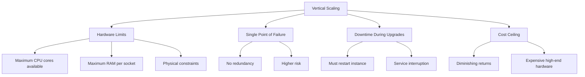
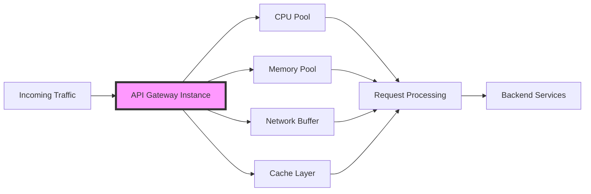
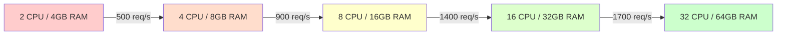
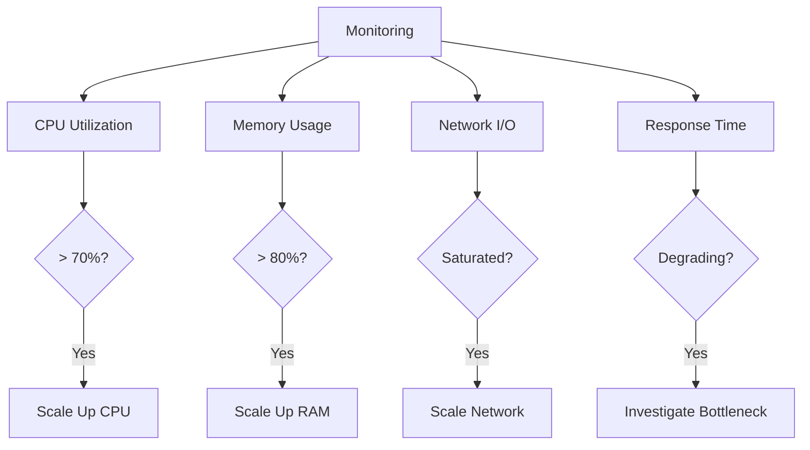
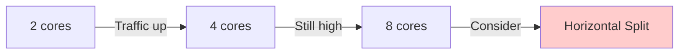
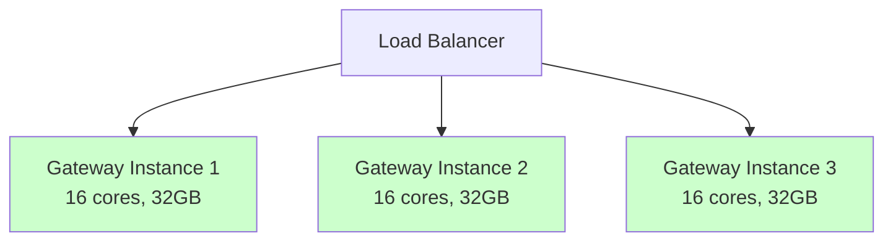

# Vertical Scaling for API Gateways

## Overview

Vertical scaling (scaling up) involves increasing the resources of a single server or instance to handle increased load. For API gateways, this means adding more CPU cores, RAM, faster storage, or network bandwidth to the existing gateway instance.

## Theory and Concepts

### What is Vertical Scaling?

Vertical scaling enhances the capacity of a single machine by:
- **Increasing CPU cores**: More processing power for concurrent request handling
- **Adding RAM**: Larger in-memory caches, more connection buffers
- **Upgrading network interfaces**: Higher throughput for request/response traffic
- **Faster storage**: Improved I/O for logging, temporary files, or persistent caching

Unlike horizontal scaling (see [scaling.md](./scaling.md)), vertical scaling doesn't distribute load across multiple instances but instead makes one instance more powerful.

### When to Use Vertical Scaling

Vertical scaling is appropriate when:
- **Starting small**: Initial traffic doesn't justify multiple instances
- **Stateful operations**: The gateway maintains session state or connections
- **Latency-critical**: Single instance avoids network hops between nodes
- **Simplicity required**: Easier deployment and management than distributed systems
- **Cost optimization**: Under certain loads, one powerful machine is cheaper than multiple smaller ones

### Limitations



## Vertical Scaling Strategy

### Resource Allocation Model



### Scaling Dimensions

1. **CPU Scaling**
   - More cores = more concurrent request handlers
   - Better for compute-intensive operations (routing logic, transformation)
   - Ideal for CPU-bound workloads

2. **Memory Scaling**
   - Larger caches reduce backend calls (see [caching.md](./caching.md))
   - More connection buffers for concurrent requests
   - Better for memory-bound operations

3. **Network Scaling**
   - Higher bandwidth handles more throughput
   - Lower latency with better network cards
   - Critical for high-traffic scenarios

## Performance Characteristics

### Throughput vs Resources



**Note**: Non-linear scaling due to:
- Context switching overhead
- Memory bus contention
- Lock contention in multi-threaded scenarios
- Amdahl's Law limitations

### Latency Improvements

Vertical scaling can reduce latency by:
- **Faster cache lookups**: More RAM for in-memory storage
- **Reduced queueing**: More CPU cores process requests faster
- **Better I/O performance**: SSDs and NVMe drives for logging

## Implementation Considerations

### Node.js Example Architecture

In Node.js (single-threaded), vertical scaling leverages cluster mode:

```javascript
// Conceptual pattern - not production code
const cluster = require('cluster');
const numCPUs = require('os').cpus().length;

if (cluster.isMaster) {
  // Fork workers equal to CPU cores
  for (let i = 0; i < numCPUs; i++) {
    cluster.fork();
  }
} else {
  // Each worker runs the API gateway
  startGateway();
}
```

**Theory**: Each CPU core runs a separate Node.js process, multiplying throughput proportionally to cores added.

### Memory Optimization

```javascript
// Conceptual cache sizing based on available RAM
const availableMemory = os.totalmem();
const cacheSize = Math.floor(availableMemory * 0.25); // 25% for cache

const cache = new LRUCache({
  max: cacheSize,
  ttl: 1000 * 60 * 5 // 5 minutes
});
```

**Theory**: Dynamically allocate cache based on system resources. More RAM = larger cache = better hit rates.

## Monitoring Vertical Scale

### Key Metrics

Track these metrics to determine when vertical scaling is needed:



See [monitoring.md](./monitoring.md) for detailed metrics collection strategies.

### Scaling Triggers

- **CPU > 70%**: Consider adding cores
- **Memory > 80%**: Increase RAM or optimize caching
- **Network saturation**: Upgrade network interface
- **P95 latency increase**: Check for resource exhaustion

## Cost-Benefit Analysis

### Vertical vs Horizontal Scaling

| Aspect | Vertical Scaling | Horizontal Scaling |
|--------|------------------|-------------------|
| **Complexity** | Low | High |
| **Max Capacity** | Hardware limited | Virtually unlimited |
| **Cost Efficiency** | Good at small-medium scale | Better at large scale |
| **Availability** | Single point of failure | Built-in redundancy |
| **State Management** | Simple | Complex (see [patterns.md](./patterns.md)) |

### When to Switch to Horizontal

Consider horizontal scaling when:
1. Reaching hardware limits (64+ cores, 512GB+ RAM)
2. Costs exceed distributed architecture
3. High availability is critical
4. Traffic is unpredictable and spiky

## Best Practices

### 1. Right-Sizing

Start with appropriate base resources:
```javascript
// Conceptual resource calculator
function calculateResources(expectedRPS, avgResponseTime) {
  const cpuCores = Math.ceil(expectedRPS * avgResponseTime / 1000);
  const memoryGB = Math.ceil(cpuCores * 2); // 2GB per core baseline
  
  return { cpuCores, memoryGB };
}
```

### 2. Progressive Scaling

Scale in increments:


### 3. Graceful Degradation

Implement circuit breakers and rate limiting (see [security.md](./security.md)) to protect the gateway when approaching resource limits.

### 4. Performance Testing

Before scaling, test to identify true bottlenecks:
- Load testing with realistic traffic patterns
- Profiling CPU and memory usage
- Network throughput testing

## Integration with Other Patterns

- **Caching**: More RAM enables larger caches ([caching.md](./caching.md))
- **Rate Limiting**: CPU resources affect rate limiting precision ([security.md](./security.md))
- **Routing**: More CPU allows complex routing logic ([routing.md](./routing.md))
- **Security**: TLS termination is CPU-intensive ([security.md](./security.md))

## Hybrid Approach

Most production systems use both vertical and horizontal scaling:



Each instance is vertically scaled for efficiency, while horizontal replication provides redundancy and handles total throughput.

## Summary

Vertical scaling is a straightforward approach to handle increased API gateway load by adding resources to existing instances. It's ideal for:
- Early-stage systems with predictable growth
- Latency-sensitive applications
- Scenarios where simplicity is valued

However, it has inherent limits. Plan to combine vertical scaling with horizontal scaling (see [scaling.md](./scaling.md)) as your system grows to achieve both performance and resilience.

## References

- [scaling.md](./scaling.md) - Comprehensive scaling strategies including horizontal
- [monitoring.md](./monitoring.md) - Metrics and observability
- [architecture.md](./architecture.md) - Overall system design
- [caching.md](./caching.md) - Cache strategies that benefit from vertical scaling
- [pros-cons.md](./pros-cons.md) - Trade-offs of different approaches