# Security Documentation

A comprehensive guide to security best practices, principles, and implementation strategies for modern system design.

## 📋 Table of Contents

- [Overview](#overview)
- [Documentation Structure](#documentation-structure)
- [Security Layers](#security-layers)
- [Quick Start Guide](#quick-start-guide)
- [Case Studies](#case-studies)
- [Contributing](#contributing)

## Overview

This repository contains detailed documentation covering all aspects of security in system design, from foundational concepts to advanced implementation strategies. Whether you're building a new system or hardening an existing one, these guides provide actionable insights and best practices.

## Documentation Structure

### Core Security Documents

1. **[Authentication](./authentication.md)** - Identity verification and user authentication mechanisms
   - Multi-factor authentication (MFA)
   - Single Sign-On (SSO)
   - OAuth 2.0 and OpenID Connect
   - Passwordless authentication
   - Session management

2. **[Authorization](./authorization.md)** - Access control and permission management
   - Role-Based Access Control (RBAC)
   - Attribute-Based Access Control (ABAC)
   - Policy-Based Access Control (PBAC)
   - Zero Trust architecture
   - Principle of least privilege

3. **[Encryption](./encryption.md)** - Data protection through cryptography
   - Symmetric vs asymmetric encryption
   - TLS/SSL implementation
   - Key management strategies
   - Data-at-rest encryption
   - Data-in-transit encryption

4. **[Data Security](./data_security.md)** - Protecting sensitive information
   - Data classification
   - Data masking and tokenization
   - Data loss prevention (DLP)
   - Backup and recovery strategies
   - Privacy considerations (GDPR, CCPA)

5. **[Network Security](./network_security.md)** - Securing communication channels
   - Firewalls and WAF
   - DDoS protection
   - VPN and secure tunneling
   - Network segmentation
   - Intrusion Detection/Prevention Systems (IDS/IPS)

6. **[Application Security](./application_security.md)** - Securing software applications
   - OWASP Top 10 vulnerabilities
   - Secure coding practices
   - Input validation and sanitization
   - API security
   - Container and microservices security

7. **[Monitoring & Auditing](./monitoring_auditing.md)** - Detection and compliance
   - Security Information and Event Management (SIEM)
   - Log management and analysis
   - Threat detection
   - Incident response
   - Audit trails and compliance reporting

8. **[Compliance](./compliance.md)** - Meeting regulatory requirements
   - GDPR, HIPAA, PCI-DSS, SOC 2
   - Compliance frameworks
   - Audit preparation
   - Documentation requirements
   - Regular assessments

9. **[Best Practices](./best_practises.md)** - Industry standards and recommendations
   - Security development lifecycle
   - DevSecOps integration
   - Vulnerability management
   - Security training and awareness
   - Incident response planning

## Security Layers

Understanding how different security components work together is crucial for building robust systems. Here's a visual representation:

## Quick Start Guide

### For New Systems

Follow this implementation sequence:

### Security Assessment Checklist

Use this flowchart to assess your current security posture:

### Security Architecture Overview

Here's how different security components interact in a typical system:

```mermaid
graph TB
    subgraph "External Layer"
        User[Users/Clients]
        Attacker[Potential Threats]
    end
    
    subgraph "Perimeter Security"
        FW[Firewall]
        WAF[Web Application Firewall]
        DDoS[DDoS Protection]
    end
    
    subgraph "Application Layer"
        LB[Load Balancer]
        API[API Gateway]
        App[Application Services]
    end
    
    subgraph "Identity & Access"
        AuthN[Authentication Service]
        AuthZ[Authorization Service]
        IAM[Identity Management]
    end
    
    subgraph "Data Layer"
        Cache[Encrypted Cache]
        DB[(Encrypted Database)]
        Storage[Encrypted Storage]
    end
    
    subgraph "Security Operations"
        SIEM[SIEM]
        IDS[IDS/IPS]
        Audit[Audit Logs]
    end
    
    User --> FW
    Attacker -.->|Blocked| FW
    FW --> WAF
    WAF --> DDoS
    DDoS --> LB
    LB --> API
    API --> AuthN
    AuthN --> AuthZ
    AuthZ --> App
    App --> Cache
    App --> DB
    App --> Storage
    
    FW -.-> IDS
    WAF -.-> IDS
    API -.-> SIEM
    AuthN -.-> SIEM
    AuthZ -.-> SIEM
    App -.-> SIEM
    DB -.-> Audit
    
    style User fill:#90EE90
    style Attacker fill:#FFB6C6
    style SIEM fill:#FFD700
    style DB fill:#87CEEB
```

## Case Studies

The `case-studies/` directory contains real-world examples and implementation scenarios:

- **E-commerce Platform Security** - Complete security implementation for online retail
- **Healthcare System Compliance** - HIPAA-compliant architecture design
- **Financial Services** - PCI-DSS and regulatory compliance
- **SaaS Multi-tenancy** - Secure multi-tenant architecture
- **API Security** - RESTful and GraphQL API protection strategies

## Security Priorities by Industry

## Getting Started

### For Developers
1. Start with [Best Practices](./best_practises.md) for an overview
2. Review [Application Security](./application_security.md) for coding guidelines
3. Implement [Authentication](./authentication.md) and [Authorization](./authorization.md)
4. Set up [Monitoring & Auditing](./monitoring_auditing.md)

### For Security Engineers
1. Begin with [Network Security](./network_security.md) and [Encryption](./encryption.md)
2. Design access controls using [Authorization](./authorization.md)
3. Implement [Data Security](./data_security.md) measures
4. Establish [Monitoring & Auditing](./monitoring_auditing.md) processes

### For Compliance Officers
1. Review [Compliance](./compliance.md) requirements for your industry
2. Ensure [Data Security](./data_security.md) meets regulatory standards
3. Verify [Monitoring & Auditing](./monitoring_auditing.md) capabilities
4. Document processes per [Best Practices](./best_practises.md)

## Contributing

We welcome contributions to improve this documentation:

1. Fork the repository
2. Create a feature branch
3. Make your changes
4. Submit a pull request with detailed description

Please ensure all contributions align with industry standards and include relevant examples.

## Additional Resources

- **OWASP**: https://owasp.org/
- **NIST Cybersecurity Framework**: https://www.nist.gov/cyberframework
- **CIS Controls**: https://www.cisecurity.org/controls
- **SANS Security Resources**: https://www.sans.org/security-resources

---

**Last Updated**: October 2025

**Maintained by**: Security Team

**License**: MIT (or specify your license)