# Application Security

## Table of Contents
1. [Overview](#overview)
2. [Application Security Fundamentals](#application-security-fundamentals)
3. [OWASP Top 10 Vulnerabilities](#owasp-top-10-vulnerabilities)
4. [Secure Development Lifecycle (SDLC)](#secure-development-lifecycle-sdlc)
5. [Input Validation and Sanitization](#input-validation-and-sanitization)
6. [Authentication Implementation](#authentication-implementation)
7. [Session Management](#session-management)
8. [API Security](#api-security)
9. [Data Protection in Applications](#data-protection-in-applications)
10. [Secure Coding Practices](#secure-coding-practices)
11. [Application Security Testing](#application-security-testing)
12. [Web Application Firewalls (WAF)](#web-application-firewalls-waf)
13. [Container and Microservices Security](#container-and-microservices-security)
14. [Mobile Application Security](#mobile-application-security)
15. [Related Security Domains](#related-security-domains)

## Overview

Application security encompasses the practices, tools, and processes used to protect software applications from threats throughout their entire lifecycle—from design and development to deployment and maintenance. As applications become the primary interface for business operations and customer interactions, securing them is critical to organizational success.

### Why Application Security Matters

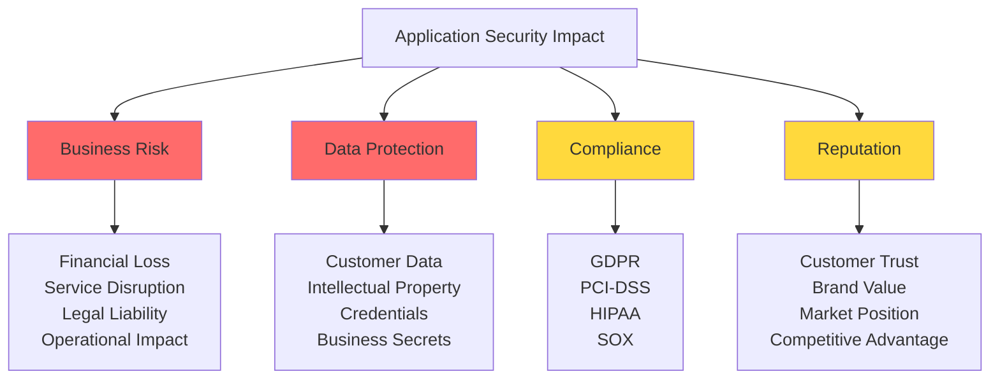

### Security by Design Principles

| Principle | Description | Implementation |
|-----------|-------------|----------------|
| **Defense in Depth** | Multiple layers of security controls | Validation + WAF + Authentication + Authorization |
| **Least Privilege** | Minimum necessary permissions | Role-based access, limited API scopes |
| **Fail Securely** | Secure defaults and error handling | Deny by default, safe error messages |
| **Complete Mediation** | Check every access | Validate all requests, no client-side security |
| **Open Design** | Security through implementation, not obscurity | Use proven algorithms, peer review |
| **Separation of Privileges** | Divide authority | Multi-approval workflows, segregated duties |
| **Psychological Acceptability** | Usable security | Balance security with user experience |

## Application Security Fundamentals

### Application Security Architecture

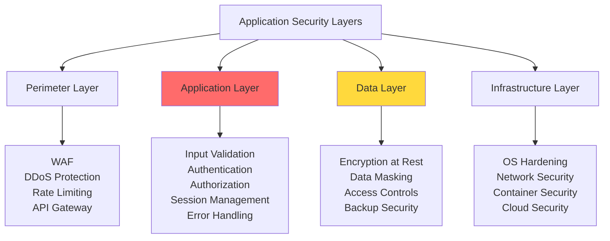

### CIA Triad in Applications

**Confidentiality**
- Encrypt sensitive data (see [encryption.md](encryption.md))
- Implement access controls (see [authorization.md](authorization.md))
- Secure communication channels
- Proper session management

**Integrity**
- Input validation and sanitization
- Digital signatures for critical data
- Audit logging of changes
- Database constraints and transactions

**Availability**
- Rate limiting and throttling
- DDoS protection
- Load balancing and redundancy
- Graceful degradation

## OWASP Top 10 Vulnerabilities

### Current OWASP Top 10 (2021)

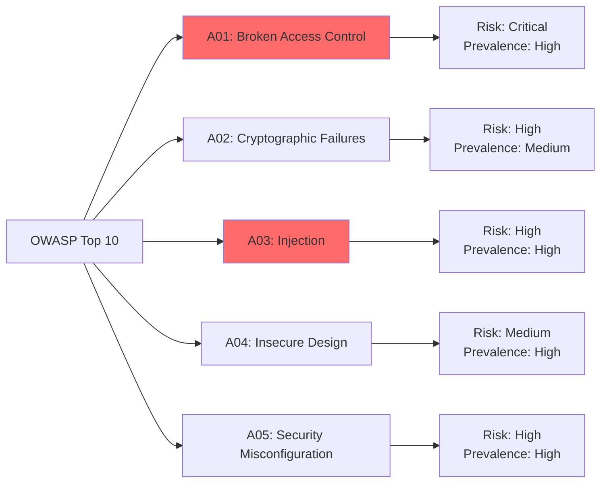

### A01: Broken Access Control

**Vulnerability Description**
Occurs when users can act outside their intended permissions, accessing unauthorized functionality or data.

**Common Scenarios**
- Insecure Direct Object References (IDOR)
- Missing function-level access control
- API access control bypass
- Elevation of privilege attacks

**Example Vulnerability**
```javascript
// VULNERABLE: No authorization check
app.get('/api/user/:id/profile', (req, res) => {
  const userId = req.params.id;
  const profile = db.getUserProfile(userId);
  res.json(profile); // Any user can access any profile!
});

// SECURE: Proper authorization
app.get('/api/user/:id/profile', authenticateUser, (req, res) => {
  const userId = req.params.id;
  const currentUser = req.user.id;
  
  // Check authorization
  if (userId !== currentUser && !req.user.isAdmin) {
    return res.status(403).json({ error: 'Access denied' });
  }
  
  const profile = db.getUserProfile(userId);
  res.json(profile);
});
```

**Prevention Strategies**
- Implement proper [authorization.md](authorization.md) checks on all resources
- Deny by default, explicitly allow
- Use framework security controls
- Disable directory listing
- Log access control failures

### A02: Cryptographic Failures

**Vulnerability Description**
Failure to properly protect sensitive data through encryption or cryptographic means.

**Common Issues**
- Transmitting data in clear text (HTTP instead of HTTPS)
- Weak cryptographic algorithms (MD5, SHA1)
- Improper key management
- Missing encryption at rest

**Prevention**
```javascript
// Key management considerations
const secureConfig = {
  encryption: {
    algorithm: 'aes-256-gcm', // Strong algorithm
    keyRotation: true,
    keyRotationPeriod: 90, // days
    keyStorage: 'KMS' // Use Key Management Service
  },
  
  transit: {
    protocol: 'TLS 1.3',
    minimumVersion: '1.2',
    cipherSuites: ['TLS_AES_256_GCM_SHA384']
  }
};
```

See [encryption.md](encryption.md) for detailed cryptographic implementation and [data_security.md](data_security.md) for data protection strategies.

### A03: Injection

**Vulnerability Description**
Untrusted data sent to an interpreter as part of a command or query, leading to unintended execution.

**Types of Injection**

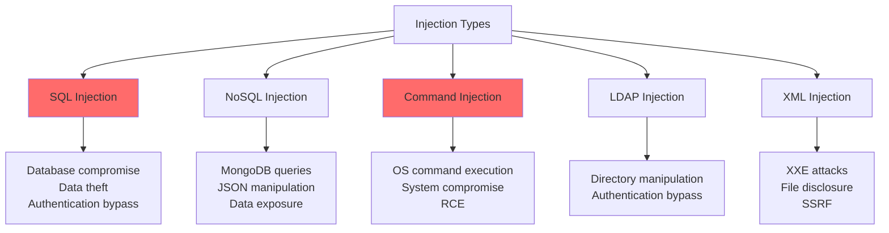

**SQL Injection Prevention**
```javascript
// VULNERABLE: String concatenation
function getUserBad(username) {
  const query = `SELECT * FROM users WHERE username = '${username}'`;
  return db.query(query);
  // Attack: username = "admin' OR '1'='1"
}

// SECURE: Parameterized queries
function getUserSecure(username) {
  const query = 'SELECT * FROM users WHERE username = ?';
  return db.query(query, [username]);
}

// SECURE: ORM usage
function getUserORM(username) {
  return User.findOne({ where: { username } });
}
```

**Command Injection Prevention**
```javascript
// VULNERABLE: Direct command execution
const exec = require('child_process').exec;
function pingHost(host) {
  exec(`ping -c 4 ${host}`, (error, stdout) => {
    console.log(stdout);
  });
  // Attack: host = "example.com; rm -rf /"
}

// SECURE: Input validation and safe APIs
function pingHostSecure(host) {
  // Validate input
  if (!/^[a-z0-9.-]+$/i.test(host)) {
    throw new Error('Invalid hostname');
  }
  
  // Use safe API with array arguments
  const spawn = require('child_process').spawn;
  const ping = spawn('ping', ['-c', '4', host]);
}
```

### A04: Insecure Design

**Vulnerability Description**
Missing or ineffective security controls in the design phase, resulting in architectural flaws.

**Design Principles**

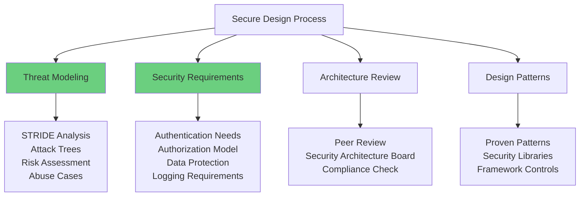

**Threat Modeling Example**
```javascript
// Design decision documentation
const designConsiderations = {
  threat: 'Account Takeover',
  
  controls: {
    preventive: [
      'Strong password policy',
      'MFA required for sensitive operations',
      'Account lockout after failed attempts'
    ],
    
    detective: [
      'Login anomaly detection',
      'Impossible travel detection',
      'Session monitoring'
    ],
    
    responsive: [
      'Automatic session termination',
      'User notification',
      'Forced password reset'
    ]
  }
};
```

### A05: Security Misconfiguration

**Vulnerability Description**
Insecure default configurations, incomplete setups, misconfigured HTTP headers, verbose error messages.

**Common Misconfigurations**
- Default credentials unchanged
- Unnecessary features enabled
- Directory listing enabled
- Detailed error messages in production
- Missing security headers

**Secure Configuration Example**
```javascript
// Express.js security headers
const helmet = require('helmet');

app.use(helmet({
  contentSecurityPolicy: {
    directives: {
      defaultSrc: ["'self'"],
      styleSrc: ["'self'", "'unsafe-inline'"],
      scriptSrc: ["'self'"],
      imgSrc: ["'self'", "data:", "https:"]
    }
  },
  hsts: {
    maxAge: 31536000,
    includeSubDomains: true,
    preload: true
  },
  noSniff: true,
  referrerPolicy: { policy: 'same-origin' },
  xssFilter: true
}));

// Remove identifying headers
app.disable('x-powered-by');
```

### Remaining OWASP Top 10

**A06: Vulnerable and Outdated Components**
- Using libraries with known vulnerabilities
- Not patching OS, frameworks, dependencies
- **Prevention**: Dependency scanning, regular updates, software composition analysis

**A07: Identification and Authentication Failures**
- Weak credential management
- Session fixation
- Missing MFA
- **Prevention**: See [authentication.md](authentication.md)

**A08: Software and Data Integrity Failures**
- Unsigned updates
- Insecure CI/CD pipelines
- Insecure deserialization
- **Prevention**: Code signing, pipeline security, safe deserialization

**A09: Security Logging and Monitoring Failures**
- Missing audit logs
- Inadequate monitoring
- No incident response
- **Prevention**: See [monitoring_auditing.md](monitoring_auditing.md)

**A10: Server-Side Request Forgery (SSRF)**
- Application fetching remote resources without validation
- **Prevention**: Input validation, allowlist URLs, network segmentation

## Secure Development Lifecycle (SDLC)

### Security in the SDLC

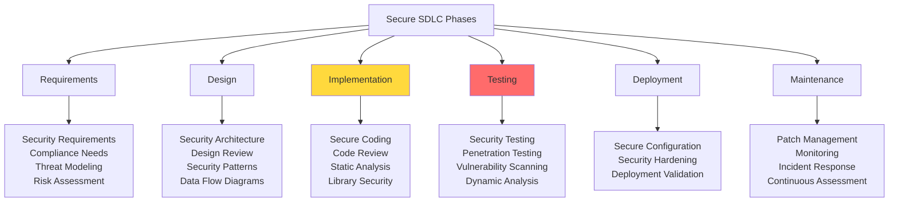

### DevSecOps Integration

**Shift-Left Security**
- Security earlier in development cycle
- Developer security training
- Security champions program
- Automated security testing in CI/CD

**Security Automation in Pipeline**
```javascript
// Example CI/CD security gates
const securityPipeline = {
  preCommit: [
    'Secret scanning',
    'Code linting with security rules'
  ],
  
  build: [
    'SAST (Static Application Security Testing)',
    'Dependency vulnerability scanning',
    'License compliance check'
  ],
  
  test: [
    'DAST (Dynamic Application Security Testing)',
    'API security testing',
    'Container image scanning'
  ],
  
  deploy: [
    'Security configuration validation',
    'Penetration testing (staging)',
    'Compliance verification'
  ],
  
  production: [
    'Runtime application protection',
    'Security monitoring',
    'Threat detection'
  ]
};
```

## Input Validation and Sanitization

### Validation Strategy

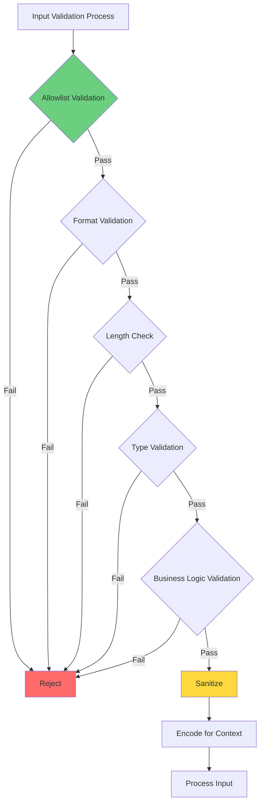

### Input Validation Patterns

**Server-Side Validation (Essential)**
```javascript
const validator = require('validator');

function validateUserInput(data) {
  const errors = [];
  
  // Email validation
  if (!validator.isEmail(data.email)) {
    errors.push('Invalid email format');
  }
  
  // Password strength
  if (!validator.isStrongPassword(data.password, {
    minLength: 12,
    minLowercase: 1,
    minUppercase: 1,
    minNumbers: 1,
    minSymbols: 1
  })) {
    errors.push('Password does not meet strength requirements');
  }
  
  // Username allowlist
  if (!/^[a-zA-Z0-9_-]{3,20}$/.test(data.username)) {
    errors.push('Invalid username format');
  }
  
  // Phone number
  if (!validator.isMobilePhone(data.phone, 'any', { strictMode: true })) {
    errors.push('Invalid phone number');
  }
  
  return errors.length === 0 ? null : errors;
}
```

**Context-Specific Encoding**
```javascript
// HTML context
function escapeHtml(unsafe) {
  return unsafe
    .replace(/&/g, "&amp;")
    .replace(/</g, "&lt;")
    .replace(/>/g, "&gt;")
    .replace(/"/g, "&quot;")
    .replace(/'/g, "&#039;");
}

// JavaScript context
function escapeJs(unsafe) {
  return unsafe
    .replace(/\\/g, '\\\\')
    .replace(/'/g, "\\'")
    .replace(/"/g, '\\"')
    .replace(/\n/g, '\\n')
    .replace(/\r/g, '\\r');
}

// URL context
function escapeUrl(unsafe) {
  return encodeURIComponent(unsafe);
}

// SQL context - use parameterized queries instead
```

### File Upload Security

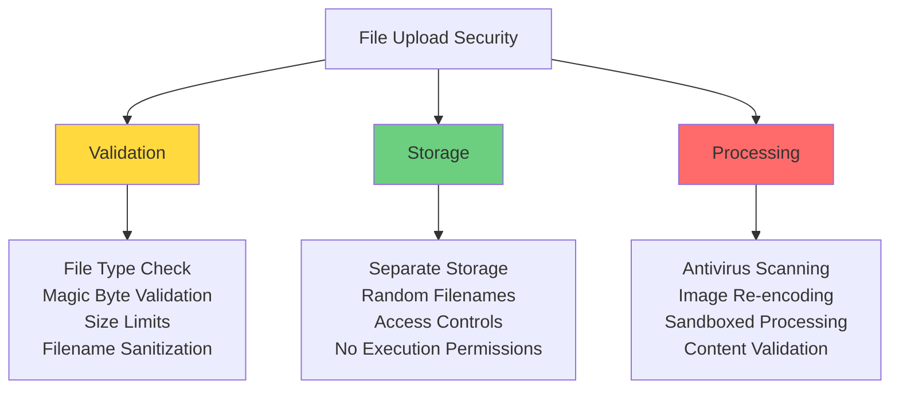

**Secure File Upload Implementation**
```javascript
const multer = require('multer');
const path = require('path');
const crypto = require('crypto');

const upload = multer({
  storage: multer.diskStorage({
    destination: (req, file, cb) => {
      // Store outside web root
      cb(null, '/secure/uploads/');
    },
    filename: (req, file, cb) => {
      // Generate random filename
      const randomName = crypto.randomBytes(16).toString('hex');
      cb(null, randomName + path.extname(file.originalname));
    }
  }),
  
  fileFilter: (req, file, cb) => {
    // Allowlist file types
    const allowedTypes = ['image/jpeg', 'image/png', 'application/pdf'];
    
    if (allowedTypes.includes(file.mimetype)) {
      cb(null, true);
    } else {
      cb(new Error('Invalid file type'));
    }
  },
  
  limits: {
    fileSize: 5 * 1024 * 1024, // 5MB limit
    files: 1
  }
});
```

## Authentication Implementation

### Authentication Patterns

For detailed authentication mechanisms, see [authentication.md](authentication.md). Here we focus on implementation security.

**Password Security**
```javascript
const bcrypt = require('bcrypt');

// Password hashing
async function hashPassword(password) {
  const saltRounds = 12; // Cost factor
  return await bcrypt.hash(password, saltRounds);
}

// Password verification
async function verifyPassword(password, hash) {
  return await bcrypt.compare(password, hash);
}

// Password policy enforcement
function validatePasswordPolicy(password) {
  const requirements = {
    minLength: 12,
    requireUppercase: /[A-Z]/,
    requireLowercase: /[a-z]/,
    requireNumber: /[0-9]/,
    requireSpecial: /[!@#$%^&*(),.?":{}|<>]/,
    noCommonPasswords: true
  };
  
  // Check against policy
  if (password.length < requirements.minLength) {
    return { valid: false, error: 'Password too short' };
  }
  
  // Additional checks...
  return { valid: true };
}
```

### Multi-Factor Authentication

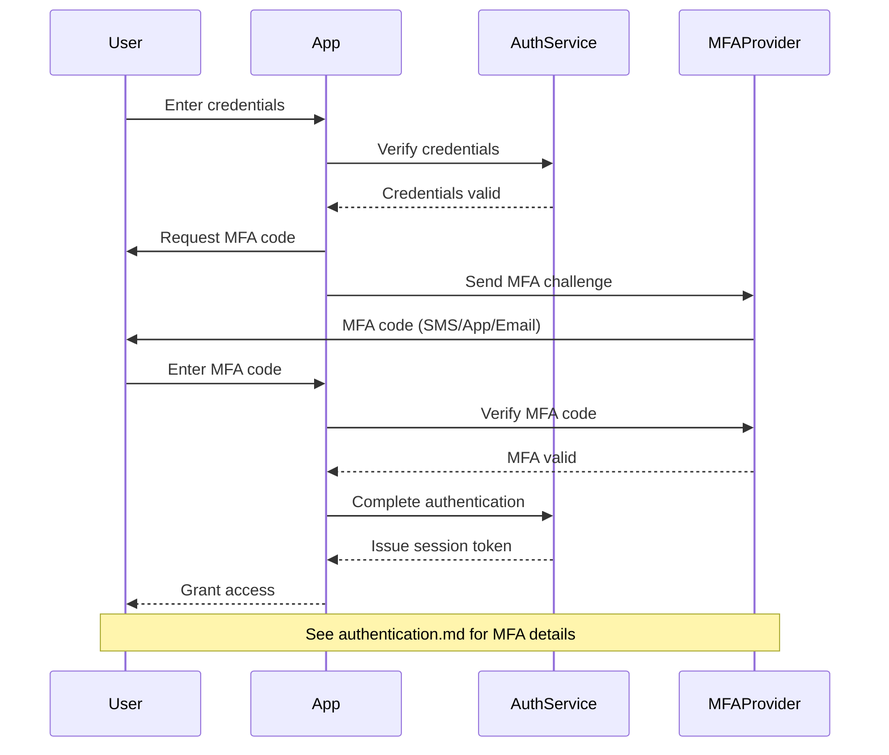

## Session Management

### Secure Session Implementation

```mermaid
graph TB
    A[Session Security] --> B[Session Creation]
    A --> C[Session Storage]
    A --> D[Session Validation]
    A --> E[Session Termination]
    
    B --> B1[Random Session ID<br/>Cryptographically Secure<br/>Sufficient Length<br/>No Predictable Patterns]
    
    C --> C1[Server-Side Storage<br/>Encrypted Storage<br/>Secure Transmission<br/>HttpOnly & Secure Flags]
    
    D --> D1[Validate Every Request<br/>Check Expiration<br/>IP Binding (Optional)<br/>Activity Timeout]
    
    E --> E1[Explicit Logout<br/>Timeout-Based<br/>Token Revocation<br/>Session Cleanup]
    
    style B fill:#6bcf7f
    style C fill:#ffd93d
    style D fill:#ff6b6b
```

**Session Configuration**
```javascript
const session = require('express-session');
const RedisStore = require('connect-redis')(session);

app.use(session({
  store: new RedisStore({ client: redisClient }),
  secret: process.env.SESSION_SECRET,
  name: 'sessionId', // Don't use default 'connect.sid'
  
  cookie: {
    secure: true, // HTTPS only
    httpOnly: true, // No JavaScript access
    maxAge: 15 * 60 * 1000, // 15 minutes
    sameSite: 'strict', // CSRF protection
    domain: '.example.com'
  },
  
  resave: false,
  saveUninitialized: false,
  rolling: true // Reset expiration on activity
}));

// Session validation middleware
function validateSession(req, res, next) {
  if (!req.session || !req.session.userId) {
    return res.status(401).json({ error: 'Unauthorized' });
  }
  
  // Check session age
  const sessionAge = Date.now() - req.session.createdAt;
  const maxAge = 24 * 60 * 60 * 1000; // 24 hours absolute timeout
  
  if (sessionAge > maxAge) {
    req.session.destroy();
    return res.status(401).json({ error: 'Session expired' });
  }
  
  next();
}
```

### JWT Security

```javascript
const jwt = require('jsonwebtoken');

// Token generation
function generateToken(user) {
  const payload = {
    sub: user.id,
    email: user.email,
    role: user.role,
    iat: Math.floor(Date.now() / 1000)
  };
  
  return jwt.sign(payload, process.env.JWT_SECRET, {
    expiresIn: '15m',
    issuer: 'app.example.com',
    audience: 'api.example.com',
    algorithm: 'HS256'
  });
}

// Token validation
function verifyToken(token) {
  try {
    return jwt.verify(token, process.env.JWT_SECRET, {
      issuer: 'app.example.com',
      audience: 'api.example.com',
      algorithms: ['HS256']
    });
  } catch (error) {
    throw new Error('Invalid token');
  }
}

// Refresh token pattern
function generateRefreshToken(user) {
  return jwt.sign(
    { sub: user.id, type: 'refresh' },
    process.env.REFRESH_TOKEN_SECRET,
    { expiresIn: '7d' }
  );
}
```

## API Security

### API Security Architecture

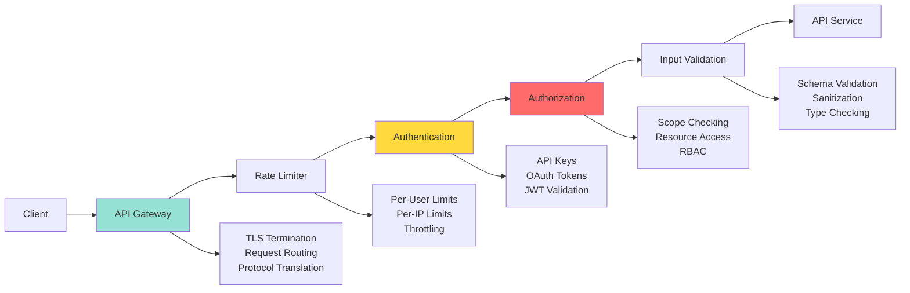

### REST API Security Best Practices

**Authentication and Authorization**
```javascript
// API key middleware
function apiKeyAuth(req, res, next) {
  const apiKey = req.header('X-API-Key');
  
  if (!apiKey) {
    return res.status(401).json({ error: 'API key required' });
  }
  
  const validKey = validateApiKey(apiKey);
  if (!validKey) {
    return res.status(403).json({ error: 'Invalid API key' });
  }
  
  req.apiKey = validKey;
  next();
}

// OAuth 2.0 middleware
function oauthAuth(req, res, next) {
  const token = req.header('Authorization')?.replace('Bearer ', '');
  
  if (!token) {
    return res.status(401).json({ error: 'Token required' });
  }
  
  // Validate token and scopes
  const decoded = verifyOAuthToken(token);
  if (!decoded) {
    return res.status(403).json({ error: 'Invalid token' });
  }
  
  req.user = decoded;
  next();
}
```

See [authorization.md](authorization.md) for detailed API authorization patterns.

**Rate Limiting**
```javascript
const rateLimit = require('express-rate-limit');

// Global rate limit
const globalLimiter = rateLimit({
  windowMs: 15 * 60 * 1000, // 15 minutes
  max: 100, // Limit each IP to 100 requests per windowMs
  message: 'Too many requests, please try again later',
  standardHeaders: true,
  legacyHeaders: false
});

// Strict rate limit for sensitive endpoints
const authLimiter = rateLimit({
  windowMs: 15 * 60 * 1000,
  max: 5, // 5 attempts per 15 minutes
  skipSuccessfulRequests: true
});

app.use('/api/', globalLimiter);
app.use('/api/auth/login', authLimiter);
```

### GraphQL Security

**Query Depth and Complexity Limiting**
```javascript
const depthLimit = require('graphql-depth-limit');
const { createComplexityLimitRule } = require('graphql-validation-complexity');

const apolloServer = new ApolloServer({
  schema,
  validationRules: [
    depthLimit(10), // Maximum query depth
    createComplexityLimitRule(1000) // Maximum complexity score
  ],
  
  context: ({ req }) => {
    // Authentication
    const token = req.headers.authorization;
    const user = verifyToken(token);
    return { user };
  }
});
```

**Query Cost Analysis**
```javascript
// Assign costs to expensive fields
const typeDefs = `
  type Query {
    users: [User!]! @cost(complexity: 10)
    user(id: ID!): User @cost(complexity: 1)
  }
  
  type User {
    posts: [Post!]! @cost(complexity: 5, multipliers: ["first"])
  }
`;
```

## Data Protection in Applications

### Sensitive Data Handling

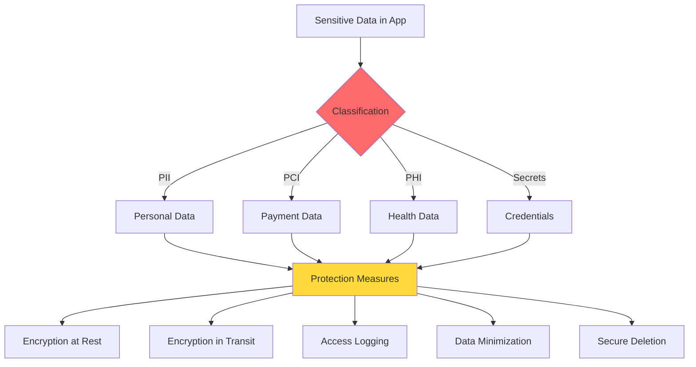

See [data_security.md](data_security.md) for comprehensive data protection strategies.

**Secrets Management**
```javascript
// NEVER hardcode secrets
// BAD
const dbPassword = 'mypassword123';

// GOOD - Environment variables
const dbPassword = process.env.DB_PASSWORD;

// BETTER - Secret management service
const AWS = require('aws-sdk');
const secretsManager = new AWS.SecretsManager();

async function getSecret(secretName) {
  const data = await secretsManager.getSecretValue({
    SecretId: secretName
  }).promise();
  
  return JSON.parse(data.SecretString);
}
```

**Data Masking in Logs**
```javascript
function maskSensitiveData(data) {
  const sensitiveFields = ['password', 'ssn', 'creditCard', 'apiKey'];
  
  const masked = { ...data };
  for (const field of sensitiveFields) {
    if (masked[field]) {
      masked[field] = '***REDACTED***';
    }
  }
  
  // Mask email
  if (masked.email) {
    masked.email = masked.email.replace(/(.{2})(.*)(@.*)/, '$1***$3');
  }
  
  return masked;
}

// Logging with masking
function secureLog(level, message, data) {
  const maskedData = maskSensitiveData(data);
  logger[level](message, maskedData);
}
```

## Secure Coding Practices

### Code Security Principles

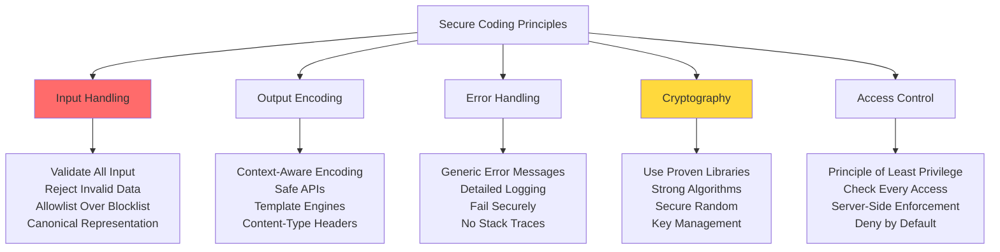

### Common Security Anti-Patterns

**1. Client-Side Security**
```javascript
// ANTI-PATTERN: Client-side validation only
function validateOnClient(userData) {
  if (userData.role === 'admin') {
    // Client can modify this!
    return true;
  }
  return false;
}

// CORRECT: Server-side validation
function validateOnServer(req, res) {
  const user = getUserFromDatabase(req.user.id);
  if (user.role !== 'admin') {
    return res.status(403).json({ error: 'Forbidden' });
  }
  // Process request
}
```

**2. Mass Assignment Vulnerability**
```javascript
// ANTI-PATTERN: Accepting all user input
app.post('/api/users/:id', (req, res) => {
  User.update(req.params.id, req.body);
  // User can set isAdmin: true in request!
});

// CORRECT: Explicitly allow fields
app.post('/api/users/:id', (req, res) => {
  const allowedFields = ['name', 'email', 'phone'];
  const updates = {};
  
  for (const field of allowedFields) {
    if (req.body[field]) {
      updates[field] = req.body[field];
    }
  }
  
  User.update(req.params.id, updates);
});
```

**3. Race Conditions**
```javascript
// ANTI-PATTERN: Check-then-use
async function transferMoney(from, to, amount) {
  const balance = await getBalance(from);
  if (balance >= amount) {
    // Race condition here!
    await deduct(from, amount);
    await add(to, amount);
  }
}

// CORRECT: Atomic operations
async function transferMoneySecure(from, to, amount) {
  await db.transaction(async (trx) => {
    const result = await trx('accounts')
      .where('id', from)
      .where('balance', '>=', amount)
      .decrement('balance', amount);
    
    if (result === 0) {
      throw new Error('Insufficient funds');
    }
    
    await trx('accounts')
      .where('id', to)
      .increment('balance', amount);
  });
}
```

### Error Handling and Logging

**Secure Error Handling**
```javascript
// Error handler middleware
app.use((err, req, res, next) => {
  // Log detailed error internally
  logger.error('Application error', {
    error: err.message,
    stack: err.stack,
    url: req.url,
    method: req.method,
    user: req.user?.id,
    timestamp: new Date().toISOString()
  });
  
  // Send generic error to client
  const statusCode = err.statusCode || 500;
  
  if (process.env.NODE_ENV === 'production') {
    res.status(statusCode).json({
      error: 'An error occurred',
      requestId: req.id // For support reference
    });
  } else {
    // Development: more details
    res.status(statusCode).json({
      error: err.message,
      requestId: req.id
    });
  }
});
```

See [monitoring_auditing.md](monitoring_auditing.md) for comprehensive logging strategies.

### Dependency Management

**Security in Dependencies**
```javascript
// package.json security practices
{
  "scripts": {
    "audit": "npm audit",
    "audit-fix": "npm audit fix",
    "check-updates": "ncu",
    "preinstall": "npx npm-force-resolutions"
  },
  
  "resolutions": {
    "vulnerable-package": "^2.0.0"
  },
  
  // Lock file integrity
  "packageManager": "npm@8.0.0"
}
```

**Automated Dependency Scanning**
- npm audit / yarn audit
- Snyk, Dependabot, WhiteSource
- Regular dependency updates
- Pin production dependencies
- Review transitive dependencies

## Application Security Testing

### Testing Pyramid for Security

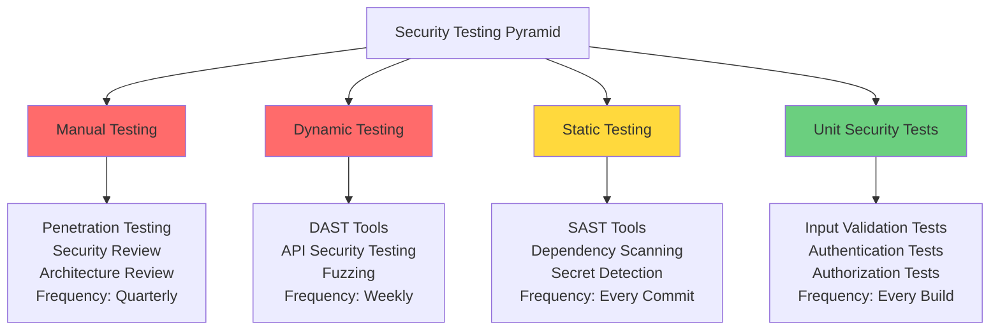

### Static Application Security Testing (SAST)

**SAST Tools and Usage**
- **SonarQube**: Code quality and security
- **Checkmarx**: Enterprise SAST
- **Semgrep**: Fast pattern-based scanning
- **ESLint Security Plugins**: JavaScript security rules

**Example Security Test**
```javascript
// Security unit test example
describe('Authentication Security', () => {
  test('should reject weak passwords', () => {
    const weakPasswords = ['password', '12345678', 'qwerty'];
    
    weakPasswords.forEach(password => {
      expect(() => {
        validatePassword(password);
      }).toThrow('Password does not meet requirements');
    });
  });
  
  test('should hash passwords with bcrypt', async () => {
    const password = 'SecureP@ssw0rd!';
    const hash = await hashPassword(password);
    
    expect(hash).not.toBe(password);
    expect(hash).toMatch(/^\$2[aby]\$/); // bcrypt format
    expect(await verifyPassword(password, hash)).toBe(true);
  });
  
  test('should prevent timing attacks', async () => {
    const validUser = 'validuser';
    const invalidUser = 'invaliduser';
    
    const start1 = Date.now();
    await login(validUser, 'wrongpassword');
    const time1 = Date.now() - start1;
    
    const start2 = Date.now();
    await login(invalidUser, 'wrongpassword');
    const time2 = Date.now() - start2;
    
    // Times should be similar (within 50ms)
    expect(Math.abs(time1 - time2)).toBeLessThan(50);
  });
});
```

### Dynamic Application Security Testing (DAST)

**DAST Tools**
- **OWASP ZAP**: Free, automated scanner
- **Burp Suite**: Professional testing platform
- **Acunetix**: Web vulnerability scanner
- **Netsparker**: Automated DAST

**DAST in CI/CD**
```javascript
// Example ZAP automation script
const zapClient = require('zaproxy');

async function runSecurityScan(targetUrl) {
  const zap = new zapClient({
    apiKey: process.env.ZAP_API_KEY,
    proxy: 'http://localhost:8080'
  });
  
  // Spider the application
  await zap.spider.scan(targetUrl);
  await zap.spider.waitForComplete();
  
  // Active scan for vulnerabilities
  await zap.ascan.scan(targetUrl);
  await zap.ascan.waitForComplete();
  
  // Get results
  const alerts = await zap.core.alerts(targetUrl);
  
  // Fail build if high-risk vulnerabilities found
  const highRisk = alerts.filter(a => a.risk === 'High');
  if (highRisk.length > 0) {
    throw new Error(`Found ${highRisk.length} high-risk vulnerabilities`);
  }
  
  return alerts;
}
```

### Penetration Testing

**Penetration Testing Scope**

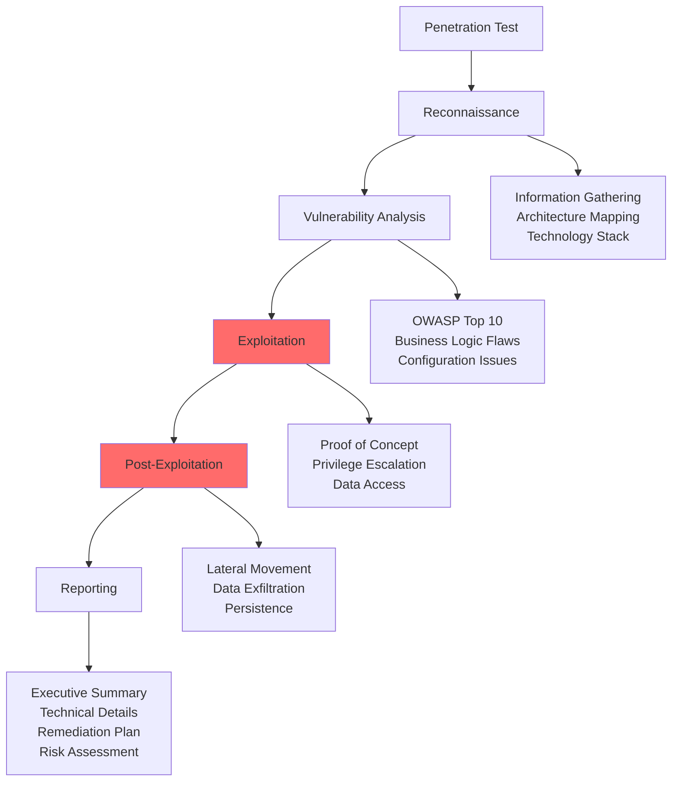

**Testing Checklist**
- [ ] Authentication bypass attempts
- [ ] Authorization testing (IDOR, privilege escalation)
- [ ] Input validation (injection attacks)
- [ ] Session management security
- [ ] Business logic vulnerabilities
- [ ] API security testing
- [ ] File upload vulnerabilities
- [ ] CSRF protection validation
- [ ] XSS testing (reflected, stored, DOM-based)
- [ ] Security headers verification

## Web Application Firewalls (WAF)

### WAF Architecture and Function

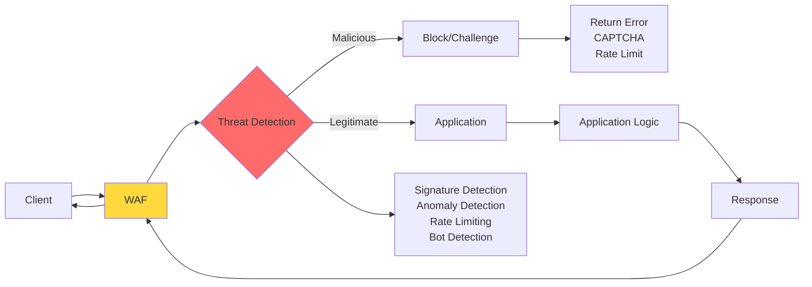

### WAF Rule Types

**1. Signature-Based Rules**
```javascript
// Conceptual WAF rule
const wafRules = {
  sqlInjection: {
    pattern: /(union.*select|drop.*table|';--)/i,
    action: 'block',
    severity: 'high'
  },
  
  xss: {
    pattern: /(<script|javascript:|onerror=)/i,
    action: 'block',
    severity: 'high'
  },
  
  pathTraversal: {
    pattern: /\.\.(\/|\\)/,
    action: 'block',
    severity: 'medium'
  }
};
```

**2. Rate Limiting**
- Per-IP request limits
- Per-endpoint limits
- API-specific rate limits
- Adaptive rate limiting based on behavior

**3. Bot Detection**
- Challenge-response (CAPTCHA)
- Browser fingerprinting
- Behavioral analysis
- Known bot signatures

### WAF Deployment Models

| Model | Description | Pros | Cons |
|-------|-------------|------|------|
| **Cloud WAF** | SaaS solution (Cloudflare, AWS WAF) | Easy setup, DDoS protection | Less customization |
| **Reverse Proxy** | On-premise or VM-based | Full control, customization | Management overhead |
| **Embedded** | Library in application | Low latency, context-aware | Development effort |

### WAF Best Practices

- Start in detection mode, tune rules before enforcement
- Custom rules for business logic protection
- Regular rule updates for new threats
- Monitor false positives and tune accordingly
- Combine with other security layers
- Log all blocked requests for analysis

## Container and Microservices Security

### Container Security Model

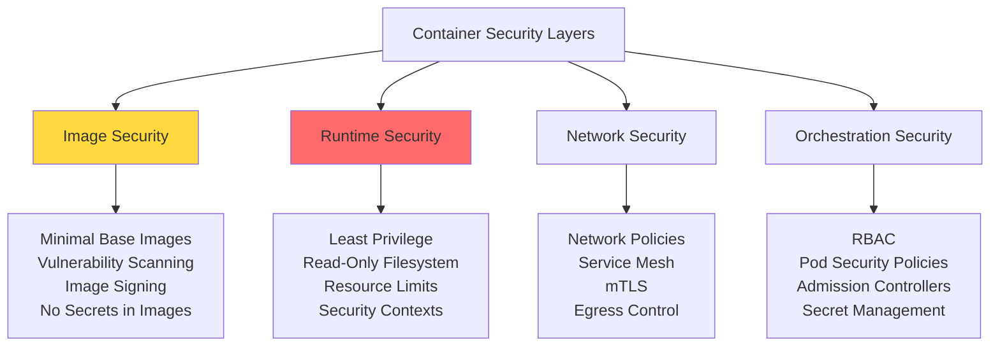

### Docker Security Best Practices

**Dockerfile Security**
```dockerfile
# Use minimal base image
FROM node:18-alpine

# Run as non-root user
RUN addgroup -g 1001 -S nodejs
RUN adduser -S nodejs -u 1001

# Set working directory
WORKDIR /app

# Copy only necessary files
COPY --chown=nodejs:nodejs package*.json ./
RUN npm ci --only=production

COPY --chown=nodejs:nodejs . .

# Drop privileges
USER nodejs

# Use specific ports
EXPOSE 3000

# Health check
HEALTHCHECK --interval=30s --timeout=3s \
  CMD node healthcheck.js || exit 1

# Run application
CMD ["node", "server.js"]
```

**Runtime Security**
```javascript
// Docker run with security options
const dockerSecurityOpts = {
  user: '1001:1001',
  readOnly: true,
  noNewPrivileges: true,
  capDrop: ['ALL'],
  capAdd: ['NET_BIND_SERVICE'], // Only if needed
  securityOpt: ['no-new-privileges:true'],
  
  resources: {
    cpus: '0.5',
    memory: '512m'
  },
  
  network: 'app-network', // Isolated network
  
  tmpfs: {
    '/tmp': 'rw,noexec,nosuid,size=100m'
  }
};
```

### Microservices Security Patterns

**Service-to-Service Authentication**

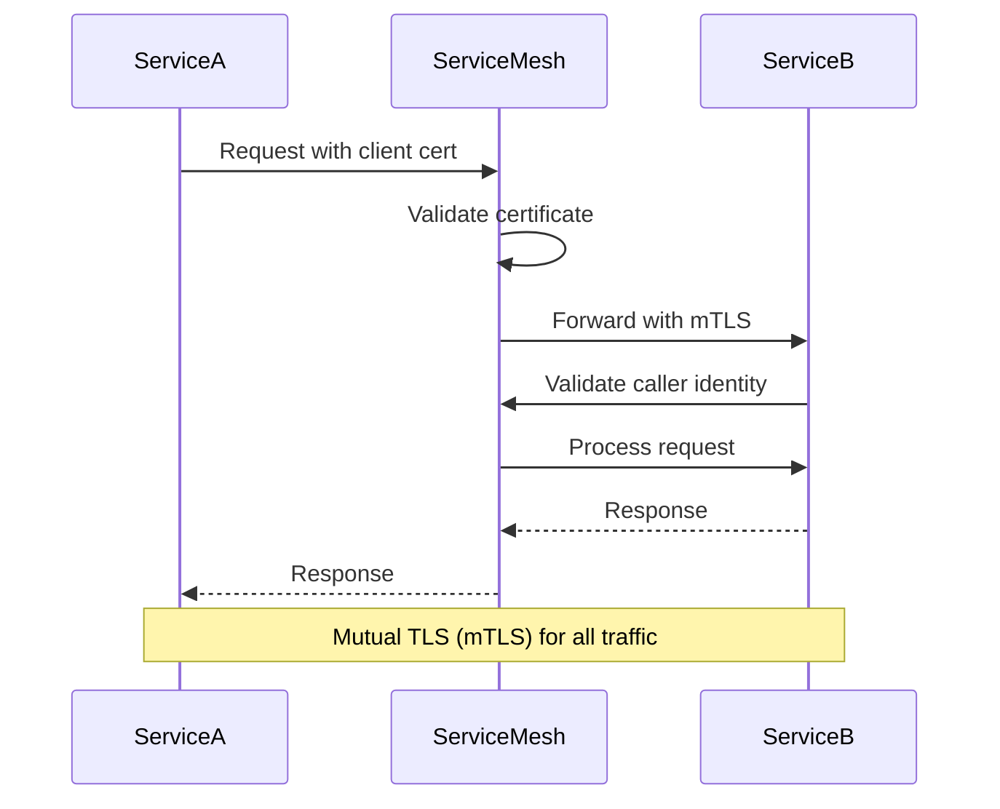

**Circuit Breaker Pattern**
```javascript
const CircuitBreaker = require('opossum');

// Protect against cascading failures
const options = {
  timeout: 3000,
  errorThresholdPercentage: 50,
  resetTimeout: 30000
};

const breaker = new CircuitBreaker(callExternalService, options);

breaker.fallback(() => ({
  status: 'degraded',
  message: 'Service temporarily unavailable'
}));

breaker.on('open', () => {
  logger.warn('Circuit breaker opened for service');
});

async function callExternalService(data) {
  // Call to another microservice
  return await fetch('http://service-b/api', {
    method: 'POST',
    body: JSON.stringify(data)
  });
}
```

## Mobile Application Security

### Mobile Security Considerations

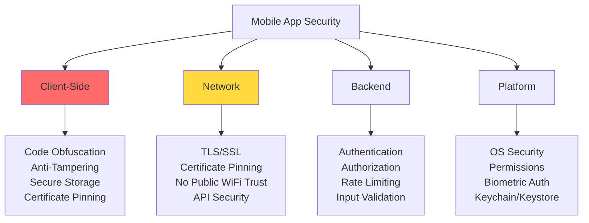

### Secure Mobile Development

**Secure Data Storage**
```javascript
// React Native secure storage example
import * as SecureStore from 'expo-secure-store';

// Store sensitive data
async function saveSecureData(key, value) {
  try {
    await SecureStore.setItemAsync(key, value);
  } catch (error) {
    console.error('Secure storage error:', error);
  }
}

// Retrieve sensitive data
async function getSecureData(key) {
  try {
    return await SecureStore.getItemAsync(key);
  } catch (error) {
    console.error('Secure retrieval error:', error);
    return null;
  }
}

// NEVER store in AsyncStorage
// BAD: await AsyncStorage.setItem('token', authToken);
```

**Certificate Pinning**
```javascript
// iOS/Android certificate pinning configuration
const certificatePinning = {
  'api.example.com': {
    certificateHashes: [
      'sha256/AAAAAAAAAAAAAAAAAAAAAAAAAAAAAAAAAAAAAAAAAAA=',
      'sha256/BBBBBBBBBBBBBBBBBBBBBBBBBBBBBBBBBBBBBBBBBBB=' // Backup
    ],
    includeSubdomains: true,
    enforceHostnameVerification: true,
    disableConnectionCache: true
  }
};

// Prevent MITM attacks
// Forces app to only trust specific certificates
```

### Mobile-Specific Threats

**Jailbreak/Root Detection**
```javascript
import JailMonkey from 'jail-monkey';

function checkDeviceSecurity() {
  if (JailMonkey.isJailBroken()) {
    // Device is jailbroken/rooted
    return {
      secure: false,
      reason: 'Device compromised'
    };
  }
  
  if (JailMonkey.hookDetected()) {
    return {
      secure: false,
      reason: 'Runtime manipulation detected'
    };
  }
  
  return { secure: true };
}

// Handle insecure devices
if (!checkDeviceSecurity().secure) {
  // Limit functionality or deny access
  showSecurityWarning();
}
```

**Secure Communication**
- Always use HTTPS/TLS
- Implement certificate pinning
- Validate server certificates
- Don't trust user-added certificates
- Encrypt sensitive data before transmission

## Related Security Domains

Application security intersects with multiple security disciplines:

### 1. Authentication
- [authentication.md](authentication.md) - Detailed coverage of:
  - Password policies and storage
  - Multi-factor authentication
  - OAuth 2.0 and OpenID Connect
  - Biometric authentication
  - Session management

### 2. Authorization
- [authorization.md](authorization.md) - Access control models:
  - Role-Based Access Control (RBAC)
  - Attribute-Based Access Control (ABAC)
  - API authorization
  - Resource permissions

### 3. Data Security
- [data_security.md](data_security.md) - Data protection strategies:
  - Encryption at rest and in transit
  - Data classification
  - Data masking and anonymization
  - Secure data lifecycle

### 4. Encryption
- [encryption.md](encryption.md) - Cryptographic implementation:
  - Encryption algorithms
  - Key management
  - TLS/SSL configuration
  - Hashing and digital signatures

### 5. Network Security
- [network_security.md](network_security.md) - Network layer protections:
  - Firewalls and WAF
  - Network segmentation
  - VPN and secure channels
  - DDoS protection

### 6. Monitoring and Auditing
- [monitoring_auditing.md](monitoring_auditing.md) - Detection and response:
  - Application logging
  - Security event monitoring
  - Incident detection
  - Audit trails

### 7. Compliance
- [compliance.md](compliance.md) - Regulatory requirements:
  - GDPR, CCPA data protection
  - PCI-DSS for payment applications
  - HIPAA for healthcare applications
  - SOC 2 security controls

### 8. Best Practices
- [best_practises.md](best_practises.md) - Implementation guidelines and industry standards

## Security Checklist

### Development Phase
- [ ] Threat modeling completed
- [ ] Security requirements documented
- [ ] Secure coding standards adopted
- [ ] Security training for developers
- [ ] Code review process includes security
- [ ] SAST tools integrated in IDE
- [ ] Dependency scanning enabled
- [ ] Secret scanning configured

### Testing Phase
- [ ] Unit tests for security functions
- [ ] SAST scan passing
- [ ] DAST scan completed
- [ ] Dependency vulnerabilities addressed
- [ ] API security testing performed
- [ ] Penetration testing completed
- [ ] Security regression tests passing

### Deployment Phase
- [ ] Secure configuration applied
- [ ] Secrets stored securely (not in code)
- [ ] TLS/HTTPS enforced
- [ ] Security headers configured
- [ ] WAF rules deployed and tuned
- [ ] Rate limiting enabled
- [ ] Monitoring and alerting configured
- [ ] Incident response plan documented

### Runtime Phase
- [ ] Security monitoring active
- [ ] Log aggregation configured
- [ ] Vulnerability scanning scheduled
- [ ] Patch management process
- [ ] Security metrics tracked
- [ ] Incident response tested
- [ ] Regular security assessments
- [ ] Compliance audits passed

## Key Takeaways

1. **Security is Not Optional**: Build security into every phase of development
2. **Defense in Depth**: Multiple layers of security controls
3. **Validate Everything**: Never trust user input or client-side validation
4. **Fail Securely**: Default to secure behavior in error conditions
5. **Least Privilege**: Grant minimum necessary permissions
6. **Keep It Simple**: Complexity is the enemy of security
7. **Stay Updated**: Regularly patch dependencies and frameworks
8. **Test Continuously**: Automated security testing in CI/CD
9. **Monitor Actively**: Real-time detection and response
10. **Learn from Incidents**: Post-mortems and continuous improvement

## Case Studies

For real-world application security incidents and lessons learned, see the [case-studies](case-studies/) directory:

- [OAuth Leak Case Study](case-studies/case1_oauth_leak.md)
- [Data Breach Case Study](case-studies/case2_data_breach.md)
- [Ransomware Attack Case Study](case-studies/case3_ransomware.md)

---
