# Authentication

## Table of Contents

- [Overview](#overview)
- [Core Concepts](#core-concepts)
- [Authentication Methods](#authentication-methods)
- [Session Management](#session-management)
- [Multi-Factor Authentication (MFA)](#multi-factor-authentication-mfa)
- [Single Sign-On (SSO)](#single-sign-on-sso)
- [Modern Authentication Protocols](#modern-authentication-protocols)
- [Best Practices](#best-practices)
- [Common Vulnerabilities](#common-vulnerabilities)

## Overview

Authentication is the process of verifying the identity of a user, device, or system. It answers the question: "Who are you?" and ensures that entities are who they claim to be before granting access to resources.

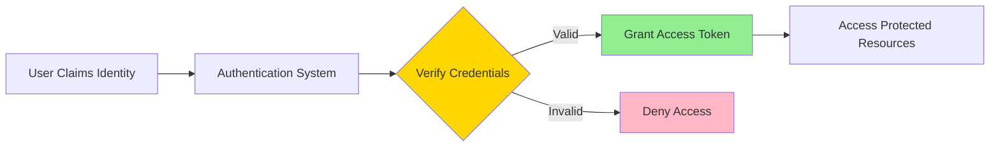

## Core Concepts

### Authentication vs Authorization

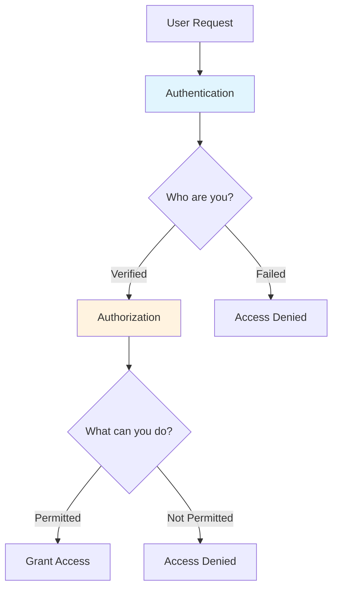

### Authentication Factors

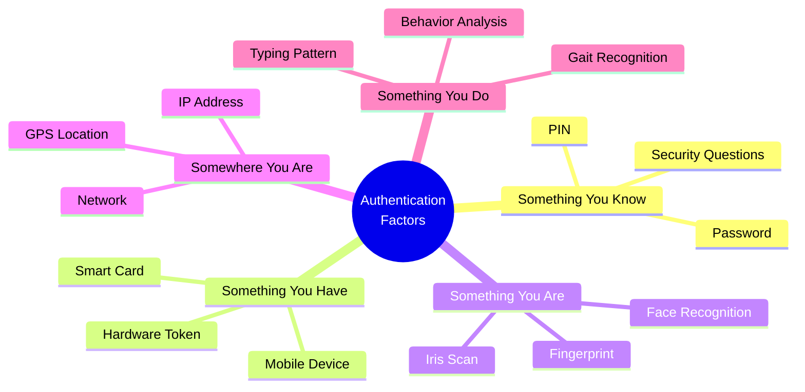

## Authentication Methods

### 1. Password-Based Authentication

The most common but increasingly vulnerable method.

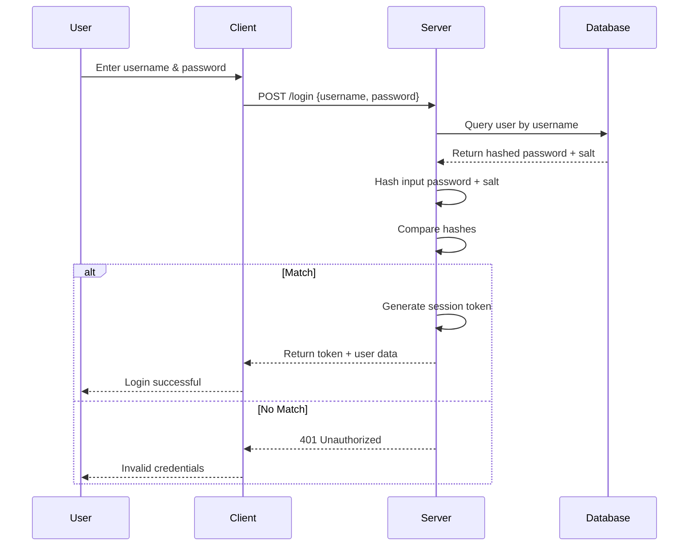

**Implementation Example:**

```javascript
// Password hashing (registration)
const bcrypt = require('bcrypt');

async function registerUser(username, password) {
  const saltRounds = 12;
  const hashedPassword = await bcrypt.hash(password, saltRounds);
  
  // Store hashedPassword in database
  await db.users.create({
    username,
    password: hashedPassword
  });
}

// Password verification (login)
async function authenticateUser(username, password) {
  const user = await db.users.findOne({ username });
  if (!user) return null;
  
  const isValid = await bcrypt.compare(password, user.password);
  return isValid ? user : null;
}
```

**Best Practices:**
- Never store passwords in plain text
- Use strong hashing algorithms (bcrypt, Argon2, scrypt)
- Implement password complexity requirements
- Use rate limiting to prevent brute force attacks

### 2. Token-Based Authentication

Modern approach using stateless tokens (JWT, OAuth tokens).

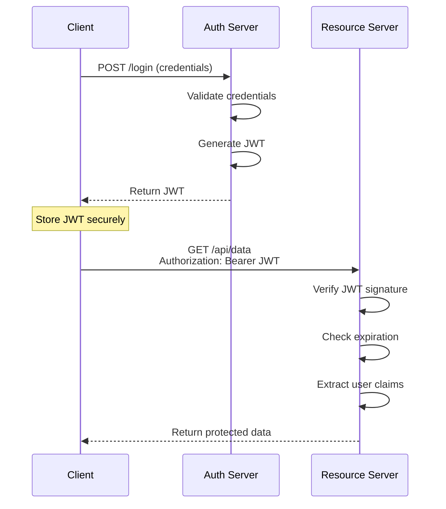

**JWT Structure:**

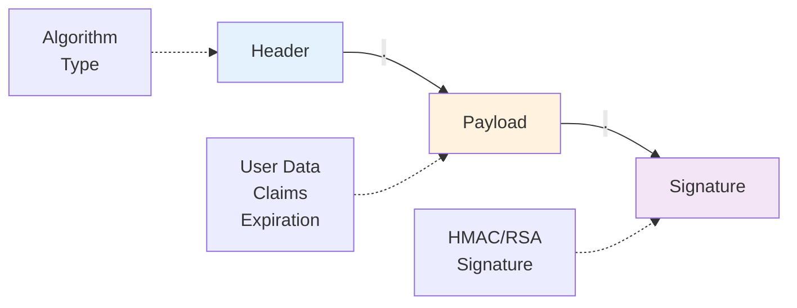

**Implementation Example:**

```javascript
const jwt = require('jsonwebtoken');
const SECRET_KEY = process.env.JWT_SECRET;

// Generate token
function generateToken(user) {
  const payload = {
    userId: user.id,
    username: user.username,
    role: user.role
  };
  
  return jwt.sign(payload, SECRET_KEY, {
    expiresIn: '1h',
    issuer: 'your-app',
    audience: 'your-app-users'
  });
}

// Verify token middleware
function verifyToken(req, res, next) {
  const token = req.headers.authorization?.split(' ')[1];
  
  if (!token) {
    return res.status(401).json({ error: 'No token provided' });
  }
  
  try {
    const decoded = jwt.verify(token, SECRET_KEY);
    req.user = decoded;
    next();
  } catch (error) {
    res.status(401).json({ error: 'Invalid token' });
  }
}
```

### 3. Biometric Authentication

Uses unique biological characteristics.

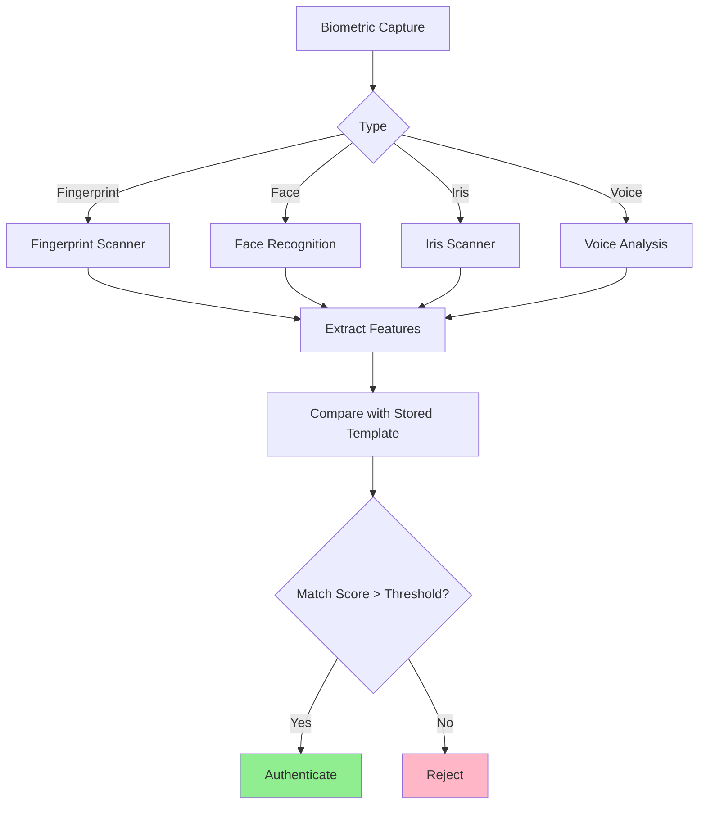

### 4. Certificate-Based Authentication

Uses digital certificates and PKI.

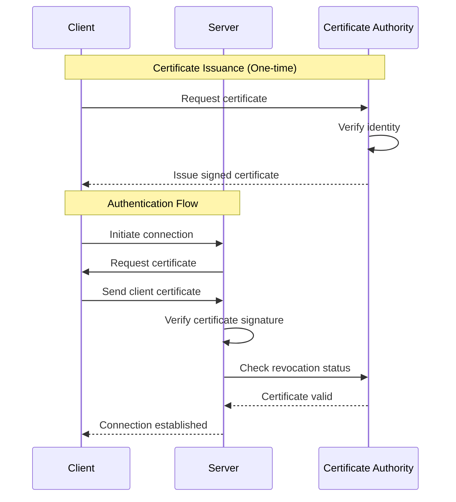

## Session Management

### Session vs Token Comparison

```mermaid
graph TB
    subgraph "Session-Based"
        A1[Client] --> B1[Login]
        B1 --> C1[Server Creates Session]
        C1 --> D1[Session ID in Cookie]
        D1 --> E1[Store Session in Server/DB]
        E1 --> F1[Validate on Each Request]
    end
    
    subgraph "Token-Based"
        A2[Client] --> B2[Login]
        B2 --> C2[Server Creates JWT]
        C2 --> D2[Token Sent to Client]
        D2 --> E2[Client Stores Token]
        E2 --> F2[Validate Token Locally]
    end
    
    style C1 fill:#FFE0B2
    style C2 fill:#C8E6C9
```

### Session Implementation

```javascript
// Express session example
const session = require('express-session');
const RedisStore = require('connect-redis')(session);

app.use(session({
  store: new RedisStore({ client: redisClient }),
  secret: process.env.SESSION_SECRET,
  resave: false,
  saveUninitialized: false,
  cookie: {
    secure: true,        // HTTPS only
    httpOnly: true,      // Not accessible via JavaScript
    maxAge: 3600000,     // 1 hour
    sameSite: 'strict'   // CSRF protection
  }
}));

// Login route
app.post('/login', async (req, res) => {
  const user = await authenticateUser(req.body.username, req.body.password);
  
  if (user) {
    req.session.userId = user.id;
    req.session.role = user.role;
    res.json({ success: true });
  } else {
    res.status(401).json({ error: 'Invalid credentials' });
  }
});
```

### Session Security

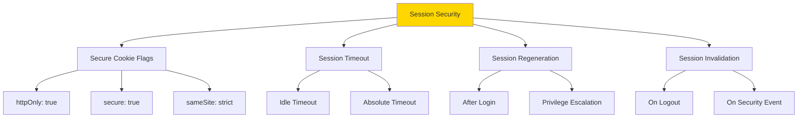

## Multi-Factor Authentication (MFA)

### MFA Flow

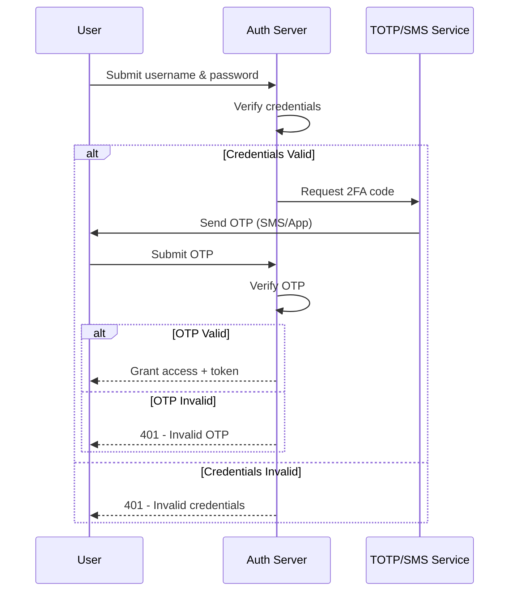

### TOTP Implementation

```javascript
const speakeasy = require('speakeasy');
const QRCode = require('qrcode');

// Generate secret for user
function generateMFASecret(username) {
  const secret = speakeasy.generateSecret({
    name: `YourApp (${username})`,
    length: 32
  });
  
  return {
    secret: secret.base32,
    qrCode: secret.otpauth_url
  };
}

// Generate QR code
async function generateQRCode(otpauth_url) {
  return await QRCode.toDataURL(otpauth_url);
}

// Verify TOTP token
function verifyTOTP(token, secret) {
  return speakeasy.totp.verify({
    secret: secret,
    encoding: 'base32',
    token: token,
    window: 2  // Allow 2 time steps before/after
  });
}

// MFA verification middleware
async function verifyMFA(req, res, next) {
  const { token } = req.body;
  const user = await db.users.findById(req.user.id);
  
  if (!user.mfaEnabled) {
    return next();
  }
  
  if (verifyTOTP(token, user.mfaSecret)) {
    next();
  } else {
    res.status(401).json({ error: 'Invalid MFA token' });
  }
}
```

### MFA Methods Comparison

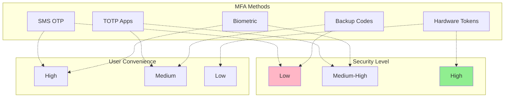

## Single Sign-On (SSO)

### SSO Architecture

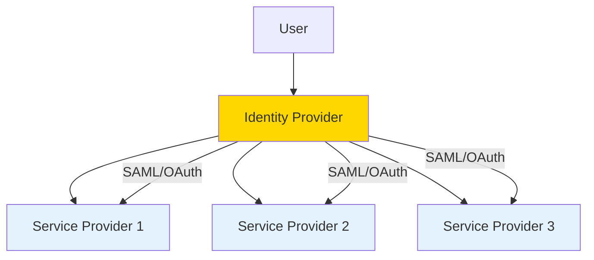

### SSO Flow (SAML)

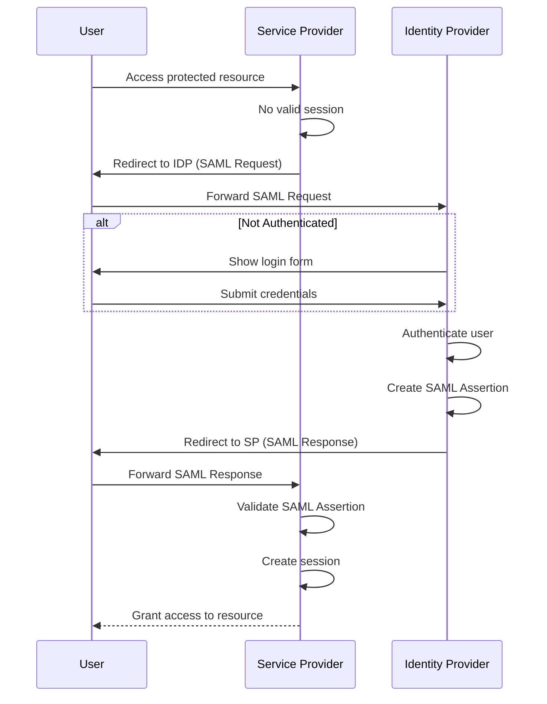

## Modern Authentication Protocols

### OAuth 2.0 Flow

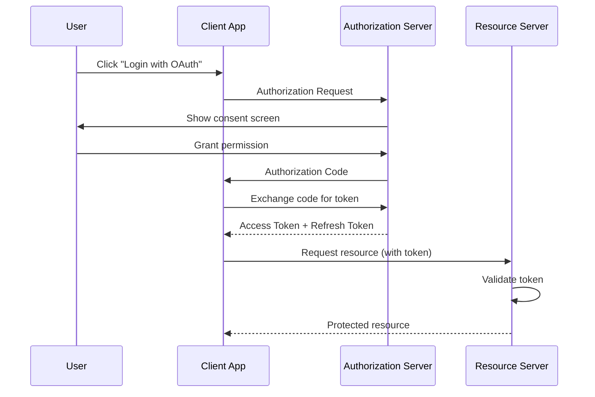

### OpenID Connect (OIDC)

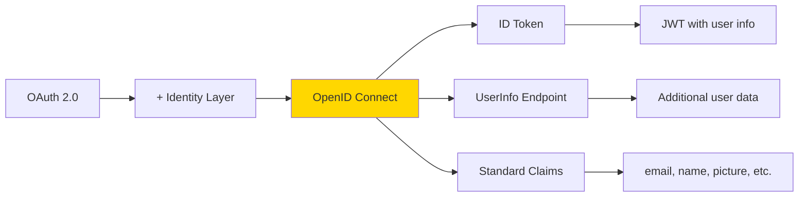

**OIDC Implementation:**

```javascript
const { Issuer } = require('openid-client');

// Discover OIDC provider
async function setupOIDC() {
  const issuer = await Issuer.discover('https://accounts.google.com');
  
  const client = new issuer.Client({
    client_id: process.env.CLIENT_ID,
    client_secret: process.env.CLIENT_SECRET,
    redirect_uris: ['http://localhost:3000/callback'],
    response_types: ['code']
  });
  
  return client;
}

// Generate authorization URL
function getAuthorizationUrl(client) {
  return client.authorizationUrl({
    scope: 'openid email profile',
    state: generateRandomState()
  });
}

// Handle callback
async function handleCallback(client, params) {
  const tokenSet = await client.callback(
    'http://localhost:3000/callback',
    params
  );
  
  const claims = tokenSet.claims();
  
  return {
    accessToken: tokenSet.access_token,
    idToken: tokenSet.id_token,
    user: {
      id: claims.sub,
      email: claims.email,
      name: claims.name
    }
  };
}
```

### Passwordless Authentication

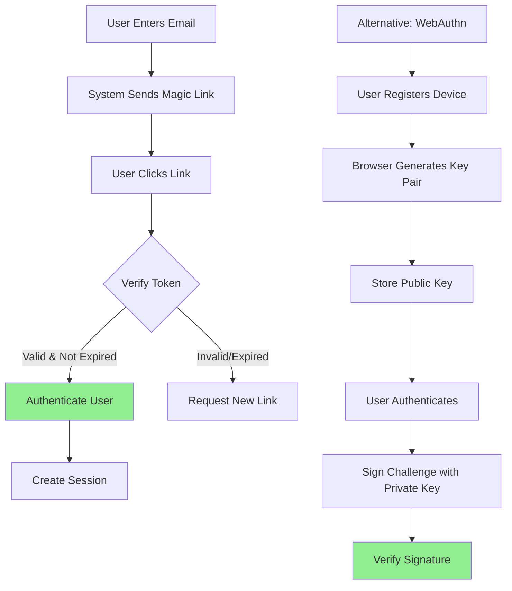

**Magic Link Implementation:**

```javascript
const crypto = require('crypto');

// Generate magic link
async function generateMagicLink(email) {
  const token = crypto.randomBytes(32).toString('hex');
  const expiresAt = new Date(Date.now() + 15 * 60 * 1000); // 15 minutes
  
  await db.magicTokens.create({
    email,
    token,
    expiresAt,
    used: false
  });
  
  const magicLink = `https://yourapp.com/auth/verify?token=${token}`;
  await sendEmail(email, magicLink);
  
  return { success: true };
}

// Verify magic link
async function verifyMagicLink(token) {
  const record = await db.magicTokens.findOne({ token });
  
  if (!record || record.used || record.expiresAt < new Date()) {
    return null;
  }
  
  await db.magicTokens.update({ token }, { used: true });
  
  return record.email;
}
```

## Best Practices

### Authentication Security Checklist

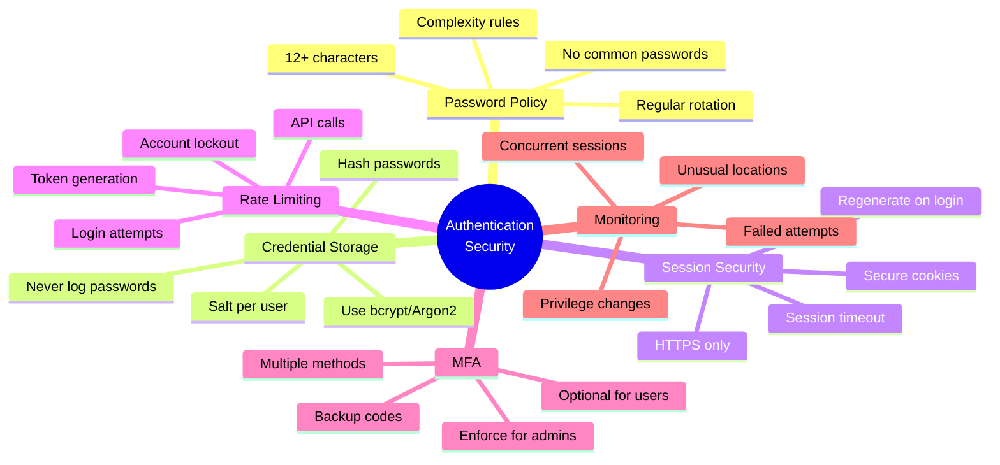

### Implementation Guidelines

1. **Always use HTTPS** - No authentication over plain HTTP
2. **Implement rate limiting** - Prevent brute force attacks
3. **Use secure password hashing** - bcrypt, Argon2, or scrypt
4. **Enable MFA** - Especially for privileged accounts
5. **Implement proper session management** - Timeouts and regeneration
6. **Use secure tokens** - JWT with proper validation
7. **Monitor authentication events** - Log failures and anomalies
8. **Regular security audits** - Test authentication mechanisms

## Common Vulnerabilities

### OWASP Authentication Risks

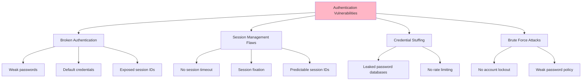

### Protection Strategies

```javascript
// Rate limiting example
const rateLimit = require('express-rate-limit');

const loginLimiter = rateLimit({
  windowMs: 15 * 60 * 1000, // 15 minutes
  max: 5, // 5 attempts
  message: 'Too many login attempts, please try again later',
  standardHeaders: true,
  legacyHeaders: false,
  handler: (req, res) => {
    // Log security event
    logger.warn('Rate limit exceeded', {
      ip: req.ip,
      username: req.body.username
    });
    res.status(429).json({ error: 'Too many attempts' });
  }
});

app.post('/login', loginLimiter, async (req, res) => {
  // Login logic
});

// Account lockout after failed attempts
async function handleFailedLogin(username) {
  const user = await db.users.findOne({ username });
  if (!user) return;
  
  user.failedAttempts = (user.failedAttempts || 0) + 1;
  user.lastFailedAttempt = new Date();
  
  if (user.failedAttempts >= 5) {
    user.lockedUntil = new Date(Date.now() + 30 * 60 * 1000); // 30 min
    await sendSecurityAlert(user.email, 'Account locked');
  }
  
  await user.save();
}
```

### Security Monitoring

```javascript
// Authentication event logging
function logAuthEvent(event, user, req) {
  logger.info('Authentication event', {
    event,
    userId: user?.id,
    username: user?.username,
    ip: req.ip,
    userAgent: req.get('user-agent'),
    timestamp: new Date(),
    success: event.includes('success')
  });
}

// Detect anomalies
async function detectAnomalies(user, req) {
  const recentLogins = await db.authLogs.find({
    userId: user.id,
    timestamp: { $gt: new Date(Date.now() - 24 * 60 * 60 * 1000) }
  });
  
  // Check for unusual location
  const currentLocation = getLocationFromIP(req.ip);
  const usualLocations = recentLogins.map(l => l.location);
  
  if (!usualLocations.includes(currentLocation)) {
    await sendSecurityAlert(user.email, 'Login from new location');
  }
}
```

---

## Related Documentation

- [Authorization](./authorization.md) - Access control after authentication
- [Encryption](./encryption.md) - Protecting credentials in transit and at rest
- [Network Security](./network_security.md) - Securing authentication channels
- [Monitoring & Auditing](./monitoring_auditing.md) - Tracking authentication events
- [Best Practices](./best_practises.md) - Overall security guidelines

---

**Remember**: Authentication is the first line of defense. Implement it carefully, monitor it continuously, and update it regularly to address emerging threats.