# Authorization

## Table of Contents

- [Overview](#overview)
- [Core Concepts](#core-concepts)
- [Authorization Models](#authorization-models)
- [Role-Based Access Control (RBAC)](#role-based-access-control-rbac)
- [Attribute-Based Access Control (ABAC)](#attribute-based-access-control-abac)
- [Policy-Based Access Control (PBAC)](#policy-based-access-control-pbac)
- [Access Control Lists (ACL)](#access-control-lists-acl)
- [Zero Trust Architecture](#zero-trust-architecture)
- [Implementation Patterns](#implementation-patterns)
- [Best Practices](#best-practices)

## Overview

Authorization determines what an authenticated user is allowed to do. While authentication answers "Who are you?", authorization answers "What are you allowed to access?" It's the process of granting or denying access to resources based on verified identity and permissions.

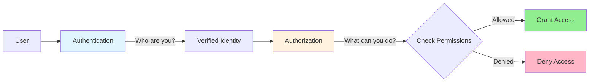

## Core Concepts

### Authorization Flow

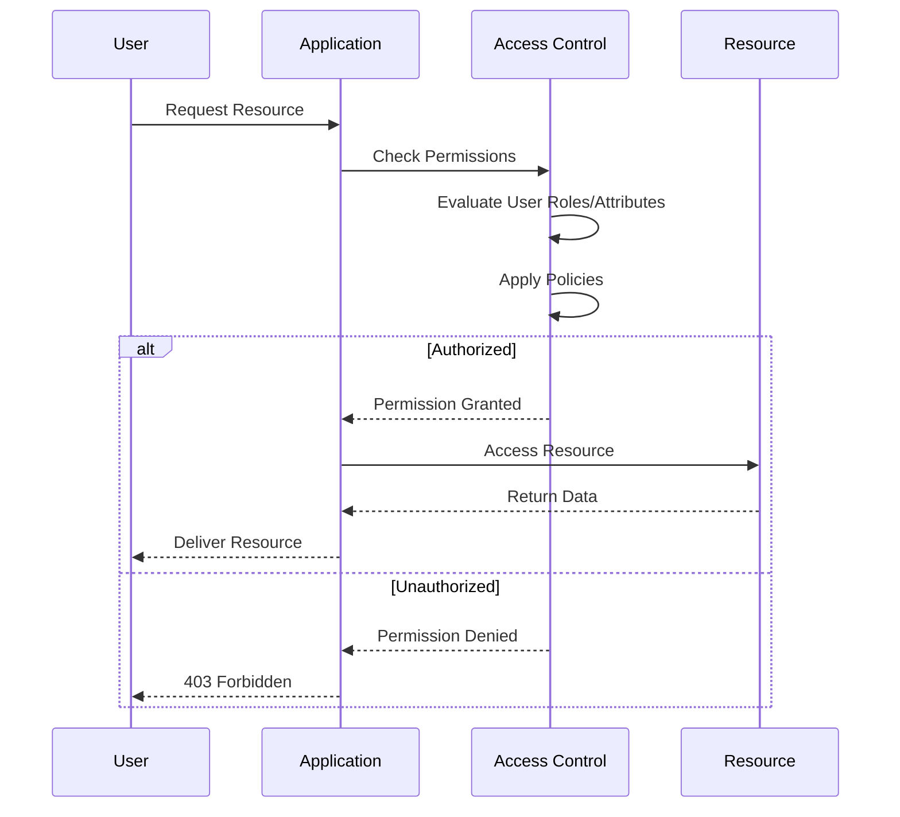

### Key Principles

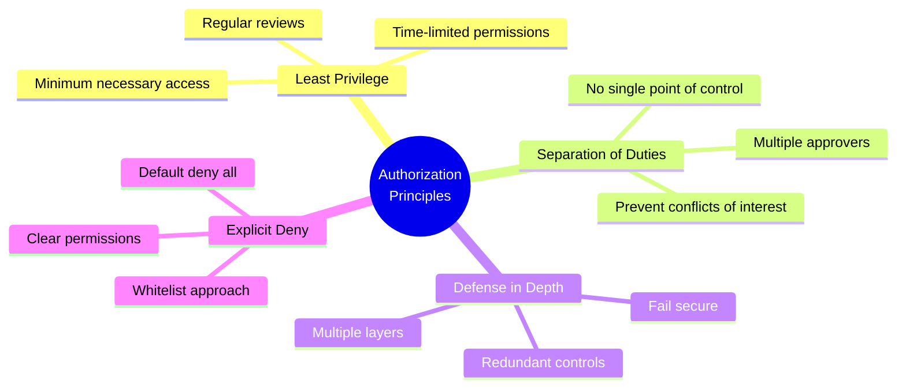

### Permission Granularity

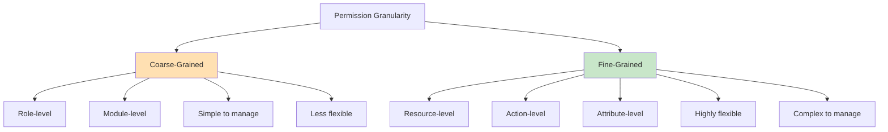

## Authorization Models

### Model Comparison

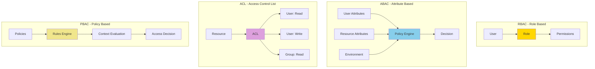

### When to Use Each Model

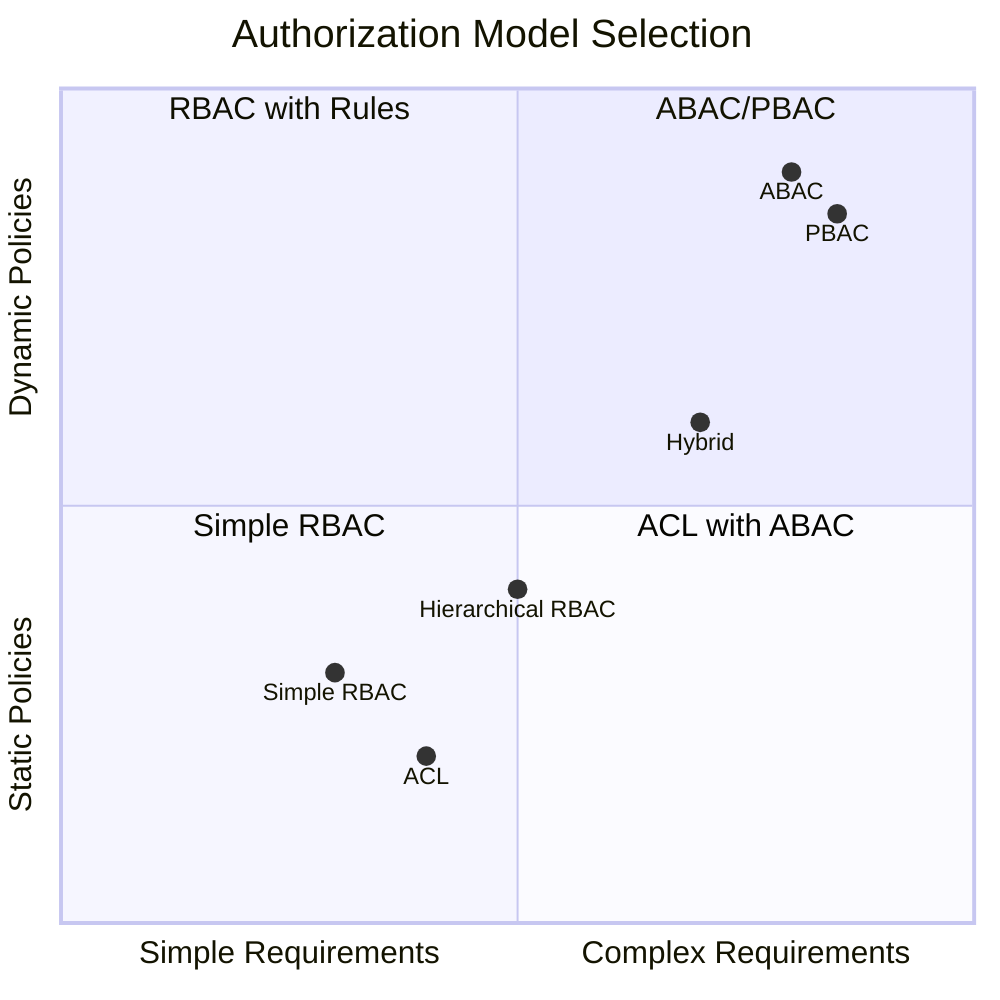

## Role-Based Access Control (RBAC)

### RBAC Architecture

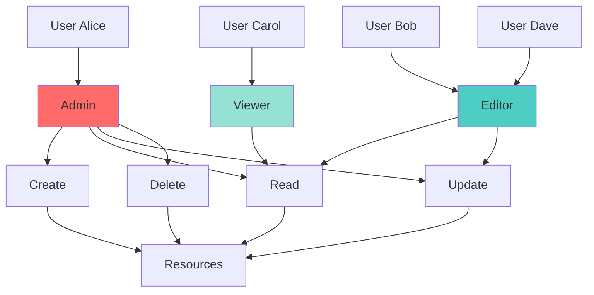

### Hierarchical RBAC

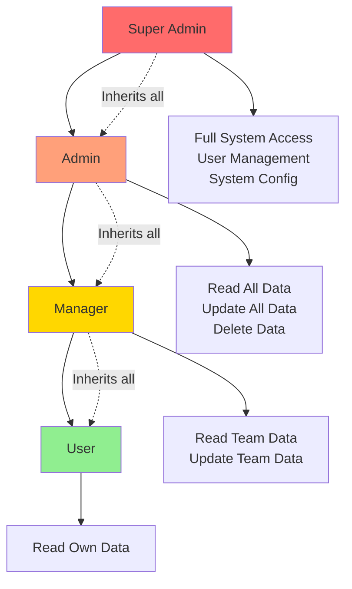

### RBAC Implementation

```javascript
// Define roles and permissions
const roles = {
  admin: ['create', 'read', 'update', 'delete', 'manage_users'],
  editor: ['create', 'read', 'update'],
  viewer: ['read']
};

// Middleware to check permissions
function authorize(requiredPermission) {
  return (req, res, next) => {
    const userRole = req.user.role;
    const permissions = roles[userRole] || [];
    
    if (permissions.includes(requiredPermission)) {
      next();
    } else {
      res.status(403).json({ 
        error: 'Forbidden',
        message: 'Insufficient permissions'
      });
    }
  };
}

// Usage in routes
app.post('/articles', authorize('create'), createArticle);
app.get('/articles/:id', authorize('read'), getArticle);
app.put('/articles/:id', authorize('update'), updateArticle);
app.delete('/articles/:id', authorize('delete'), deleteArticle);

// Check multiple permissions
function authorizeAny(permissions) {
  return (req, res, next) => {
    const userRole = req.user.role;
    const userPermissions = roles[userRole] || [];
    
    const hasPermission = permissions.some(p => 
      userPermissions.includes(p)
    );
    
    if (hasPermission) {
      next();
    } else {
      res.status(403).json({ error: 'Forbidden' });
    }
  };
}
```

### Role Assignment Flow

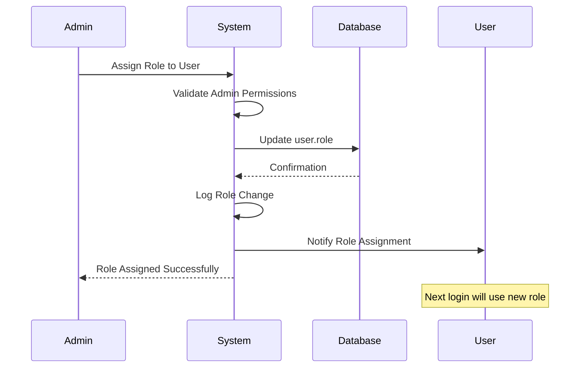

### Dynamic RBAC

```javascript
// Role hierarchy and inheritance
const roleHierarchy = {
  superadmin: ['admin', 'manager', 'user'],
  admin: ['manager', 'user'],
  manager: ['user'],
  user: []
};

const rolePermissions = {
  superadmin: ['system:config', 'user:manage'],
  admin: ['data:delete'],
  manager: ['data:update'],
  user: ['data:read']
};

// Get all permissions including inherited
function getAllPermissions(role) {
  const inherited = roleHierarchy[role] || [];
  const direct = rolePermissions[role] || [];
  
  const allPermissions = [...direct];
  inherited.forEach(inheritedRole => {
    allPermissions.push(...getAllPermissions(inheritedRole));
  });
  
  return [...new Set(allPermissions)];
}

// Check permission with hierarchy
function hasPermission(user, permission) {
  const userPermissions = getAllPermissions(user.role);
  return userPermissions.includes(permission);
}

// Advanced authorization
function authorizeResource(action) {
  return async (req, res, next) => {
    const resource = await getResource(req.params.id);
    
    // Owner check
    if (resource.ownerId === req.user.id) {
      return next();
    }
    
    // Role-based check
    if (hasPermission(req.user, `${resource.type}:${action}`)) {
      return next();
    }
    
    res.status(403).json({ error: 'Forbidden' });
  };
}
```

## Attribute-Based Access Control (ABAC)

### ABAC Components

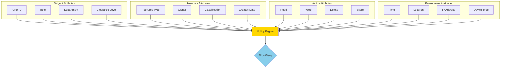

### ABAC Policy Evaluation

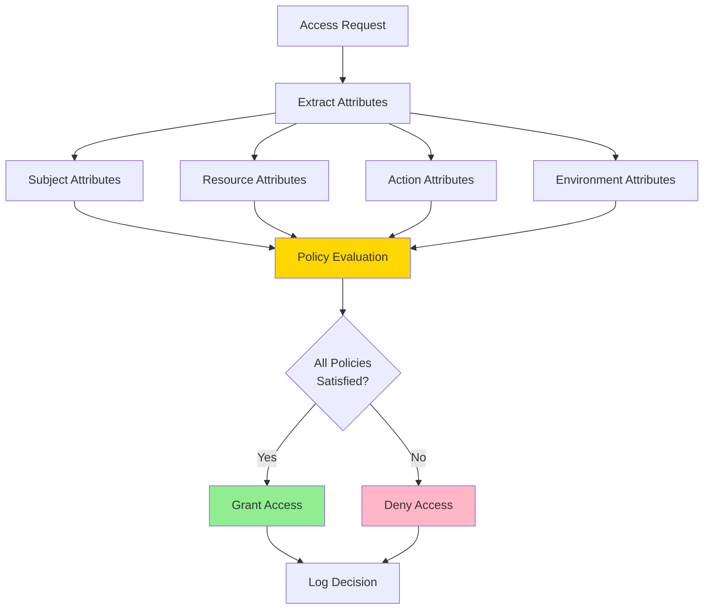

### ABAC Implementation

```javascript
// ABAC Policy Engine
class ABACEngine {
  constructor() {
    this.policies = [];
  }
  
  addPolicy(policy) {
    this.policies.push(policy);
  }
  
  evaluate(subject, resource, action, environment) {
    for (const policy of this.policies) {
      if (policy.applies(subject, resource, action, environment)) {
        const result = policy.evaluate(subject, resource, action, environment);
        if (!result) {
          return { allowed: false, reason: policy.name };
        }
      }
    }
    return { allowed: true };
  }
}

// Define policies
const policies = [
  {
    name: 'Department Access',
    applies: (s, r) => true,
    evaluate: (subject, resource) => {
      return subject.department === resource.department;
    }
  },
  {
    name: 'Time-Based Access',
    applies: (s, r, a, e) => true,
    evaluate: (subject, resource, action, env) => {
      const hour = env.currentTime.getHours();
      return hour >= 9 && hour <= 17; // Business hours only
    }
  },
  {
    name: 'Clearance Level',
    applies: (s, r) => r.classification,
    evaluate: (subject, resource) => {
      const levels = { public: 0, internal: 1, confidential: 2, secret: 3 };
      return levels[subject.clearance] >= levels[resource.classification];
    }
  },
  {
    name: 'Location-Based',
    applies: (s, r, a, e) => a === 'delete',
    evaluate: (subject, resource, action, env) => {
      return env.ipAddress.startsWith('10.0.'); // Internal network only
    }
  }
];

// ABAC Middleware
function abacAuthorize() {
  const engine = new ABACEngine();
  policies.forEach(p => engine.addPolicy(p));
  
  return async (req, res, next) => {
    const subject = {
      id: req.user.id,
      role: req.user.role,
      department: req.user.department,
      clearance: req.user.clearance
    };
    
    const resource = await getResource(req.params.id);
    const action = getActionFromMethod(req.method);
    const environment = {
      currentTime: new Date(),
      ipAddress: req.ip,
      userAgent: req.get('user-agent')
    };
    
    const result = engine.evaluate(subject, resource, action, environment);
    
    if (result.allowed) {
      next();
    } else {
      res.status(403).json({ 
        error: 'Access Denied',
        reason: result.reason 
      });
    }
  };
}
```

### ABAC Policy Examples

```javascript
// Complex policy with multiple conditions
const complexPolicy = {
  name: 'Financial Document Access',
  evaluate: (subject, resource, action, env) => {
    // Must be in finance department
    if (subject.department !== 'finance') {
      return false;
    }
    
    // Senior staff can access all, junior only their own
    if (subject.level === 'senior') {
      return true;
    }
    
    if (subject.level === 'junior') {
      return resource.createdBy === subject.id;
    }
    
    // Must be during business hours
    const hour = env.currentTime.getHours();
    if (hour < 9 || hour > 17) {
      return false;
    }
    
    // Delete requires manager approval
    if (action === 'delete') {
      return subject.approvals.includes(resource.id);
    }
    
    return true;
  }
};
```

## Policy-Based Access Control (PBAC)

### PBAC Architecture

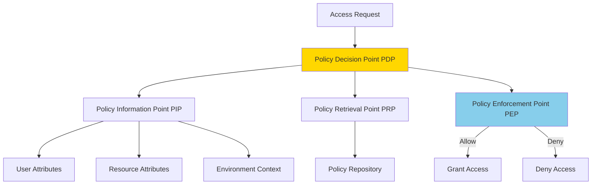

### Policy Definition Language

```javascript
// XACML-like policy structure
const policySet = {
  id: 'document-access-policy',
  target: { resourceType: 'document' },
  rules: [
    {
      id: 'owner-full-access',
      effect: 'Permit',
      condition: (ctx) => ctx.resource.owner === ctx.subject.id
    },
    {
      id: 'shared-read-access',
      effect: 'Permit',
      condition: (ctx) => 
        ctx.resource.sharedWith.includes(ctx.subject.id) &&
        ctx.action === 'read'
    },
    {
      id: 'department-manager-access',
      effect: 'Permit',
      condition: (ctx) =>
        ctx.subject.role === 'manager' &&
        ctx.subject.department === ctx.resource.department
    },
    {
      id: 'deny-confidential-without-clearance',
      effect: 'Deny',
      condition: (ctx) =>
        ctx.resource.classification === 'confidential' &&
        !ctx.subject.hasClearance
    }
  ],
  combiningAlgorithm: 'deny-overrides' // Deny takes precedence
};

// Policy evaluation engine
function evaluatePolicy(policySet, context) {
  const results = policySet.rules.map(rule => ({
    rule: rule.id,
    effect: rule.effect,
    applies: rule.condition(context)
  }));
  
  // Apply combining algorithm
  if (policySet.combiningAlgorithm === 'deny-overrides') {
    const denyApplies = results.some(r => 
      r.effect === 'Deny' && r.applies
    );
    if (denyApplies) return 'Deny';
    
    const permitApplies = results.some(r => 
      r.effect === 'Permit' && r.applies
    );
    return permitApplies ? 'Permit' : 'Deny';
  }
  
  return 'Deny';
}
```

## Access Control Lists (ACL)

### ACL Structure

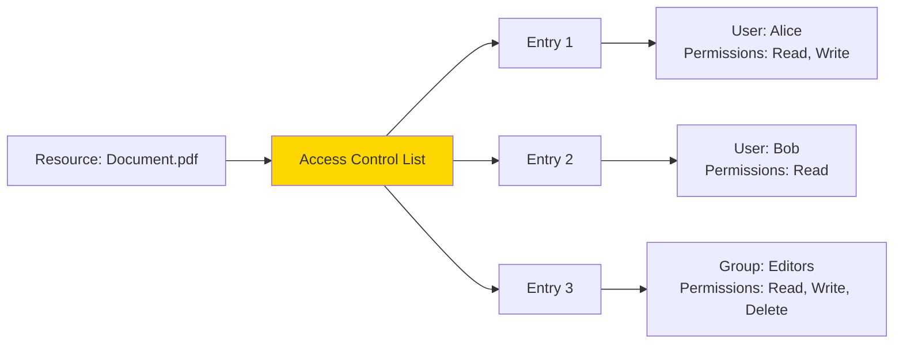

### ACL Implementation

```javascript
// ACL Manager
class ACLManager {
  constructor() {
    this.acls = new Map(); // resourceId -> ACL
  }
  
  setACL(resourceId, acl) {
    this.acls.set(resourceId, acl);
  }
  
  getACL(resourceId) {
    return this.acls.get(resourceId) || [];
  }
  
  hasPermission(resourceId, userId, permission) {
    const acl = this.getACL(resourceId);
    
    for (const entry of acl) {
      if (entry.principal === userId || 
          entry.principal === `group:${getUserGroup(userId)}`) {
        if (entry.permissions.includes(permission)) {
          return true;
        }
      }
    }
    return false;
  }
  
  addPermission(resourceId, userId, permission) {
    const acl = this.getACL(resourceId);
    const entry = acl.find(e => e.principal === userId);
    
    if (entry) {
      if (!entry.permissions.includes(permission)) {
        entry.permissions.push(permission);
      }
    } else {
      acl.push({
        principal: userId,
        permissions: [permission]
      });
    }
    
    this.setACL(resourceId, acl);
  }
  
  removePermission(resourceId, userId, permission) {
    const acl = this.getACL(resourceId);
    const entry = acl.find(e => e.principal === userId);
    
    if (entry) {
      entry.permissions = entry.permissions.filter(p => p !== permission);
      if (entry.permissions.length === 0) {
        this.setACL(resourceId, acl.filter(e => e.principal !== userId));
      }
    }
  }
}

// Usage
const aclManager = new ACLManager();

// Set ACL for a document
aclManager.setACL('doc123', [
  { principal: 'user:alice', permissions: ['read', 'write'] },
  { principal: 'user:bob', permissions: ['read'] },
  { principal: 'group:editors', permissions: ['read', 'write', 'delete'] }
]);

// Check permission
function checkACL(req, res, next) {
  const resourceId = req.params.id;
  const action = getActionFromMethod(req.method);
  
  if (aclManager.hasPermission(resourceId, req.user.id, action)) {
    next();
  } else {
    res.status(403).json({ error: 'Access Denied' });
  }
}
```

## Zero Trust Architecture

### Zero Trust Principles

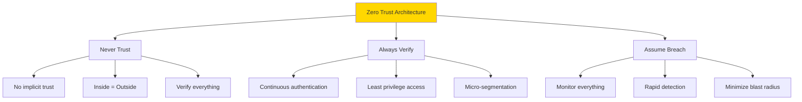

### Zero Trust Implementation

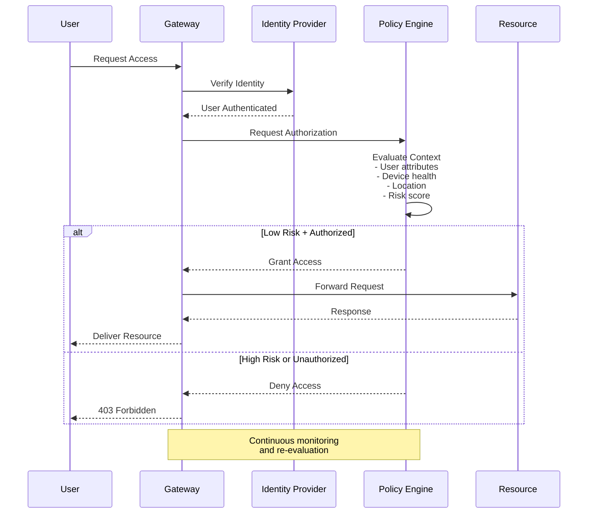

### Zero Trust Authorization

```javascript
// Zero Trust authorization middleware
async function zeroTrustAuthorize(req, res, next) {
  const context = {
    user: req.user,
    device: await getDeviceInfo(req),
    location: getLocationFromIP(req.ip),
    resource: await getResource(req.params.id),
    action: getActionFromMethod(req.method),
    time: new Date()
  };
  
  // 1. Verify identity (continuous)
  if (!await verifyIdentity(context.user)) {
    return res.status(401).json({ error: 'Identity verification failed' });
  }
  
  // 2. Check device health
  const deviceScore = await assessDeviceHealth(context.device);
  if (deviceScore < 70) {
    return res.status(403).json({ error: 'Device security requirements not met' });
  }
  
  // 3. Calculate risk score
  const riskScore = await calculateRiskScore(context);
  
  // 4. Apply adaptive access control
  if (riskScore > 80) {
    // High risk - require MFA
    if (!req.headers['x-mfa-token']) {
      return res.status(403).json({ 
        error: 'MFA required',
        reason: 'High risk activity detected'
      });
    }
  }
  
  // 5. Check authorization
  const authorized = await checkPermissions(context);
  if (!authorized) {
    return res.status(403).json({ error: 'Insufficient permissions' });
  }
  
  // 6. Log access for monitoring
  await logAccess(context, riskScore);
  
  next();
}

// Risk scoring
async function calculateRiskScore(context) {
  let score = 0;
  
  // Unusual location
  const usualLocations = await getUserLocations(context.user.id);
  if (!usualLocations.includes(context.location)) {
    score += 30;
  }
  
  // Unusual time
  const hour = context.time.getHours();
  if (hour < 6 || hour > 22) {
    score += 20;
  }
  
  // Sensitive action
  if (['delete', 'admin'].includes(context.action)) {
    score += 25;
  }
  
  // Multiple recent failures
  const recentFailures = await getRecentFailures(context.user.id);
  if (recentFailures > 3) {
    score += 25;
  }
  
  return score;
}
```

## Implementation Patterns

### Multi-Tenant Authorization

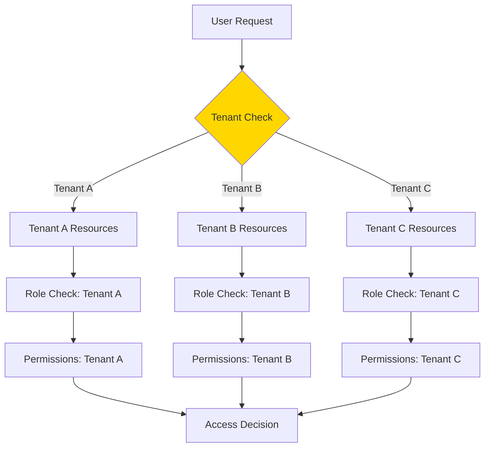

```javascript
// Multi-tenant authorization
function tenantAuthorize(permission) {
  return async (req, res, next) => {
    const tenantId = req.user.tenantId;
    const resourceId = req.params.id;
    
    // 1. Verify resource belongs to tenant
    const resource = await getResource(resourceId);
    if (resource.tenantId !== tenantId) {
      return res.status(404).json({ error: 'Resource not found' });
    }
    
    // 2. Check user permissions within tenant
    const hasPermission = await checkTenantPermission(
      tenantId,
      req.user.id,
      permission
    );
    
    if (hasPermission) {
      req.tenant = { id: tenantId };
      next();
    } else {
      res.status(403).json({ error: 'Forbidden' });
    }
  };
}
```

### Resource Ownership

```javascript
// Owner-based authorization
function authorizeOwner(options = {}) {
  return async (req, res, next) => {
    const resource = await getResource(req.params.id);
    
    // Check ownership
    if (resource.ownerId === req.user.id) {
      return next();
    }
    
    // Check if shared with user
    if (options.allowShared && resource.sharedWith?.includes(req.user.id)) {
      req.isShared = true;
      return next();
    }
    
    // Check admin override
    if (options.allowAdmin && req.user.role === 'admin') {
      req.isAdmin = true;
      return next();
    }
    
    res.status(403).json({ error: 'Access Denied' });
  };
}

// Usage
app.get('/documents/:id', authorizeOwner({ allowShared: true }), getDocument);
app.delete('/documents/:id', authorizeOwner({ allowAdmin: true }), deleteDocument);
```

### Permission Caching

```javascript
// Cache user permissions for performance
class PermissionCache {
  constructor(ttl = 300000) { // 5 minutes
    this.cache = new Map();
    this.ttl = ttl;
  }
  
  get(userId, resource, action) {
    const key = `${userId}:${resource}:${action}`;
    const cached = this.cache.get(key);
    
    if (cached && Date.now() - cached.timestamp < this.ttl) {
      return cached.value;
    }
    
    return null;
  }
  
  set(userId, resource, action, value) {
    const key = `${userId}:${resource}:${action}`;
    this.cache.set(key, {
      value,
      timestamp: Date.now()
    });
  }
  
  invalidate(userId) {
    for (const key of this.cache.keys()) {
      if (key.startsWith(`${userId}:`)) {
        this.cache.delete(key);
      }
    }
  }
}

const permCache = new PermissionCache();

// Use cache in authorization
async function cachedAuthorize(req, res, next) {
  const cached = permCache.get(
    req.user.id,
    req.params.id,
    req.method
  );
  
  if (cached !== null) {
    return cached ? next() : res.status(403).json({ error: 'Forbidden' });
  }
  
  const authorized = await checkPermission(req.user, req.params.id, req.method);
  permCache.set(req.user.id, req.params.id, req.method, authorized);
  
  return authorized ? next() : res.status(403).json({ error: 'Forbidden' });
}
```

## Best Practices

### Authorization Security Checklist

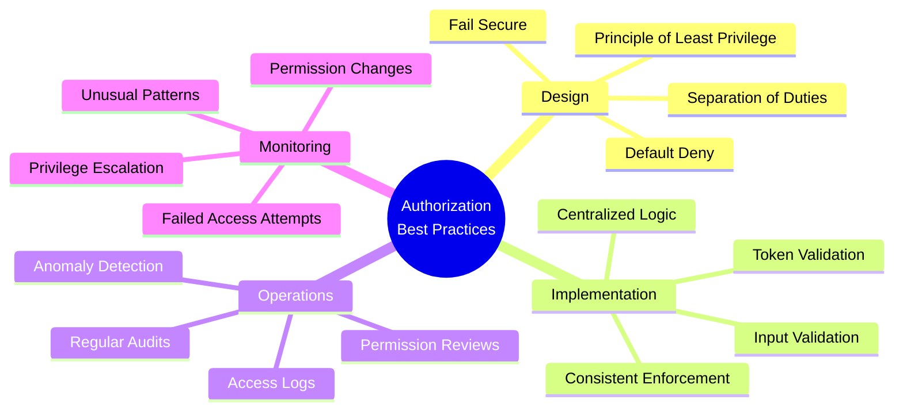

### Defense in Depth

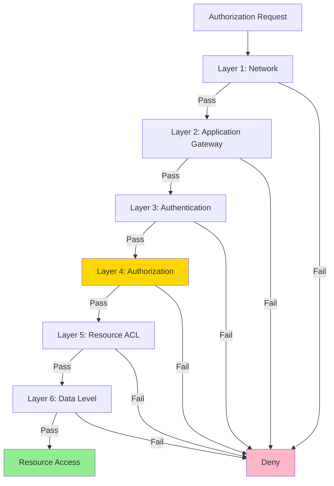

### Authorization Testing

```javascript
// Unit tests for authorization
describe('Authorization Tests', () => {
  
  test('Admin can access all resources', async () => {
    const admin = { id: 1, role: 'admin' };
    const resource = { id: 100, ownerId: 2 };
    
    const result = await authorize(admin, resource, 'read');
    expect(result).toBe(true);
  });
  
  test('User can only access owned resources', async () => {
    const user = { id: 1, role: 'user' };
    const ownedResource = { id: 100, ownerId: 1 };
    const otherResource = { id: 101, ownerId: 2 };
    
    expect(await authorize(user, ownedResource, 'read')).toBe(true);
    expect(await authorize(user, otherResource, 'read')).toBe(false);
  });
  
  test('ABAC time-based restrictions', async () => {
    const user = { id: 1, role: 'user', department: 'finance' };
    const resource = { id: 100, department: 'finance' };
    
    // During business hours
    const businessHours = new Date('2024-01-15T10:00:00');
    expect(await authorizeABAC(user, resource, 'read', { time: businessHours }))
      .toBe(true);
    
    // Outside business hours
    const afterHours = new Date('2024-01-15T22:00:00');
    expect(await authorizeABAC(user, resource, 'read', { time: afterHours }))
      .toBe(false);
  });
  
  test('Least privilege - new users have minimal permissions', async () => {
    const newUser = createUser({ role: 'user' });
    const permissions = getUserPermissions(newUser);
    
    expect(permissions).toEqual(['read']);
    expect(permissions).not.toContain('delete');
  });
});
```

### Common Pitfalls

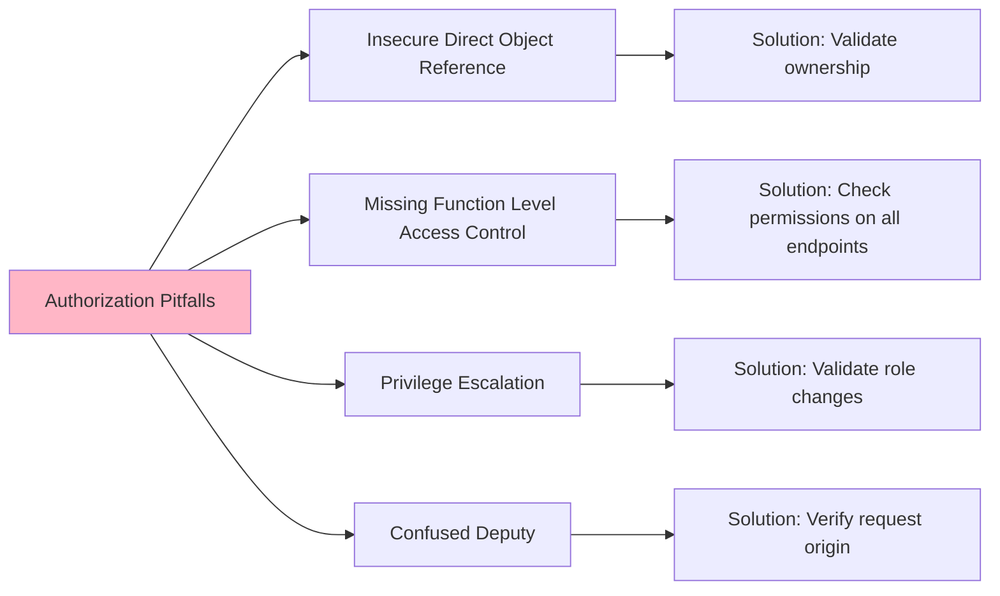

### Secure Implementation Patterns

```javascript
// Pattern 1: Centralized Authorization Service
class AuthorizationService {
  async canAccess(user, resource, action) {
    // Single source of truth for all authorization logic
    const checks = [
      this.checkRole(user, action),
      this.checkOwnership(user, resource),
      this.checkTenant(user, resource),
      this.checkTimeRestrictions(user, action),
      this.checkResourceState(resource, action)
    ];
    
    const results = await Promise.all(checks);
    return results.every(result => result === true);
  }
  
  async checkRole(user, action) {
    const permissions = await this.getRolePermissions(user.role);
    return permissions.includes(action);
  }
  
  async checkOwnership(user, resource) {
    if (user.role === 'admin') return true;
    return resource.ownerId === user.id || 
           resource.sharedWith?.includes(user.id);
  }
  
  async checkTenant(user, resource) {
    return user.tenantId === resource.tenantId;
  }
  
  checkTimeRestrictions(user, action) {
    if (action === 'delete') {
      const hour = new Date().getHours();
      return hour >= 9 && hour <= 17;
    }
    return true;
  }
  
  checkResourceState(resource, action) {
    if (action === 'delete' && resource.status === 'locked') {
      return false;
    }
    return true;
  }
}

// Pattern 2: Decorator for Authorization
function requiresPermission(permission) {
  return function (target, propertyKey, descriptor) {
    const originalMethod = descriptor.value;
    
    descriptor.value = async function (...args) {
      const [req, res] = args;
      
      if (!await authService.hasPermission(req.user, permission)) {
        return res.status(403).json({ error: 'Forbidden' });
      }
      
      return originalMethod.apply(this, args);
    };
    
    return descriptor;
  };
}

// Usage with decorator
class DocumentController {
  @requiresPermission('documents:read')
  async getDocument(req, res) {
    const doc = await Document.findById(req.params.id);
    res.json(doc);
  }
  
  @requiresPermission('documents:delete')
  async deleteDocument(req, res) {
    await Document.deleteById(req.params.id);
    res.status(204).send();
  }
}

// Pattern 3: Authorization Context
class AuthorizationContext {
  constructor(user, resource, action) {
    this.user = user;
    this.resource = resource;
    this.action = action;
    this.checks = [];
  }
  
  addCheck(name, fn) {
    this.checks.push({ name, fn });
    return this;
  }
  
  async evaluate() {
    for (const check of this.checks) {
      const result = await check.fn(this);
      if (!result) {
        return {
          allowed: false,
          failedCheck: check.name
        };
      }
    }
    return { allowed: true };
  }
}

// Usage
async function authorizeWithContext(req, res, next) {
  const context = new AuthorizationContext(
    req.user,
    await getResource(req.params.id),
    req.method
  );
  
  context
    .addCheck('tenant', ctx => ctx.user.tenantId === ctx.resource.tenantId)
    .addCheck('role', ctx => hasPermission(ctx.user.role, ctx.action))
    .addCheck('ownership', ctx => ctx.resource.ownerId === ctx.user.id);
  
  const result = await context.evaluate();
  
  if (result.allowed) {
    next();
  } else {
    res.status(403).json({
      error: 'Access Denied',
      reason: result.failedCheck
    });
  }
}
```

## Advanced Topics

### Dynamic Permission Management

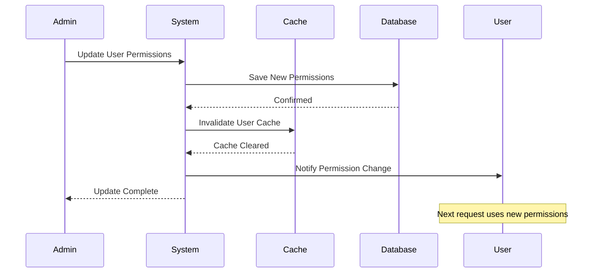

```javascript
// Dynamic permission updates
class PermissionManager {
  constructor(cache, db) {
    this.cache = cache;
    this.db = db;
  }
  
  async grantPermission(userId, permission) {
    await this.db.permissions.create({
      userId,
      permission,
      grantedAt: new Date(),
      grantedBy: getCurrentUser().id
    });
    
    // Invalidate cache
    this.cache.invalidate(userId);
    
    // Notify user
    await this.notifyUser(userId, 'permission_granted', permission);
    
    // Audit log
    await this.auditLog('GRANT', userId, permission);
  }
  
  async revokePermission(userId, permission) {
    await this.db.permissions.delete({
      userId,
      permission
    });
    
    this.cache.invalidate(userId);
    await this.notifyUser(userId, 'permission_revoked', permission);
    await this.auditLog('REVOKE', userId, permission);
  }
  
  async getEffectivePermissions(userId) {
    // Check cache first
    const cached = this.cache.get(`permissions:${userId}`);
    if (cached) return cached;
    
    // Get direct permissions
    const direct = await this.db.permissions.find({ userId });
    
    // Get role-based permissions
    const user = await this.db.users.findById(userId);
    const roleBased = await this.getRolePermissions(user.role);
    
    // Get group permissions
    const groups = await this.getUserGroups(userId);
    const groupBased = await this.getGroupPermissions(groups);
    
    // Combine all permissions
    const effective = [
      ...direct.map(p => p.permission),
      ...roleBased,
      ...groupBased
    ];
    
    const unique = [...new Set(effective)];
    
    // Cache result
    this.cache.set(`permissions:${userId}`, unique, 300);
    
    return unique;
  }
}
```

### Conditional Access Policies

```mermaid
flowchart TD
    A[Access Request] --> B{Device Compliance}
    B -->|Non-compliant| C[Block]
    B -->|Compliant| D{Location}
    
    D -->|Untrusted| E{Risk Assessment}
    D -->|Trusted| F{MFA Status}
    
    E -->|High Risk| C
    E -->|Medium Risk| G[Require MFA]
    E -->|Low Risk| F
    
    F -->|MFA Enabled| H[Grant Access]
    F -->|No MFA| G
    
    G --> I{MFA Success}
    I -->|Yes| H
    I -->|No| C
    
    style H fill:#90EE90
    style C fill:#FFB6C6
    style G fill:#FFD700
```

```javascript
// Conditional access implementation
class ConditionalAccessPolicy {
  async evaluate(context) {
    const conditions = [
      await this.checkDeviceCompliance(context),
      await this.checkLocationTrust(context),
      await this.checkUserRisk(context),
      await this.checkApplicationSensitivity(context)
    ];
    
    const riskLevel = this.calculateRisk(conditions);
    
    if (riskLevel === 'high') {
      return { action: 'block', reason: 'High risk detected' };
    }
    
    if (riskLevel === 'medium') {
      return { 
        action: 'require_mfa',
        reason: 'Additional verification required'
      };
    }
    
    return { action: 'allow' };
  }
  
  async checkDeviceCompliance(context) {
    const device = context.device;
    return {
      compliant: device.isManaged && 
                 device.hasEncryption && 
                 device.osVersion >= device.minOsVersion,
      score: device.complianceScore
    };
  }
  
  async checkLocationTrust(context) {
    const trustedLocations = await this.getTrustedLocations(context.user);
    const isTrusted = trustedLocations.some(loc => 
      this.matchesLocation(loc, context.location)
    );
    
    return {
      trusted: isTrusted,
      score: isTrusted ? 100 : 50
    };
  }
  
  async checkUserRisk(context) {
    const recentActivity = await this.getRecentActivity(context.user.id);
    const anomalies = this.detectAnomalies(recentActivity, context);
    
    return {
      riskScore: anomalies.score,
      factors: anomalies.factors
    };
  }
  
  calculateRisk(conditions) {
    const scores = conditions.map(c => c.score || 0);
    const avgScore = scores.reduce((a, b) => a + b, 0) / scores.length;
    
    if (avgScore < 40) return 'high';
    if (avgScore < 70) return 'medium';
    return 'low';
  }
}
```

### Delegation and Impersonation

```mermaid
sequenceDiagram
    participant A as Admin
    participant S as System
    participant D as Delegated User
    participant R as Resource
    
    A->>S: Request Impersonation
    S->>S: Validate Admin Permissions
    S->>S: Create Impersonation Token
    S->>S: Log Impersonation Start
    S-->>A: Impersonation Active
    
    A->>R: Access as Delegated User
    R->>S: Verify Token
    S->>S: Check Original User = Admin
    S->>S: Check Impersonated User Permissions
    S-->>R: Authorized
    R-->>A: Resource Access
    
    Note over S: All actions logged with both identities
    
    A->>S: End Impersonation
    S->>S: Invalidate Token
    S->>S: Log Impersonation End
```

```javascript
// Delegation implementation
class DelegationManager {
  async createDelegation(fromUserId, toUserId, permissions, expiresAt) {
    // Verify delegator has permission to delegate
    const fromUser = await this.db.users.findById(fromUserId);
    if (!this.canDelegate(fromUser, permissions)) {
      throw new Error('Cannot delegate permissions you do not have');
    }
    
    const delegation = await this.db.delegations.create({
      fromUserId,
      toUserId,
      permissions,
      expiresAt,
      createdAt: new Date(),
      active: true
    });
    
    await this.auditLog('DELEGATION_CREATED', { delegation });
    
    return delegation;
  }
  
  async checkDelegatedPermission(userId, permission) {
    const activeDelegations = await this.db.delegations.find({
      toUserId: userId,
      active: true,
      expiresAt: { $gt: new Date() }
    });
    
    for (const delegation of activeDelegations) {
      if (delegation.permissions.includes(permission)) {
        return {
          allowed: true,
          delegatedBy: delegation.fromUserId,
          expiresAt: delegation.expiresAt
        };
      }
    }
    
    return { allowed: false };
  }
  
  async impersonate(adminId, targetUserId) {
    // Only admins can impersonate
    const admin = await this.db.users.findById(adminId);
    if (!admin.permissions.includes('impersonate')) {
      throw new Error('Unauthorized impersonation attempt');
    }
    
    const token = this.generateImpersonationToken({
      originalUserId: adminId,
      impersonatedUserId: targetUserId,
      expiresAt: new Date(Date.now() + 3600000) // 1 hour
    });
    
    await this.auditLog('IMPERSONATION_START', {
      adminId,
      targetUserId,
      timestamp: new Date()
    });
    
    return token;
  }
  
  async validateImpersonation(token) {
    const decoded = this.verifyToken(token);
    
    if (decoded.expiresAt < new Date()) {
      throw new Error('Impersonation token expired');
    }
    
    return {
      originalUser: await this.db.users.findById(decoded.originalUserId),
      impersonatedUser: await this.db.users.findById(decoded.impersonatedUserId)
    };
  }
}
```

## Monitoring and Auditing

### Authorization Audit Trail

```mermaid
graph LR
    A[Authorization Event] --> B[Capture Details]
    B --> C[Who]
    B --> D[What]
    B --> E[When]
    B --> F[Where]
    B --> G[Result]
    
    C --> H[User ID<br/>Role<br/>IP]
    D --> I[Resource<br/>Action<br/>Permissions]
    E --> J[Timestamp<br/>Duration]
    F --> K[Location<br/>Device<br/>Context]
    G --> L[Allowed/Denied<br/>Reason]
    
    H --> M[Audit Log]
    I --> M
    J --> M
    K --> M
    L --> M
    
    M --> N[Analysis]
    M --> O[Compliance]
    M --> P[Security]
    
    style M fill:#FFD700
```

```javascript
// Comprehensive audit logging
class AuthorizationAuditor {
  async logAuthorizationAttempt(context, result) {
    const auditEntry = {
      timestamp: new Date(),
      
      // Who
      userId: context.user.id,
      userRole: context.user.role,
      userName: context.user.name,
      ipAddress: context.ipAddress,
      userAgent: context.userAgent,
      
      // What
      action: context.action,
      resourceType: context.resource.type,
      resourceId: context.resource.id,
      requiredPermissions: context.requiredPermissions,
      
      // Where
      location: context.location,
      deviceId: context.device?.id,
      
      // Result
      allowed: result.allowed,
      reason: result.reason,
      evaluationTimeMs: result.duration,
      
      // Additional context
      sessionId: context.sessionId,
      requestId: context.requestId,
      riskScore: result.riskScore
    };
    
    await this.db.auditLog.insert(auditEntry);
    
    // Real-time alerting for suspicious activity
    if (!result.allowed && this.isSuspicious(auditEntry)) {
      await this.sendSecurityAlert(auditEntry);
    }
  }
  
  isSuspicious(entry) {
    // Multiple failed attempts
    if (this.hasRepeatedFailures(entry.userId)) {
      return true;
    }
    
    // Privilege escalation attempt
    if (entry.action === 'admin' && entry.userRole !== 'admin') {
      return true;
    }
    
    // Unusual time or location
    if (this.isUnusualActivity(entry)) {
      return true;
    }
    
    return false;
  }
  
  async generateComplianceReport(startDate, endDate) {
    const logs = await this.db.auditLog.find({
      timestamp: { $gte: startDate, $lte: endDate }
    });
    
    return {
      totalAttempts: logs.length,
      successfulAccess: logs.filter(l => l.allowed).length,
      deniedAccess: logs.filter(l => !l.allowed).length,
      uniqueUsers: new Set(logs.map(l => l.userId)).size,
      topResources: this.getTopResources(logs),
      suspiciousActivity: logs.filter(l => this.isSuspicious(l)),
      privilegedAccess: logs.filter(l => 
        ['admin', 'delete', 'modify'].includes(l.action)
      )
    };
  }
}
```

## Common Vulnerabilities

### Authorization Bypass Techniques

```mermaid
graph TD
    A[Authorization Vulnerabilities] --> B[IDOR]
    A --> C[Path Traversal]
    A --> D[Missing Function Level]
    A --> E[Mass Assignment]
    
    B --> B1[Direct object reference<br/>without validation]
    C --> C1[Access parent/sibling<br/>resources]
    D --> D1[No permission check<br/>on endpoints]
    E --> E1[Update unauthorized<br/>fields]
    
    B1 --> F[Mitigation]
    C1 --> F
    D1 --> F
    E1 --> F
    
    F --> F1[Validate ownership]
    F --> F2[Indirect references]
    F --> F3[Centralized auth]
    F --> F4[Whitelist fields]
    
    style A fill:#FFB6C6
    style F fill:#90EE90
```

### Secure Code Examples

```javascript
// ❌ VULNERABLE: Insecure Direct Object Reference
app.get('/api/documents/:id', async (req, res) => {
  const doc = await Document.findById(req.params.id);
  res.json(doc); // No ownership check!
});

// ✅ SECURE: Validate ownership
app.get('/api/documents/:id', async (req, res) => {
  const doc = await Document.findById(req.params.id);
  
  if (!doc) {
    return res.status(404).json({ error: 'Not found' });
  }
  
  // Check ownership or permissions
  if (doc.ownerId !== req.user.id && !req.user.isAdmin) {
    return res.status(403).json({ error: 'Forbidden' });
  }
  
  res.json(doc);
});

// ❌ VULNERABLE: Missing function-level access control
app.delete('/api/users/:id', async (req, res) => {
  await User.deleteById(req.params.id);
  res.status(204).send();
});

// ✅ SECURE: Enforce role-based access
app.delete('/api/users/:id', 
  authorize('admin'),
  async (req, res) => {
    // Additional check: can't delete yourself
    if (req.params.id === req.user.id) {
      return res.status(400).json({ 
        error: 'Cannot delete your own account' 
      });
    }
    
    await User.deleteById(req.params.id);
    res.status(204).send();
  }
);

// ❌ VULNERABLE: Mass assignment
app.put('/api/profile', async (req, res) => {
  await User.update(req.user.id, req.body); // Can update role!
  res.json({ success: true });
});

// ✅ SECURE: Whitelist allowed fields
app.put('/api/profile', async (req, res) => {
  const allowedFields = ['name', 'email', 'bio', 'avatar'];
  const updates = {};
  
  for (const field of allowedFields) {
    if (req.body[field] !== undefined) {
      updates[field] = req.body[field];
    }
  }
  
  await User.update(req.user.id, updates);
  res.json({ success: true });
});
```

---

## Related Documentation

- [Authentication](./authentication.md) - Identity verification before authorization
- [Data Security](./data_security.md) - Protecting authorized data access
- [Monitoring & Auditing](./monitoring_auditing.md) - Tracking authorization events
- [Compliance](./compliance.md) - Meeting regulatory authorization requirements
- [Best Practices](./best_practises.md) - Overall security guidelines

---

## Key Takeaways

1. **Defense in Depth**: Implement multiple layers of authorization checks
2. **Least Privilege**: Grant minimum necessary permissions
3. **Explicit Deny**: Default to denying access unless explicitly allowed
4. **Centralize Logic**: Keep authorization logic in one place
5. **Audit Everything**: Log all authorization decisions
6. **Regular Reviews**: Periodically review and revoke unnecessary permissions
7. **Test Thoroughly**: Include authorization in security testing
8. **Monitor Continuously**: Watch for authorization bypass attempts

**Remember**: Authorization is not authentication. Always verify both who the user is AND what they're allowed to do!