# Security Best Practices

## Table of Contents

- [Overview](#overview)
- [Security by Design](#security-by-design)
- [Secure Development Lifecycle](#secure-development-lifecycle)
- [Code Security](#code-security)
- [Infrastructure Security](#infrastructure-security)
- [Data Protection](#data-protection)
- [Access Management](#access-management)
- [Incident Response](#incident-response)
- [Security Culture](#security-culture)
- [Compliance and Governance](#compliance-and-governance)

## Overview

Security best practices are proven methods and strategies that help organizations protect their systems, data, and users from threats. These practices form the foundation of a comprehensive security program and should be integrated into every aspect of system design and operation.

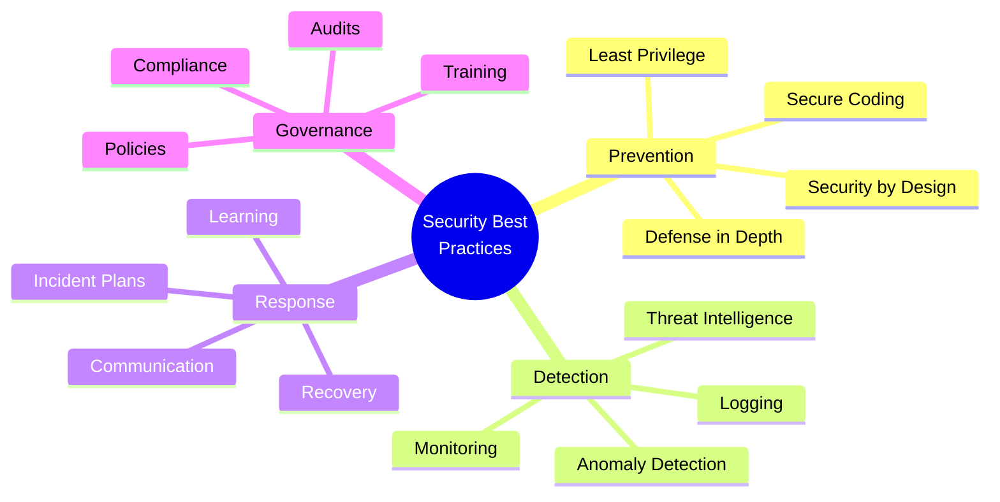

## Security by Design

### Core Principles

Security should be built into systems from the ground up, not added as an afterthought.

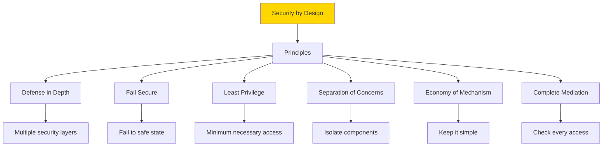

### Defense in Depth Strategy

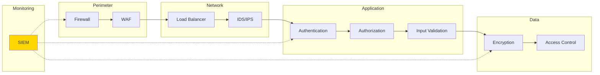

**Key Concept**: If one layer fails, other layers continue to provide protection. Never rely on a single security control.

### Principle of Least Privilege

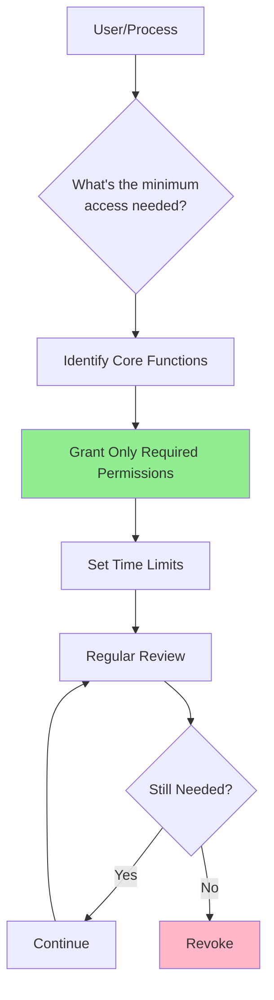

**Implementation**: Start with zero permissions and add only what's necessary.

```javascript
// Default deny approach
const permissions = {
  user: [],  // Start empty
  admin: ['read', 'write', 'delete']  // Explicit permissions
};

function hasPermission(user, action) {
  return permissions[user.role]?.includes(action) || false;
}
```

### Fail Secure Principle

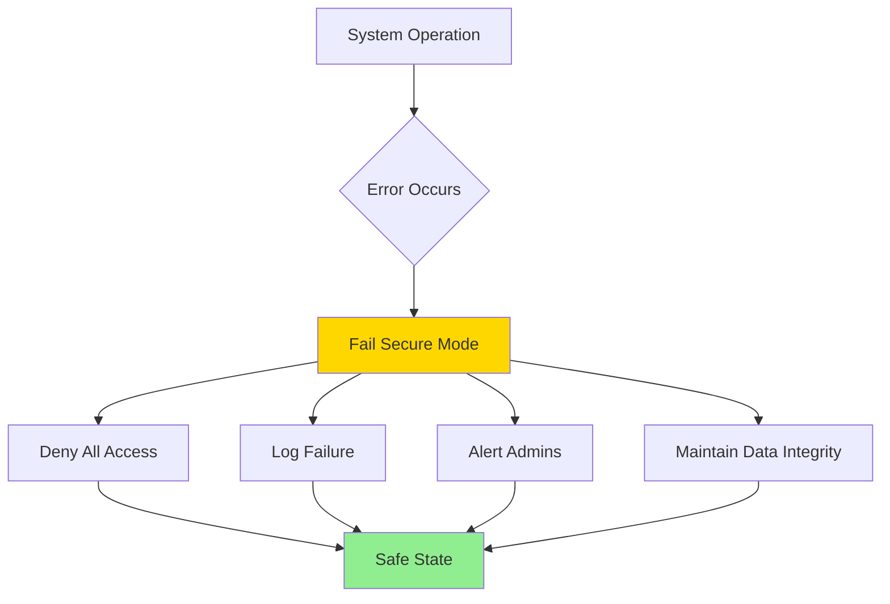

**Principle**: When something goes wrong, the system should fail in a secure state, not an open one.

```javascript
// Fail secure example
function validateAccess(user, resource) {
  try {
    const hasAccess = checkPermissions(user, resource);
    return hasAccess;
  } catch (error) {
    logger.error('Access validation failed', error);
    return false;  // Fail secure: deny access
  }
}
```

## Secure Development Lifecycle

### SDLC Security Integration

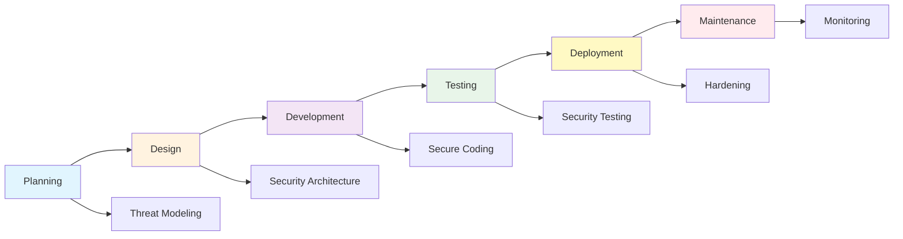

### Threat Modeling Process

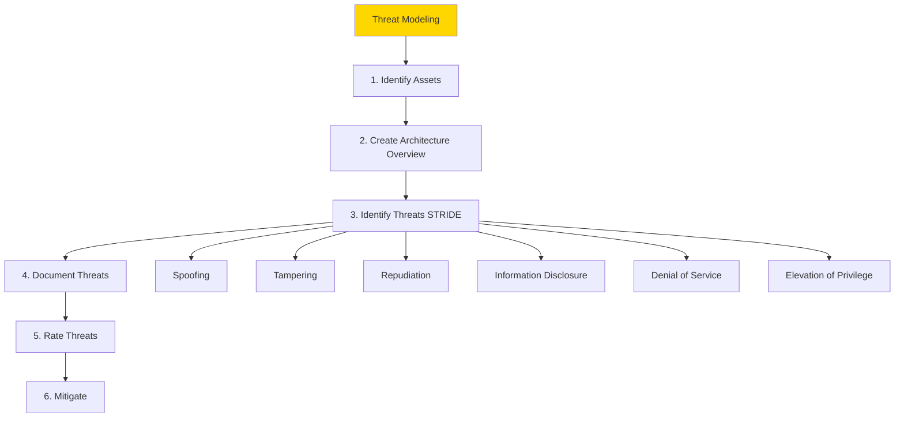

**STRIDE Framework**:
- **S**poofing: Pretending to be someone else
- **T**ampering: Modifying data or code
- **R**epudiation: Denying actions
- **I**nformation Disclosure: Exposing protected data
- **D**enial of Service: Making system unavailable
- **E**levation of Privilege: Gaining unauthorized access

### Security Gates in CI/CD

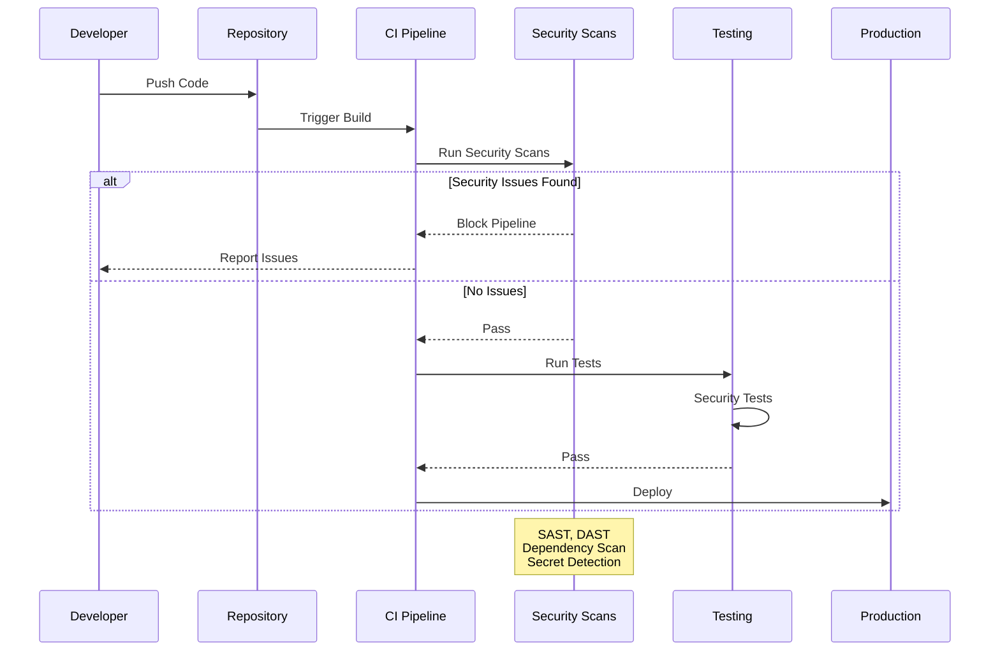

**Automated Security Checks**:
1. **SAST** (Static Analysis): Scan code for vulnerabilities
2. **DAST** (Dynamic Analysis): Test running application
3. **Dependency Scanning**: Check third-party libraries
4. **Secret Detection**: Find exposed credentials
5. **Container Scanning**: Check image vulnerabilities

## Code Security

### Secure Coding Principles

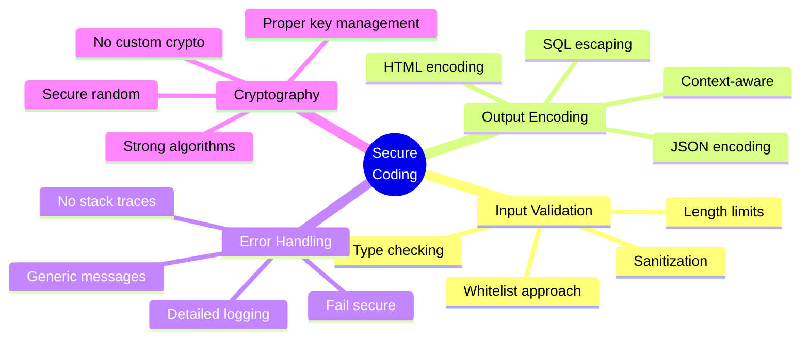

### Input Validation

**Principle**: Never trust user input. Validate everything.

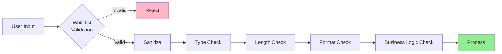

```javascript
// Input validation example
function validateUserInput(input) {
  // Whitelist allowed characters
  if (!/^[a-zA-Z0-9\s-]+$/.test(input)) {
    throw new Error('Invalid characters');
  }
  
  // Length check
  if (input.length > 255) {
    throw new Error('Input too long');
  }
  
  // Sanitize
  return input.trim();
}

// SQL injection prevention
const query = 'SELECT * FROM users WHERE id = ?';
db.execute(query, [userId]);  // Use parameterized queries
```

### Common Vulnerabilities (OWASP Top 10)

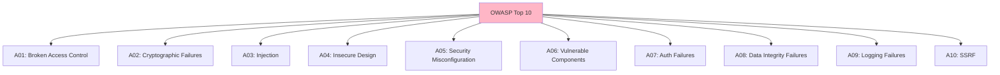

**Prevention Strategies**:

```javascript
// XSS Prevention
function escapeHtml(unsafe) {
  return unsafe
    .replace(/&/g, "&amp;")
    .replace(/</g, "&lt;")
    .replace(/>/g, "&gt;")
    .replace(/"/g, "&quot;")
    .replace(/'/g, "&#039;");
}

// CSRF Prevention
app.use(csrf());  // CSRF token middleware

// Command Injection Prevention
const { execFile } = require('child_process');
execFile('ls', ['-la', userInput]);  // Avoid shell=true
```

### Sensitive Data Handling

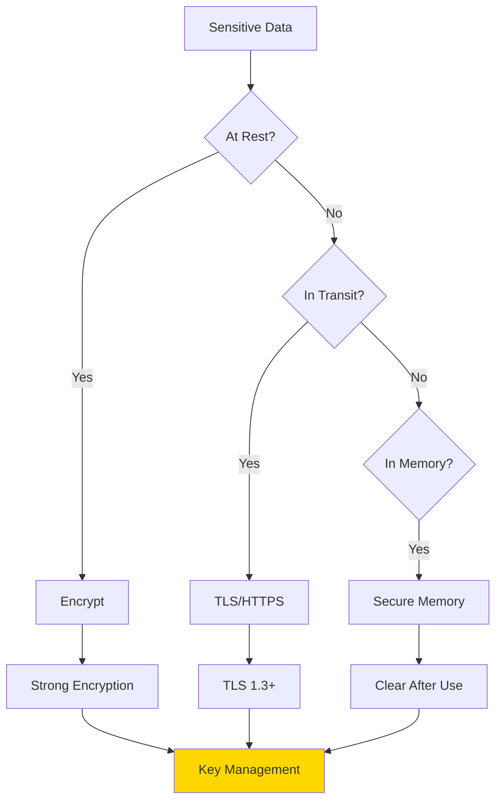

**Best Practices**:
- Never log sensitive data (passwords, tokens, credit cards)
- Encrypt data at rest and in transit
- Use secure key management systems
- Clear sensitive data from memory after use
- Implement data classification policies

```javascript
// Secure password handling
const bcrypt = require('bcrypt');

async function hashPassword(password) {
  return await bcrypt.hash(password, 12);  // High cost factor
}

// Don't log sensitive data
logger.info('User login', { 
  userId: user.id,
  // password: user.password  ❌ NEVER
});
```

## Infrastructure Security

### Network Segmentation

```mermaid
graph TB
    subgraph "DMZ"
        A[Load Balancer]
        B[Web Servers]
    end
    
    subgraph "Application Tier"
        C[App Servers]
        D[API Gateway]
    end
    
    subgraph "Data Tier"
        E[(Database)]
        F[(Cache)]
    end
    
    subgraph "Management"
        G[Monitoring]
        H[Logging]
    end
    
    Internet --> A
    A --> B
    B --> D
    D --> C
    C --> E
    C --> F
    
    G -.-> B
    G -.-> C
    H -.-> B
    H -.-> C
    H -.-> E
    
    style DMZ fill:#FFE0B2
    style "Application Tier" fill:#C8E6C9
    style "Data Tier" fill:#FFCDD2
```

**Key Principles**:
- Separate public-facing and internal systems
- Use firewalls between segments
- Implement least privilege network access
- Monitor traffic between segments
- Use VLANs and network ACLs

### Hardening Checklist

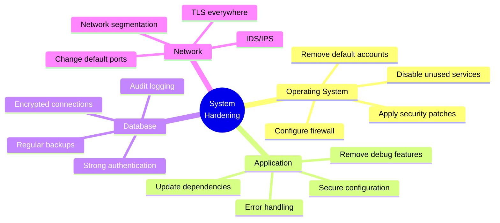

### Patch Management

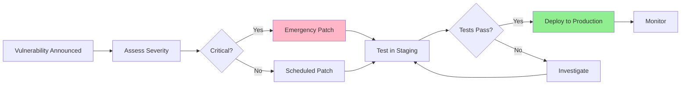

**Patch Management Strategy**:
1. Maintain inventory of all systems
2. Subscribe to security advisories
3. Assess vulnerability severity (CVSS scores)
4. Test patches in non-production environment
5. Schedule maintenance windows
6. Document and communicate changes
7. Monitor for issues post-deployment

## Data Protection

### Data Classification

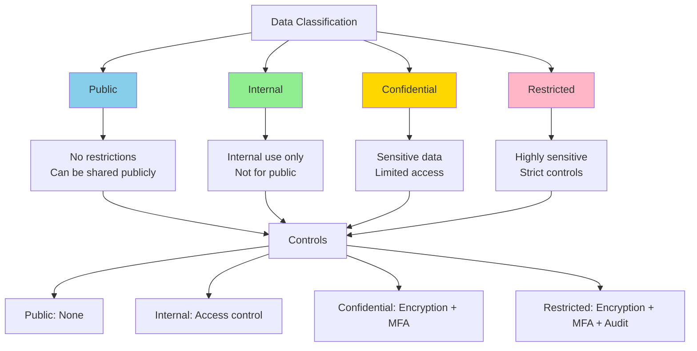

### Data Lifecycle Security

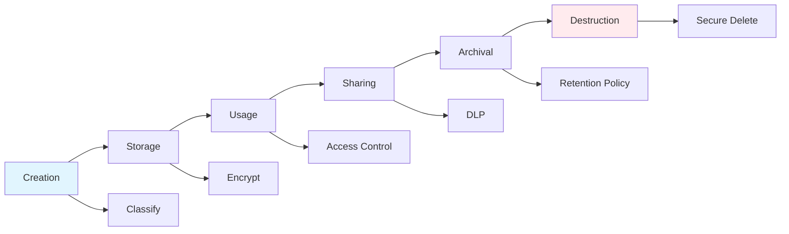

**Key Practices**:
- **Creation**: Classify data immediately
- **Storage**: Encrypt sensitive data, implement access controls
- **Usage**: Monitor access, audit logs
- **Sharing**: Use DLP, encrypt in transit, need-to-know basis
- **Archival**: Long-term encryption, immutable storage
- **Destruction**: Secure deletion, verify removal, audit trail

### Backup Strategy (3-2-1 Rule)

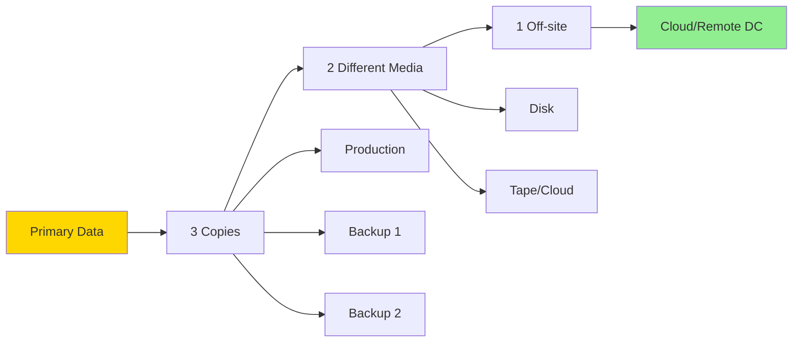

```javascript
// Backup verification
async function verifyBackup(backup) {
  // Test restore process
  const restored = await restoreFromBackup(backup);
  
  // Verify data integrity
  const checksum = calculateChecksum(restored);
  assert(checksum === backup.checksum);
  
  // Test key data access
  await validateDataAccess(restored);
  
  return { success: true, verifiedAt: new Date() };
}
```

## Access Management

### Identity Lifecycle

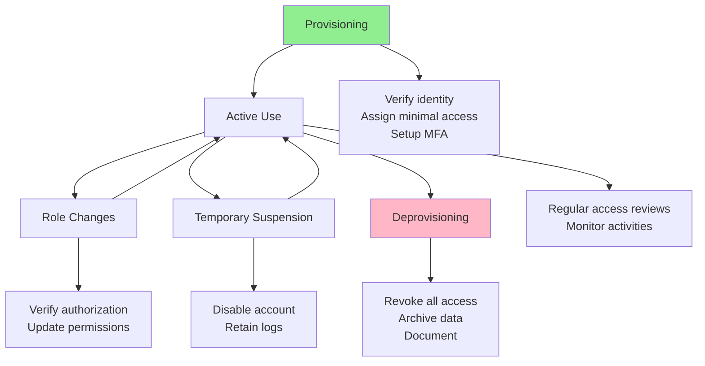

### Access Review Process

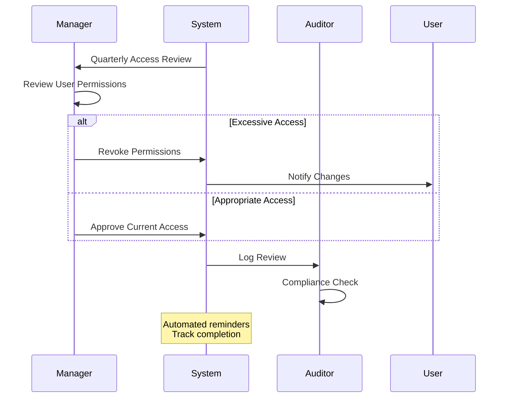

**Review Frequency**:
- **High-privilege accounts**: Monthly
- **Regular users**: Quarterly
- **Service accounts**: Bi-annually
- **Admin accounts**: After each use

### Privileged Access Management

```mermaid
graph TD
    A[Privileged Access Request] --> B[Justification Required]
    B --> C[Manager Approval]
    C --> D[Just-in-Time Access]
    D --> E[Time-Limited]
    E --> F[Session Recording]
    F --> G[Audit Trail]
    G --> H[Automatic Revocation]
    
    style D fill:#FFD700
    style F fill:#87CEEB
```

**Best Practices**:
- Use separate admin accounts (never daily-use accounts)
- Implement just-in-time privileged access
- Record and monitor all privileged sessions
- Require MFA for privileged access
- Regular rotation of privileged credentials
- Break-glass procedures for emergencies

## Incident Response

### Incident Response Lifecycle

```mermaid
graph LR
    A[Preparation] --> B[Detection]
    B --> C[Analysis]
    C --> D[Containment]
    D --> E[Eradication]
    E --> F[Recovery]
    F --> G[Lessons Learned]
    G --> A
    
    style A fill:#E1F5FE
    style D fill:#FFD700
    style G fill:#C8E6C9
```

### Incident Response Plan

```mermaid
flowchart TD
    A[Incident Detected] --> B{Severity?}
    B -->|Critical| C[Immediate Response]
    B -->|High| D[Urgent Response]
    B -->|Medium| E[Standard Response]
    B -->|Low| F[Monitored Response]
    
    C --> G[Activate IR Team]
    D --> G
    E --> H[Assign to Security Team]
    F --> I[Document & Track]
    
    G --> J[Contain Threat]
    H --> J
    
    J --> K[Investigate]
    K --> L[Eradicate]
    L --> M[Recover]
    M --> N[Post-Incident Review]
    
    style C fill:#FFB6C6
    style N fill:#90EE90
```

### Incident Severity Classification

```mermaid
quadrantChart
    title Incident Severity Matrix
    x-axis Low Impact --> High Impact
    y-axis Low Likelihood --> High Likelihood
    quadrant-1 Critical
    quadrant-2 High
    quadrant-3 Low
    quadrant-4 Medium
```

**Response Times**:
- **Critical** (P1): Immediate (< 15 minutes)
- **High** (P2): < 1 hour
- **Medium** (P3): < 4 hours
- **Low** (P4): < 24 hours

### Communication Plan

```mermaid
sequenceDiagram
    participant IR as IR Team
    participant M as Management
    participant L as Legal
    participant PR as Public Relations
    participant U as Users
    participant A as Authorities
    
    IR->>M: Incident Notification
    M->>L: Assess Legal Implications
    L->>M: Guidance
    
    alt Data Breach
        M->>A: Regulatory Notification
        M->>PR: Prepare Statement
        PR->>U: User Notification
    else Internal Only
        M->>U: Internal Communication
    end
    
    Note over IR,U: Clear, timely,<br/>accurate communication
```

## Security Culture

### Security Awareness Training

```mermaid
mindmap
  root((Security<br/>Training))
    Topics
      Password Security
      Phishing Recognition
      Data Handling
      Social Engineering
      Physical Security
      Incident Reporting
    Methods
      Onboarding
      Annual Refresher
      Simulated Attacks
      Lunch & Learns
      Security Champions
    Metrics
      Completion Rate
      Test Scores
      Phishing Click Rate
      Incident Reports
```

### Building Security Culture

```mermaid
graph TD
    A[Security Culture] --> B[Leadership Commitment]
    A --> C[Clear Policies]
    A --> D[Training & Awareness]
    A --> E[Positive Reinforcement]
    A --> F[Continuous Improvement]
    
    B --> B1[Security as priority<br/>Budget allocation<br/>Lead by example]
    C --> C1[Written policies<br/>Easy to understand<br/>Regularly updated]
    D --> D1[Regular training<br/>Multiple formats<br/>Role-specific]
    E --> E1[Reward good behavior<br/>No blame culture<br/>Celebrate wins]
    F --> F1[Learn from incidents<br/>Measure progress<br/>Adapt practices]
    
    style A fill:#FFD700
```

### Security Champions Program

```mermaid
flowchart LR
    A[Security Team] --> B[Identify Champions]
    B --> C[Train Champions]
    C --> D[Champions Embed in Teams]
    D --> E[Promote Best Practices]
    E --> F[Report Issues]
    F --> G[Continuous Learning]
    G --> C
    
    D --> D1[Development Teams]
    D --> D2[Operations Teams]
    D --> D3[Business Units]
    
    style B fill:#FFD700
```

**Benefits**:
- Decentralized security knowledge
- Faster issue identification
- Better security adoption
- Bridge between security and development teams

## Compliance and Governance

### Compliance Frameworks

```mermaid
graph TB
    A[Compliance Requirements] --> B[Industry Specific]
    A --> C[Regional]
    A --> D[International]
    
    B --> B1[PCI-DSS: Payment Cards]
    B --> B2[HIPAA: Healthcare]
    B --> B3[SOC 2: Service Organizations]
    
    C --> C1[GDPR: Europe]
    C --> C2[CCPA: California]
    C --> C3[LGPD: Brazil]
    
    D --> D1[ISO 27001]
    D --> D2[NIST Framework]
    D --> D3[CIS Controls]
    
    style B1 fill:#FFE0B2
    style C1 fill:#C8E6C9
    style D1 fill:#FFCDD2
```

### Governance Structure

```mermaid
graph TD
    A[Board of Directors] --> B[Executive Management]
    B --> C[CISO]
    C --> D[Security Governance Council]
    
    D --> E[Policy Development]
    D --> F[Risk Management]
    D --> G[Compliance]
    D --> H[Architecture Review]
    
    E --> I[Security Policies]
    F --> J[Risk Assessments]
    G --> K[Audit Programs]
    H --> L[Security Standards]
    
    style C fill:#FFD700
```

### Policy Hierarchy

```mermaid
graph TD
    A[Policies] --> B[Standards]
    B --> C[Procedures]
    C --> D[Guidelines]
    
    A --> A1["High-level requirements<br/>(Why)"]
    B --> B1["Mandatory specifications<br/>(What)"]
    C --> C1["Step-by-step instructions<br/>(How)"]
    D --> D1["Recommendations<br/>(Suggestions)"]
    
    style A fill:#FFB6C6
    style B fill:#FFD700
    style C fill:#90EE90
    style D fill:#87CEEB
```

### Audit and Assessment

```mermaid
flowchart LR
    A[Security Assessment] --> B[Internal Audit]
    A --> C[External Audit]
    A --> D[Penetration Testing]
    A --> E[Vulnerability Scanning]
    
    B --> F[Findings]
    C --> F
    D --> F
    E --> F
    
    F --> G[Remediation Plan]
    G --> H[Implementation]
    H --> I[Verification]
    I --> J[Documentation]
    
    style F fill:#FFD700
    style I fill:#90EE90
```

**Assessment Types**:
1. **Internal Audits**: Regular self-assessments
2. **External Audits**: Independent third-party reviews
3. **Penetration Testing**: Simulated attacks to find vulnerabilities
4. **Vulnerability Scanning**: Automated security scans
5. **Red Team Exercises**: Comprehensive adversarial testing

### Continuous Compliance

```mermaid
sequenceDiagram
    participant S as System
    participant M as Monitoring
    participant C as Compliance Tool
    participant A as Auditor
    
    loop Continuous Monitoring
        S->>M: Security Events
        M->>C: Compliance Data
        C->>C: Automated Checks
        
        alt Non-Compliant
            C->>A: Alert
            A->>S: Remediate
        else Compliant
            C->>C: Document
        end
    end
    
    Note over C: Real-time compliance<br/>vs. point-in-time audits
```

## Security Metrics and KPIs

### Key Security Metrics

```mermaid
mindmap
  root((Security<br/>Metrics))
    Preventive
      Patch compliance rate
      MFA adoption
      Security training completion
      Vulnerability remediation time
    Detective
      Mean time to detect MTTD
      Incidents detected
      False positive rate
      Coverage percentage
    Responsive
      Mean time to respond MTTR
      Incident resolution time
      Recovery time
      Lessons learned implemented
    Governance
      Policy compliance
      Audit findings
      Risk assessment coverage
      Budget utilization
```

### Measuring Security Posture

```mermaid
graph LR
    A[Security Posture] --> B[Technical Metrics]
    A --> C[Process Metrics]
    A --> D[People Metrics]
    
    B --> B1[Vulnerability count<br/>Patch level<br/>System hardening]
    C --> C1[Incident response time<br/>Change management<br/>Access reviews]
    D --> D1[Training completion<br/>Awareness scores<br/>Phishing click rate]
    
    B1 --> E[Dashboard]
    C1 --> E
    D1 --> E
    
    style E fill:#FFD700
```

### Trend Analysis

```javascript
// Track security metrics over time
const securityMetrics = {
  vulnerabilities: {
    critical: 2,
    high: 15,
    medium: 45,
    low: 120
  },
  incidents: {
    total: 12,
    resolved: 10,
    avgResolutionTime: '4.5 hours'
  },
  compliance: {
    patchCompliance: 95,
    mfaAdoption: 88,
    trainingCompletion: 92
  }
};

// Calculate trends
function calculateTrend(current, previous) {
  const change = ((current - previous) / previous) * 100;
  return {
    direction: change > 0 ? 'increasing' : 'decreasing',
    percentage: Math.abs(change).toFixed(2)
  };
}
```

## Implementation Roadmap

### Security Maturity Model

```mermaid
graph LR
    A[Level 1: Initial] --> B[Level 2: Managed]
    B --> C[Level 3: Defined]
    C --> D[Level 4: Quantitatively Managed]
    D --> E[Level 5: Optimizing]
    
    A --> A1[Ad-hoc<br/>Reactive<br/>Unpredictable]
    B --> B1[Repeatable<br/>Basic controls<br/>Some documentation]
    C --> C1[Documented<br/>Standardized<br/>Proactive]
    D --> D1[Measured<br/>Controlled<br/>Predictable]
    E --> E1[Continuous improvement<br/>Automated<br/>Optimized]
    
    style A fill:#FFB6C6
    style E fill:#90EE90
```

### 90-Day Security Plan

```mermaid
gantt
    title Security Implementation Roadmap
    dateFormat  YYYY-MM-DD
    section Phase 1 (0-30 days)
    Asset Inventory           :2024-01-01, 7d
    Risk Assessment          :7d
    Security Policies        :7d
    Quick Wins              :9d
    
    section Phase 2 (31-60 days)
    MFA Implementation       :2024-01-31, 14d
    Logging & Monitoring     :14d
    Security Training        :14d
    Vulnerability Scanning   :14d
    
    section Phase 3 (61-90 days)
    Incident Response Plan   :2024-03-01, 10d
    Access Reviews          :10d
    Penetration Testing     :10d
    Documentation           :10d
```

### Priority Matrix

```mermaid
quadrantChart
    title Security Initiative Prioritization
    x-axis Low Effort --> High Effort
    y-axis Low Impact --> High Impact
    quadrant-1 Strategic Projects
    quadrant-2 Quick Wins
    quadrant-3 Fill-ins
    quadrant-4 Time Sinks
    
    MFA Implementation: [0.6, 0.9]
    Security Training: [0.4, 0.7]
    Vulnerability Scanning: [0.3, 0.8]
    Logging Setup: [0.5, 0.85]
    Password Policy: [0.2, 0.6]
    Penetration Testing: [0.8, 0.85]
    Documentation: [0.4, 0.5]
```

**Focus Areas**:
- **Quick Wins** (Low effort, High impact): Implement first
- **Strategic Projects** (High effort, High impact): Plan and resource properly
- **Fill-ins** (Low effort, Low impact): Do when time permits
- **Time Sinks** (High effort, Low impact): Avoid or deprioritize

## DevSecOps Integration

### Shift-Left Security

```mermaid
graph LR
    A[Traditional:<br/>Test at End] --> B[Shift Left:<br/>Security Early]
    
    B --> C[Requirements]
    C --> D[Design]
    D --> E[Development]
    E --> F[Testing]
    F --> G[Deployment]
    G --> H[Operations]
    
    C --> C1[Threat Modeling]
    D --> D1[Security Architecture]
    E --> E1[Secure Coding<br/>SAST]
    F --> F1[Security Testing<br/>DAST]
    G --> G1[Security Scanning]
    H --> H1[Monitoring]
    
    style B fill:#FFD700
```

**Benefits of Shift-Left**:
- Find issues earlier (cheaper to fix)
- Reduce security debt
- Build security into culture
- Faster time to market
- Better collaboration

### CI/CD Security Pipeline

```mermaid
flowchart TD
    A[Code Commit] --> B[Pre-commit Hooks]
    B --> C[Build]
    C --> D[SAST]
    D --> E[Unit Tests]
    E --> F[Dependency Scan]
    F --> G[Container Scan]
    G --> H[Deploy to Staging]
    H --> I[DAST]
    I --> J[Integration Tests]
    J --> K{Security Gates<br/>Passed?}
    K -->|Yes| L[Deploy to Production]
    K -->|No| M[Block & Notify]
    M --> N[Fix Issues]
    N --> A
    
    style K fill:#FFD700
    style L fill:#90EE90
    style M fill:#FFB6C6
```

```javascript
// Example: Pre-commit hook for secret detection
const { execSync } = require('child_process');

function preCommitSecurityCheck() {
  try {
    // Check for secrets
    execSync('git-secrets --scan');
    
    // Check for sensitive files
    const staged = execSync('git diff --cached --name-only').toString();
    const sensitivePatterns = ['.env', 'secrets', 'credentials'];
    
    for (const pattern of sensitivePatterns) {
      if (staged.includes(pattern)) {
        console.error(`Blocked: Attempting to commit sensitive file`);
        process.exit(1);
      }
    }
    
    console.log('✓ Security checks passed');
  } catch (error) {
    console.error('✗ Security check failed');
    process.exit(1);
  }
}
```

### Security as Code

```mermaid
graph TD
    A[Security as Code] --> B[Infrastructure as Code]
    A --> C[Configuration as Code]
    A --> D[Policy as Code]
    
    B --> B1[Terraform<br/>CloudFormation<br/>Ansible]
    C --> C1[Version controlled<br/>Peer reviewed<br/>Automated deployment]
    D --> D1[OPA<br/>Sentinel<br/>Cloud Custodian]
    
    B1 --> E[Benefits]
    C1 --> E
    D1 --> E
    
    E --> E1[Consistency]
    E --> E2[Auditability]
    E --> E3[Repeatability]
    E --> E4[Testability]
    
    style A fill:#FFD700
```

```javascript
// Example: Policy as Code (Open Policy Agent)
// policy.rego
package kubernetes.admission

deny[msg] {
  input.request.kind.kind == "Pod"
  container := input.request.object.spec.containers[_]
  not container.securityContext.readOnlyRootFilesystem
  msg := sprintf("Container %v must have readOnlyRootFilesystem", [container.name])
}

deny[msg] {
  input.request.kind.kind == "Pod"
  container := input.request.object.spec.containers[_]
  container.securityContext.privileged
  msg := sprintf("Container %v cannot run in privileged mode", [container.name])
}
```

## Third-Party Security

### Vendor Risk Management

```mermaid
flowchart LR
    A[Vendor Assessment] --> B[Initial Evaluation]
    B --> C[Security Questionnaire]
    C --> D[Risk Rating]
    D --> E{Risk Level}
    
    E -->|High| F[Detailed Audit]
    E -->|Medium| G[Standard Review]
    E -->|Low| H[Basic Check]
    
    F --> I[Contract Terms]
    G --> I
    H --> I
    
    I --> J[Ongoing Monitoring]
    J --> K[Annual Review]
    K --> A
    
    style D fill:#FFD700
```

**Vendor Security Checklist**:
- Security certifications (SOC 2, ISO 27001)
- Data handling practices
- Incident response capabilities
- Business continuity plans
- Compliance with regulations
- Insurance coverage
- Right to audit
- Data portability and deletion

### Supply Chain Security

```mermaid
graph TD
    A[Supply Chain Security] --> B[Software Dependencies]
    A --> C[Third-Party Services]
    A --> D[Hardware Vendors]
    
    B --> B1[Dependency scanning]
    B --> B2[License compliance]
    B --> B3[Known vulnerabilities]
    B --> B4[Update frequency]
    
    C --> C1[API security]
    C --> C2[Data sharing]
    C --> C3[Access controls]
    C --> C4[SLA monitoring]
    
    D --> D1[Supply chain integrity]
    D --> D2[Secure boot]
    D --> D3[Firmware updates]
    D --> D4[Physical security]
    
    style A fill:#FFB6C6
```

```javascript
// Dependency vulnerability scanning
const { audit } = require('npm-audit-ci');

async function checkDependencies() {
  const result = await audit({
    'audit-level': 'moderate',
    'json': true
  });
  
  if (result.vulnerabilities) {
    console.error('Found vulnerabilities:', result.vulnerabilities);
    process.exit(1);
  }
  
  console.log('Dependencies are secure');
}
```

### API Security

```mermaid
mindmap
  root((API Security))
    Authentication
      API Keys
      OAuth 2.0
      JWT Tokens
      Mutual TLS
    Authorization
      Scope-based
      Rate limiting
      IP whitelisting
      Request signing
    Data Protection
      TLS encryption
      Input validation
      Output encoding
      Data minimization
    Monitoring
      Request logging
      Anomaly detection
      Rate limit tracking
      Error monitoring
```

```javascript
// API security middleware
function secureApiMiddleware(req, res, next) {
  // Rate limiting
  const limit = rateLimit({
    windowMs: 15 * 60 * 1000,
    max: 100
  });
  
  // API key validation
  const apiKey = req.headers['x-api-key'];
  if (!isValidApiKey(apiKey)) {
    return res.status(401).json({ error: 'Invalid API key' });
  }
  
  // Request size limit
  if (req.headers['content-length'] > 1048576) { // 1MB
    return res.status(413).json({ error: 'Payload too large' });
  }
  
  // CORS protection
  res.setHeader('Access-Control-Allow-Origin', allowedOrigins);
  
  next();
}
```

## Cloud Security

### Shared Responsibility Model

```mermaid
graph TB
    subgraph "Customer Responsibility"
        A[Data]
        B[Identity & Access]
        C[Application]
        D[Operating System]
    end
    
    subgraph "Shared"
        E[Network Controls]
        F[Configuration]
    end
    
    subgraph "Provider Responsibility"
        G[Physical Security]
        H[Infrastructure]
        I[Virtualization]
        J[Hardware]
    end
    
    style "Customer Responsibility" fill:#FFE0B2
    style "Shared" fill:#FFD700
    style "Provider Responsibility" fill:#C8E6C9
```

**Key Principle**: You are always responsible for:
- Your data
- Access management
- Application security
- Configuration

### Cloud Security Best Practices

```mermaid
mindmap
  root((Cloud<br/>Security))
    Identity
      IAM policies
      MFA enforcement
      Service accounts
      Least privilege
    Data
      Encryption at rest
      Encryption in transit
      Key management
      Data classification
    Network
      VPC configuration
      Security groups
      Network ACLs
      Private endpoints
    Monitoring
      CloudTrail logs
      Flow logs
      Config changes
      Threat detection
    Compliance
      Compliance reports
      Audit logging
      Retention policies
      Data residency
```

### Container Security

```mermaid
flowchart TD
    A[Container Security] --> B[Image Security]
    A --> C[Runtime Security]
    A --> D[Orchestration Security]
    
    B --> B1[Scan for vulnerabilities]
    B --> B2[Sign images]
    B --> B3[Use minimal base images]
    B --> B4[Regular updates]
    
    C --> C1[Run as non-root]
    C --> C2[Read-only filesystem]
    C --> C3[Resource limits]
    C --> C4[Security contexts]
    
    D --> D1[RBAC policies]
    D --> D2[Network policies]
    D --> D3[Pod security policies]
    D --> D4[Secrets management]
    
    style A fill:#FFD700
```

```javascript
// Dockerfile security best practices
/*
# Use specific version (not latest)
FROM node:18.17-alpine

# Run as non-root user
RUN addgroup -g 1001 -S nodejs
RUN adduser -S nodejs -u 1001
USER nodejs

# Copy only necessary files
COPY --chown=nodejs:nodejs package*.json ./
RUN npm ci --only=production

# Read-only root filesystem
VOLUME ["/app/data"]
WORKDIR /app
COPY --chown=nodejs:nodejs . .

# Health check
HEALTHCHECK --interval=30s --timeout=3s \
  CMD node healthcheck.js || exit 1

CMD ["node", "server.js"]
*/

// Security scanning in CI/CD
const { execSync } = require('child_process');

function scanContainer(imageName) {
  try {
    execSync(`trivy image --severity HIGH,CRITICAL ${imageName}`);
    console.log('Container scan passed');
  } catch (error) {
    console.error('Container has vulnerabilities');
    process.exit(1);
  }
}
```

## Privacy by Design

### Privacy Principles

```mermaid
graph TD
    A[Privacy by Design] --> B[Proactive not Reactive]
    A --> C[Privacy as Default]
    A --> D[Privacy Embedded]
    A --> E[Full Functionality]
    A --> F[End-to-End Security]
    A --> G[Visibility & Transparency]
    A --> H[User-Centric]
    
    B --> B1[Prevent privacy issues<br/>before they occur]
    C --> C1[No action required<br/>to protect privacy]
    D --> D1[Privacy in architecture<br/>and operations]
    E --> E1[No trade-offs between<br/>privacy and functionality]
    F --> F1[Secure throughout<br/>lifecycle]
    G --> G1[Open and transparent<br/>operations]
    H --> H1[Users maintain control<br/>of their data]
    
    style A fill:#FFD700
```

### Data Minimization

```mermaid
flowchart LR
    A[Data Collection] --> B{Is it necessary?}
    B -->|No| C[Don't Collect]
    B -->|Yes| D{Can we pseudonymize?}
    D -->|Yes| E[Pseudonymize]
    D -->|No| F{Can we anonymize?}
    F -->|Yes| G[Anonymize]
    F -->|No| H[Justify & Document]
    
    E --> I[Store Securely]
    G --> I
    H --> I
    
    I --> J[Regular Review]
    J --> K{Still needed?}
    K -->|No| L[Delete]
    K -->|Yes| J
    
    style C fill:#90EE90
    style L fill:#90EE90
```

**Principles**:
- Collect only what you need
- Keep only as long as necessary
- Delete when purpose fulfilled
- Provide user access and deletion
- Document data flows

### Privacy-Enhancing Technologies

```mermaid
graph LR
    A[PETs] --> B[Encryption]
    A --> C[Anonymization]
    A --> D[Pseudonymization]
    A --> E[Differential Privacy]
    
    B --> B1[End-to-end encryption<br/>Homomorphic encryption]
    C --> C1[Remove identifying info<br/>Data aggregation]
    D --> D1[Replace direct identifiers<br/>Maintain reversibility]
    E --> E1[Add statistical noise<br/>Protect individuals]
    
    style A fill:#FFD700
```

```javascript
// Example: Data anonymization
function anonymizeData(userData) {
  return {
    // Hash email (one-way)
    emailHash: crypto.createHash('sha256').update(userData.email).digest('hex'),
    
    // Generalize age to range
    ageRange: getAgeRange(userData.age),
    
    // Generalize location to region
    region: getRegion(userData.zipCode),
    
    // Remove direct identifiers
    // name: REMOVED
    // address: REMOVED
    // phone: REMOVED
    
    // Keep necessary data
    preferences: userData.preferences
  };
}

function getAgeRange(age) {
  if (age < 18) return '0-17';
  if (age < 30) return '18-29';
  if (age < 50) return '30-49';
  return '50+';
}
```

## Mobile Security

### Mobile Security Principles

```mermaid
mindmap
  root((Mobile<br/>Security))
    Data Protection
      Local encryption
      Secure storage
      Data-at-rest
      Secure deletion
    Communication
      Certificate pinning
      TLS 1.3
      API security
      Man-in-the-middle prevention
    Authentication
      Biometric auth
      Secure token storage
      Session management
      Device binding
    Application
      Code obfuscation
      Root/jailbreak detection
      Runtime protection
      Secure updates
```

### Secure Mobile Development

```mermaid
flowchart TD
    A[Mobile App Security] --> B[Secure Storage]
    A --> C[Network Security]
    A --> D[Authentication]
    A --> E[Code Protection]
    
    B --> B1[Use Keychain/Keystore]
    B --> B2[Encrypt sensitive data]
    B --> B3[No hardcoded secrets]
    
    C --> C1[Certificate pinning]
    C --> C2[TLS enforcement]
    C --> C3[Validate certificates]
    
    D --> D1[Secure token storage]
    D --> D2[Biometric auth]
    D --> D3[Session timeout]
    
    E --> E1[Code obfuscation]
    E --> E2[Anti-tampering]
    E --> E3[Secure updates]
    
    style A fill:#FFD700
```

```javascript
// Mobile security example (React Native)
import { SecureStore } from 'expo-secure-store';
import * as LocalAuthentication from 'expo-local-authentication';

// Secure token storage
async function storeToken(token) {
  await SecureStore.setItemAsync('userToken', token, {
    keychainAccessible: SecureStore.WHEN_UNLOCKED
  });
}

// Biometric authentication
async function authenticateWithBiometric() {
  const hasHardware = await LocalAuthentication.hasHardwareAsync();
  const isEnrolled = await LocalAuthentication.isEnrolledAsync();
  
  if (hasHardware && isEnrolled) {
    const result = await LocalAuthentication.authenticateAsync({
      promptMessage: 'Authenticate to access app',
      fallbackLabel: 'Use passcode'
    });
    return result.success;
  }
  return false;
}

// Certificate pinning
const axios = require('axios');
const https = require('https');

const agent = new https.Agent({
  rejectUnauthorized: true,
  checkServerIdentity: (host, cert) => {
    const expectedFingerprint = 'AA:BB:CC...';
    if (cert.fingerprint !== expectedFingerprint) {
      throw new Error('Certificate pinning failed');
    }
  }
});

axios.get('https://api.example.com', { httpsAgent: agent });
```

## Emerging Security Challenges

### Zero-Day Threat Management

```mermaid
flowchart LR
    A[Zero-Day Discovered] --> B[Assess Impact]
    B --> C{Affects Us?}
    C -->|Yes| D[Immediate Action]
    C -->|No| E[Monitor]
    
    D --> F[Virtual Patching]
    D --> G[Workarounds]
    D --> H[IDS/IPS Rules]
    
    F --> I[Wait for Patch]
    G --> I
    H --> I
    
    I --> J[Test Patch]
    J --> K[Deploy Patch]
    K --> L[Verify]
    
    E --> M[Update Documentation]
    
    style D fill:#FFB6C6
    style K fill:#90EE90
```

### AI/ML Security Considerations

```mermaid
graph TD
    A[AI/ML Security] --> B[Model Security]
    A --> C[Data Security]
    A --> D[Output Security]
    
    B --> B1[Model poisoning]
    B --> B2[Adversarial attacks]
    B --> B3[Model theft]
    B --> B4[Backdoor attacks]
    
    C --> C1[Training data privacy]
    C --> C2[Data poisoning]
    C --> C3[Membership inference]
    C --> C4[Data leakage]
    
    D --> D1[Prompt injection]
    D --> D2[Output manipulation]
    D --> D3[Hallucinations]
    D --> D4[Bias and fairness]
    
    style A fill:#FFD700
```

### Quantum-Safe Cryptography

```mermaid
graph LR
    A[Current Crypto] --> B[Quantum Threat]
    B --> C[Post-Quantum Crypto]
    
    A --> A1[RSA<br/>ECC<br/>DH]
    B --> B1[Quantum computers<br/>can break these]
    C --> C1[Lattice-based<br/>Hash-based<br/>Code-based]
    
    style B fill:#FFB6C6
    style C fill:#90EE90
```

**Preparation Strategy**:
1. **Inventory**: Identify cryptographic systems
2. **Risk Assessment**: Determine quantum vulnerability
3. **Crypto Agility**: Design for algorithm changes
4. **Hybrid Approach**: Use both classical and quantum-safe
5. **Stay Informed**: Follow NIST standardization

## Security Checklists

### Pre-Deployment Security Checklist

```mermaid
mindmap
  root((Pre-Deploy<br/>Checklist))
    Authentication
      ✓ MFA enabled
      ✓ Strong passwords
      ✓ Session timeout
      ✓ Account lockout
    Authorization
      ✓ RBAC implemented
      ✓ Least privilege
      ✓ Access reviews
      ✓ Admin accounts secured
    Data
      ✓ Encryption at rest
      ✓ Encryption in transit
      ✓ Key management
      ✓ Backup tested
    Network
      ✓ Firewall configured
      ✓ TLS 1.3+
      ✓ Network segmentation
      ✓ DDoS protection
    Monitoring
      ✓ Logging enabled
      ✓ Alerts configured
      ✓ SIEM integrated
      ✓ Audit trail
    Compliance
      ✓ Policies documented
      ✓ Privacy requirements
      ✓ Audit completed
      ✓ Sign-off obtained
```

### Incident Response Checklist

```mermaid
flowchart TD
    A[Incident Detected] --> B[✓ IR team notified]
    B --> C[✓ Severity assessed]
    C --> D[✓ Containment initiated]
    D --> E[✓ Evidence preserved]
    E --> F[✓ Stakeholders informed]
    F --> G[✓ Root cause identified]
    G --> H[✓ Threat eradicated]
    H --> I[✓ Systems restored]
    I --> J[✓ Validation completed]
    J --> K[✓ Post-mortem conducted]
    K --> L[✓ Lessons documented]
    L --> M[✓ Improvements implemented]
    
    style A fill:#FFB6C6
    style M fill:#90EE90
```

### Security Review Checklist

```javascript
// Automated security checklist
const securityChecklist = {
  authentication: {
    mfaEnabled: true,
    passwordComplexity: true,
    sessionTimeout: true,
    accountLockout: true
  },
  
  encryption: {
    tlsEnabled: true,
    dataAtRest: true,
    certificateValid: true,
    strongCiphers: true
  },
  
  accessControl: {
    rbacImplemented: true,
    leastPrivilege: true,
    regularReviews: true,
    auditLogging: true
  },
  
  monitoring: {
    loggingEnabled: true,
    alertsConfigured: true,
    siemIntegration: true,
    incidentResponse: true
  }
};

function validateSecurity(config) {
  const results = [];
  
  for (const [category, checks] of Object.entries(securityChecklist)) {
    for (const [check, required] of Object.entries(checks)) {
      if (required && !config[category]?.[check]) {
        results.push({ 
          category, 
          check, 
          status: 'FAILED',
          severity: 'HIGH'
        });
      }
    }
  }
  
  return results;
}
```

## Conclusion

### Security is a Journey

```mermaid
graph LR
    A[Current State] --> B[Assess]
    B --> C[Plan]
    C --> D[Implement]
    D --> E[Monitor]
    E --> F[Improve]
    F --> B
    
    style A fill:#FFB6C6
    style F fill:#90EE90
```

### Key Principles Summary

1. **Defense in Depth**: Multiple layers of security
2. **Least Privilege**: Minimum necessary access
3. **Fail Secure**: Default to secure state
4. **Security by Design**: Build security in from the start
5. **Continuous Monitoring**: Always watching for threats
6. **Regular Testing**: Verify security controls work
7. **Stay Current**: Update and patch regularly
8. **Security Culture**: Everyone's responsibility
9. **Incident Preparedness**: Plan for breaches
10. **Continuous Improvement**: Learn and adapt

### Final Checklist

```mermaid
mindmap
  root((Security<br/>Foundation))
    Technical
      ✓ Encryption everywhere
      ✓ Access controls
      ✓ Security monitoring
      ✓ Regular updates
    Process
      ✓ Security policies
      ✓ Incident response
      ✓ Change management
      ✓ Regular audits
    People
      ✓ Security training
      ✓ Awareness programs
      ✓ Clear responsibilities
      ✓ Culture of security
```

**Remember**: 
- Security is not a one-time project
- Perfect security is impossible, but good security is achievable
- Start with high-impact, low-effort improvements
- Measure and demonstrate progress
- Learn from incidents
- Adapt to new threats

---

## Related Documentation

- [Authentication](./authentication.md) - Identity verification methods
- [Authorization](./authorization.md) - Access control strategies
- [Encryption](./encryption.md) - Data protection techniques
- [Data Security](./data_security.md) - Protecting sensitive information
- [Network Security](./network_security.md) - Securing communications
- [Application Security](./application_security.md) - Secure coding practices
- [Monitoring & Auditing](./monitoring_auditing.md) - Detection and compliance
- [Compliance](./compliance.md) - Regulatory requirements

---

**Last Updated**: October 2025

**Version**: 1.0

**Next Review**: January 2026