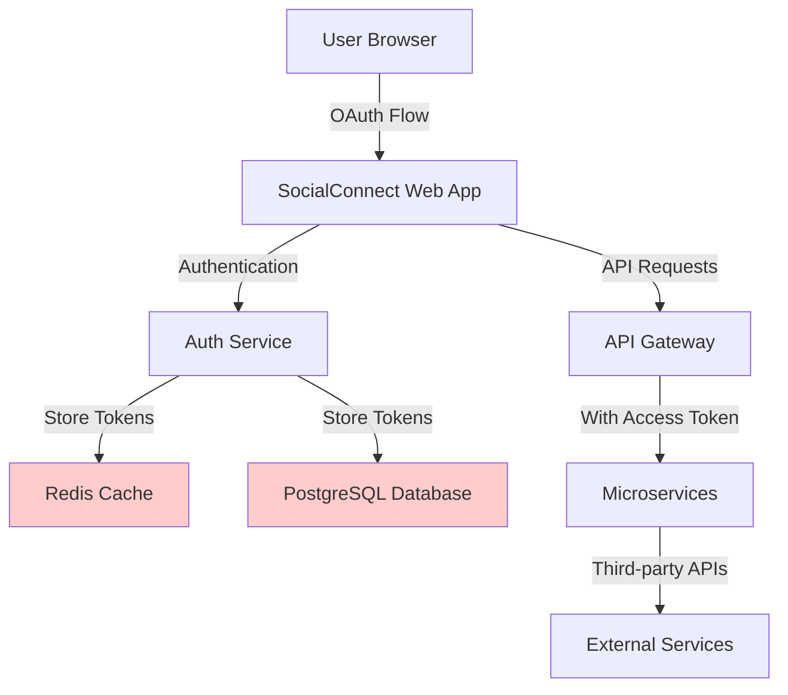
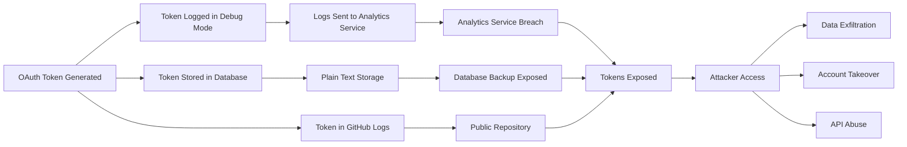
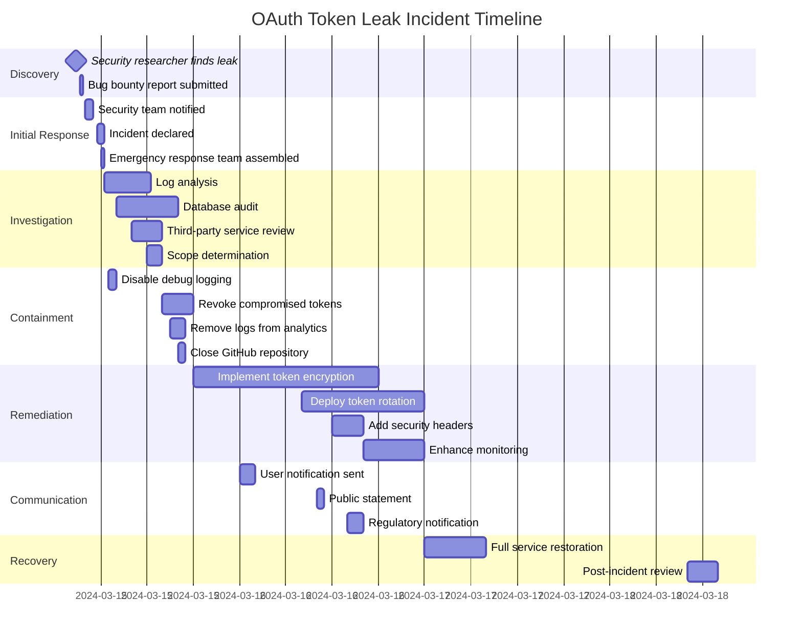
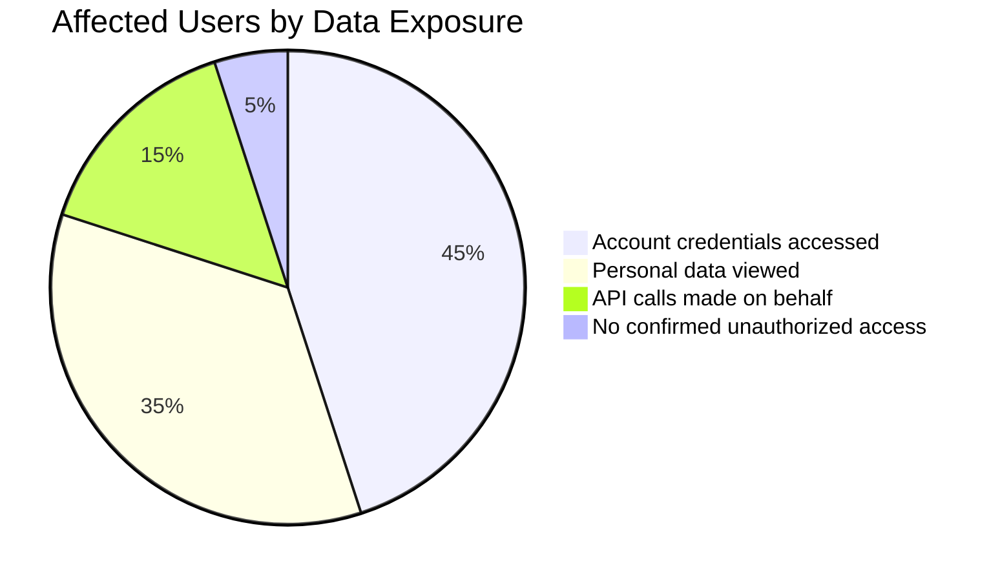
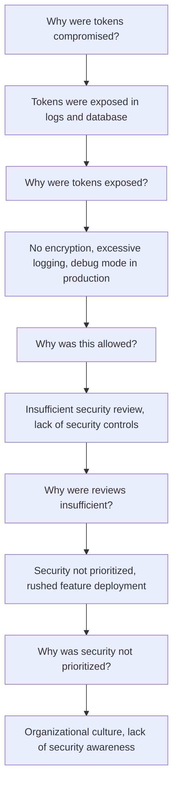
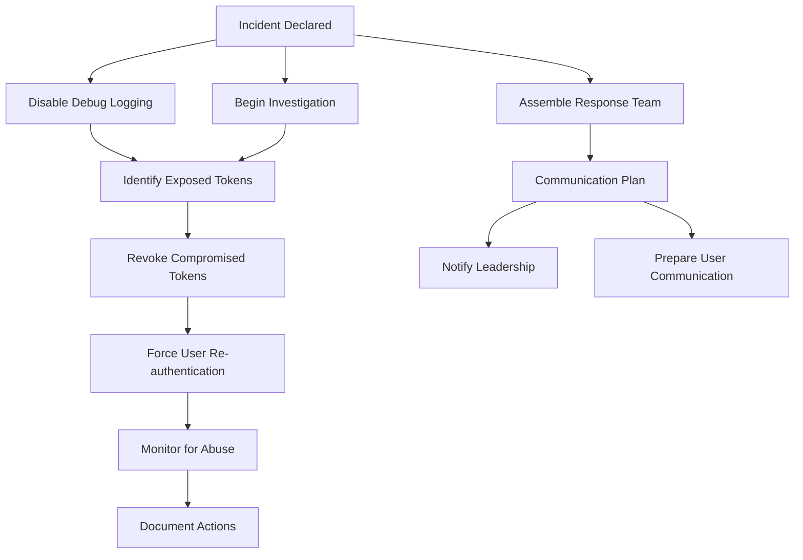
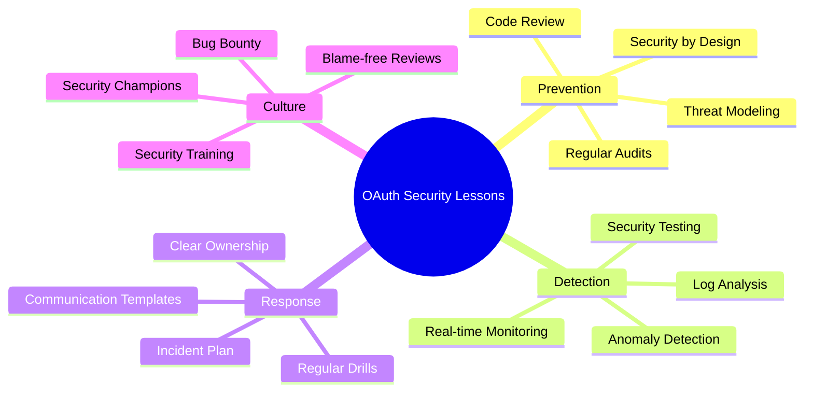
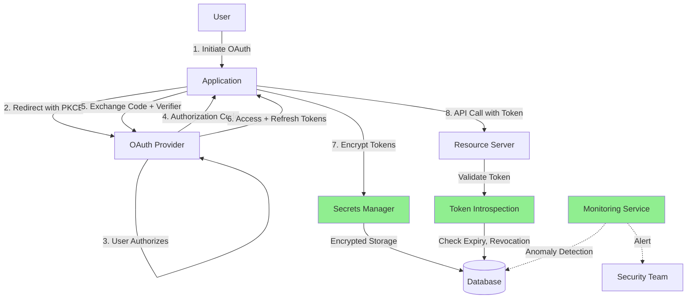

# Case Study 1: OAuth Token Leak

## Executive Summary

**Incident Type**: OAuth Token Exposure  
**Severity**: Critical  
**Impact**: 100,000+ user accounts compromised  
**Root Cause**: Insecure token storage and lack of token rotation  
**Detection Time**: 14 days  
**Resolution Time**: 72 hours  
**Estimated Cost**: $2.3 million (remediation, legal, PR)

---

## Table of Contents
- [Background](#background)
- [The Incident](#the-incident)
- [Technical Analysis](#technical-analysis)
- [Timeline](#timeline)
- [Impact Assessment](#impact-assessment)
- [Root Cause Analysis](#root-cause-analysis)
- [Response and Remediation](#response-and-remediation)
- [Lessons Learned](#lessons-learned)
- [Prevention Strategies](#prevention-strategies)
- [Related Documentation](#related-documentation)

---

## Background

### Company Profile
- **Organization**: SocialConnect (pseudonym)
- **Industry**: Social Media Platform
- **Size**: 5 million active users
- **Architecture**: Microservices, cloud-native (AWS)
- **OAuth Integration**: Third-party integrations with 50+ services

### System Architecture



### OAuth Implementation

SocialConnect implemented OAuth 2.0 to allow users to:
- Link social media accounts (Twitter, Facebook, LinkedIn)
- Integrate productivity tools (Google Calendar, Slack)
- Connect file storage (Dropbox, Google Drive)

**Token Flow**:
1. User initiates OAuth flow
2. User authorizes access on third-party service
3. Authorization code returned to SocialConnect
4. SocialConnect exchanges code for access token
5. Access token stored for future API calls

---

## The Incident

### Discovery

**Date**: March 15, 2024, 2:47 AM UTC

A security researcher discovered that SocialConnect's mobile application was leaking OAuth tokens through:
1. **Insecure logging** - Tokens logged in plain text
2. **Log aggregation service** - Logs sent to third-party analytics
3. **Public GitHub repository** - Debug logs accidentally committed

The researcher reported the vulnerability through SocialConnect's bug bounty program.

### Initial Assessment

**Security team discovered**:
- OAuth access tokens exposed in application logs
- Refresh tokens stored in plain text in database
- No token expiration enforcement
- Tokens valid for 90 days by default
- Over 100,000 tokens potentially compromised

### Threat Actor Activity

While investigating, the security team found evidence of exploitation:
- Unusual API activity from unrecognized IP addresses
- Automated scripts accessing user data
- Third-party services showing suspicious authorization patterns
- Data exfiltration to external endpoints

---

## Technical Analysis

### Vulnerability Chain



### Specific Vulnerabilities

#### 1. Insecure Token Storage

**Database Schema** (Vulnerable):
```sql
CREATE TABLE oauth_tokens (
    user_id INTEGER,
    provider VARCHAR(50),
    access_token TEXT,        -- Plain text!
    refresh_token TEXT,       -- Plain text!
    expires_at TIMESTAMP,
    created_at TIMESTAMP
);
```

**Issues**:
- No encryption at rest (see [../encryption.md](../encryption.md))
- No field-level encryption
- Tokens readable by any database administrator
- Database backups contained plain text tokens

#### 2. Excessive Logging

**Code Sample** (Vulnerable):
```javascript
// Authentication service - auth.js
async function exchangeCodeForToken(authCode) {
    try {
        const response = await oauth2Client.getToken(authCode);
        const tokens = response.tokens;
        
        // VULNERABILITY: Logging sensitive tokens
        logger.debug('OAuth token exchange successful', {
            access_token: tokens.access_token,
            refresh_token: tokens.refresh_token,
            expires_in: tokens.expires_in
        });
        
        return tokens;
    } catch (error) {
        logger.error('Token exchange failed', error);
        throw error;
    }
}
```

**Issues**:
- Tokens logged in debug mode
- Debug mode enabled in production
- Logs sent to third-party service
- No log sanitization (see [../monitoring_auditing.md](../monitoring_auditing.md))

#### 3. No Token Rotation

**Token Lifecycle Issues**:
- Access tokens valid for 90 days
- Refresh tokens never expired
- No automatic token rotation
- No detection of token reuse
- No token revocation mechanism

#### 4. Missing Security Headers

**API Response** (Vulnerable):
```http
HTTP/1.1 200 OK
Content-Type: application/json
Cache-Control: max-age=3600

{
    "access_token": "ya29.a0AfH6SMBx...",
    "token_type": "Bearer",
    "expires_in": 7776000
}
```

**Issues**:
- Tokens cached by browser
- No `Cache-Control: no-store` header
- No `Pragma: no-cache` header
- Tokens potentially in browser history

#### 5. Insufficient Access Controls

**Authorization Check** (Vulnerable):
```javascript
// API Gateway - middleware/auth.js
async function validateToken(req, res, next) {
    const token = req.headers.authorization?.split(' ')[1];
    
    if (!token) {
        return res.status(401).json({ error: 'No token provided' });
    }
    
    // VULNERABILITY: Only checks if token exists, not if valid
    const tokenRecord = await db.query(
        'SELECT * FROM oauth_tokens WHERE access_token = $1',
        [token]
    );
    
    if (tokenRecord.rows.length > 0) {
        req.user = tokenRecord.rows[0];
        next();
    } else {
        return res.status(401).json({ error: 'Invalid token' });
    }
}
```

**Issues**:
- No token expiration check
- No scope validation (see [../authorization.md](../authorization.md))
- No rate limiting
- No anomaly detection

---

## Timeline



### Key Events

| Time (UTC) | Event | Action Taken |
|-----------|-------|--------------|
| March 15, 02:47 | Researcher discovers vulnerability | Bug bounty report submitted |
| March 15, 04:00 | Security team alerted | Initial investigation begins |
| March 15, 05:30 | Incident declared critical | Emergency response activated |
| March 15, 07:00 | Debug logging disabled | Immediate containment |
| March 15, 12:00 | Scope confirmed: 100,000+ tokens | Full remediation plan created |
| March 15, 14:00 | Token revocation begins | API rate limits temporarily reduced |
| March 15, 18:00 | Encryption implementation starts | Database migration planned |
| March 16, 00:00 | User notification sent | Email to affected users |
| March 16, 08:00 | Token rotation deployed | All users required to re-authenticate |
| March 17, 00:00 | Services fully restored | Normal operations resume |
| March 18, 10:00 | Post-incident review | Lessons learned documented |

---

## Impact Assessment

### User Impact



**Breakdown**:
- **100,000 users**: Tokens potentially exposed
- **45,000 users**: Evidence of unauthorized account access
- **35,000 users**: Personal data viewed by attackers
- **15,000 users**: Unauthorized API calls made
- **12 users**: Accounts fully compromised with password changes

### Data Compromised

**Types of exposed data**:
- OAuth access tokens (100,000+)
- OAuth refresh tokens (100,000+)
- User profile information (name, email, profile picture)
- Connected account data (linked social media accounts)
- Third-party service data (calendar events, files, messages)
- User activity logs
- API usage patterns

### Business Impact

**Financial**:
- Incident response: $500,000
- Legal fees: $300,000
- Regulatory fines: $800,000
- Customer compensation: $400,000
- Public relations: $150,000
- Security improvements: $150,000
- **Total estimated cost**: $2.3 million

**Reputational**:
- 8% user churn in following month
- 15% decrease in new user signups
- Negative press coverage (50+ articles)
- Trust score decreased by 23%
- Bug bounty payout: $50,000 (well worth it!)

### Compliance Impact

**Regulatory Obligations**:
- **GDPR**: Data breach notification required (see [../compliance.md](../compliance.md))
  - Notified supervisory authority within 72 hours
  - Individual notifications sent to affected EU users
  - Potential fine assessed
- **CCPA**: California users notified
- **OAuth Provider Agreements**: Breach disclosure to third-party services
- **PCI-DSS**: No payment data involved (fortunate)

---

## Root Cause Analysis

### The Five Whys



### Contributing Factors

#### 1. Organizational Factors
- Security treated as afterthought
- "Move fast" culture prioritized over security
- Insufficient security training
- No security champions in development teams
- Limited security budget

#### 2. Process Failures
- No security review for OAuth implementation
- Inadequate code review (see [../best_practises.md](../best_practises.md))
- Missing security testing in CI/CD
- No threat modeling conducted
- Insufficient penetration testing (see [../application_security.md](../application_security.md))

#### 3. Technical Gaps
- No encryption at rest implementation (see [../encryption.md](../encryption.md))
- Weak authentication controls (see [../authentication.md](../authentication.md))
- Missing authorization checks (see [../authorization.md](../authorization.md))
- Inadequate logging controls (see [../monitoring_auditing.md](../monitoring_auditing.md))
- No secrets management solution

#### 4. Monitoring Failures
- No anomaly detection
- Insufficient log monitoring
- No alerting on suspicious API activity
- Missing rate limiting
- No token usage analytics

---

## Response and Remediation

### Immediate Actions (0-24 hours)



**Actions Taken**:

1. **Containment**
   - Disabled debug logging in all environments
   - Removed sensitive logs from analytics service
   - Closed public GitHub repository
   - Blocked suspicious IP addresses

2. **Revocation**
   - Identified all exposed tokens
   - Bulk revoked access tokens
   - Invalidated refresh tokens
   - Forced OAuth re-authorization

3. **Communication**
   - Notified executive team
   - Briefed customer support
   - Prepared incident response statement
   - Contacted OAuth providers

### Short-term Remediation (24-72 hours)

**Technical Fixes**:

1. **Token Encryption Implementation**

```sql
-- New encrypted schema
CREATE TABLE oauth_tokens (
    user_id INTEGER,
    provider VARCHAR(50),
    access_token_encrypted BYTEA,      -- Encrypted using AES-256-GCM
    refresh_token_encrypted BYTEA,     -- Encrypted using AES-256-GCM
    token_iv BYTEA,                    -- Initialization vector
    expires_at TIMESTAMP,
    created_at TIMESTAMP,
    last_used_at TIMESTAMP,            -- Track usage
    revoked BOOLEAN DEFAULT FALSE,     -- Revocation flag
    INDEX idx_expires_at (expires_at),
    INDEX idx_revoked (revoked)
);
```

2. **Secure Logging**

```javascript
// Fixed logging implementation
const sanitizeForLogging = (data) => {
    const sensitive = ['access_token', 'refresh_token', 'password', 'api_key'];
    const sanitized = { ...data };
    
    sensitive.forEach(field => {
        if (sanitized[field]) {
            sanitized[field] = '[REDACTED]';
        }
    });
    
    return sanitized;
};

async function exchangeCodeForToken(authCode) {
    try {
        const response = await oauth2Client.getToken(authCode);
        const tokens = response.tokens;
        
        // Safe logging
        logger.info('OAuth token exchange successful', 
            sanitizeForLogging({
                user_id: userId,
                provider: provider,
                expires_in: tokens.expires_in
            })
        );
        
        // Encrypt before storing
        const encryptedTokens = await encryptTokens(tokens);
        await storeTokens(encryptedTokens);
        
        return tokens;
    } catch (error) {
        logger.error('Token exchange failed', sanitizeForLogging(error));
        throw error;
    }
}
```

3. **Token Rotation**

```javascript
// Automatic token rotation
const TOKEN_REFRESH_THRESHOLD = 5 * 60 * 1000; // 5 minutes before expiry

async function getValidToken(userId, provider) {
    const tokenRecord = await getTokenFromDatabase(userId, provider);
    
    // Check if token is about to expire
    const expiresAt = new Date(tokenRecord.expires_at);
    const now = new Date();
    
    if (expiresAt - now < TOKEN_REFRESH_THRESHOLD) {
        // Token about to expire, refresh it
        const newTokens = await refreshOAuthToken(tokenRecord.refresh_token_encrypted);
        await updateTokens(userId, provider, newTokens);
        return newTokens.access_token;
    }
    
    return tokenRecord.access_token_encrypted;
}
```

4. **Enhanced Validation**

```javascript
// Improved token validation
async function validateToken(req, res, next) {
    const token = req.headers.authorization?.split(' ')[1];
    
    if (!token) {
        return res.status(401).json({ error: 'No token provided' });
    }
    
    try {
        // Retrieve encrypted token
        const tokenRecord = await db.query(
            `SELECT * FROM oauth_tokens 
             WHERE access_token_encrypted = $1 
             AND revoked = FALSE 
             AND expires_at > NOW()`,
            [hashToken(token)]
        );
        
        if (tokenRecord.rows.length === 0) {
            return res.status(401).json({ error: 'Invalid or expired token' });
        }
        
        // Verify token hasn't been used from different location
        await checkTokenAnomaly(tokenRecord.rows[0], req);
        
        // Update last used timestamp
        await updateTokenUsage(tokenRecord.rows[0].id, req.ip);
        
        req.user = tokenRecord.rows[0];
        next();
    } catch (error) {
        logger.error('Token validation failed', sanitizeForLogging(error));
        return res.status(401).json({ error: 'Token validation failed' });
    }
}
```

5. **Security Headers**

```javascript
// Add security headers
app.use((req, res, next) => {
    res.setHeader('Cache-Control', 'no-store, no-cache, must-revalidate, private');
    res.setHeader('Pragma', 'no-cache');
    res.setHeader('Expires', '0');
    res.setHeader('X-Content-Type-Options', 'nosniff');
    res.setHeader('X-Frame-Options', 'DENY');
    res.setHeader('Strict-Transport-Security', 'max-age=31536000; includeSubDomains');
    next();
});
```

### Long-term Improvements (1-3 months)

**Strategic Initiatives**:

1. **Secrets Management** (see [../encryption.md](../encryption.md))
   - Implemented HashiCorp Vault
   - Centralized token encryption keys
   - Automated key rotation
   - Audit logging for all key access

2. **Enhanced Monitoring** (see [../monitoring_auditing.md](../monitoring_auditing.md))
   - Real-time token usage monitoring
   - Anomaly detection for API calls
   - Geographic usage tracking
   - Automated alerting on suspicious activity

3. **Security Testing**
   - Added OAuth security tests to CI/CD
   - Quarterly penetration testing
   - Automated security scanning
   - Bug bounty program expansion

4. **Training and Awareness**
   - Security training for all developers
   - OAuth security best practices documentation
   - Secure coding guidelines updated
   - Regular security champions meetings

---

## Lessons Learned

### What Went Well ✅

1. **Bug Bounty Program**
   - Vulnerability discovered by ethical hacker
   - Responsible disclosure process worked
   - Faster discovery than traditional security audits

2. **Incident Response**
   - Clear escalation path
   - Quick assembly of response team
   - Effective communication between teams
   - Documentation practices helped investigation

3. **Technical Response**
   - Rapid token revocation
   - Effective containment measures
   - Minimal service disruption during remediation

### What Didn't Go Well ❌

1. **Prevention**
   - Security not built into initial design
   - No security review before production
   - Ignored OAuth security best practices
   - Debug mode in production environment

2. **Detection**
   - 14 days before external discovery
   - No internal monitoring detected anomalies
   - Lack of automated security scanning
   - No anomaly detection on token usage

3. **Preparedness**
   - No incident response plan for OAuth incidents
   - Insufficient security expertise in team
   - Unclear roles and responsibilities
   - Communication templates not prepared

### Key Takeaways



**Critical Lessons**:

1. **Never log sensitive data**
   - Implement log sanitization
   - Use structured logging
   - Regular log audits

2. **Encrypt everything sensitive** (see [../encryption.md](../encryption.md))
   - Encryption at rest
   - Encryption in transit
   - Field-level encryption

3. **Implement token best practices** (see [../authentication.md](../authentication.md))
   - Short-lived access tokens
   - Secure refresh token rotation
   - Token binding
   - Revocation mechanisms

4. **Monitor and detect**
   - Real-time anomaly detection
   - Usage analytics
   - Geographic tracking
   - Rate limiting

5. **Security is everyone's responsibility**
   - Developer training
   - Security champions
   - Code review requirements
   - Security gates in CI/CD

---

## Prevention Strategies

### Secure OAuth Implementation Checklist

#### Design Phase
- [ ] Conduct threat modeling for OAuth flows
- [ ] Define token lifecycle management
- [ ] Plan encryption strategy for token storage
- [ ] Design monitoring and alerting
- [ ] Review OAuth 2.0 security best practices (RFC 6819)
- [ ] Consider using OAuth 2.1 (when available)

#### Development Phase
- [ ] Use well-tested OAuth libraries (don't roll your own)
- [ ] Implement PKCE (Proof Key for Code Exchange) for mobile/SPA
- [ ] Use state parameter to prevent CSRF
- [ ] Validate redirect URIs strictly
- [ ] Implement token encryption (see [../encryption.md](../encryption.md))
- [ ] Add log sanitization for all sensitive data
- [ ] Never enable debug logging in production

#### Token Management
- [ ] Use short-lived access tokens (15-60 minutes)
- [ ] Implement refresh token rotation
- [ ] Store tokens encrypted with unique keys per user
- [ ] Implement token revocation
- [ ] Add token binding (where supported)
- [ ] Track token usage (last used, IP, user agent)
- [ ] Implement automatic token expiration

#### Security Controls
- [ ] Add rate limiting on OAuth endpoints
- [ ] Implement anomaly detection
- [ ] Add geographic usage monitoring
- [ ] Use security headers (Cache-Control, etc.)
- [ ] Validate token scopes on every request (see [../authorization.md](../authorization.md))
- [ ] Implement defense in depth
- [ ] Add Web Application Firewall (see [../network_security.md](../network_security.md))

#### Monitoring and Response
- [ ] Set up real-time monitoring (see [../monitoring_auditing.md](../monitoring_auditing.md))
- [ ] Create alerts for suspicious activity
- [ ] Log all token operations
- [ ] Implement audit trail
- [ ] Prepare incident response plan
- [ ] Conduct regular security testing
- [ ] Perform quarterly penetration tests

#### Testing
- [ ] Unit tests for OAuth flows
- [ ] Integration tests with mocked providers
- [ ] Security tests in CI/CD pipeline
- [ ] Test token revocation
- [ ] Test token expiration
- [ ] Penetration testing of OAuth implementation
- [ ] Review third-party OAuth apps regularly

### Architectural Recommendations



**Key Architectural Principles**:

1. **Separation of Concerns**
   - Dedicated authentication service
   - Centralized token management
   - Separate token storage from application data

2. **Defense in Depth**
   - Multiple layers of security
   - Encryption at rest and in transit
   - Network segmentation
   - WAF and API gateway

3. **Least Privilege** (see [../authorization.md](../authorization.md))
   - Request minimum OAuth scopes
   - Regular scope review
   - Automatic scope expiration

4. **Zero Trust**
   - Verify every token on every request
   - No implicit trust of tokens
   - Continuous validation

### Code Review Guidelines

**OAuth Security Checklist for Code Reviews**:

```markdown
## OAuth Code Review Checklist

### Token Handling
- [ ] No tokens in logs
- [ ] No tokens in error messages
- [ ] No tokens in URLs (use headers/body)
- [ ] Tokens encrypted before storage
- [ ] Secure token deletion (not just flagged as deleted)

### Validation
- [ ] Token expiration checked
- [ ] Token signature verified (JWT)
- [ ] Scope validation on each request
- [ ] State parameter validated (CSRF protection)
- [ ] Redirect URI validated against whitelist

### Error Handling
- [ ] Generic error messages (no token details)
- [ ] Secure error logging
- [ ] No token leakage in stack traces

### Security Headers
- [ ] Cache-Control: no-store
- [ ] Pragma: no-cache
- [ ] X-Frame-Options
- [ ] Strict-Transport-Security

### OAuth Flow
- [ ] Using PKCE for public clients
- [ ] State parameter used and validated
- [ ] Nonce used (for OpenID Connect)
- [ ] Secure redirect URI handling
```

---

## Related Documentation

### Internal References
- [Authentication](../authentication.md) - Comprehensive authentication strategies
- [Authorization](../authorization.md) - Access control and OAuth scopes
- [Encryption](../encryption.md) - Token encryption methods
- [Monitoring & Auditing](../monitoring_auditing.md) - Detection and logging
- [Application Security](../application_security.md) - Secure development practices
- [Network Security](../network_security.md) - Network-level protections
- [Data Security](../data_security.md) - Data protection strategies
- [Best Practices](../best_practises.md) - Security best practices
- [Compliance](../compliance.md) - Regulatory requirements

### Related Case Studies
- [Case 2: Data Breach](case2_data_breach.md) - Database exposure incident
- [Case 3: Ransomware Attack](case3_ransomware.md) - Ransomware response

### External Resources
- **OAuth 2.0 RFC 6749**: https://tools.ietf.org/html/rfc6749
- **OAuth 2.0 Security Best Practices (RFC 6819)**: https://tools.ietf.org/html/rfc6819
- **OAuth 2.0 for Native Apps (RFC 8252)**: https://tools.ietf.org/html/rfc8252
- **PKCE (RFC 7636)**: https://tools.ietf.org/html/rfc7636
- **OAuth 2.1 Draft**: https://oauth.net/2.1/
- **OWASP OAuth Cheat Sheet**: https://cheatsheetseries.owasp.org/cheatsheets/OAuth2_Cheat_Sheet.html

---

## Conclusion

The OAuth token leak at SocialConnect demonstrates how a combination of insecure practices can lead to significant security incidents. The key lessons are:

1. **Security must be built in from the start** - Retrofitting security is costly and risky
2. **Never trust, always verify** - Implement comprehensive validation at every layer
3. **Visibility is critical** - You can't protect what you can't see
4. **Culture matters** - Security must be everyone's priority, not just the security team's

By following OAuth best practices, implementing defense in depth, and maintaining vigilant monitoring, organizations can significantly reduce the risk of token-based attacks.

**Remember**: Compliance frameworks like GDPR, HIPAA, and PCI-DSS all require secure authentication and authorization mechanisms. OAuth security isn't just a technical concern—it's a compliance requirement (see [../compliance.md](../compliance.md)).

---
