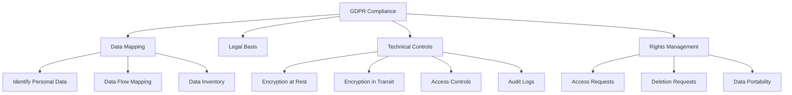
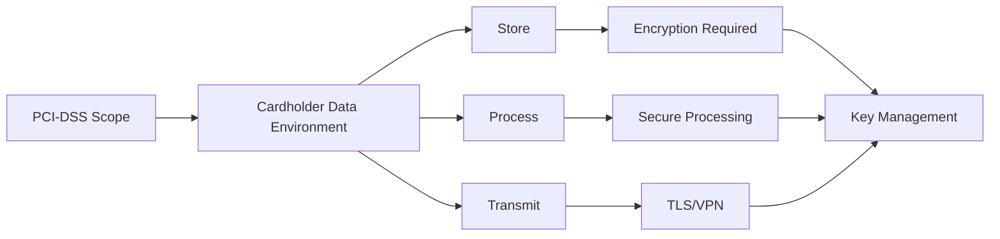
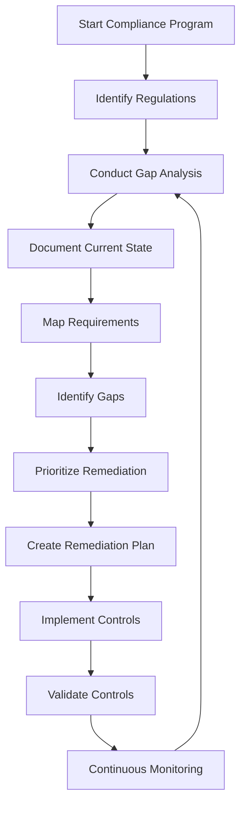
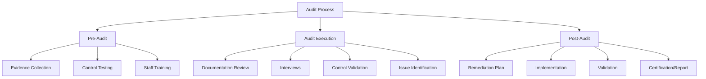
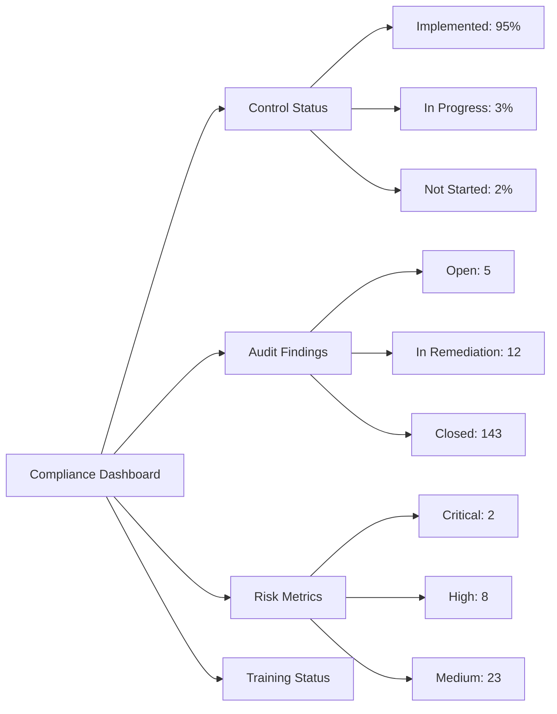

# Compliance in System Security

## Table of Contents
- [Overview](#overview)
- [Major Compliance Frameworks](#major-compliance-frameworks)
- [Compliance Implementation Strategy](#compliance-implementation-strategy)
- [Documentation Requirements](#documentation-requirements)
- [Audit Preparation](#audit-preparation)
- [Continuous Compliance](#continuous-compliance)
- [Integration with Security Practices](#integration-with-security-practices)

---

## Overview

Compliance refers to adhering to laws, regulations, standards, and internal policies that govern how organizations handle data and conduct operations. In system security, compliance ensures that security controls meet legal and industry-specific requirements.

### Why Compliance Matters

- **Legal Protection**: Avoid fines, penalties, and legal action
- **Customer Trust**: Demonstrate commitment to data protection
- **Risk Management**: Identify and mitigate security vulnerabilities
- **Market Access**: Required for certain industries and regions
- **Operational Excellence**: Drives standardization and best practices

### Compliance vs Security

While related, compliance and security serve different purposes:

| Aspect | Compliance | Security |
|--------|-----------|----------|
| **Focus** | Meeting specific requirements | Protecting against all threats |
| **Scope** | Defined by regulations | Comprehensive threat landscape |
| **Approach** | Checklist-driven | Risk-based |
| **Timeline** | Point-in-time assessments | Continuous monitoring |

**Key Principle**: Compliance is the floor, not the ceiling. Being compliant doesn't guarantee security, but security efforts should support compliance.

---

## Major Compliance Frameworks

### 1. GDPR (General Data Protection Regulation)

**Scope**: EU residents' personal data, regardless of where processing occurs

**Key Requirements**:
- **Lawful Basis**: Must have legal grounds for processing data (consent, contract, legal obligation, etc.)
- **Data Minimization**: Collect only necessary data
- **Right to Access**: Individuals can request their data
- **Right to Erasure**: "Right to be forgotten"
- **Data Portability**: Users can transfer data between services
- **Breach Notification**: Report breaches within 72 hours
- **Data Protection by Design**: Security built into systems from inception
- **DPO Requirement**: Appoint Data Protection Officer for certain organizations

**Penalties**: Up to €20 million or 4% of global annual revenue

**Technical Requirements**:
- Strong encryption (see [encryption.md](encryption.md))
- Access controls and authentication (see [authentication.md](authentication.md))
- Audit logging (see [monitoring_auditing.md](monitoring_auditing.md))
- Data anonymization and pseudonymization
- Secure data deletion mechanisms



### 2. HIPAA (Health Insurance Portability and Accountability Act)

**Scope**: Healthcare providers, health plans, healthcare clearinghouses, and their business associates in the US

**Key Components**:

#### Privacy Rule
- Protects Protected Health Information (PHI)
- Minimum necessary standard
- Patient rights to access and amend records
- Authorization requirements for disclosures

#### Security Rule
- **Administrative Safeguards**: Security management, workforce security, contingency planning
- **Physical Safeguards**: Facility access controls, workstation security, device controls
- **Technical Safeguards**: Access controls, audit controls, integrity controls, transmission security

#### Breach Notification Rule
- Notify affected individuals within 60 days
- Report to HHS (Department of Health & Human Services)
- Media notification for breaches affecting 500+ individuals

**Penalties**: $100 to $50,000 per violation, up to $1.5 million per year for each violation category

**Technical Requirements**:
- Unique user identification (see [authentication.md](authentication.md))
- Automatic logoff
- Encryption and decryption (see [encryption.md](encryption.md))
- Integrity controls
- Transmission security

### 3. PCI-DSS (Payment Card Industry Data Security Standard)

**Scope**: Organizations that store, process, or transmit cardholder data

**12 Requirements**:

1. **Install and maintain firewall configuration** (see [network_security.md](network_security.md))
2. **Do not use vendor-supplied defaults** for passwords and security parameters
3. **Protect stored cardholder data** with encryption
4. **Encrypt transmission** of cardholder data across public networks
5. **Protect systems against malware** (see [application_security.md](application_security.md))
6. **Develop and maintain secure systems** and applications
7. **Restrict access to cardholder data** by business need-to-know
8. **Identify and authenticate access** to system components
9. **Restrict physical access** to cardholder data
10. **Track and monitor all access** to network resources (see [monitoring_auditing.md](monitoring_auditing.md))
11. **Regularly test security systems** and processes
12. **Maintain information security policy** (see [best_practises.md](best_practises.md))

**Compliance Levels**:
- **Level 1**: 6+ million transactions annually
- **Level 2**: 1-6 million transactions
- **Level 3**: 20,000-1 million e-commerce transactions
- **Level 4**: Fewer than 20,000 e-commerce transactions or up to 1 million total transactions



### 4. SOC 2 (System and Organization Controls 2)

**Scope**: Service organizations providing services to other organizations

**Trust Service Criteria**:

1. **Security**: Protection against unauthorized access
   - Logical and physical access controls
   - System operations monitoring
   - Change management

2. **Availability**: System uptime and operational performance
   - Performance monitoring
   - Incident response
   - Backup and disaster recovery

3. **Processing Integrity**: Complete, valid, accurate, timely, authorized processing
   - Quality assurance
   - Error detection and correction

4. **Confidentiality**: Protection of confidential information
   - Encryption (see [encryption.md](encryption.md))
   - Access controls (see [authorization.md](authorization.md))
   - Secure disposal

5. **Privacy**: Collection, use, retention, disclosure, and disposal of personal information
   - Notice and consent
   - Data subject rights
   - Privacy controls

**Report Types**:
- **Type I**: Controls design at a specific point in time
- **Type II**: Controls design and operating effectiveness over a period (typically 6-12 months)

### 5. ISO 27001

**Scope**: International standard for Information Security Management Systems (ISMS)

**Key Components**:
- Risk assessment and treatment
- 114 controls across 14 domains
- Leadership commitment
- Continuous improvement

**Domains**:
1. Information security policies
2. Organization of information security
3. Human resource security
4. Asset management
5. Access control (see [authorization.md](authorization.md))
6. Cryptography (see [encryption.md](encryption.md))
7. Physical and environmental security
8. Operations security
9. Communications security (see [network_security.md](network_security.md))
10. System acquisition, development, and maintenance
11. Supplier relationships
12. Information security incident management
13. Business continuity management
14. Compliance

---

## Compliance Implementation Strategy

### 1. Gap Analysis

**Process**:
1. Identify applicable regulations
2. Document current state
3. Map requirements to controls
4. Identify gaps
5. Prioritize remediation



### 2. Control Mapping

Map compliance requirements to technical and organizational controls:

| Requirement | Control Type | Implementation | Reference |
|------------|--------------|----------------|-----------|
| Encrypt data at rest | Technical | AES-256 encryption | [encryption.md](encryption.md) |
| Multi-factor authentication | Technical | MFA for all admin access | [authentication.md](authentication.md) |
| Access control | Technical | RBAC implementation | [authorization.md](authorization.md) |
| Audit logging | Technical | Centralized logging | [monitoring_auditing.md](monitoring_auditing.md) |
| Security awareness | Organizational | Annual training | [best_practises.md](best_practises.md) |

### 3. Compliance Architecture

Design systems with compliance in mind:

**Principles**:
- **Least Privilege**: Grant minimum necessary access (see [authorization.md](authorization.md))
- **Defense in Depth**: Multiple layers of security (see [network_security.md](network_security.md))
- **Separation of Duties**: No single person has complete control
- **Audit Trail**: Log all activities (see [monitoring_auditing.md](monitoring_auditing.md))
- **Data Classification**: Identify and protect sensitive data (see [data_security.md](data_security.md))

### 4. Vendor Management

Third-party compliance considerations:

**Due Diligence**:
- Request compliance certifications (SOC 2, ISO 27001)
- Review security questionnaires
- Assess data handling practices
- Evaluate incident response capabilities
- Check breach history

**Contractual Requirements**:
- Data Processing Agreements (DPAs) for GDPR
- Business Associate Agreements (BAAs) for HIPAA
- Right to audit clauses
- Breach notification requirements
- Data return/deletion upon termination

---

## Documentation Requirements

### 1. Policy Documentation

**Essential Policies**:
- Information Security Policy
- Acceptable Use Policy
- Incident Response Policy
- Data Retention and Disposal Policy
- Access Control Policy
- Change Management Policy
- Business Continuity/Disaster Recovery Policy

**Policy Structure**:
```
1. Purpose
2. Scope
3. Policy Statements
4. Roles and Responsibilities
5. Compliance and Enforcement
6. Review and Revision Schedule
7. References
```

### 2. Procedure Documentation

Convert policies into actionable procedures:

- User provisioning/de-provisioning steps
- Incident response playbooks (see [case studies](case-studies/))
- Backup and recovery procedures
- Patch management procedures
- Vulnerability assessment procedures

### 3. Evidence Collection

**Types of Evidence**:
- **Design Evidence**: Policies, procedures, architecture diagrams
- **Implementation Evidence**: Screenshots, configuration files, system logs
- **Operating Evidence**: Audit logs, incident reports, training records

**Evidence Management**:
- Centralized repository
- Version control
- Access controls
- Retention schedules
- Regular reviews

### 4. Risk Register

Maintain a living document of identified risks:

| Risk ID | Description | Likelihood | Impact | Mitigation | Owner | Status |
|---------|-------------|-----------|--------|------------|-------|--------|
| R001 | Unauthorized access to customer data | Medium | High | MFA implementation | CISO | In Progress |
| R002 | Data breach via SQL injection | Low | Critical | WAF + code review | AppSec | Complete |

---

## Audit Preparation

### 1. Internal Audits

**Frequency**: Quarterly or semi-annually

**Process**:
1. **Planning**: Define scope, select auditor, schedule
2. **Documentation Review**: Assess policies and procedures
3. **Control Testing**: Validate implementation
4. **Interviews**: Verify understanding and adherence
5. **Reporting**: Document findings and recommendations
6. **Remediation**: Address identified gaps
7. **Follow-up**: Verify remediation

### 2. External Audits

**Types**:
- Compliance audits (GDPR, HIPAA, PCI-DSS)
- Financial audits
- SOC 2 examinations
- ISO 27001 certification audits

**Preparation Checklist**:
- [ ] Review and update all policies
- [ ] Collect evidence for all controls
- [ ] Test controls for effectiveness
- [ ] Train staff on audit process
- [ ] Prepare documentation repository
- [ ] Schedule interviews
- [ ] Review prior audit findings
- [ ] Validate remediation of previous issues

### 3. Audit Artifacts

**Required Documentation**:
- Network diagrams (see [network_security.md](network_security.md))
- Data flow diagrams (see [data_security.md](data_security.md))
- System inventory
- User access lists
- Change logs
- Incident reports (see [case studies](case-studies/))
- Training records
- Vendor assessments
- Penetration test reports (see [application_security.md](application_security.md))
- Backup logs



### 4. Common Audit Findings

**Frequent Issues**:
- Incomplete or outdated documentation
- Lack of evidence for control operation
- Insufficient access controls (see [authorization.md](authorization.md))
- Weak password policies (see [authentication.md](authentication.md))
- Missing encryption (see [encryption.md](encryption.md))
- Inadequate logging (see [monitoring_auditing.md](monitoring_auditing.md))
- Unpatched systems
- Lack of security awareness training

---

## Continuous Compliance

### 1. Compliance Monitoring

**Automated Monitoring**:
- Configuration compliance scanning
- Vulnerability assessments
- Log analysis for policy violations
- Access review automation
- Certificate expiration monitoring

**Manual Reviews**:
- Quarterly access reviews
- Annual policy reviews
- Vendor assessment updates
- Risk assessment updates

### 2. Change Management

Ensure changes don't impact compliance:

**Process**:
1. Change request and approval
2. Compliance impact assessment
3. Testing in non-production environment
4. Documentation updates
5. Implementation
6. Validation
7. Post-implementation review

### 3. Compliance Metrics

**Key Performance Indicators (KPIs)**:
- Time to remediate audit findings
- Percentage of systems compliant with policies
- Number of policy exceptions
- Training completion rates
- Incident response time (see [monitoring_auditing.md](monitoring_auditing.md))
- Mean time to detect (MTTD) violations
- Mean time to respond (MTTR) to violations

### 4. Compliance Dashboard

Track compliance status in real-time:



---

## Integration with Security Practices

### 1. Compliance in SDLC

Embed compliance requirements throughout the software development lifecycle:

**Requirements Phase**:
- Identify applicable regulations
- Define compliance requirements
- Document data handling needs

**Design Phase**:
- Security architecture review (see [application_security.md](application_security.md))
- Data protection by design (GDPR)
- Privacy impact assessment

**Development Phase**:
- Secure coding standards (see [best_practises.md](best_practises.md))
- Code reviews for compliance
- Static analysis tools

**Testing Phase**:
- Security testing (see [application_security.md](application_security.md))
- Compliance validation
- Penetration testing

**Deployment Phase**:
- Configuration validation
- Documentation updates
- Compliance signoff

**Operations Phase**:
- Continuous monitoring (see [monitoring_auditing.md](monitoring_auditing.md))
- Incident response (see [case studies](case-studies/))
- Regular assessments

### 2. Compliance and Incident Response

Regulatory requirements for incident handling:

**GDPR Breach Notification**:
- Assess breach within 72 hours
- Notify supervisory authority
- Document decision-making process
- Notify affected individuals if high risk

**HIPAA Breach Notification**:
- Notify individuals within 60 days
- Report to HHS
- Media notification if 500+ affected
- Document breach and response

See [case2_data_breach.md](case-studies/case2_data_breach.md) for practical examples.

### 3. Compliance Automation

**Tools and Technologies**:
- Compliance management platforms (GRC tools)
- Infrastructure as Code (IaC) with compliance checks
- Security Information and Event Management (SIEM) (see [monitoring_auditing.md](monitoring_auditing.md))
- Cloud Security Posture Management (CSPM)
- Automated vulnerability scanning

**Benefits**:
- Continuous compliance validation
- Reduced manual effort
- Faster remediation
- Evidence collection automation
- Real-time alerting

### 4. Cross-Reference Matrix

Map compliance requirements to security controls:

| Regulation | Requirement | Security Control | Documentation |
|-----------|-------------|------------------|---------------|
| GDPR | Encryption | AES-256 at rest, TLS 1.3 in transit | [encryption.md](encryption.md) |
| HIPAA | Unique user ID | SSO with MFA | [authentication.md](authentication.md) |
| PCI-DSS | Access control | RBAC with least privilege | [authorization.md](authorization.md) |
| SOC 2 | Monitoring | Centralized logging + SIEM | [monitoring_auditing.md](monitoring_auditing.md) |
| All | Secure development | SSDLC practices | [application_security.md](application_security.md) |

---

## Best Practices Summary

1. **Start Early**: Build compliance into systems from the beginning
2. **Document Everything**: Maintain comprehensive evidence
3. **Automate Where Possible**: Use tools to reduce manual effort
4. **Regular Training**: Ensure all staff understand compliance obligations
5. **Continuous Improvement**: Treat compliance as an ongoing process
6. **Cross-Functional Collaboration**: Involve legal, security, engineering, and business teams
7. **Stay Current**: Monitor regulatory changes and update controls
8. **Test Regularly**: Validate controls through internal audits
9. **Vendor Due Diligence**: Ensure third parties meet compliance standards
10. **Executive Support**: Secure leadership buy-in and resources

---

## Additional Resources

- **Internal Documentation**:
  - [Authentication](authentication.md) - User identification and verification
  - [Authorization](authorization.md) - Access control mechanisms
  - [Encryption](encryption.md) - Data protection through cryptography
  - [Monitoring & Auditing](monitoring_auditing.md) - Logging and detection
  - [Data Security](data_security.md) - Data protection strategies
  - [Network Security](network_security.md) - Network protection measures
  - [Application Security](application_security.md) - Secure development
  - [Best Practices](best_practises.md) - Security best practices
  - [Case Studies](case-studies/) - Real-world security incidents

- **External Resources**:
  - GDPR: https://gdpr.eu/
  - HIPAA: https://www.hhs.gov/hipaa
  - PCI-DSS: https://www.pcisecuritystandards.org/
  - SOC 2: https://www.aicpa.org/
  - ISO 27001: https://www.iso.org/isoiec-27001-information-security.html

---

