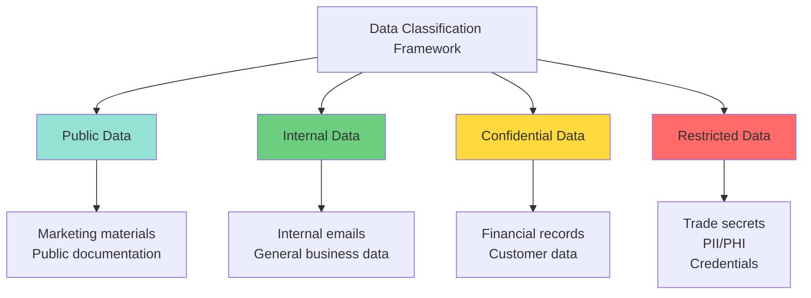
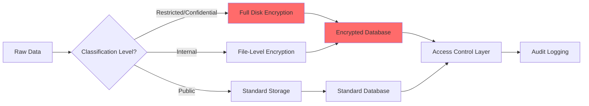
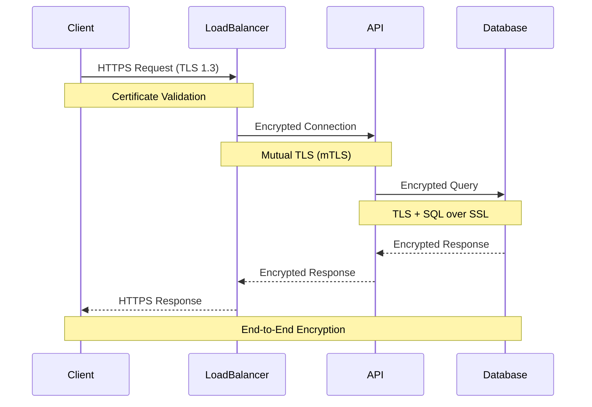
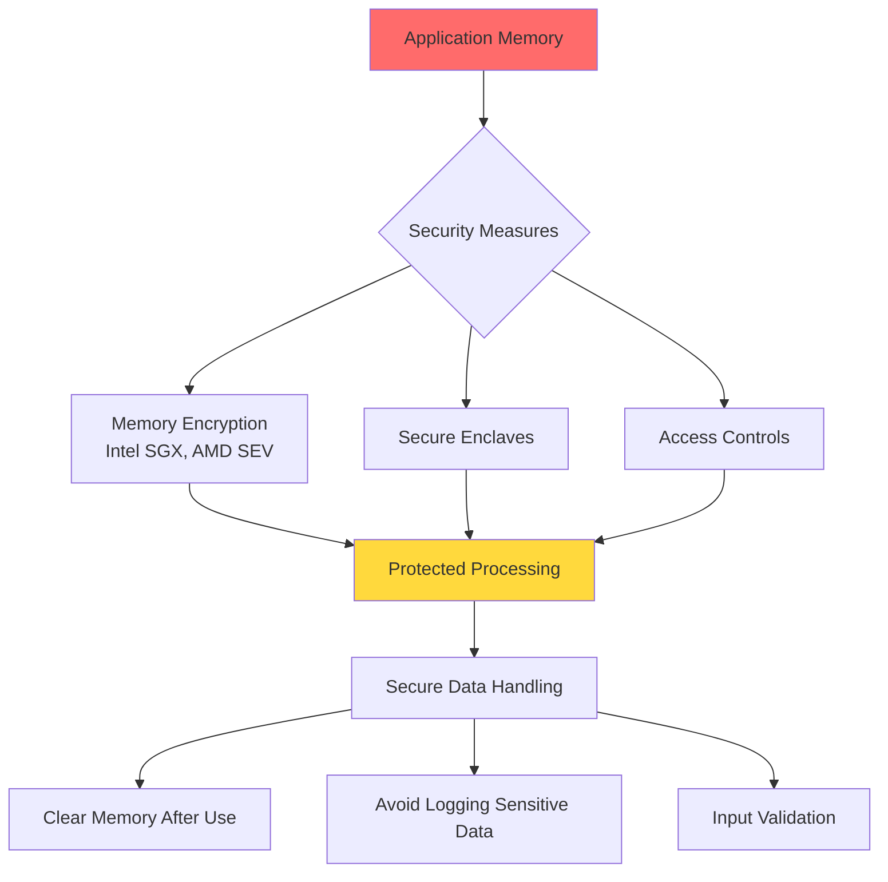
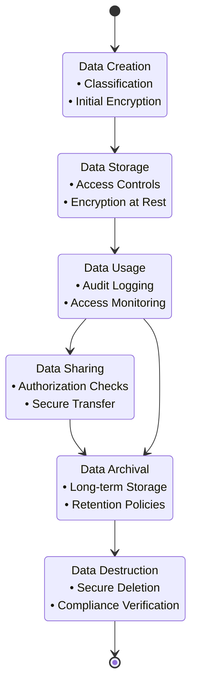
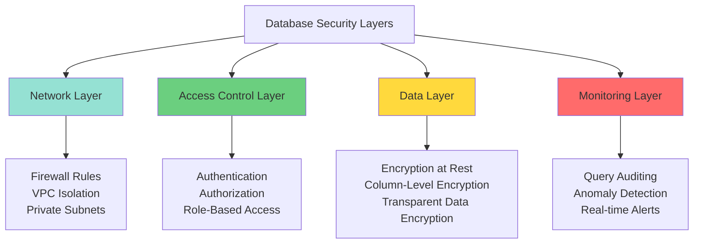
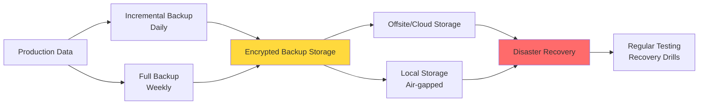
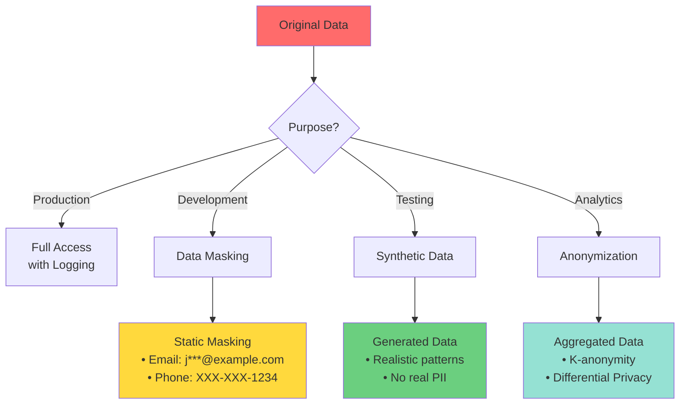
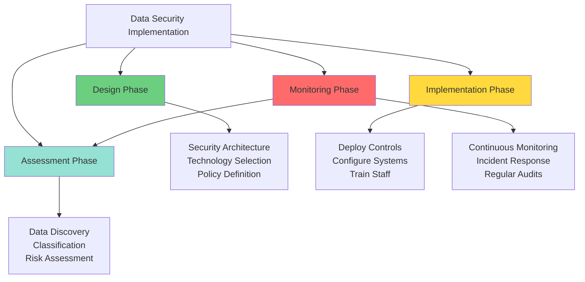

# Data Security

## Table of Contents
1. [Overview](#overview)
2. [Data Classification](#data-classification)
3. [Data at Rest Security](#data-at-rest-security)
4. [Data in Transit Security](#data-in-transit-security)
5. [Data in Use Security](#data-in-use-security)
6. [Data Lifecycle Management](#data-lifecycle-management)
7. [Database Security](#database-security)
8. [Backup and Recovery](#backup-and-recovery)
9. [Data Masking and Anonymization](#data-masking-and-anonymization)
10. [Implementation Strategies](#implementation-strategies)
11. [Related Security Domains](#related-security-domains)

## Overview

Data security encompasses the practices, policies, and technologies used to protect digital information from unauthorized access, corruption, or theft throughout its entire lifecycle. It is a critical component of any organization's security posture.

### Key Objectives
- **Confidentiality**: Ensure data is accessible only to authorized parties
- **Integrity**: Maintain accuracy and consistency of data
- **Availability**: Ensure data is accessible when needed by authorized users
- **Compliance**: Meet regulatory and legal requirements

## Data Classification

Data classification is the foundation of an effective data security strategy. It involves categorizing data based on sensitivity and business impact.



### Classification Levels

| Level | Description | Examples | Security Controls |
|-------|-------------|----------|-------------------|
| **Public** | No risk if disclosed | Marketing materials, press releases | Minimal controls |
| **Internal** | Low impact if disclosed | Internal memos, general business data | Basic access controls |
| **Confidential** | Moderate impact if disclosed | Customer data, financial records | [Encryption](encryption.md), access logging |
| **Restricted** | Severe impact if disclosed | Trade secrets, PHI, PII | Strong [encryption](encryption.md), MFA, strict [authorization](authorization.md) |

## Data at Rest Security

Data at rest refers to inactive data stored physically in databases, data warehouses, archives, or other storage systems.



### Encryption Strategies

**Full Disk Encryption (FDE)**
```javascript
// Conceptual: Full disk encryption is typically handled at OS/hardware level
// Example using Node.js crypto for file encryption
const crypto = require('crypto');
const algorithm = 'aes-256-gcm';

function encryptFile(data, key) {
  const iv = crypto.randomBytes(16);
  const cipher = crypto.createCipheriv(algorithm, key, iv);
  const encrypted = Buffer.concat([cipher.update(data), cipher.final()]);
  const authTag = cipher.getAuthTag();
  
  return { encrypted, iv, authTag };
}
```

**Database-Level Encryption**
See [encryption.md](encryption.md) for detailed encryption algorithms and key management strategies.

### Key Management
- **Key Rotation**: Regularly rotate encryption keys (every 90-180 days)
- **Key Storage**: Use Hardware Security Modules (HSM) or Key Management Services (KMS)
- **Access Control**: Implement strict [authorization](authorization.md) for key access
- **Key Recovery**: Maintain secure key backup procedures

## Data in Transit Security

Data in transit refers to data actively moving from one location to another across networks.



### Transport Layer Security

**TLS Configuration Best Practices**
```javascript
// Node.js HTTPS server with strong TLS configuration
const https = require('https');
const fs = require('fs');

const options = {
  key: fs.readFileSync('private-key.pem'),
  cert: fs.readFileSync('certificate.pem'),
  minVersion: 'TLSv1.3',
  ciphers: 'TLS_AES_256_GCM_SHA384:TLS_CHACHA20_POLY1305_SHA256'
};

https.createServer(options, (req, res) => {
  // Handle secure requests
}).listen(443);
```

Related: [network_security.md](network_security.md) for network-level protections

### API Security
- Use HTTPS/TLS for all API communications
- Implement API authentication tokens (see [authentication.md](authentication.md))
- Apply rate limiting and throttling
- Validate and sanitize all inputs (see [application_security.md](application_security.md))

## Data in Use Security

Data in use refers to data being actively processed in memory or by applications.



### Secure Coding Practices

**Memory Management**
```javascript
// Secure data handling in memory
class SecureDataHandler {
  constructor(sensitiveData) {
    this.data = Buffer.from(sensitiveData);
  }
  
  process() {
    // Process data securely
    const result = this.performOperation(this.data);
    return result;
  }
  
  destroy() {
    // Overwrite memory before garbage collection
    this.data.fill(0);
    this.data = null;
  }
}

// Usage
const handler = new SecureDataHandler('sensitive-info');
const result = handler.process();
handler.destroy(); // Clear from memory
```

See [application_security.md](application_security.md) for comprehensive secure coding guidelines.

## Data Lifecycle Management



### Data Retention Policies

| Data Type | Retention Period | Destruction Method |
|-----------|-----------------|-------------------|
| Customer PII | 7 years (or per regulation) | Cryptographic erasure |
| Transaction logs | 1-3 years | Secure deletion (multiple overwrites) |
| Backup data | 30-90 days | Encrypted backup destruction |
| Audit logs | 1-7 years (compliance dependent) | Archived then securely deleted |

Related: [compliance.md](compliance.md) for regulatory requirements

## Database Security



### Defense in Depth Strategy

**1. Network Security**
- Place databases in private subnets
- Use VPN or private connections for admin access
- Implement database firewalls

**2. Access Control**
```javascript
// Example: Implementing least privilege access
const dbRoles = {
  readOnly: ['SELECT'],
  analyst: ['SELECT', 'aggregate_functions'],
  developer: ['SELECT', 'INSERT', 'UPDATE'],
  admin: ['SELECT', 'INSERT', 'UPDATE', 'DELETE', 'CREATE', 'DROP']
};

function grantPermissions(user, role) {
  // Grant only necessary permissions based on role
  return dbRoles[role] || dbRoles.readOnly;
}
```

See [authorization.md](authorization.md) for RBAC implementation details.

**3. SQL Injection Prevention**
```javascript
// Always use parameterized queries
async function getUserData(userId) {
  // BAD - Vulnerable to SQL injection
  // const query = `SELECT * FROM users WHERE id = ${userId}`;
  
  // GOOD - Parameterized query
  const query = 'SELECT * FROM users WHERE id = ?';
  return await db.execute(query, [userId]);
}
```

Related: [application_security.md](application_security.md) for injection attack prevention

## Backup and Recovery



### Backup Security Principles

**3-2-1 Backup Rule**
- **3** copies of data
- **2** different media types
- **1** offsite backup

**Backup Encryption**
```javascript
// Conceptual backup encryption
const backupConfig = {
  encryption: {
    algorithm: 'AES-256-GCM',
    keyRotation: true,
    rotationPeriod: 90 // days
  },
  compression: true,
  verification: true,
  schedule: 'daily',
  retention: {
    daily: 7,
    weekly: 4,
    monthly: 12
  }
};
```

### Recovery Testing
- Test backups monthly
- Document recovery procedures
- Measure Recovery Time Objective (RTO) and Recovery Point Objective (RPO)
- Maintain offline recovery procedures

## Data Masking and Anonymization



### Data Masking Techniques

**Static Data Masking**
```javascript
function maskEmail(email) {
  const [local, domain] = email.split('@');
  return `${local[0]}***@${domain}`;
}

function maskCreditCard(card) {
  return `****-****-****-${card.slice(-4)}`;
}

function maskPhone(phone) {
  return `XXX-XXX-${phone.slice(-4)}`;
}
```

**Dynamic Data Masking**
- Real-time masking based on user role
- Original data remains unchanged
- Applied at query time

**Tokenization**
- Replace sensitive data with non-sensitive tokens
- Maintain referential integrity
- Store token-to-value mapping in secure vault

### Privacy-Enhancing Technologies

**K-Anonymity**: Ensure each record is indistinguishable from at least k-1 other records
**L-Diversity**: Ensure diversity of sensitive attributes within each group
**Differential Privacy**: Add mathematical noise to prevent individual identification

## Implementation Strategies



### Security Controls Framework

**Preventive Controls**
- Encryption (at rest and in transit)
- Access controls and authentication
- Input validation and sanitization
- Secure configuration management

**Detective Controls**
- Audit logging and monitoring
- Intrusion detection systems
- Data loss prevention (DLP)
- Anomaly detection

**Corrective Controls**
- Incident response procedures
- Backup and recovery systems
- Patch management
- Security updates

### Monitoring and Auditing

```javascript
// Example: Audit logging for sensitive data access
class DataAccessLogger {
  logAccess(event) {
    const auditRecord = {
      timestamp: new Date().toISOString(),
      userId: event.userId,
      action: event.action,
      dataClassification: event.dataClassification,
      resourceId: event.resourceId,
      ipAddress: event.ipAddress,
      result: event.result
    };
    
    // Send to SIEM system
    this.sendToSIEM(auditRecord);
  }
}
```

See [monitoring_auditing.md](monitoring_auditing.md) for comprehensive logging strategies.

## Related Security Domains

Data security intersects with multiple security domains:

### 1. Encryption
- [encryption.md](encryption.md) - Detailed coverage of:
  - Symmetric and asymmetric encryption
  - Key management and rotation
  - Algorithm selection and implementation

### 2. Authentication & Authorization
- [authentication.md](authentication.md) - User verification methods
- [authorization.md](authorization.md) - Access control models (RBAC, ABAC)

### 3. Application Security
- [application_security.md](application_security.md) - Covers:
  - Input validation and sanitization
  - SQL injection prevention
  - Secure coding practices

### 4. Network Security
- [network_security.md](network_security.md) - Network-level protections:
  - Firewalls and segmentation
  - VPNs and secure communications
  - DDoS protection

### 5. Compliance
- [compliance.md](compliance.md) - Regulatory requirements:
  - GDPR, HIPAA, PCI-DSS
  - Data residency and sovereignty
  - Audit requirements

### 6. Monitoring and Auditing
- [monitoring_auditing.md](monitoring_auditing.md) - Detection and response:
  - Log aggregation and analysis
  - Security Information and Event Management (SIEM)
  - Incident response

### 7. Best Practices
- [best_practises.md](best_practises.md) - Implementation guidelines and industry standards

## Case Studies

See the [case-studies](case-studies/) directory for real-world implementations:
- Data breach prevention and response
- Compliance implementation examples
- Large-scale encryption strategies
- Zero-trust data security architectures

## Key Takeaways

1. **Classification First**: Always classify data before implementing security controls
2. **Defense in Depth**: Implement multiple layers of security controls
3. **Encryption Everywhere**: Encrypt data at rest, in transit, and in use where possible
4. **Least Privilege**: Grant minimum necessary access rights
5. **Monitoring is Critical**: Implement comprehensive logging and monitoring
6. **Regular Testing**: Continuously test backups, recovery, and security controls
7. **Compliance Alignment**: Ensure controls meet regulatory requirements
8. **Lifecycle Management**: Secure data from creation to destruction

## Best Practices Checklist

- [ ] Implement data classification framework
- [ ] Enable encryption at rest for all sensitive data
- [ ] Enforce TLS 1.3 for all data in transit
- [ ] Implement strong authentication and authorization (see [authentication.md](authentication.md), [authorization.md](authorization.md))
- [ ] Deploy database security controls (parameterized queries, least privilege)
- [ ] Establish backup and recovery procedures (3-2-1 rule)
- [ ] Implement data masking for non-production environments
- [ ] Enable comprehensive audit logging (see [monitoring_auditing.md](monitoring_auditing.md))
- [ ] Regular security assessments and penetration testing
- [ ] Staff training on data security practices
- [ ] Incident response plan for data breaches
- [ ] Regular compliance audits (see [compliance.md](compliance.md))

---

**Remember**: Data security is not a one-time implementation but a continuous process requiring regular review, updates, and adaptation to emerging threats.