# Encryption

## Table of Contents

- [Overview](#overview)
- [Encryption Fundamentals](#encryption-fundamentals)
- [Symmetric Encryption](#symmetric-encryption)
- [Asymmetric Encryption](#asymmetric-encryption)
- [Hashing and Digital Signatures](#hashing-and-digital-signatures)
- [Key Management](#key-management)
- [Transport Layer Security (TLS)](#transport-layer-security-tls)
- [Data-at-Rest Encryption](#data-at-rest-encryption)
- [Data-in-Transit Encryption](#data-in-transit-encryption)
- [End-to-End Encryption](#end-to-end-encryption)
- [Best Practices](#best-practices)

## Overview

Encryption is the process of converting plaintext into ciphertext using an algorithm and a key, making data unreadable to unauthorized parties. It's a fundamental security control that protects data confidentiality, integrity, and authenticity.

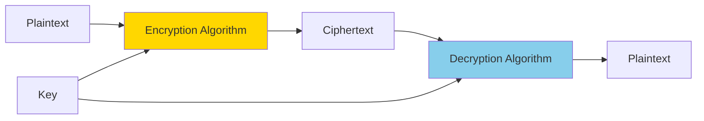

### Why Encryption Matters

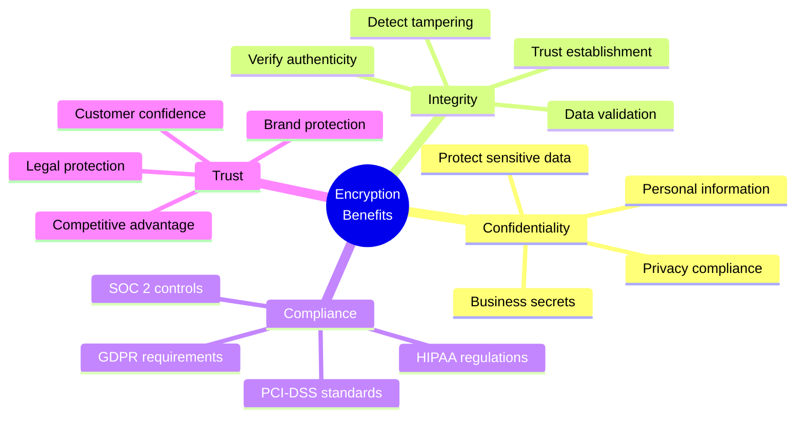

## Encryption Fundamentals

### Encryption Components

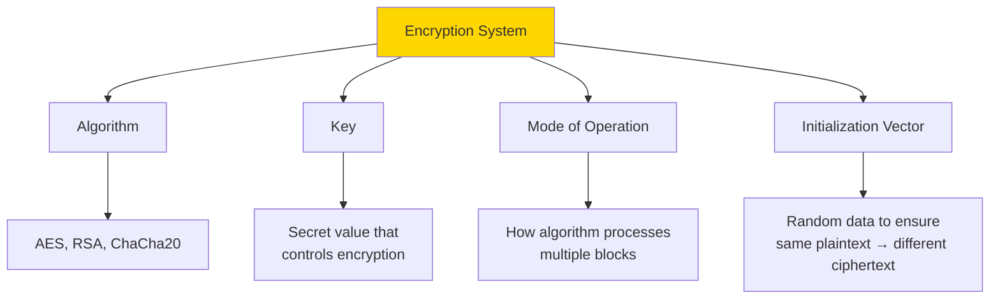

**Kerckhoffs's Principle**: A cryptographic system should be secure even if everything about the system, except the key, is public knowledge.

### Encryption vs Encoding vs Hashing

```mermaid
graph TB
    subgraph Encryption
        A1[Plaintext] --> A2[Encrypt with Key]
        A2 --> A3[Ciphertext]
        A3 --> A4[Decrypt with Key]
        A4 --> A5[Plaintext]
    end
    
    subgraph Encoding
        B1[Data] --> B2[Encode]
        B2 --> B3[Encoded Data]
        B3 --> B4[Decode]
        B4 --> B5[Data]
    end
    
    subgraph Hashing
        C1[Data] --> C2[Hash Function]
        C2 --> C3[Fixed-Size Hash]
        C3 --> C4[Cannot Reverse]
    end
    
    %% Apply styles to individual nodes
    style A1 fill:#E1F5FE
    style A2 fill:#E1F5FE
    style A3 fill:#E1F5FE
    style A4 fill:#E1F5FE
    style A5 fill:#E1F5FE

    style B1 fill:#FFF3E0
    style B2 fill:#FFF3E0
    style B3 fill:#FFF3E0
    style B4 fill:#FFF3E0
    style B5 fill:#FFF3E0

    style C1 fill:#F3E5F5
    style C2 fill:#F3E5F5
    style C3 fill:#F3E5F5
    style C4 fill:#F3E5F5
```

**Key Differences**:
- **Encryption**: Reversible with key, protects confidentiality
- **Encoding**: Reversible without key, data representation
- **Hashing**: One-way, data integrity verification

### Cipher Types

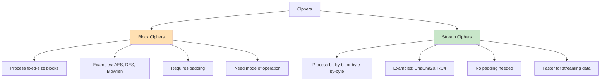

## Symmetric Encryption

### Concept

In symmetric encryption, the same key is used for both encryption and decryption. It's fast and efficient for large amounts of data.

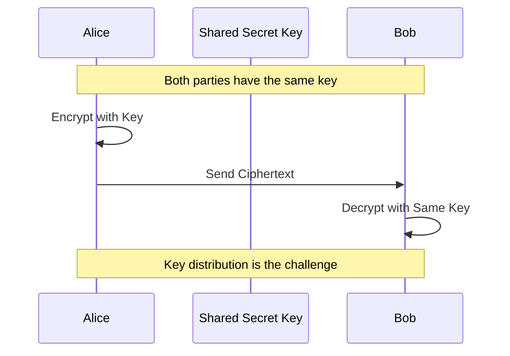

### Common Symmetric Algorithms

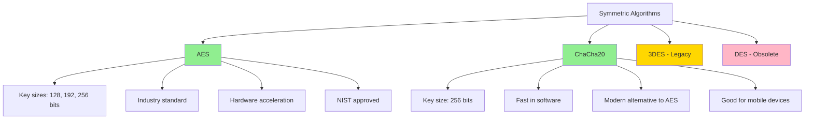

### AES (Advanced Encryption Standard)

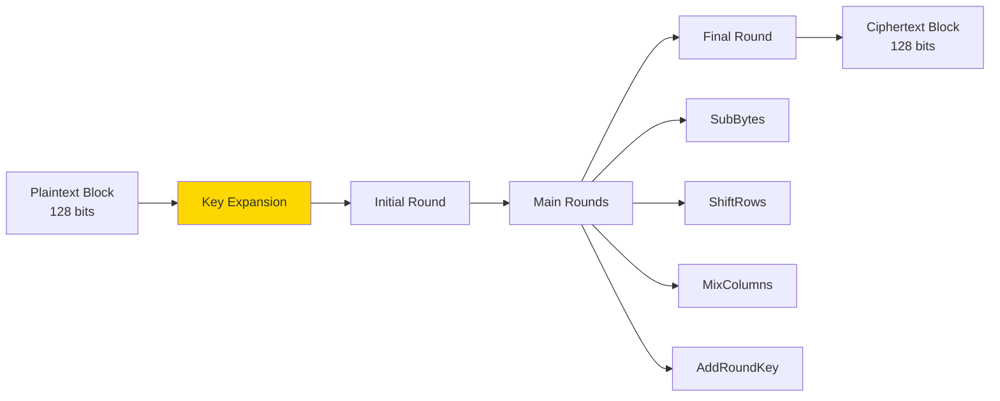

**Implementation Example**:

```javascript
const crypto = require('crypto');

// AES-256-GCM encryption
function encryptAES(plaintext, key) {
  const iv = crypto.randomBytes(16); // 128-bit IV
  const cipher = crypto.createCipheriv('aes-256-gcm', key, iv);
  
  let ciphertext = cipher.update(plaintext, 'utf8', 'hex');
  ciphertext += cipher.final('hex');
  
  const authTag = cipher.getAuthTag();
  
  return {
    ciphertext,
    iv: iv.toString('hex'),
    authTag: authTag.toString('hex')
  };
}

// AES-256-GCM decryption
function decryptAES(encrypted, key) {
  const decipher = crypto.createDecipheriv(
    'aes-256-gcm',
    key,
    Buffer.from(encrypted.iv, 'hex')
  );
  
  decipher.setAuthTag(Buffer.from(encrypted.authTag, 'hex'));
  
  let plaintext = decipher.update(encrypted.ciphertext, 'hex', 'utf8');
  plaintext += decipher.final('utf8');
  
  return plaintext;
}

// Usage
const key = crypto.randomBytes(32); // 256-bit key
const message = 'Sensitive data';
const encrypted = encryptAES(message, key);
const decrypted = decryptAES(encrypted, key);
```

### Block Cipher Modes of Operation

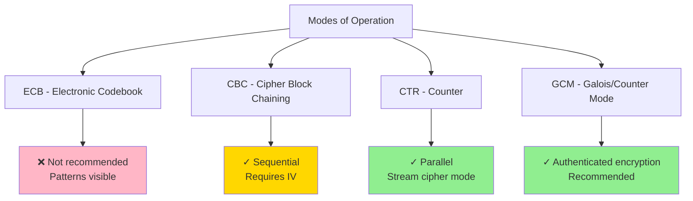

**Mode Selection**:
- **GCM**: Recommended for most cases (authenticated encryption)
- **CBC**: Legacy systems, ensure proper IV handling
- **CTR**: Good for parallel processing
- **ECB**: Never use (insecure - patterns leak)

### Symmetric Encryption Use Cases

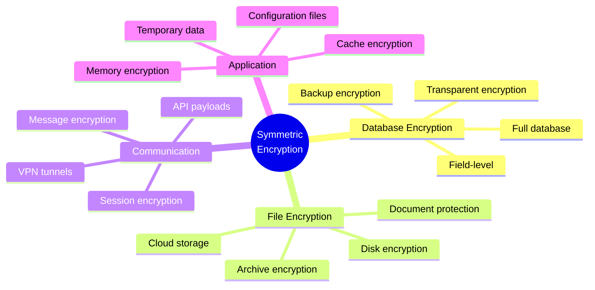

## Asymmetric Encryption

### Concept

Asymmetric encryption uses a pair of keys: a public key for encryption and a private key for decryption. Anyone can encrypt with the public key, but only the private key holder can decrypt.

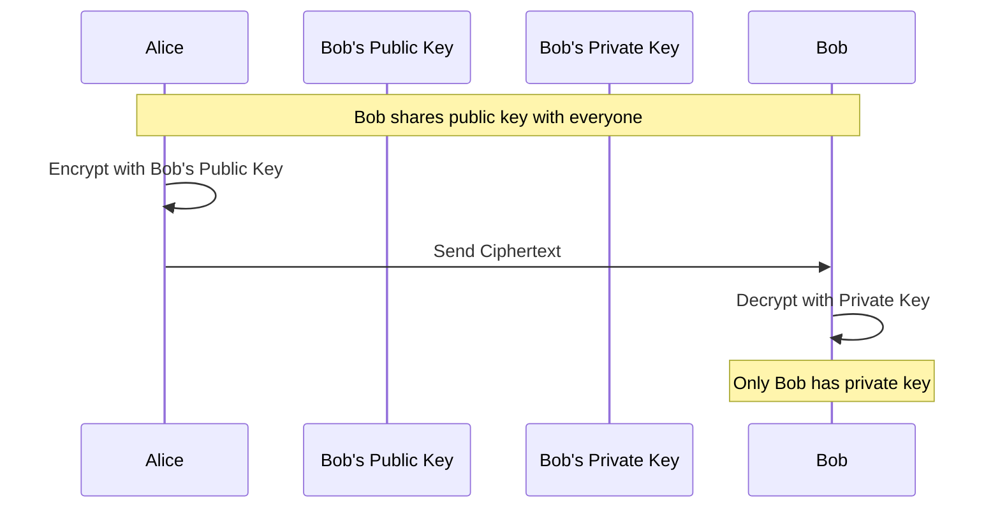

### Public Key Infrastructure (PKI)

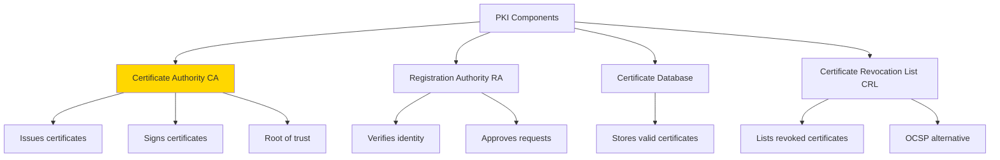

### Common Asymmetric Algorithms

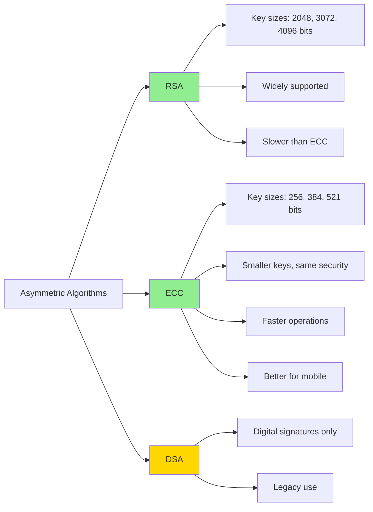

### RSA Key Generation and Usage

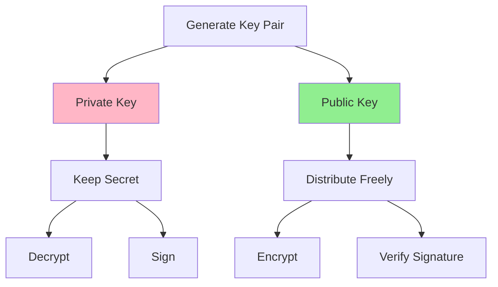

**Implementation Example**:

```javascript
const crypto = require('crypto');

// Generate RSA key pair
function generateKeyPair() {
  const { publicKey, privateKey } = crypto.generateKeyPairSync('rsa', {
    modulusLength: 4096,
    publicKeyEncoding: {
      type: 'spki',
      format: 'pem'
    },
    privateKeyEncoding: {
      type: 'pkcs8',
      format: 'pem',
      cipher: 'aes-256-cbc',
      passphrase: 'strong-passphrase'
    }
  });
  
  return { publicKey, privateKey };
}

// RSA encryption
function encryptRSA(plaintext, publicKey) {
  return crypto.publicEncrypt(
    {
      key: publicKey,
      padding: crypto.constants.RSA_PKCS1_OAEP_PADDING,
      oaepHash: 'sha256'
    },
    Buffer.from(plaintext)
  );
}

// RSA decryption
function decryptRSA(ciphertext, privateKey, passphrase) {
  return crypto.privateDecrypt(
    {
      key: privateKey,
      passphrase: passphrase,
      padding: crypto.constants.RSA_PKCS1_OAEP_PADDING,
      oaepHash: 'sha256'
    },
    ciphertext
  );
}
```

### Elliptic Curve Cryptography (ECC)

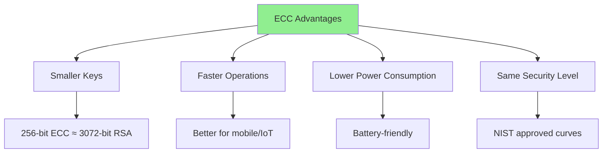

**Common Curves**:
- **P-256** (secp256r1): NIST standard, widely supported
- **P-384** (secp384r1): Higher security
- **Curve25519**: Modern, fast, secure
- **Ed25519**: For digital signatures

### Hybrid Encryption

Most systems use both symmetric and asymmetric encryption together.

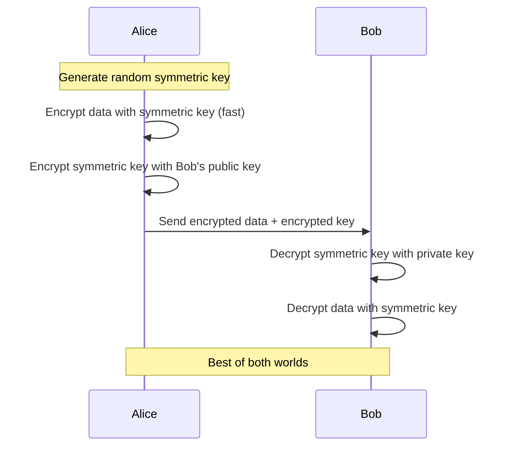

**Why Hybrid?**
- Symmetric: Fast for large data
- Asymmetric: Secure key exchange
- Combined: Efficient and secure

```javascript
// Hybrid encryption
function hybridEncrypt(plaintext, recipientPublicKey) {
  // Generate random symmetric key
  const symmetricKey = crypto.randomBytes(32);
  
  // Encrypt data with symmetric key (AES)
  const encryptedData = encryptAES(plaintext, symmetricKey);
  
  // Encrypt symmetric key with recipient's public key (RSA)
  const encryptedKey = encryptRSA(symmetricKey, recipientPublicKey);
  
  return {
    encryptedData,
    encryptedKey: encryptedKey.toString('base64')
  };
}

function hybridDecrypt(encrypted, privateKey, passphrase) {
  // Decrypt symmetric key
  const symmetricKey = decryptRSA(
    Buffer.from(encrypted.encryptedKey, 'base64'),
    privateKey,
    passphrase
  );
  
  // Decrypt data
  return decryptAES(encrypted.encryptedData, symmetricKey);
}
```

## Hashing and Digital Signatures

### Cryptographic Hashing

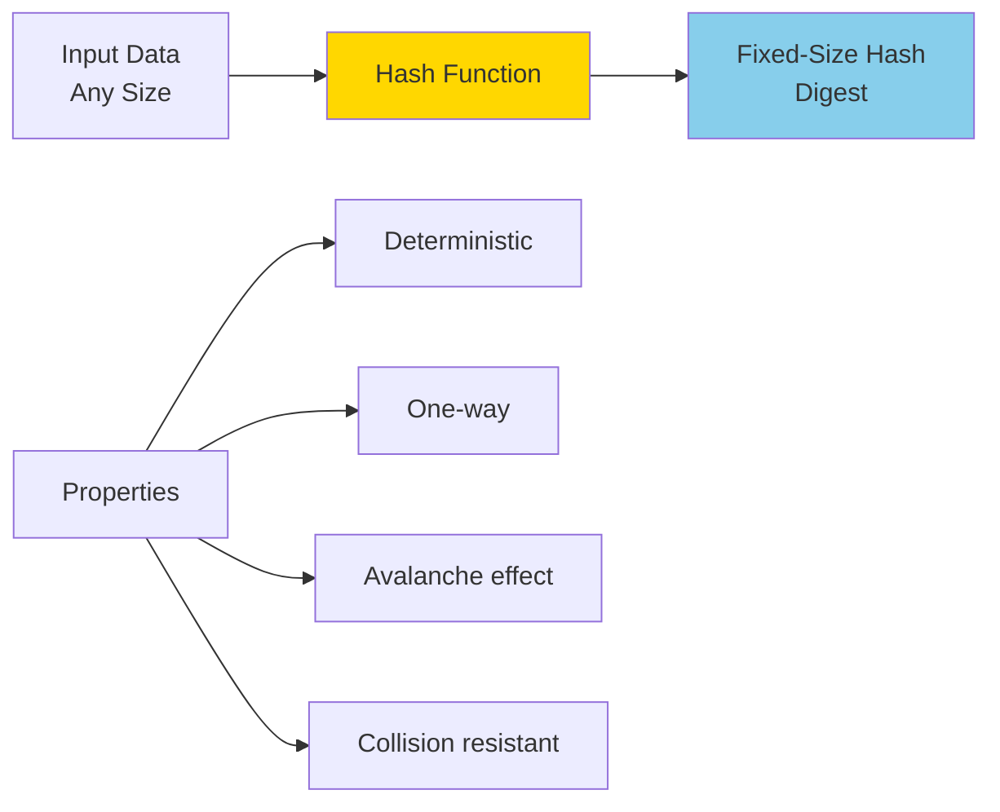

### Hash Function Properties

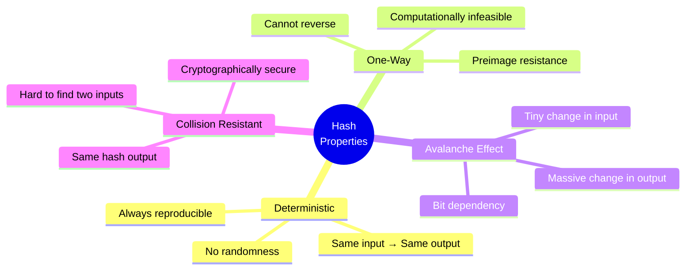

### Common Hash Algorithms

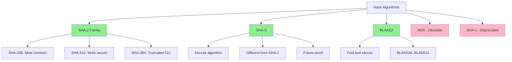

**Implementation**:

```javascript
const crypto = require('crypto');

// Hash functions
function hashSHA256(data) {
  return crypto.createHash('sha256').update(data).digest('hex');
}

function hashSHA512(data) {
  return crypto.createHash('sha512').update(data).digest('hex');
}

// HMAC (Hash-based Message Authentication Code)
function createHMAC(message, secret) {
  return crypto.createHmac('sha256', secret).update(message).digest('hex');
}

function verifyHMAC(message, secret, expectedHMAC) {
  const calculatedHMAC = createHMAC(message, secret);
  return crypto.timingSafeEqual(
    Buffer.from(calculatedHMAC),
    Buffer.from(expectedHMAC)
  );
}
```

### Digital Signatures

Digital signatures provide authentication, non-repudiation, and integrity.

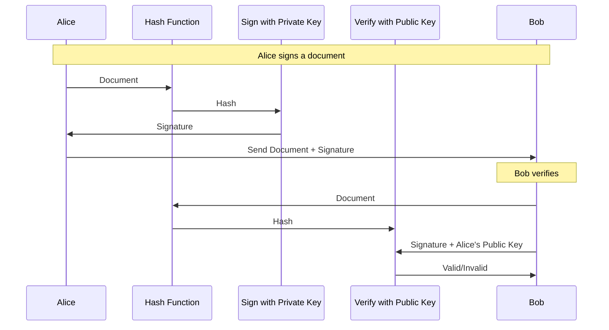

**Signature Process**:

```mermaid
flowchart LR
    A[Document] --> B[Hash]
    B --> C[Encrypt Hash<br/>with Private Key]
    C --> D[Digital Signature]
    
    E[Document] --> F[Hash]
    D --> G[Decrypt with<br/>Public Key]
    F --> H[Compare Hashes]
    G --> H
    H --> I{Match?}
    I -->|Yes| J[Valid Signature]
    I -->|No| K[Invalid Signature]
    
    style D fill:#FFD700
    style J fill:#90EE90
    style K fill:#FFB6C6
```

**Implementation**:

```javascript
// Create digital signature
function signData(data, privateKey, passphrase) {
  const sign = crypto.createSign('SHA256');
  sign.update(data);
  sign.end();
  
  return sign.sign({
    key: privateKey,
    passphrase: passphrase
  });
}

// Verify digital signature
function verifySignature(data, signature, publicKey) {
  const verify = crypto.createVerify('SHA256');
  verify.update(data);
  verify.end();
  
  return verify.verify(publicKey, signature);
}

// Usage
const { publicKey, privateKey } = generateKeyPair();
const document = 'Important contract';

const signature = signData(document, privateKey, 'passphrase');
const isValid = verifySignature(document, signature, publicKey);
console.log('Signature valid:', isValid);
```

## Key Management

### Key Lifecycle

```mermaid
flowchart LR
    A[Generation] --> B[Distribution]
    B --> C[Storage]
    C --> D[Usage]
    D --> E[Rotation]
    E --> F[Revocation]
    F --> G[Destruction]
    
    A --> A1[Strong randomness]
    B --> B1[Secure channels]
    C --> C1[Encrypted storage]
    D --> D1[Access control]
    E --> E1[Regular schedule]
    F --> F1[Immediate action]
    G --> G1[Secure deletion]
    
    style A fill:#E1F5FE
    style G fill:#FFEBEE
```

### Key Storage Hierarchy

```mermaid
graph TD
    A[Key Storage] --> B[Hardware Security Module HSM]
    A --> C[Key Management Service KMS]
    A --> D[Secure Enclave]
    A --> E[Software Storage]
    
    B --> B1[Highest security]
    B --> B2[FIPS 140-2 Level 3/4]
    B --> B3[Tamper-resistant]
    
    C --> C1[Cloud-based]
    C --> C2[Centralized management]
    C --> C3[AWS KMS, Azure Key Vault]
    
    D --> D1[Device-level security]
    D --> D2[iOS Secure Enclave]
    D --> D3[Android KeyStore]
    
    E --> E1[Encrypted files]
    E --> E2[Environment variables]
    E --> E3[Lowest security]
    
    style B fill:#90EE90
    style C fill:#90EE90
    style D fill:#FFD700
    style E fill:#FFB6C6
```

### Key Management Best Practices

```mermaid
mindmap
  root((Key<br/>Management))
    Generation
      Use CSPRNG
      Sufficient entropy
      Proper key length
      Secure environment
    Storage
      Never hardcode
      Encrypt keys
      HSM/KMS
      Access control
    Rotation
      Regular schedule
      Automated process
      Version control
      Backward compatibility
    Protection
      Principle of least privilege
      Separation of duties
      Audit logging
      Secure deletion
```

**Implementation**:

```javascript
// Key management example
class KeyManager {
  constructor(kmsClient) {
    this.kms = kmsClient;
    this.keyCache = new Map();
  }
  
  // Generate new data encryption key
  async generateDataKey(keyId) {
    const { plaintext, ciphertext } = await this.kms.generateDataKey({
      KeyId: keyId,
      KeySpec: 'AES_256'
    });
    
    return { plaintext, encrypted: ciphertext };
  }
  
  // Rotate encryption key
  async rotateKey(oldKeyId) {
    const newKeyId = await this.kms.createKey({
      KeyUsage: 'ENCRYPT_DECRYPT',
      Origin: 'AWS_KMS'
    });
    
    // Re-encrypt all data with new key
    await this.reencryptData(oldKeyId, newKeyId);
    
    // Schedule old key for deletion
    await this.kms.scheduleKeyDeletion({
      KeyId: oldKeyId,
      PendingWindowInDays: 30
    });
    
    return newKeyId;
  }
  
  // Envelope encryption pattern
  async envelopeEncrypt(data, masterKeyId) {
    // Generate data encryption key
    const { plaintext: dek, encrypted: encryptedDek } = 
      await this.generateDataKey(masterKeyId);
    
    // Encrypt data with DEK
    const encryptedData = encryptAES(data, dek);
    
    // Clear DEK from memory
    dek.fill(0);
    
    return {
      encryptedData,
      encryptedKey: encryptedDek
    };
  }
}
```

### Key Rotation Strategy

```mermaid
sequenceDiagram
    participant S as System
    participant K as Key Management
    participant D as Data Store
    
    Note over S,D: Regular key rotation
    
    S->>K: Generate new key (Key V2)
    K-->>S: New key created
    
    loop For each encrypted item
        S->>D: Read encrypted data
        D-->>S: Encrypted with Key V1
        S->>S: Decrypt with Key V1
        S->>S: Encrypt with Key V2
        S->>D: Store re-encrypted data
    end
    
    S->>K: Mark Key V1 for deletion
    K->>K: Wait grace period
    K->>K: Delete Key V1
    
    Note over S,D: Rotation complete
```

## Transport Layer Security (TLS)

### TLS Handshake Process

```mermaid
sequenceDiagram
    participant C as Client
    participant S as Server
    
    C->>S: ClientHello (supported ciphers, TLS version)
    S->>C: ServerHello (selected cipher, certificate)
    S->>C: Certificate (public key)
    S->>C: ServerHelloDone
    
    C->>C: Verify certificate
    C->>C: Generate pre-master secret
    C->>S: Encrypted pre-master secret
    
    Note over C,S: Both derive session keys
    
    C->>S: ChangeCipherSpec
    C->>S: Finished (encrypted)
    S->>C: ChangeCipherSpec
    S->>C: Finished (encrypted)
    
    Note over C,S: Secure connection established
```

### TLS Versions

```mermaid
graph TD
    A[TLS Versions] --> B[TLS 1.3 - Current]
    A --> C[TLS 1.2 - Acceptable]
    A --> D[TLS 1.1 - Deprecated]
    A --> E[TLS 1.0 - Deprecated]
    A --> F[SSL 3.0 - Obsolete]
    
    B --> B1[Faster handshake]
    B --> B2[Better security]
    B --> B3[Forward secrecy required]
    B --> B4[Removed weak ciphers]
    
    C --> C1[Widely supported]
    C --> C2[Still secure if configured properly]
    
    style B fill:#90EE90
    style C fill:#FFD700
    style D fill:#FFB6C6
    style E fill:#FFB6C6
    style F fill:#FFB6C6
```

### Certificate Validation

```mermaid
flowchart TD
    A[Receive Certificate] --> B{Valid Period?}
    B -->|No| Z[Reject]
    B -->|Yes| C{Trusted CA?}
    C -->|No| Z
    C -->|Yes| D{Valid Signature?}
    D -->|No| Z
    D -->|Yes| E{Domain Match?}
    E -->|No| Z
    E -->|Yes| F{Not Revoked?}
    F -->|No| Z
    F -->|Yes| G[Accept]
    
    style G fill:#90EE90
    style Z fill:#FFB6C6
```

**TLS Configuration**:

```javascript
const https = require('https');
const fs = require('fs');

// Secure TLS server
const options = {
  key: fs.readFileSync('private-key.pem'),
  cert: fs.readFileSync('certificate.pem'),
  ca: fs.readFileSync('ca-certificate.pem'),
  
  // Security settings
  minVersion: 'TLSv1.2',
  maxVersion: 'TLSv1.3',
  ciphers: [
    'TLS_AES_256_GCM_SHA384',
    'TLS_CHACHA20_POLY1305_SHA256',
    'TLS_AES_128_GCM_SHA256',
    'ECDHE-RSA-AES256-GCM-SHA384'
  ].join(':'),
  honorCipherOrder: true,
  
  // Require client certificates
  requestCert: true,
  rejectUnauthorized: true
};

const server = https.createServer(options, (req, res) => {
  res.writeHead(200);
  res.end('Secure connection\n');
});

server.listen(443);
```

### Certificate Pinning

```mermaid
graph LR
    A[Certificate Pinning] --> B[Pin Public Key]
    A --> C[Pin Certificate]
    
    B --> B1[More flexible]
    B --> B2[Survives cert renewal]
    B --> B3[Recommended]
    
    C --> C1[More restrictive]
    C --> C2[Must update on renewal]
    
    style B fill:#90EE90
    style C fill:#FFD700
```

```javascript
// Certificate pinning
const https = require('https');
const crypto = require('crypto');

const EXPECTED_PIN = 'sha256/AAAAAAAAAAAAAAAAAAAAAAAAAAAAAAAAAAAAAAAAAAA=';

function verifyPinning(cert) {
  const pubkey = cert.pubkey;
  const actual = crypto.createHash('sha256').update(pubkey).digest('base64');
  const actualPin = `sha256/${actual}`;
  
  return actualPin === EXPECTED_PIN;
}

const options = {
  checkServerIdentity: (host, cert) => {
    if (!verifyPinning(cert)) {
      throw new Error('Certificate pin mismatch');
    }
  }
};

https.get('https://api.example.com', options, (res) => {
  // Handle response
});
```

## Data-at-Rest Encryption

### Encryption Layers

```mermaid
graph TD
    A[Data-at-Rest Encryption] --> B[Full Disk Encryption]
    A --> C[File-Level Encryption]
    A --> D[Database Encryption]
    A --> E[Application-Level Encryption]
    
    B --> B1[BitLocker, LUKS]
    B --> B2[Transparent to apps]
    B --> B3[Protection if device stolen]
    
    C --> C1[Individual files]
    C --> C2[Selective protection]
    
    D --> D1[Transparent Data Encryption]
    D --> D2[Column-level encryption]
    
    E --> E1[Field-level encryption]
    E --> E2[Most granular control]
    
    style E fill:#90EE90
```

### Database Encryption Strategies

```mermaid
graph TB
    subgraph "Transparent Data Encryption (TDE)"
        A1[Database Engine] --> A2[Encryption Layer]
        A2 --> A3[Encrypted Storage]
    end
    
    subgraph "Application-Level"
        B1[Application] --> B2[Encrypt Fields]
        B2 --> B3[Database Storage]
    end
    
    subgraph "Column-Level"
        C1[Database] --> C2[Encrypt Columns]
        C2 --> C3[Selective Encryption]
    end
    
    style "Transparent Data Encryption (TDE)" fill:#C8E6C9
    style "Application-Level" fill:#FFE0B2
    style "Column-Level" fill:#E1F5FE
```

**Comparison**:

| Method | Pros | Cons | Use Case |
|--------|------|------|----------|
| TDE | Transparent, no code changes | Encrypts everything, less granular | Compliance requirements |
| Column-Level | Selective, database-managed | Performance impact on encrypted columns | Specific sensitive fields |
| Application-Level | Fine-grained control, key separation | Code complexity, performance | Maximum security |

**Implementation Example**:

```javascript
// Application-level field encryption
class FieldEncryption {
  constructor(encryptionKey) {
    this.key = encryptionKey;
  }
  
  // Encrypt sensitive fields before storage
  encryptDocument(doc) {
    return {
      id: doc.id,
      name: doc.name,
      // Encrypt sensitive fields
      ssn: this.encrypt(doc.ssn),
      creditCard: this.encrypt(doc.creditCard),
      email: doc.email, // Not sensitive, no encryption
      createdAt: doc.createdAt
    };
  }
  
  // Decrypt when retrieving
  decryptDocument(encryptedDoc) {
    return {
      ...encryptedDoc,
      ssn: this.decrypt(encryptedDoc.ssn),
      creditCard: this.decrypt(encryptedDoc.creditCard)
    };
  }
  
  encrypt(plaintext) {
    if (!plaintext) return null;
    const result = encryptAES(plaintext, this.key);
    return JSON.stringify(result); // Store as JSON
  }
  
  decrypt(encrypted) {
    if (!encrypted) return null;
    const parsed = JSON.parse(encrypted);
    return decryptAES(parsed, this.key);
  }
}

// Usage with database
const fieldEncryption = new FieldEncryption(masterKey);

async function saveUser(userData) {
  const encrypted = fieldEncryption.encryptDocument(userData);
  await db.users.insert(encrypted);
}

async function getUser(userId) {
  const encrypted = await db.users.findById(userId);
  return fieldEncryption.decryptDocument(encrypted);
}
```

### Envelope Encryption Pattern

```mermaid
sequenceDiagram
    participant A as Application
    participant M as Master Key (KMS)
    participant D as Data Encryption Key
    participant S as Storage
    
    A->>M: Request data key
    M->>A: Plain DEK + Encrypted DEK
    A->>A: Encrypt data with plain DEK
    A->>A: Clear plain DEK from memory
    A->>S: Store encrypted data + encrypted DEK
    
    Note over A,S: Decryption process
    
    A->>S: Retrieve encrypted data + encrypted DEK
    S->>A: Return both
    A->>M: Decrypt DEK
    M->>A: Plain DEK
    A->>A: Decrypt data with DEK
    A->>A: Clear DEK from memory
```

**Benefits**:
- Master key never leaves KMS
- Each data object has unique key
- Fast encryption (symmetric)
- Easy key rotation

```javascript
// Envelope encryption implementation
async function envelopeEncrypt(data, kmsClient, masterKeyId) {
  // Generate data encryption key
  const { Plaintext: dek, CiphertextBlob: encryptedDek } = 
    await kmsClient.generateDataKey({
      KeyId: masterKeyId,
      KeySpec: 'AES_256'
    });
  
  // Encrypt data with DEK
  const encryptedData = encryptAES(data, dek);
  
  // Securely clear DEK
  dek.fill(0);
  
  // Store both encrypted data and encrypted DEK
  return {
    data: encryptedData,
    key: encryptedDek.toString('base64')
  };
}

async function envelopeDecrypt(envelope, kmsClient) {
  // Decrypt the DEK
  const { Plaintext: dek } = await kmsClient.decrypt({
    CiphertextBlob: Buffer.from(envelope.key, 'base64')
  });
  
  // Decrypt data with DEK
  const plaintext = decryptAES(envelope.data, dek);
  
  // Clear DEK
  dek.fill(0);
  
  return plaintext;
}
```

## Data-in-Transit Encryption

### Protection Layers

```mermaid
graph TB
    A[Data in Transit] --> B[Network Layer]
    A --> C[Transport Layer]
    A --> D[Application Layer]
    
    B --> B1[IPSec]
    B --> B2[VPN]
    
    C --> C1[TLS/SSL]
    C --> C2[DTLS for UDP]
    
    D --> D1[HTTPS]
    D --> D2[SFTP]
    D --> D3[Secure WebSockets]
    
    style C fill:#FFD700
```

### API Communication Security

```mermaid
sequenceDiagram
    participant C as Client
    participant A as API Gateway
    participant S as Service
    
    Note over C,S: All communications over TLS
    
    C->>A: HTTPS Request + API Key
    A->>A: Validate API Key
    A->>A: Rate Limiting
    A->>S: Forward Request (internal TLS)
    S->>S: Process Request
    S->>A: Response
    A->>C: HTTPS Response
    
    Note over C,S: End-to-end encryption
```

### Message Encryption

```mermaid
flowchart LR
    A[Message] --> B[Encrypt with Recipient's Public Key]
    B --> C[Add Signature with Sender's Private Key]
    C --> D[Encrypted & Signed Message]
    D --> E[Send over Channel]
    
    F[Receive Message] --> G[Verify Signature with Sender's Public Key]
    G --> H[Decrypt with Recipient's Private Key]
    H --> I[Original Message]
    
    style D fill:#FFD700
    style I fill:#90EE90
```

**Implementation**:

```javascript
// Secure message transmission
class SecureMessaging {
  constructor(senderPrivateKey, senderPassphrase) {
    this.privateKey = senderPrivateKey;
    this.passphrase = senderPassphrase;
  }
  
  // Encrypt and sign message
  async sendMessage(message, recipientPublicKey) {
    // 1. Encrypt message with recipient's public key
    const encrypted = hybridEncrypt(message, recipientPublicKey);
    
    // 2. Sign the encrypted message
    const signature = signData(
      JSON.stringify(encrypted),
      this.privateKey,
      this.passphrase
    );
    
    // 3. Combine encrypted message and signature
    return {
      payload: encrypted,
      signature: signature.toString('base64'),
      timestamp: Date.now()
    };
  }
  
  // Verify and decrypt message
  async receiveMessage(secureMessage, senderPublicKey, recipientPrivateKey, passphrase) {
    // 1. Verify signature
    const isValid = verifySignature(
      JSON.stringify(secureMessage.payload),
      Buffer.from(secureMessage.signature, 'base64'),
      senderPublicKey
    );
    
    if (!isValid) {
      throw new Error('Invalid signature - message tampered or not from claimed sender');
    }
    
    // 2. Check timestamp (prevent replay attacks)
    const age = Date.now() - secureMessage.timestamp;
    if (age > 300000) { // 5 minutes
      throw new Error('Message too old');
    }
    
    // 3. Decrypt message
    const decrypted = hybridDecrypt(
      secureMessage.payload,
      recipientPrivateKey,
      passphrase
    );
    
    return decrypted;
  }
}
```

### WebSocket Security

```mermaid
graph LR
    A[Client] --> B[WSS:// Secure WebSocket]
    B --> C[TLS Layer]
    C --> D[WebSocket Protocol]
    D --> E[Server]
    
    B --> B1[Port 443]
    B --> B2[TLS 1.3]
    B --> B3[Certificate validation]
    
    style C fill:#FFD700
```

```javascript
// Secure WebSocket connection
const WebSocket = require('ws');
const https = require('https');
const fs = require('fs');

// Server with TLS
const server = https.createServer({
  cert: fs.readFileSync('cert.pem'),
  key: fs.readFileSync('key.pem')
});

const wss = new WebSocket.Server({ 
  server,
  verifyClient: (info) => {
    // Verify client certificate or token
    const token = info.req.headers['authorization'];
    return verifyToken(token);
  }
});

wss.on('connection', (ws) => {
  ws.on('message', (message) => {
    // Additional encryption layer if needed
    const decrypted = decryptMessage(message);
    processMessage(decrypted);
  });
});

server.listen(443);
```

## End-to-End Encryption

### E2EE Concept

```mermaid
sequenceDiagram
    participant A as Alice
    participant S as Server
    participant B as Bob
    
    Note over A,B: Keys generated on devices
    
    A->>A: Encrypt with Bob's Public Key
    A->>S: Send Encrypted Message
    Note over S: Server cannot decrypt
    S->>B: Forward Encrypted Message
    B->>B: Decrypt with Private Key
    
    Note over A,B: Server never has plaintext
```

### Signal Protocol

The Signal Protocol provides perfect forward secrecy and future secrecy.

```mermaid
graph TD
    A[Signal Protocol] --> B[X3DH Key Agreement]
    A --> C[Double Ratchet]
    
    B --> B1[Initial key exchange]
    B --> B2[Identity keys]
    B --> B3[Prekeys]
    B --> B4[One-time prekeys]
    
    C --> C1[Symmetric key ratchet]
    C --> C2[DH ratchet]
    C --> C3[Forward secrecy]
    C --> C4[Future secrecy]
    
    style A fill:#FFD700
```

**Key Features**:
- **Perfect Forward Secrecy**: Past messages secure even if keys compromised
- **Future Secrecy**: Automatic healing from key compromise
- **Asynchronous**: Works with offline recipients

### E2EE Implementation Considerations

```mermaid
mindmap
  root((E2EE<br/>Considerations))
    Key Management
      Device key storage
      Backup/recovery
      Multi-device sync
      Key verification
    Performance
      Encryption overhead
      Battery impact
      Network usage
      Storage requirements
    Usability
      Transparent to users
      Key verification UI
      Account recovery
      Error handling
    Compliance
      Legal requirements
      Data retention
      Law enforcement
      Export controls
```

**Simplified E2EE Example**:

```javascript
// Basic E2EE messaging
class E2EEMessaging {
  constructor(userId) {
    this.userId = userId;
    // Generate keys per device
    const { publicKey, privateKey } = generateKeyPair();
    this.publicKey = publicKey;
    this.privateKey = privateKey;
  }
  
  // Register public key with server
  async registerPublicKey(server) {
    await server.storePublicKey(this.userId, this.publicKey);
  }
  
  // Send encrypted message
  async sendMessage(recipientId, message, server) {
    // Get recipient's public key
    const recipientPublicKey = await server.getPublicKey(recipientId);
    
    // Encrypt message (only recipient can decrypt)
    const encrypted = hybridEncrypt(message, recipientPublicKey);
    
    // Send to server (server cannot read content)
    await server.deliverMessage(recipientId, {
      from: this.userId,
      encrypted: encrypted,
      timestamp: Date.now()
    });
  }
  
  // Receive and decrypt message
  async receiveMessage(encryptedMessage) {
    // Only this device can decrypt
    const plaintext = hybridDecrypt(
      encryptedMessage.encrypted,
      this.privateKey,
      'device-passphrase'
    );
    
    return {
      from: encryptedMessage.from,
      message: plaintext,
      timestamp: encryptedMessage.timestamp
    };
  }
  
  // Verify sender's identity (trust on first use)
  async verifySender(senderId, server) {
    const currentKey = await server.getPublicKey(senderId);
    const expectedFingerprint = this.storedFingerprints[senderId];
    
    const fingerprint = crypto
      .createHash('sha256')
      .update(currentKey)
      .digest('hex');
    
    if (expectedFingerprint && fingerprint !== expectedFingerprint) {
      throw new Error('Key changed - potential MITM attack');
    }
    
    return fingerprint;
  }
}
```

## Best Practices

### Encryption Checklist

```mermaid
mindmap
  root((Encryption<br/>Best Practices))
    Algorithm Selection
      Use industry standards
      AES-256 or ChaCha20
      RSA 4096 or ECC P-256
      SHA-256 or better
    Key Management
      Never hardcode keys
      Use KMS/HSM
      Regular rotation
      Secure generation
    Implementation
      Use proven libraries
      Don't implement crypto
      Keep updated
      Follow guidelines
    Modes and Padding
      Use authenticated encryption
      GCM or ChaCha20-Poly1305
      Avoid ECB mode
      OAEP for RSA
```

### Common Mistakes to Avoid

```mermaid
graph TD
    A[Encryption Mistakes] --> B[Weak Algorithms]
    A --> C[Poor Key Management]
    A --> D[Implementation Flaws]
    A --> E[Misuse of Modes]
    
    B --> B1[❌ DES, MD5, SHA-1]
    B --> B2[❌ RC4, ECB mode]
    
    C --> C1[❌ Hardcoded keys]
    C --> C2[❌ Predictable keys]
    C --> C3[❌ No key rotation]
    
    D --> D1[❌ Custom crypto]
    D --> D2[❌ Ignoring IV]
    D --> D3[❌ Reusing nonces]
    
    E --> E1[❌ Using ECB]
    E --> E2[❌ No authentication]
    E --> E3[❌ Static IVs]
    
    style A fill:#FFB6C6
```

### Security Principles

```mermaid
flowchart TD
    A[Encryption Security] --> B[Use Standard Algorithms]
    A --> C[Authenticated Encryption]
    A --> D[Key Separation]
    A --> E[Defense in Depth]
    
    B --> B1[AES-GCM, ChaCha20-Poly1305]
    C --> C1[Detect tampering]
    D --> D1[Different keys for different purposes]
    E --> E1[Multiple encryption layers]
    
    style A fill:#FFD700
```

**Golden Rules**:

1. **Never roll your own crypto**: Use well-tested libraries
2. **Use authenticated encryption**: GCM, ChaCha20-Poly1305
3. **Proper key management**: HSM/KMS, rotation, separation
4. **Random IVs/nonces**: Never reuse for same key
5. **Timing-safe comparisons**: Prevent timing attacks
6. **Secure key derivation**: Use PBKDF2, bcrypt, or Argon2
7. **Keep crypto updated**: Patch vulnerabilities promptly
8. **Test thoroughly**: Unit tests, security audits

### Algorithm Recommendations

```mermaid
graph TB
    A[Use Cases] --> B[Data-at-Rest]
    A --> C[Data-in-Transit]
    A --> D[Password Storage]
    A --> E[Digital Signatures]
    A --> F[Key Exchange]
    
    B --> B1[✓ AES-256-GCM]
    C --> C1[✓ TLS 1.3]
    D --> D1[✓ Argon2id]
    D --> D2[✓ bcrypt]
    E --> E1[✓ RSA-PSS]
    E --> E2[✓ Ed25519]
    F --> F1[✓ ECDH]
    F --> F2[✓ X25519]
    
    style B1 fill:#90EE90
    style C1 fill:#90EE90
    style D1 fill:#90EE90
    style E1 fill:#90EE90
    style F1 fill:#90EE90
```

### Performance Considerations

```mermaid
graph LR
    A[Performance] --> B[Hardware Acceleration]
    A --> C[Algorithm Choice]
    A --> D[Key Size Balance]
    
    B --> B1[AES-NI instructions]
    B --> B2[Use when available]
    
    C --> C1[ChaCha20 for software]
    C --> C2[AES for hardware]
    
    D --> D1[256-bit symmetric sufficient]
    D --> D2[4096-bit RSA for high security]
    D --> D3[256-bit ECC ≈ 3072-bit RSA]
    
    style B fill:#90EE90
```

### Encryption Performance Comparison

```javascript
// Performance testing example
const crypto = require('crypto');

function benchmarkEncryption(algorithm, data, iterations = 1000) {
  const key = crypto.randomBytes(32);
  const iv = crypto.randomBytes(16);
  
  console.time(algorithm);
  for (let i = 0; i < iterations; i++) {
    const cipher = crypto.createCipheriv(algorithm, key, iv);
    cipher.update(data);
    cipher.final();
  }
  console.timeEnd(algorithm);
}

const testData = Buffer.alloc(1024 * 1024); // 1MB

benchmarkEncryption('aes-256-gcm', testData);
benchmarkEncryption('aes-256-cbc', testData);
benchmarkEncryption('chacha20-poly1305', testData);
```

## Compliance and Regulations

### Encryption Requirements

```mermaid
graph TD
    A[Compliance Frameworks] --> B[GDPR]
    A --> C[HIPAA]
    A --> D[PCI-DSS]
    A --> E[SOC 2]
    
    B --> B1[Encryption of personal data]
    B --> B2[Pseudonymization]
    B --> B3[Data breach notification]
    
    C --> C1[ePHI encryption]
    C --> C2[Encryption in transit]
    C --> C3[Key management]
    
    D --> D1[Cardholder data encryption]
    D --> D2[Strong cryptography]
    D --> D3[Key rotation]
    
    E --> E1[Encryption controls]
    E --> E2[Key management procedures]
    E --> E3[Audit logging]
    
    style A fill:#FFD700
```

### Export Restrictions

```mermaid
mindmap
  root((Export<br/>Controls))
    Considerations
      Encryption strength limits
      Country restrictions
      License requirements
      Open source exceptions
    Best Practices
      Review regulations
      Document compliance
      Restrict access
      Use approved algorithms
```

## Quantum-Resistant Cryptography

### Quantum Computing Threat

```mermaid
graph TD
    A[Quantum Threat] --> B[Current Algorithms at Risk]
    
    B --> C[RSA]
    B --> D[ECC]
    B --> E[DH Key Exchange]
    
    C --> F[Shor's Algorithm]
    D --> F
    E --> F
    
    F --> G[Can break in polynomial time]
    
    A --> H[Quantum-Safe Alternatives]
    H --> I[Lattice-based]
    H --> J[Hash-based]
    H --> K[Code-based]
    H --> L[Multivariate]
    
    style A fill:#FFB6C6
    style H fill:#90EE90
```

### Post-Quantum Cryptography (PQC)

```mermaid
flowchart LR
    A[NIST PQC Standardization] --> B[Finalists]
    
    B --> C[CRYSTALS-Kyber]
    B --> D[CRYSTALS-Dilithium]
    B --> E[FALCON]
    B --> F[SPHINCS+]
    
    C --> G[Key Encapsulation]
    D --> H[Digital Signatures]
    E --> H
    F --> H
    
    style A fill:#FFD700
```

**Preparation Strategy**:

```javascript
// Crypto agility - design for algorithm changes
class CryptoProvider {
  constructor(config) {
    this.algorithm = config.algorithm || 'aes-256-gcm';
    this.version = config.version || 'v1';
  }
  
  encrypt(data, key) {
    // Version prefix allows future algorithm changes
    const result = this.encryptWithAlgorithm(data, key, this.algorithm);
    return `${this.version}:${result}`;
  }
  
  decrypt(versionedData, key) {
    const [version, encrypted] = versionedData.split(':');
    const algorithm = this.getAlgorithmForVersion(version);
    return this.decryptWithAlgorithm(encrypted, key, algorithm);
  }
  
  // Future: add quantum-resistant algorithms
  getAlgorithmForVersion(version) {
    const algorithms = {
      'v1': 'aes-256-gcm',
      'v2': 'chacha20-poly1305',
      // 'v3': 'kyber-1024' // Post-quantum future
    };
    return algorithms[version] || algorithms['v1'];
  }
}
```

## Troubleshooting Common Issues

### Debugging Encryption Problems

```mermaid
flowchart TD
    A[Encryption Error] --> B{Type of Error?}
    
    B -->|Cannot Decrypt| C[Key Issues]
    B -->|Performance| D[Algorithm Choice]
    B -->|Integration| E[Implementation]
    
    C --> C1[Wrong key]
    C --> C2[Key rotation]
    C --> C3[Encoding mismatch]
    
    D --> D1[Use hardware acceleration]
    D --> D2[Optimize key derivation]
    D --> D3[Batch operations]
    
    E --> E1[IV/nonce reuse]
    E --> E2[Wrong mode]
    E --> E3[Padding errors]
    
    style A fill:#FFB6C6
```

### Testing Encryption

```javascript
// Comprehensive encryption tests
describe('Encryption Tests', () => {
  test('Encryption produces different outputs', () => {
    const key = crypto.randomBytes(32);
    const plaintext = 'test message';
    
    const encrypted1 = encryptAES(plaintext, key);
    const encrypted2 = encryptAES(plaintext, key);
    
    // IVs should be different
    expect(encrypted1.iv).not.toBe(encrypted2.iv);
    expect(encrypted1.ciphertext).not.toBe(encrypted2.ciphertext);
  });
  
  test('Decrypt returns original plaintext', () => {
    const key = crypto.randomBytes(32);
    const plaintext = 'sensitive data';
    
    const encrypted = encryptAES(plaintext, key);
    const decrypted = decryptAES(encrypted, key);
    
    expect(decrypted).toBe(plaintext);
  });
  
  test('Tampering detected', () => {
    const key = crypto.randomBytes(32);
    const plaintext = 'important message';
    
    const encrypted = encryptAES(plaintext, key);
    
    // Tamper with ciphertext
    encrypted.ciphertext = encrypted.ciphertext.slice(0, -2) + 'XX';
    
    // Should throw on decryption (GCM auth tag validation)
    expect(() => decryptAES(encrypted, key)).toThrow();
  });
  
  test('Key rotation works', async () => {
    const oldKey = crypto.randomBytes(32);
    const newKey = crypto.randomBytes(32);
    const data = 'test data';
    
    // Encrypt with old key
    const encrypted = encryptAES(data, oldKey);
    
    // Decrypt with old key
    const decrypted = decryptAES(encrypted, oldKey);
    
    // Re-encrypt with new key
    const reencrypted = encryptAES(decrypted, newKey);
    
    // Verify with new key
    const final = decryptAES(reencrypted, newKey);
    expect(final).toBe(data);
  });
});
```

---

## Related Documentation

- [Authentication](./authentication.md) - Using encryption for auth tokens
- [Authorization](./authorization.md) - Encrypting authorization data
- [Data Security](./data_security.md) - Comprehensive data protection
- [Network Security](./network_security.md) - TLS and network encryption
- [Key Management](./key_management.md) - Advanced key management
- [Compliance](./compliance.md) - Regulatory encryption requirements
- [Best Practices](./best_practises.md) - Overall security guidelines

---

## Key Takeaways

### Essential Principles

1. **Use Standard Algorithms**: AES-256-GCM, ChaCha20-Poly1305, RSA-4096, ECC P-256
2. **Authenticated Encryption**: Always use modes that provide integrity (GCM, Poly1305)
3. **Proper Key Management**: HSM/KMS, rotation, separation, never hardcode
4. **Defense in Depth**: Multiple layers of encryption
5. **Stay Current**: Update libraries, follow NIST guidance
6. **Test Thoroughly**: Unit tests, penetration testing
7. **Plan for Quantum**: Crypto agility, monitor PQC standards
8. **Compliance First**: Meet regulatory requirements (GDPR, HIPAA, PCI-DSS)

### Quick Reference

```mermaid
graph LR
    A[Encryption Quick Guide] --> B[Data at Rest]
    A --> C[Data in Transit]
    A --> D[Passwords]
    A --> E[Keys]
    
    B --> B1[AES-256-GCM]
    C --> C1[TLS 1.3]
    D --> D1[Argon2/bcrypt]
    E --> E1[HSM/KMS]
    
    style A fill:#FFD700
```

**Remember**: Encryption is only as strong as its implementation and key management. Use proven libraries, follow best practices, and never implement your own cryptographic algorithms.

---
