# Monitoring and Auditing

## Table of Contents
1. [Overview](#overview)
2. [Monitoring Fundamentals](#monitoring-fundamentals)
3. [Logging Strategy](#logging-strategy)
4. [Security Information and Event Management (SIEM)](#security-information-and-event-management-siem)
5. [Log Aggregation and Analysis](#log-aggregation-and-analysis)
6. [Audit Logging](#audit-logging)
7. [Real-Time Monitoring and Alerting](#real-time-monitoring-and-alerting)
8. [Metrics and KPIs](#metrics-and-kpis)
9. [Anomaly Detection](#anomaly-detection)
10. [Compliance and Regulatory Auditing](#compliance-and-regulatory-auditing)
11. [Incident Detection and Response](#incident-detection-and-response)
12. [Log Retention and Management](#log-retention-and-management)
13. [Monitoring Best Practices](#monitoring-best-practices)
14. [Related Security Domains](#related-security-domains)

## Overview

Security monitoring and auditing are critical components of a comprehensive security strategy. They provide visibility into system activities, enable detection of security incidents, support forensic investigations, and demonstrate compliance with regulatory requirements.

### Why Monitoring and Auditing Matter

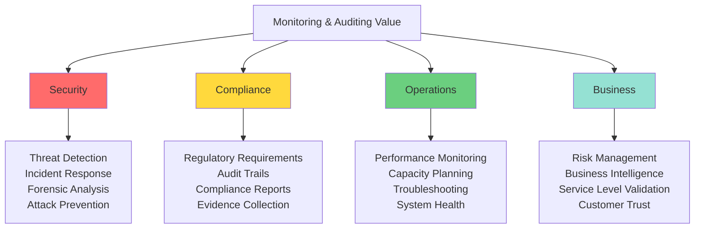

### Core Principles

| Principle | Description | Implementation |
|-----------|-------------|----------------|
| **Comprehensive Coverage** | Monitor all security-relevant events | Application, network, system, database logs |
| **Real-Time Detection** | Identify threats as they occur | Automated alerting, anomaly detection |
| **Tamper Resistance** | Protect log integrity | Centralized logging, write-once storage |
| **Actionable Intelligence** | Generate meaningful insights | Correlation, analysis, contextualization |
| **Regulatory Compliance** | Meet legal requirements | Retention policies, audit trails, reporting |

## Monitoring Fundamentals

### Monitoring Architecture

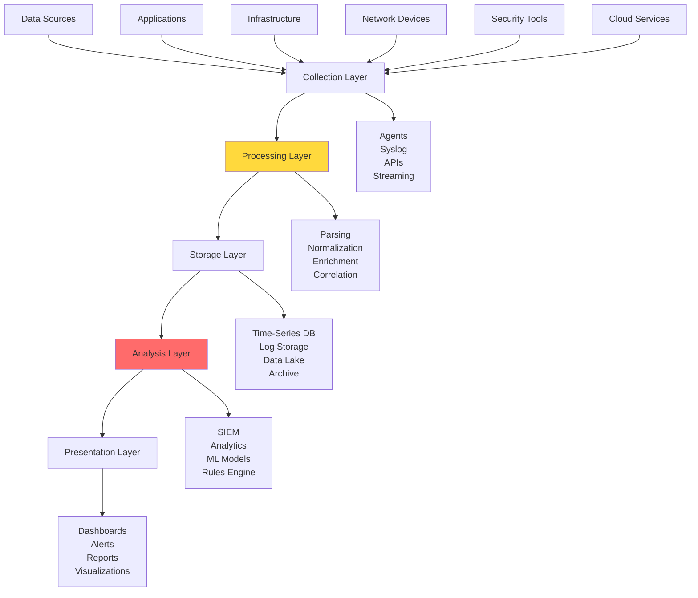

### Types of Monitoring

**1. Infrastructure Monitoring**
- Server health and performance
- Network device status
- Storage and database metrics
- Cloud resource utilization

**2. Application Monitoring**
- Application performance (APM)
- Error rates and exceptions
- User transactions
- API response times

**3. Security Monitoring**
- Authentication attempts
- Authorization failures
- Security policy violations
- Suspicious activities

**4. Business Monitoring**
- Transaction volumes
- User behavior patterns
- Service level indicators
- Business KPIs

### Observability Pillars

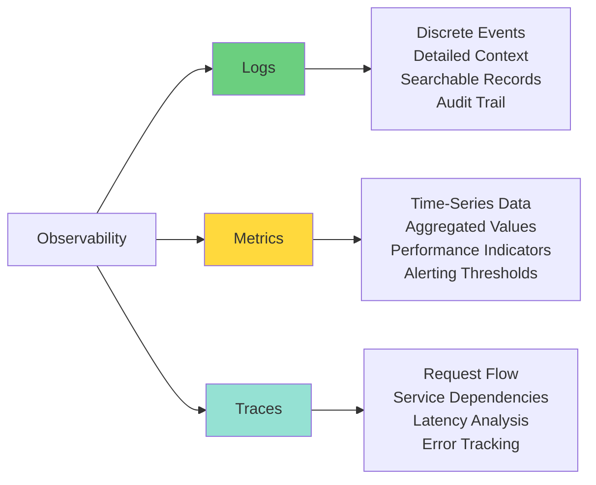

## Logging Strategy

### Structured Logging

**Structured vs Unstructured Logs**

```javascript
// UNSTRUCTURED - Difficult to parse
console.log('User john@example.com logged in from 192.168.1.100 at 2025-01-15 10:30:00');

// STRUCTURED - Machine parseable
const logger = require('winston');

logger.info('User login', {
  event: 'user_login',
  user_id: 'user_12345',
  email: 'john@example.com',
  ip_address: '192.168.1.100',
  timestamp: new Date().toISOString(),
  success: true,
  mfa_used: true,
  session_id: 'sess_abc123',
  user_agent: 'Mozilla/5.0...',
  geo_location: { country: 'US', city: 'New York' }
});
```

### Log Levels and Severity

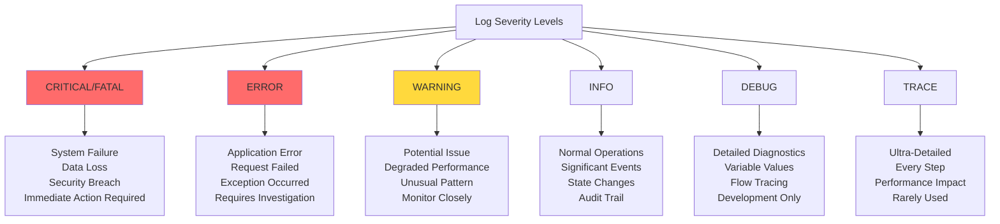

### What to Log

**Security Events**
```javascript
const securityEvents = {
  authentication: [
    'login_success',
    'login_failure',
    'logout',
    'password_change',
    'mfa_challenge',
    'account_locked',
    'session_created',
    'session_expired'
  ],
  
  authorization: [
    'access_granted',
    'access_denied',
    'privilege_escalation_attempt',
    'resource_access',
    'permission_change'
  ],
  
  dataAccess: [
    'sensitive_data_viewed',
    'data_exported',
    'data_modified',
    'data_deleted',
    'bulk_operation'
  ],
  
  securityViolations: [
    'injection_attempt',
    'xss_attempt',
    'rate_limit_exceeded',
    'suspicious_pattern',
    'policy_violation'
  ],
  
  systemEvents: [
    'configuration_change',
    'service_start',
    'service_stop',
    'system_error',
    'resource_exhaustion'
  ]
};
```

### Sensitive Data in Logs

**What NOT to Log**
```javascript
// Security logging with data masking
function createSecureLogEntry(event, data) {
  // Fields that should NEVER be logged
  const prohibitedFields = [
    'password',
    'creditCard',
    'ssn',
    'secret',
    'token',
    'apiKey',
    'privateKey'
  ];
  
  // Fields that should be masked
  const maskFields = [
    'email',
    'phone',
    'ipAddress'
  ];
  
  const sanitized = { ...data };
  
  // Remove prohibited fields
  prohibitedFields.forEach(field => {
    if (sanitized[field]) {
      sanitized[field] = '***REDACTED***';
    }
  });
  
  // Mask sensitive fields
  if (sanitized.email) {
    sanitized.email = maskEmail(sanitized.email);
  }
  
  if (sanitized.creditCard) {
    sanitized.creditCard = `****-****-****-${sanitized.creditCard.slice(-4)}`;
  }
  
  return {
    timestamp: new Date().toISOString(),
    event,
    ...sanitized
  };
}

function maskEmail(email) {
  const [local, domain] = email.split('@');
  return `${local[0]}***@${domain}`;
}
```

See [data_security.md](data_security.md) for comprehensive data protection strategies.

## Security Information and Event Management (SIEM)

### SIEM Architecture

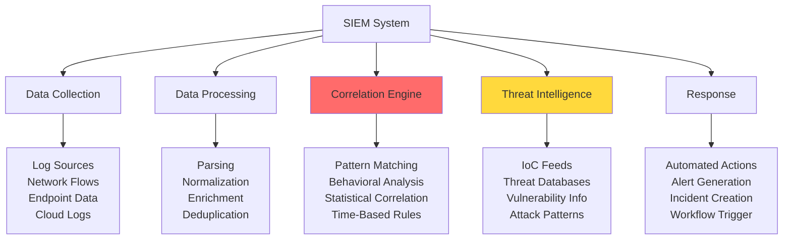

### SIEM Capabilities

**1. Log Aggregation**
- Centralized collection from all sources
- Standardized format and storage
- Long-term retention
- High-performance search

**2. Correlation and Analysis**
- Cross-source event correlation
- Pattern detection
- Behavioral baselining
- Statistical analysis

**3. Alerting and Notification**
- Real-time alert generation
- Priority-based escalation
- Multi-channel notifications
- Alert aggregation and suppression

**4. Compliance Reporting**
- Pre-built compliance templates
- Automated report generation
- Audit trail documentation
- Evidence collection

### SIEM Use Cases

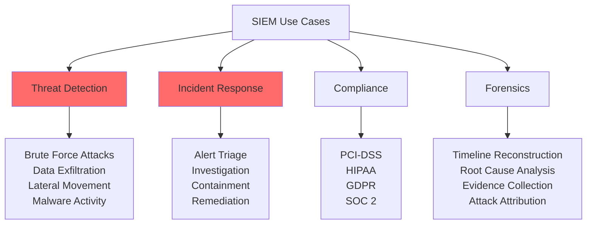

### SIEM Rule Examples

**Brute Force Detection**
```javascript
// Conceptual SIEM correlation rule
const bruteForceRule = {
  name: 'Brute Force Login Attempt',
  
  condition: {
    event: 'login_failure',
    threshold: 5,
    timeWindow: '5 minutes',
    groupBy: ['source_ip', 'target_user']
  },
  
  severity: 'HIGH',
  
  actions: [
    'generate_alert',
    'block_ip_address',
    'notify_security_team',
    'create_incident'
  ],
  
  metadata: {
    mitre_attack: 'T1110',
    category: 'Credential Access',
    tags: ['authentication', 'brute-force']
  }
};
```

**Impossible Travel Detection**
```javascript
const impossibleTravelRule = {
  name: 'Impossible Travel Detected',
  
  condition: {
    event: 'successful_login',
    detect: 'geographic_anomaly',
    
    logic: `
      Two successful logins from same user
      within 1 hour from locations >500 miles apart
      where travel time < actual time difference
    `
  },
  
  calculation: (login1, login2) => {
    const distance = calculateDistance(login1.location, login2.location);
    const timeDiff = login2.timestamp - login1.timestamp;
    const requiredSpeed = distance / (timeDiff / 3600); // mph
    
    return requiredSpeed > 500; // Impossible by car
  },
  
  severity: 'CRITICAL',
  
  actions: [
    'generate_alert',
    'suspend_session',
    'require_mfa_verification',
    'notify_user'
  ]
};
```

## Log Aggregation and Analysis

### Log Collection Methods

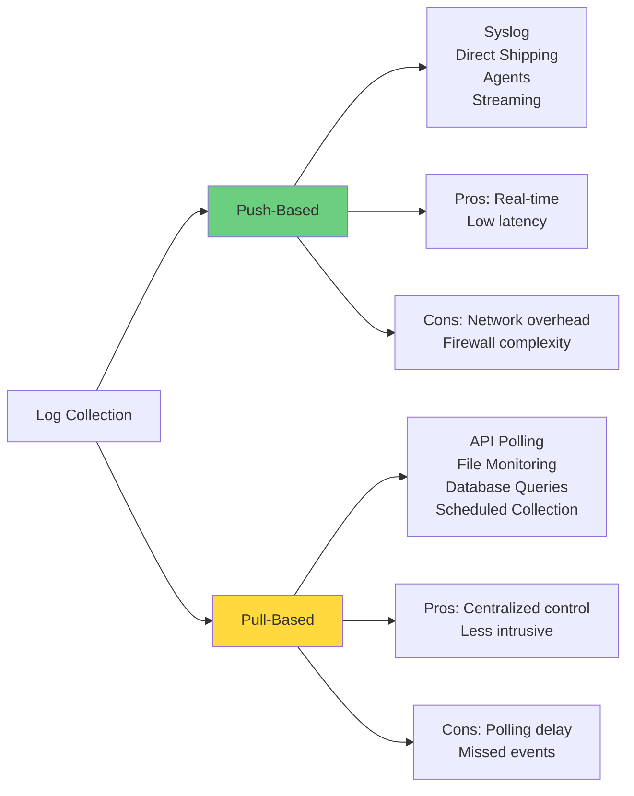

### Log Processing Pipeline

**ELK Stack Example (Elasticsearch, Logstash, Kibana)**
```javascript
// Logstash configuration concept
const logstashPipeline = {
  input: {
    beats: { port: 5044 },
    syslog: { port: 514 },
    http: { port: 8080 }
  },
  
  filter: {
    // Parse JSON logs
    json: { source: 'message' },
    
    // Parse timestamps
    date: {
      match: ['timestamp', 'ISO8601']
    },
    
    // Enrich with GeoIP
    geoip: {
      source: 'client_ip',
      target: 'geo'
    },
    
    // Add tags
    mutate: {
      add_field: {
        'environment': 'production',
        'log_source': 'application'
      }
    }
  },
  
  output: {
    elasticsearch: {
      hosts: ['es-cluster:9200'],
      index: 'security-logs-%{+YYYY.MM.dd}'
    },
    
    // Alert on critical events
    if: {
      condition: '[severity] == "CRITICAL"',
      action: 'send_to_pagerduty'
    }
  }
};
```

### Log Analysis Techniques

**1. Pattern Matching**
```javascript
// Search for SQL injection attempts
const sqlInjectionPattern = {
  query: {
    bool: {
      should: [
        { match: { request: 'UNION SELECT' }},
        { match: { request: 'DROP TABLE' }},
        { match: { request: "'; --" }},
        { wildcard: { request: '*../etc/passwd*' }}
      ],
      minimum_should_match: 1
    }
  }
};
```

**2. Statistical Analysis**
```javascript
// Baseline and anomaly detection
const performanceBaseline = {
  metric: 'response_time',
  
  calculateBaseline: (data) => {
    const mean = calculateMean(data);
    const stdDev = calculateStdDev(data);
    
    return {
      mean,
      stdDev,
      threshold: mean + (3 * stdDev) // 3 sigma
    };
  },
  
  detectAnomaly: (value, baseline) => {
    return value > baseline.threshold;
  }
};
```

**3. Time-Series Analysis**
```javascript
// Detect unusual activity patterns
const timeSeriesAnalysis = {
  metric: 'login_attempts',
  interval: '1h',
  
  detectSpike: (current, historical) => {
    const historicalAvg = calculateAverage(historical);
    const historicalStdDev = calculateStdDev(historical);
    
    // Alert if current > 3 standard deviations
    return current > (historicalAvg + (3 * historicalStdDev));
  }
};
```

## Audit Logging

### Audit Trail Requirements

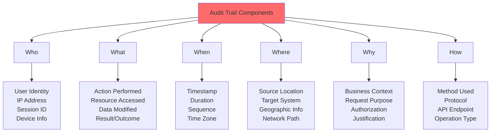

### Comprehensive Audit Logging

```javascript
// Audit log schema
const auditLogSchema = {
  // Core identification
  audit_id: 'uuid',
  timestamp: 'ISO8601',
  
  // Actor (Who)
  actor: {
    user_id: 'string',
    username: 'string',
    email: 'string',
    role: 'string',
    session_id: 'string',
    ip_address: 'string',
    user_agent: 'string',
    device_id: 'string'
  },
  
  // Action (What)
  action: {
    type: 'string', // CREATE, READ, UPDATE, DELETE
    category: 'string', // data_access, config_change, etc.
    resource_type: 'string',
    resource_id: 'string',
    operation: 'string',
    result: 'string', // success, failure, partial
    error_code: 'string'
  },
  
  // Context (Why & How)
  context: {
    request_id: 'string',
    api_endpoint: 'string',
    http_method: 'string',
    request_size: 'number',
    response_size: 'number',
    duration_ms: 'number',
    business_purpose: 'string'
  },
  
  // Changes (What Changed)
  changes: {
    before: 'object',
    after: 'object',
    fields_modified: ['array']
  },
  
  // Metadata
  metadata: {
    environment: 'string',
    application: 'string',
    version: 'string',
    compliance_tags: ['array']
  }
};

// Example audit log entry
function createAuditLog(event) {
  return {
    audit_id: generateUUID(),
    timestamp: new Date().toISOString(),
    
    actor: {
      user_id: event.user.id,
      username: event.user.username,
      email: maskEmail(event.user.email),
      role: event.user.role,
      session_id: event.sessionId,
      ip_address: event.ipAddress,
      user_agent: event.userAgent
    },
    
    action: {
      type: 'UPDATE',
      category: 'data_modification',
      resource_type: 'customer_record',
      resource_id: event.customerId,
      operation: 'update_email',
      result: 'success'
    },
    
    context: {
      request_id: event.requestId,
      api_endpoint: '/api/customers/:id',
      http_method: 'PUT',
      duration_ms: event.duration
    },
    
    changes: {
      before: { email: maskEmail(event.oldEmail) },
      after: { email: maskEmail(event.newEmail) },
      fields_modified: ['email']
    },
    
    metadata: {
      environment: 'production',
      application: 'customer-portal',
      version: '2.3.1',
      compliance_tags: ['GDPR', 'PCI-DSS']
    }
  };
}
```

See [compliance.md](compliance.md) for regulatory audit requirements.

### Audit Log Integrity

**Ensuring Tamper-Proof Logs**

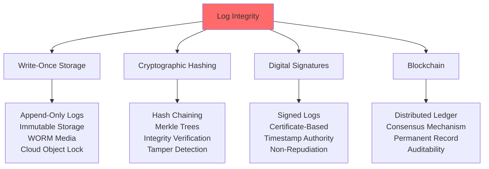

**Log Hashing Implementation**
```javascript
const crypto = require('crypto');

class SecureAuditLog {
  constructor() {
    this.logs = [];
    this.previousHash = '0';
  }
  
  addLog(logEntry) {
    const timestamp = Date.now();
    const data = JSON.stringify(logEntry);
    
    // Create hash chain
    const hash = crypto
      .createHash('sha256')
      .update(this.previousHash + timestamp + data)
      .digest('hex');
    
    const secureLog = {
      timestamp,
      data: logEntry,
      hash,
      previousHash: this.previousHash
    };
    
    this.logs.push(secureLog);
    this.previousHash = hash;
    
    return secureLog;
  }
  
  verifyIntegrity() {
    let previousHash = '0';
    
    for (const log of this.logs) {
      const calculatedHash = crypto
        .createHash('sha256')
        .update(previousHash + log.timestamp + JSON.stringify(log.data))
        .digest('hex');
      
      if (calculatedHash !== log.hash) {
        return { valid: false, tamperedLog: log };
      }
      
      previousHash = log.hash;
    }
    
    return { valid: true };
  }
}
```

## Real-Time Monitoring and Alerting

### Alert Management

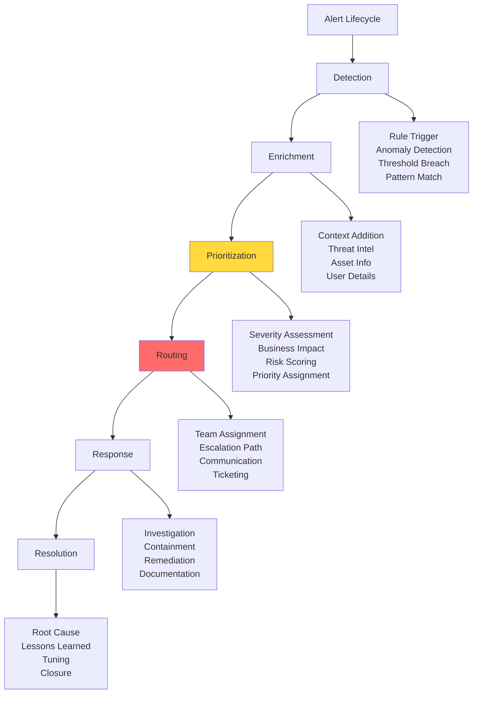

### Alert Configuration

```javascript
const alertConfig = {
  // Critical: Immediate response required
  critical: {
    severity: 'CRITICAL',
    channels: ['pagerduty', 'sms', 'email', 'slack'],
    escalation: {
      immediate: 'security-team',
      after_5min: 'security-lead',
      after_15min: 'ciso'
    },
    sla: {
      acknowledge: '5 minutes',
      resolve: '1 hour'
    }
  },
  
  // High: Urgent attention needed
  high: {
    severity: 'HIGH',
    channels: ['email', 'slack'],
    escalation: {
      immediate: 'security-team',
      after_30min: 'security-lead'
    },
    sla: {
      acknowledge: '15 minutes',
      resolve: '4 hours'
    }
  },
  
  // Medium: Monitor and investigate
  medium: {
    severity: 'MEDIUM',
    channels: ['email', 'ticketing-system'],
    escalation: {
      immediate: 'security-analyst'
    },
    sla: {
      acknowledge: '1 hour',
      resolve: '24 hours'
    }
  },
  
  // Low: Informational
  low: {
    severity: 'LOW',
    channels: ['ticketing-system'],
    escalation: {
      immediate: 'security-queue'
    },
    sla: {
      acknowledge: '24 hours',
      resolve: '7 days'
    }
  }
};
```

### Alert Fatigue Prevention

**Strategies to Reduce False Positives**

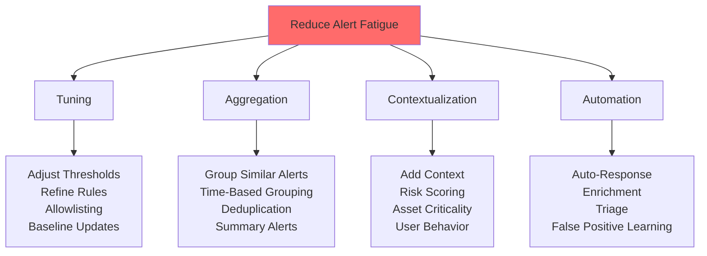

```javascript
// Alert aggregation example
class AlertAggregator {
  constructor() {
    this.alerts = new Map();
    this.windowSize = 5 * 60 * 1000; // 5 minutes
  }
  
  processAlert(alert) {
    const key = this.getAggregationKey(alert);
    
    if (!this.alerts.has(key)) {
      this.alerts.set(key, {
        firstSeen: Date.now(),
        count: 0,
        alerts: []
      });
      
      // Schedule aggregated alert
      setTimeout(() => this.sendAggregatedAlert(key), this.windowSize);
    }
    
    const aggregation = this.alerts.get(key);
    aggregation.count++;
    aggregation.alerts.push(alert);
  }
  
  getAggregationKey(alert) {
    // Group by type and source
    return `${alert.type}_${alert.sourceIp}`;
  }
  
  sendAggregatedAlert(key) {
    const aggregation = this.alerts.get(key);
    
    if (aggregation.count >= 5) {
      // Send single alert for multiple occurrences
      sendAlert({
        title: `Multiple ${aggregation.alerts[0].type} events`,
        count: aggregation.count,
        timeWindow: this.windowSize,
        samples: aggregation.alerts.slice(0, 3),
        severity: this.calculateSeverity(aggregation.count)
      });
    }
    
    this.alerts.delete(key);
  }
  
  calculateSeverity(count) {
    if (count >= 100) return 'CRITICAL';
    if (count >= 50) return 'HIGH';
    if (count >= 10) return 'MEDIUM';
    return 'LOW';
  }
}
```

## Metrics and KPIs

### Security Metrics Framework

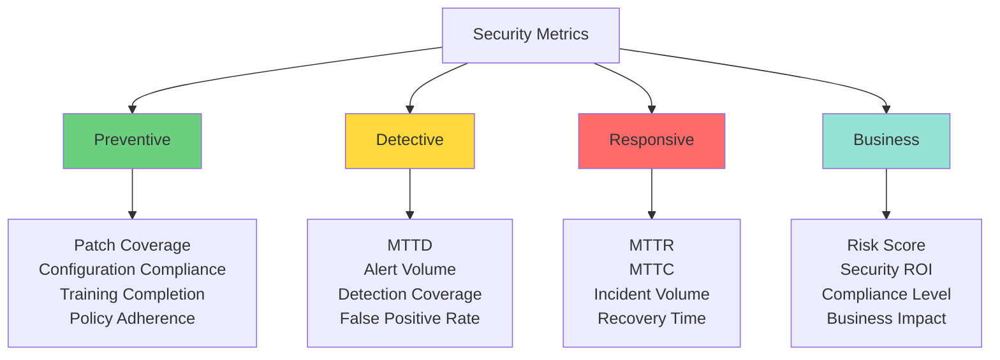

### Key Performance Indicators

**Mean Time Metrics**

| Metric | Definition | Target | Calculation |
|--------|------------|--------|-------------|
| **MTTD** | Mean Time to Detect | < 5 minutes | Time from breach to detection |
| **MTTA** | Mean Time to Acknowledge | < 15 minutes | Time from detection to acknowledgment |
| **MTTI** | Mean Time to Investigate | < 30 minutes | Time from acknowledgment to investigation start |
| **MTTC** | Mean Time to Contain | < 1 hour | Time from detection to containment |
| **MTTR** | Mean Time to Resolve | < 4 hours | Time from detection to full resolution |
| **MTTF** | Mean Time to Failure | Maximize | Average time between security incidents |

**Dashboard Metrics**
```javascript
const securityDashboard = {
  realtime: {
    activeAlerts: {
      critical: 2,
      high: 15,
      medium: 43,
      low: 128
    },
    
    recentIncidents: [
      {
        id: 'INC-2025-001',
        type: 'Brute Force Attack',
        status: 'Investigating',
        severity: 'HIGH',
        assignee: 'security-team'
      }
    ],
    
    systemHealth: {
      loggingPipeline: 'operational',
      storageUtilization: '67%',
      ingestionRate: '15,000 events/sec',
      queryLatency: '234ms'
    }
  },
  
  trends: {
    last24Hours: {
      totalEvents: 1250000,
      securityEvents: 45000,
      blockedAttempts: 3420,
      alertsGenerated: 186,
      incidentsCreated: 3
    },
    
    weekOverWeek: {
      events: '+12%',
      alerts: '-8%',
      incidents: '-25%',
      falsePositives: '-15%'
    }
  },
  
  performance: {
    mttd: '3.5 minutes',
    mtta: '8 minutes',
    mttc: '45 minutes',
    mttr: '2.3 hours',
    detectionRate: '98.5%',
    falsePositiveRate: '3.2%'
  }
};
```

## Anomaly Detection

### Anomaly Detection Approaches

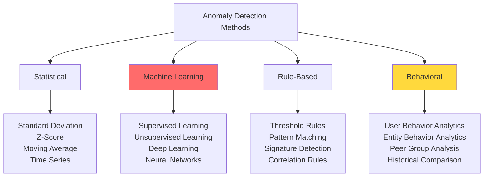

### Statistical Anomaly Detection

```javascript
// Z-score based anomaly detection
class StatisticalAnomalyDetector {
  constructor(threshold = 3) {
    this.threshold = threshold; // Standard deviations
    this.samples = [];
  }
  
  addSample(value) {
    this.samples.push(value);
    
    // Keep last 1000 samples for baseline
    if (this.samples.length > 1000) {
      this.samples.shift();
    }
  }
  
  isAnomaly(value) {
    if (this.samples.length < 30) {
      return false; // Need minimum samples
    }
    
    const mean = this.calculateMean();
    const stdDev = this.calculateStdDev(mean);
    const zScore = Math.abs((value - mean) / stdDev);
    
    return zScore > this.threshold;
  }
  
  calculateMean() {
    return this.samples.reduce((sum, val) => sum + val, 0) / this.samples.length;
  }
  
  calculateStdDev(mean) {
    const variance = this.samples.reduce((sum, val) => {
      return sum + Math.pow(val - mean, 2);
    }, 0) / this.samples.length;
    
    return Math.sqrt(variance);
  }
  
  getAnomalyScore(value) {
    const mean = this.calculateMean();
    const stdDev = this.calculateStdDev(mean);
    return Math.abs((value - mean) / stdDev);
  }
}

// Usage example
const loginDetector = new StatisticalAnomalyDetector(3);

// Build baseline
for (let hour = 0; hour < 168; hour++) { // One week
  const normalLogins = 100 + Math.random() * 50;
  loginDetector.addSample(normalLogins);
}

// Detect anomaly
const currentLogins = 500; // Unusual spike
if (loginDetector.isAnomaly(currentLogins)) {
  const score = loginDetector.getAnomalyScore(currentLogins);
  createAlert({
    type: 'login_spike',
    value: currentLogins,
    anomalyScore: score,
    severity: score > 5 ? 'CRITICAL' : 'HIGH'
  });
}
```

### User and Entity Behavior Analytics (UEBA)

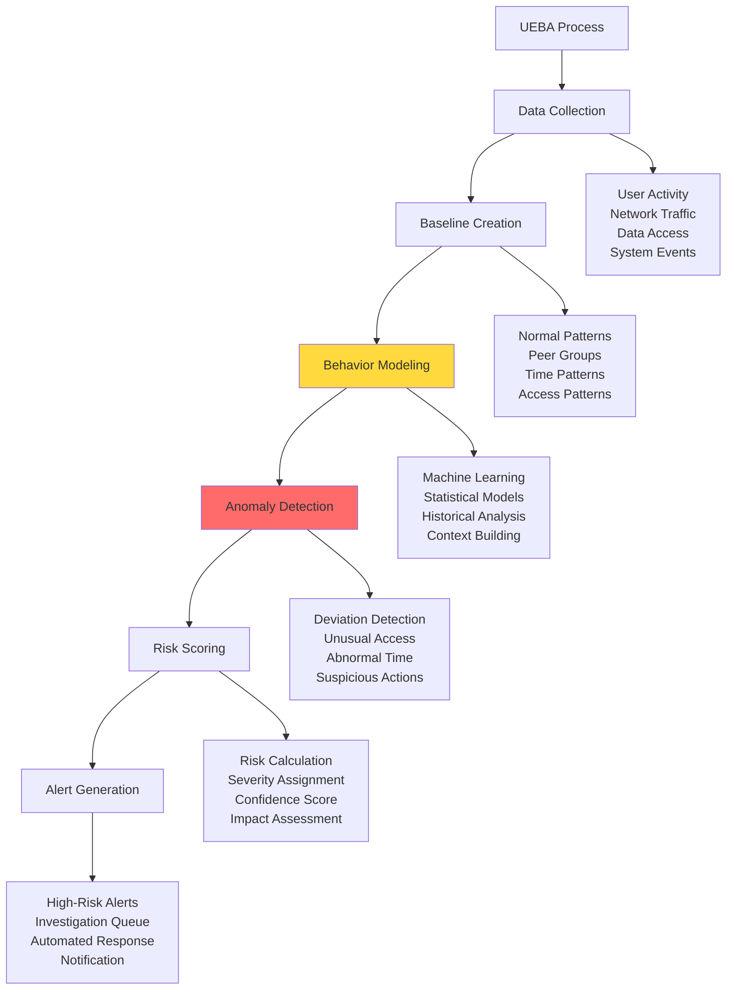

**UEBA Detection Scenarios**

```javascript
const uebaScenarios = {
  // Scenario 1: Unusual login time
  unusualLoginTime: {
    description: 'User login outside normal hours',
    baseline: {
      normalHours: [8, 9, 10, 11, 12, 13, 14, 15, 16, 17],
      normalDays: ['Mon', 'Tue', 'Wed', 'Thu', 'Fri']
    },
    detection: (loginTime) => {
      const hour = loginTime.getHours();
      const day = loginTime.toLocaleDateString('en', { weekday: 'short' });
      return !baseline.normalHours.includes(hour) || 
             !baseline.normalDays.includes(day);
    },
    riskScore: 6
  },
  
  // Scenario 2: Unusual data access volume
  unusualDataAccess: {
    description: 'User accessing more data than normal',
    baseline: {
      avgRecordsPerDay: 50,
      maxRecordsPerDay: 150,
      stdDev: 25
    },
    detection: (recordsAccessed) => {
      return recordsAccessed > (baseline.avgRecordsPerDay + 3 * baseline.stdDev);
    },
    riskScore: 8
  },
  
  // Scenario 3: Unusual geographic location
  unusualLocation: {
    description: 'User login from unusual location',
    baseline: {
      normalCountries: ['US'],
      normalCities: ['New York', 'Boston']
    },
    detection: (location) => {
      return !baseline.normalCountries.includes(location.country);
    },
    riskScore: 9
  },
  
  // Scenario 4: Privilege escalation
  privilegeEscalation: {
    description: 'User attempting to access higher privilege resources',
    baseline: {
      normalRole: 'user',
      normalPermissions: ['read', 'write']
    },
    detection: (action) => {
      return ['admin', 'delete', 'configure'].includes(action.type);
    },
    riskScore: 10
  },
  
  // Scenario 5: Lateral movement
  lateralMovement: {
    description: 'User accessing multiple systems rapidly',
    baseline: {
      maxSystemsPerHour: 3
    },
    detection: (systemsAccessed, timeWindow) => {
      return systemsAccessed.length > baseline.maxSystemsPerHour;
    },
    riskScore: 9
  }
};
```

### Machine Learning for Threat Detection

**Supervised Learning Example**
```javascript
// Conceptual ML-based threat detection
class MLThreatDetector {
  constructor() {
    this.model = null;
    this.features = [
      'failed_login_count',
      'login_time_deviation',
      'geographic_distance',
      'data_access_volume',
      'unusual_endpoints',
      'privilege_changes'
    ];
  }
  
  async train(trainingData) {
    // Training data: historical events labeled as benign or malicious
    const X = trainingData.map(d => this.extractFeatures(d));
    const y = trainingData.map(d => d.label); // 0 = benign, 1 = malicious
    
    // Train model (conceptual)
    this.model = await trainClassifier(X, y);
    
    return this.model.accuracy;
  }
  
  extractFeatures(event) {
    return {
      failed_login_count: this.getFailedLogins(event.userId, '1h'),
      login_time_deviation: this.calculateTimeDeviation(event.timestamp),
      geographic_distance: this.calculateGeoDistance(event.location),
      data_access_volume: this.getAccessVolume(event.userId, '1h'),
      unusual_endpoints: this.countUnusualEndpoints(event.userId, '1h'),
      privilege_changes: this.detectPrivilegeChanges(event.userId, '24h')
    };
  }
  
  async predict(event) {
    const features = this.extractFeatures(event);
    const prediction = await this.model.predict(features);
    
    return {
      isThreat: prediction.class === 1,
      confidence: prediction.probability,
      riskScore: prediction.probability * 10,
      features: features
    };
  }
  
  async analyzeEvent(event) {
    const result = await this.predict(event);
    
    if (result.isThreat && result.confidence > 0.8) {
      return {
        alert: true,
        severity: result.riskScore > 8 ? 'CRITICAL' : 'HIGH',
        message: `ML threat detected with ${(result.confidence * 100).toFixed(1)}% confidence`,
        riskScore: result.riskScore,
        recommendedActions: this.getRecommendedActions(result)
      };
    }
    
    return { alert: false };
  }
  
  getRecommendedActions(result) {
    const actions = [];
    
    if (result.features.failed_login_count > 5) {
      actions.push('Block IP address');
    }
    
    if (result.features.geographic_distance > 1000) {
      actions.push('Require MFA verification');
    }
    
    if (result.features.data_access_volume > 1000) {
      actions.push('Restrict data access');
    }
    
    return actions;
  }
}
```

## Compliance and Regulatory Auditing

### Compliance Framework Mapping

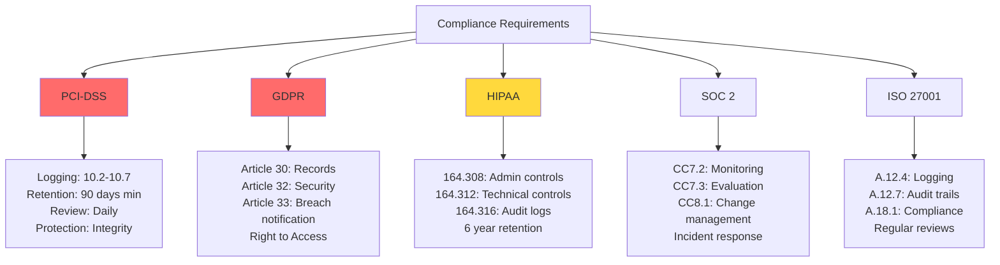

See [compliance.md](compliance.md) for detailed regulatory requirements.

### Audit Report Generation

```javascript
// Compliance audit report generator
class ComplianceAuditor {
  constructor(framework) {
    this.framework = framework; // 'PCI-DSS', 'GDPR', 'HIPAA', etc.
    this.requirements = this.loadRequirements(framework);
  }
  
  async generateAuditReport(startDate, endDate) {
    const report = {
      framework: this.framework,
      period: { start: startDate, end: endDate },
      timestamp: new Date().toISOString(),
      summary: {},
      findings: [],
      evidence: []
    };
    
    // Check each requirement
    for (const requirement of this.requirements) {
      const result = await this.auditRequirement(requirement, startDate, endDate);
      report.findings.push(result);
      
      if (!result.compliant) {
        report.summary.violations = (report.summary.violations || 0) + 1;
      }
    }
    
    report.summary.totalRequirements = this.requirements.length;
    report.summary.compliantCount = this.requirements.length - (report.summary.violations || 0);
    report.summary.complianceRate = (report.summary.compliantCount / report.summary.totalRequirements * 100).toFixed(2);
    
    return report;
  }
  
  async auditRequirement(requirement, startDate, endDate) {
    switch (requirement.type) {
      case 'log_retention':
        return await this.checkLogRetention(requirement, startDate, endDate);
      
      case 'access_logging':
        return await this.checkAccessLogging(requirement, startDate, endDate);
      
      case 'authentication_events':
        return await this.checkAuthenticationLogging(requirement, startDate, endDate);
      
      case 'data_access':
        return await this.checkDataAccessLogging(requirement, startDate, endDate);
      
      default:
        return { compliant: false, reason: 'Unknown requirement type' };
    }
  }
  
  async checkLogRetention(requirement, startDate, endDate) {
    const oldestLog = await this.getOldestLog();
    const retentionDays = Math.floor((Date.now() - oldestLog.timestamp) / (1000 * 60 * 60 * 24));
    
    const compliant = retentionDays >= requirement.minRetentionDays;
    
    return {
      requirement: requirement.id,
      description: requirement.description,
      compliant,
      actualRetention: retentionDays,
      requiredRetention: requirement.minRetentionDays,
      evidence: {
        oldestLogDate: oldestLog.timestamp,
        logCount: await this.countLogs(startDate, endDate)
      }
    };
  }
  
  async checkAccessLogging(requirement, startDate, endDate) {
    // Check if all access events are logged
    const accessEvents = await this.getAccessEvents(startDate, endDate);
    const loggedEvents = await this.getLoggedAccessEvents(startDate, endDate);
    
    const coverageRate = (loggedEvents.length / accessEvents.length * 100).toFixed(2);
    const compliant = coverageRate >= requirement.minCoverage;
    
    return {
      requirement: requirement.id,
      description: requirement.description,
      compliant,
      coverageRate,
      totalAccess: accessEvents.length,
      loggedAccess: loggedEvents.length,
      evidence: {
        sampleLogs: loggedEvents.slice(0, 10)
      }
    };
  }
}

// Generate PCI-DSS audit report
const pciAuditor = new ComplianceAuditor('PCI-DSS');
const report = await pciAuditor.generateAuditReport(
  new Date('2024-10-01'),
  new Date('2025-01-01')
);

console.log(`Compliance Rate: ${report.summary.complianceRate}%`);
```

### Audit Trail Queries

```javascript
// Common audit trail queries for compliance
const auditQueries = {
  // Who accessed specific sensitive data?
  sensitiveDataAccess: {
    query: `
      SELECT user_id, timestamp, action, resource_id, ip_address
      FROM audit_logs
      WHERE resource_type = 'sensitive_data'
        AND action IN ('READ', 'UPDATE', 'DELETE')
        AND timestamp >= ?
        AND timestamp <= ?
      ORDER BY timestamp DESC
    `,
    compliance: ['GDPR', 'HIPAA', 'PCI-DSS']
  },
  
  // Failed authentication attempts
  failedAuthentication: {
    query: `
      SELECT user_id, ip_address, COUNT(*) as attempts, 
             MIN(timestamp) as first_attempt,
             MAX(timestamp) as last_attempt
      FROM audit_logs
      WHERE event_type = 'authentication_failure'
        AND timestamp >= ?
        AND timestamp <= ?
      GROUP BY user_id, ip_address
      HAVING COUNT(*) >= 5
      ORDER BY attempts DESC
    `,
    compliance: ['PCI-DSS', 'SOC 2']
  },
  
  // Privilege changes
  privilegeChanges: {
    query: `
      SELECT actor_user_id, target_user_id, 
             old_role, new_role, timestamp
      FROM audit_logs
      WHERE action = 'ROLE_CHANGE'
        AND timestamp >= ?
        AND timestamp <= ?
      ORDER BY timestamp DESC
    `,
    compliance: ['SOC 2', 'ISO 27001']
  },
  
  // Data exports
  dataExports: {
    query: `
      SELECT user_id, resource_type, record_count,
             export_format, timestamp, ip_address
      FROM audit_logs
      WHERE action = 'EXPORT'
        AND timestamp >= ?
        AND timestamp <= ?
      ORDER BY record_count DESC
    `,
    compliance: ['GDPR', 'HIPAA']
  },
  
  // Configuration changes
  configurationChanges: {
    query: `
      SELECT user_id, component, setting_name,
             old_value, new_value, timestamp
      FROM audit_logs
      WHERE action = 'CONFIG_CHANGE'
        AND timestamp >= ?
        AND timestamp <= ?
      ORDER BY timestamp DESC
    `,
    compliance: ['PCI-DSS', 'SOC 2', 'ISO 27001']
  }
};
```

## Incident Detection and Response

### Incident Detection Workflow

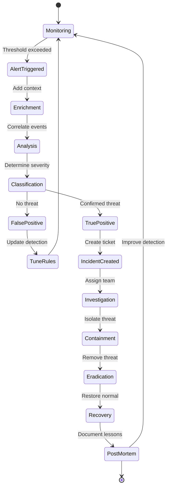

### Automated Incident Response

```javascript
// Automated incident response system
class IncidentResponseSystem {
  constructor() {
    this.playbooks = this.loadPlaybooks();
    this.responseActions = this.initializeActions();
  }
  
  async handleAlert(alert) {
    // Step 1: Enrich alert with context
    const enrichedAlert = await this.enrichAlert(alert);
    
    // Step 2: Classify incident
    const classification = this.classifyIncident(enrichedAlert);
    
    // Step 3: Execute appropriate playbook
    const playbook = this.selectPlaybook(classification);
    
    // Step 4: Create incident ticket
    const incident = await this.createIncident(enrichedAlert, classification);
    
    // Step 5: Execute automated responses
    const responses = await this.executePlaybook(playbook, incident);
    
    // Step 6: Notify stakeholders
    await this.notifyStakeholders(incident, responses);
    
    return incident;
  }
  
  async enrichAlert(alert) {
    return {
      ...alert,
      userInfo: await this.getUserInfo(alert.userId),
      assetInfo: await this.getAssetInfo(alert.sourceIp),
      threatIntel: await this.checkThreatIntel(alert.sourceIp),
      recentActivity: await this.getRecentActivity(alert.userId, '1h'),
      similarIncidents: await this.findSimilarIncidents(alert)
    };
  }
  
  classifyIncident(alert) {
    let severity = 'LOW';
    let category = 'unknown';
    let confidence = 0.5;
    
    // Brute force attack
    if (alert.type === 'multiple_failed_logins' && alert.count > 10) {
      severity = 'HIGH';
      category = 'brute_force';
      confidence = 0.9;
    }
    
    // Data exfiltration
    if (alert.type === 'unusual_data_transfer' && alert.volumeGB > 10) {
      severity = 'CRITICAL';
      category = 'data_exfiltration';
      confidence = 0.85;
    }
    
    // Malware detection
    if (alert.threatIntel?.malicious) {
      severity = 'CRITICAL';
      category = 'malware';
      confidence = 0.95;
    }
    
    return { severity, category, confidence };
  }
  
  selectPlaybook(classification) {
    return this.playbooks[classification.category] || this.playbooks.default;
  }
  
  async executePlaybook(playbook, incident) {
    const results = [];
    
    for (const action of playbook.actions) {
      try {
        const result = await this.executeAction(action, incident);
        results.push({ action: action.name, success: true, result });
      } catch (error) {
        results.push({ action: action.name, success: false, error: error.message });
      }
    }
    
    return results;
  }
  
  async executeAction(action, incident) {
    switch (action.type) {
      case 'block_ip':
        return await this.blockIpAddress(incident.sourceIp);
      
      case 'disable_user':
        return await this.disableUserAccount(incident.userId);
      
      case 'isolate_host':
        return await this.isolateHost(incident.hostname);
      
      case 'terminate_session':
        return await this.terminateSession(incident.sessionId);
      
      case 'collect_evidence':
        return await this.collectEvidence(incident);
      
      default:
        throw new Error(`Unknown action type: ${action.type}`);
    }
  }
}

// Example playbook for brute force attack
const bruteForcePlaybook = {
  name: 'Brute Force Attack Response',
  category: 'brute_force',
  
  actions: [
    {
      type: 'block_ip',
      name: 'Block source IP address',
      duration: '24h',
      automatic: true
    },
    {
      type: 'notify_user',
      name: 'Notify targeted user',
      automatic: true
    },
    {
      type: 'require_mfa',
      name: 'Force MFA on next login',
      automatic: true
    },
    {
      type: 'collect_evidence',
      name: 'Collect logs for investigation',
      automatic: true
    },
    {
      type: 'create_ticket',
      name: 'Create incident ticket',
      automatic: true,
      assignTo: 'security-team'
    }
  ],
  
  escalation: {
    condition: 'multiple_targets',
    action: 'escalate_to_security_lead'
  }
};
```

See [application_security.md](application_security.md) and [network_security.md](network_security.md) for specific security controls.

## Log Retention and Management

### Retention Policy Framework

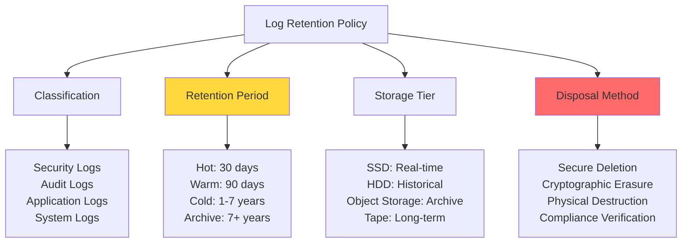

### Retention Requirements by Type

| Log Type | Minimum Retention | Compliance Driver | Storage Type |
|----------|------------------|-------------------|--------------|
| **Security Events** | 90 days - 1 year | PCI-DSS, SOC 2 | Hot → Warm |
| **Audit Logs** | 6-7 years | HIPAA, SOX | Warm → Archive |
| **Authentication** | 90 days | PCI-DSS | Hot → Warm |
| **Data Access** | 1-7 years | GDPR, HIPAA | Warm → Archive |
| **System Logs** | 30-90 days | Operational | Hot → Warm |
| **Application Logs** | 30 days | Operational | Hot |
| **Network Flow** | 30-90 days | Forensics | Warm |

### Log Lifecycle Management

```javascript
// Log lifecycle management system
class LogLifecycleManager {
  constructor() {
    this.tiers = {
      hot: { retention: 30, storage: 'ssd', searchable: true },
      warm: { retention: 90, storage: 'hdd', searchable: true },
      cold: { retention: 365, storage: 'object', searchable: false },
      archive: { retention: 2555, storage: 'glacier', searchable: false } // 7 years
    };
  }
  
  async manageLogLifecycle() {
    // Daily lifecycle management job
    const logs = await this.getAllLogIndices();
    
    for (const log of logs) {
      const age = this.calculateAge(log.created);
      const currentTier = log.tier;
      const targetTier = this.determineTargetTier(age, log.type);
      
      if (targetTier !== currentTier) {
        await this.transitionLog(log, targetTier);
      }
      
      // Check for deletion
      if (this.shouldDelete(log)) {
        await this.secureDelete(log);
      }
    }
  }
  
  determineTargetTier(ageInDays, logType) {
    const policy = this.getRetentionPolicy(logType);
    
    if (ageInDays <= 30) return 'hot';
    if (ageInDays <= 90) return 'warm';
    if (ageInDays <= 365) return 'cold';
    if (ageInDays <= policy.maxRetention) return 'archive';
    
    return 'delete';
  }
  
  async transitionLog(log, targetTier) {
    console.log(`Transitioning ${log.id} from ${log.tier} to ${targetTier}`);
    
    switch (targetTier) {
      case 'warm':
        await this.moveToWarmStorage(log);
        break;
      
      case 'cold':
        await this.moveToColdStorage(log);
        await this.removeSearchIndex(log);
        break;
      
      case 'archive':
        await this.moveToArchive(log);
        await this.createArchiveMetadata(log);
        break;
    }
  }
  
  async secureDelete(log) {
    // Compliance-aware deletion
    if (await this.hasLegalHold(log)) {
      console.log(`Legal hold prevents deletion of ${log.id}`);
      return;
    }
    
    // Cryptographic erasure (delete encryption keys)
    await this.deleteEncryptionKeys(log);
    
    // Physical deletion
    await this.deleteLogData(log);
    
    // Record deletion in audit trail
    await this.logDeletion(log);
  }
}
```

## Monitoring Best Practices

### Implementation Checklist

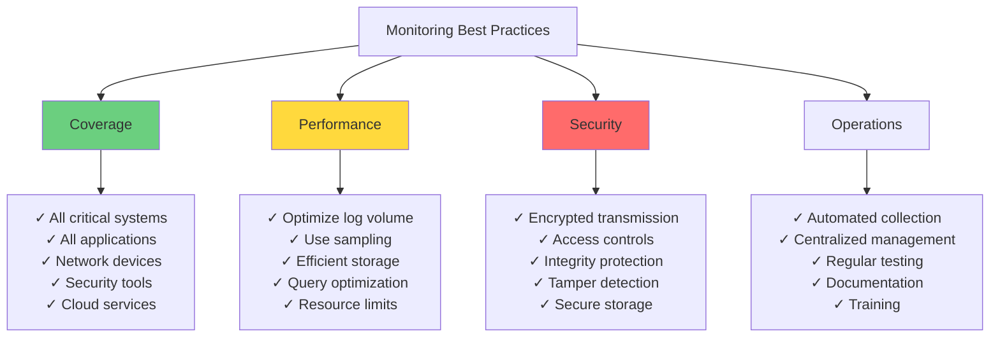

### Logging Best Practices

**DO:**
- ✅ Use structured logging (JSON)
- ✅ Include correlation IDs for tracing
- ✅ Log at appropriate severity levels
- ✅ Centralize log collection
- ✅ Protect log integrity
- ✅ Implement retention policies
- ✅ Regular log review
- ✅ Automate alerting
- ✅ Mask sensitive data
- ✅ Monitor logging infrastructure

**DON'T:**
- ❌ Log sensitive data (passwords, tokens)
- ❌ Log excessively in production
- ❌ Ignore log errors
- ❌ Store logs indefinitely
- ❌ Use unstructured logs
- ❌ Log to local files only
- ❌ Ignore false positives
- ❌ Skip log retention compliance
- ❌ Leave logs unprotected
- ❌ Forget to test alerting

### Monitoring Maturity Model

| Level | Description | Characteristics |
|-------|-------------|-----------------|
| **1. Initial** | Basic logging | Manual review, local logs, reactive |
| **2. Managed** | Centralized logging | SIEM deployed, some automation, defined processes |
| **3. Defined** | Standardized monitoring | Comprehensive coverage, automated alerting, metrics tracking |
| **4. Measured** | Quantified effectiveness | ML-based detection, proactive hunting, optimized performance |
| **5. Optimized** | Continuous improvement | Predictive analytics, automated response, self-healing |

## Related Security Domains

Monitoring and auditing integrates with all security domains:

### 1. Application Security
- [application_security.md](application_security.md) - Application monitoring:
  - Error logging and tracking
  - Security event logging
  - Performance monitoring
  - User activity tracking
  - API request logging

### 2. Authentication
- [authentication.md](authentication.md) - Authentication monitoring:
  - Login attempts (success/failure)
  - MFA challenges
  - Password changes
  - Account lockouts
  - Session management events

### 3. Authorization
- [authorization.md](authorization.md) - Access control monitoring:
  - Permission checks
  - Access denied events
  - Privilege escalations
  - Role changes
  - Resource access patterns

### 4. Data Security
- [data_security.md](data_security.md) - Data access monitoring:
  - Sensitive data access
  - Data modifications
  - Export operations
  - Encryption key usage
  - Data classification changes

### 5. Encryption
- [encryption.md](encryption.md) - Cryptographic monitoring:
  - Certificate expiration
  - Key rotation events
  - Encryption failures
  - TLS/SSL issues
  - Cryptographic operations

### 6. Network Security
- [network_security.md](network_security.md) - Network monitoring:
  - Firewall logs
  - IDS/IPS alerts
  - Network flow data
  - VPN connections
  - DDoS attacks

### 7. Compliance
- [compliance.md](compliance.md) - Compliance monitoring:
  - Regulatory requirements
  - Audit trail maintenance
  - Compliance reporting
  - Evidence collection
  - Policy violations

### 8. Best Practices
- [best_practises.md](best_practises.md) - Implementation guidelines and industry standards

## Advanced Monitoring Techniques

### Distributed Tracing

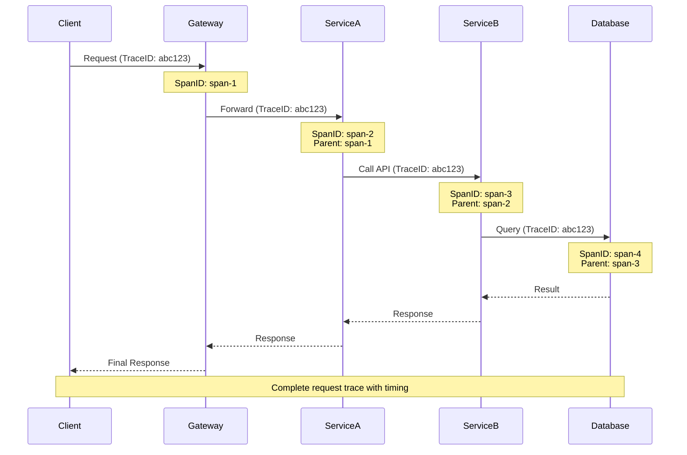

**Distributed Tracing Implementation**
```javascript
// OpenTelemetry distributed tracing
const { trace, context } = require('@opentelemetry/api');

class DistributedTracer {
  constructor(serviceName) {
    this.tracer = trace.getTracer(serviceName);
  }
  
  startSpan(operationName, parentContext) {
    return this.tracer.startSpan(operationName, {
      attributes: {
        'service.name': 'user-service',
        'service.version': '1.2.3'
      },
      kind: trace.SpanKind.SERVER
    }, parentContext);
  }
  
  async traceOperation(operationName, fn) {
    const span = this.startSpan(operationName);
    
    try {
      const result = await context.with(
        trace.setSpan(context.active(), span),
        async () => await fn(span)
      );
      
      span.setStatus({ code: trace.SpanStatusCode.OK });
      return result;
      
    } catch (error) {
      span.setStatus({
        code: trace.SpanStatusCode.ERROR,
        message: error.message
      });
      span.recordException(error);
      throw error;
      
    } finally {
      span.end();
    }
  }
}

// Usage example
const tracer = new DistributedTracer('api-service');

app.get('/api/user/:id', async (req, res) => {
  await tracer.traceOperation('getUserProfile', async (span) => {
    span.setAttribute('user.id', req.params.id);
    
    const user = await getUserFromDatabase(req.params.id);
    span.addEvent('user_retrieved', { record_count: 1 });
    
    const permissions = await getUserPermissions(user.id);
    span.addEvent('permissions_retrieved', { count: permissions.length });
    
    res.json({ user, permissions });
  });
});
```

### Synthetic Monitoring

**Proactive Health Checks**
```javascript
// Synthetic monitoring for critical paths
class SyntheticMonitor {
  constructor() {
    this.checks = [];
    this.interval = 60000; // 1 minute
  }
  
  addCheck(check) {
    this.checks.push(check);
  }
  
  start() {
    setInterval(() => this.runChecks(), this.interval);
  }
  
  async runChecks() {
    for (const check of this.checks) {
      try {
        const startTime = Date.now();
        const result = await check.execute();
        const duration = Date.now() - startTime;
        
        this.recordMetric({
          check: check.name,
          success: result.success,
          duration,
          timestamp: new Date().toISOString()
        });
        
        if (!result.success || duration > check.threshold) {
          this.alertFailure(check, result, duration);
        }
        
      } catch (error) {
        this.alertError(check, error);
      }
    }
  }
  
  recordMetric(metric) {
    // Send to time-series database
    console.log('Metric:', metric);
  }
  
  alertFailure(check, result, duration) {
    createAlert({
      severity: 'HIGH',
      title: `Synthetic check failed: ${check.name}`,
      description: `Check failed or exceeded threshold (${duration}ms > ${check.threshold}ms)`,
      result: result
    });
  }
}

// Define synthetic checks
const monitor = new SyntheticMonitor();

monitor.addCheck({
  name: 'Login Flow',
  threshold: 3000, // 3 seconds
  execute: async () => {
    const response = await fetch('https://api.example.com/auth/login', {
      method: 'POST',
      body: JSON.stringify({
        username: 'synthetic-user',
        password: 'test-password'
      })
    });
    
    return {
      success: response.ok && response.status === 200,
      statusCode: response.status
    };
  }
});

monitor.addCheck({
  name: 'Payment Processing',
  threshold: 5000,
  execute: async () => {
    // Simulate payment flow
    const steps = [
      'validate_cart',
      'calculate_total',
      'process_payment',
      'create_order'
    ];
    
    for (const step of steps) {
      const response = await executeStep(step);
      if (!response.success) {
        return { success: false, failedStep: step };
      }
    }
    
    return { success: true };
  }
});

monitor.start();
```

### Chaos Engineering for Observability

```javascript
// Chaos experiments to test monitoring
class ChaosExperiment {
  constructor(name) {
    this.name = name;
  }
  
  async injectLatency(service, delayMs) {
    console.log(`Injecting ${delayMs}ms latency into ${service}`);
    
    // Verify monitoring detects latency
    await this.verifyAlert({
      type: 'high_latency',
      service: service,
      expectedWithin: '5 minutes'
    });
  }
  
  async injectErrors(service, errorRate) {
    console.log(`Injecting ${errorRate * 100}% error rate into ${service}`);
    
    // Verify monitoring detects errors
    await this.verifyAlert({
      type: 'error_rate_spike',
      service: service,
      expectedWithin: '2 minutes'
    });
  }
  
  async killPod(service) {
    console.log(`Killing random pod for ${service}`);
    
    // Verify monitoring detects pod failure
    await this.verifyAlert({
      type: 'pod_failure',
      service: service,
      expectedWithin: '1 minute'
    });
  }
  
  async verifyAlert(expected) {
    // Check if alert was generated
    const alerts = await getRecentAlerts();
    const found = alerts.some(a => 
      a.type === expected.type && 
      a.service === expected.service
    );
    
    if (!found) {
      throw new Error(
        `Monitoring failed to detect ${expected.type} for ${expected.service}`
      );
    }
    
    console.log(`✓ Monitoring successfully detected ${expected.type}`);
  }
}
```

## Monitoring Tools Landscape

### SIEM Solutions

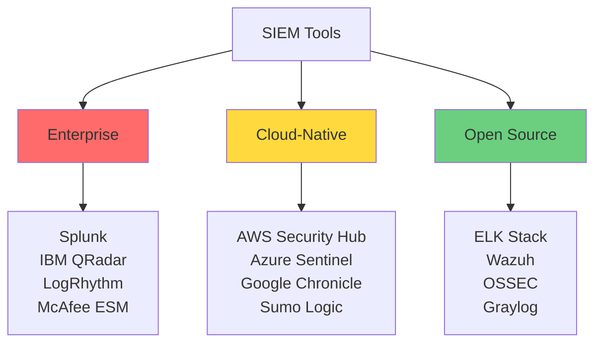

### Tool Comparison

| Tool | Type | Strengths | Best For |
|------|------|-----------|----------|
| **Splunk** | Enterprise SIEM | Powerful search, extensive integrations | Large enterprises, complex environments |
| **ELK Stack** | Open Source | Flexible, scalable, cost-effective | DevOps teams, custom implementations |
| **Azure Sentinel** | Cloud SIEM | Native Azure integration, AI/ML | Azure-heavy environments |
| **Datadog** | APM + Logging | Unified monitoring, great UX | Application performance monitoring |
| **Prometheus** | Metrics | Time-series, Kubernetes native | Cloud-native infrastructure |
| **Grafana** | Visualization | Beautiful dashboards, multi-source | Metrics visualization |
| **Jaeger** | Tracing | Distributed tracing, OpenTelemetry | Microservices architectures |

## Security Operations Center (SOC)

### SOC Operating Model

```mermaid
graph TB
    A[SOC Operations] --> B[Tier 1: Triage]
    A --> C[Tier 2: Investigation]
    A --> D[Tier 3: Expert]
    A --> E[Threat Intelligence]
    A --> F[Threat Hunting]
    
    B --> B1[Alert Monitoring<br/>Initial Triage<br/>Basic Response<br/>Escalation]
    
    C --> C1[Deep Investigation<br/>Forensics<br/>Complex Response<br/>Playbook Execution]
    
    D --> D1[Advanced Threats<br/>Malware Analysis<br/>Incident Commander<br/>Tool Development]
    
    E --> E1[IoC Collection<br/>Threat Research<br/>Intel Sharing<br/>Risk Assessment]
    
    F --> F1[Proactive Search<br/>Hypothesis Testing<br/>New TTPs<br/>Advanced Analytics]
    
    style B fill:#6bcf7f
    style C fill:#ffd93d
    style D fill:#ff6b6b
```

### SOC Metrics

**Operational Metrics**
```javascript
const socMetrics = {
  efficiency: {
    mttd: '3.5 minutes',
    mtta: '8 minutes',
    mtti: '25 minutes',
    mttc: '45 minutes',
    mttr: '2.3 hours'
  },
  
  coverage: {
    assetsMonitored: '100%',
    logSourcesCovered: 156,
    detectionRuleCoverage: '95%',
    mitreAttackCoverage: '78%'
  },
  
  effectiveness: {
    truePositiveRate: '82%',
    falsePositiveRate: '3.2%',
    detectionAccuracy: '96.8%',
    incidentEscalationRate: '15%'
  },
  
  workload: {
    alertsPerDay: 1250,
    incidentsPerWeek: 23,
    averageInvestigationTime: '35 minutes',
    alertsPerAnalyst: 85
  }
};
```

### SOC Playbooks

```javascript
// Incident response playbook structure
const phishingPlaybook = {
  name: 'Phishing Email Response',
  trigger: 'phishing_email_reported',
  severity: 'MEDIUM',
  
  phases: [
    {
      phase: 'Triage',
      steps: [
        'Review reported email headers',
        'Check sender reputation',
        'Analyze email content and attachments',
        'Identify other recipients'
      ],
      automation: ['header_analysis', 'url_scanning', 'attachment_sandbox']
    },
    
    {
      phase: 'Containment',
      steps: [
        'Remove email from all mailboxes',
        'Block sender domain',
        'Add URLs to blocklist',
        'Isolate affected systems if clicked'
      ],
      automation: ['email_quarantine', 'domain_blocking', 'url_blocking']
    },
    
    {
      phase: 'Investigation',
      steps: [
        'Identify users who clicked links',
        'Check for credential compromise',
        'Review related security events',
        'Determine campaign scope'
      ],
      automation: ['log_correlation', 'user_activity_review']
    },
    
    {
      phase: 'Recovery',
      steps: [
        'Force password reset for affected users',
        'Enable MFA if not already active',
        'Restore any affected systems',
        'Monitor for follow-up attacks'
      ],
      automation: ['password_reset', 'mfa_enforcement']
    },
    
    {
      phase: 'Post-Incident',
      steps: [
        'Document incident details',
        'Update detection rules',
        'Send security awareness reminder',
        'Review and improve playbook'
      ],
      automation: ['incident_documentation', 'rule_updates']
    }
  ],
  
  escalation: {
    condition: 'credentials_compromised OR widespread_campaign',
    action: 'escalate_to_tier2'
  }
};
```

## Cost Optimization

### Log Volume Management

```mermaid
flowchart TD
    A[Reduce Logging Costs] --> B[Sampling]
    A --> C[Filtering]
    A --> D[Aggregation]
    A --> E[Tiering]
    
    B --> B1[Sample non-critical logs<br/>Keep all security events<br/>Statistical sampling<br/>Dynamic rate adjustment]
    
    C --> C1[Drop noise<br/>Exclude debug logs<br/>Filter known good<br/>Allowlist approach]
    
    D --> D1[Aggregate metrics<br/>Summarize events<br/>Roll-up data<br/>Statistical summaries]
    
    E --> E1[Hot: 30 days<br/>Warm: 90 days<br/>Cold: 1 year<br/>Archive: 7 years]
    
    style A fill:#ffd93d
```

**Log Sampling Strategy**
```javascript
class LogSampler {
  constructor() {
    this.rules = {
      security: { sample: false, rate: 1.0 },      // Keep all
      authentication: { sample: false, rate: 1.0 }, // Keep all
      error: { sample: false, rate: 1.0 },         // Keep all
      warning: { sample: true, rate: 0.5 },        // Sample 50%
      info: { sample: true, rate: 0.1 },           // Sample 10%
      debug: { sample: true, rate: 0.01 }          // Sample 1%
    };
  }
  
  shouldLog(logLevel, eventType) {
    // Never sample security-critical events
    if (eventType === 'security' || eventType === 'audit') {
      return true;
    }
    
    const rule = this.rules[logLevel] || this.rules.info;
    
    if (!rule.sample) {
      return true;
    }
    
    return Math.random() < rule.rate;
  }
  
  log(level, message, data) {
    if (this.shouldLog(level, data.eventType)) {
      sendToLogPlatform({ level, message, data });
    } else {
      // Still count dropped logs for metrics
      incrementMetric(`logs.dropped.${level}`);
    }
  }
}
```

## Key Takeaways

1. **Comprehensive Coverage**: Monitor all security-relevant events across all systems
2. **Real-Time Detection**: Detect and respond to threats as they occur
3. **Structured Logging**: Use structured, machine-parseable log formats
4. **Protect Log Integrity**: Implement tamper-proof logging mechanisms
5. **Automated Analysis**: Leverage SIEM and automation for correlation and analysis
6. **Actionable Alerts**: Generate meaningful alerts with low false positive rates
7. **Compliance Focus**: Maintain audit trails for regulatory requirements
8. **Continuous Improvement**: Regularly tune detection rules and processes
9. **Balance Cost and Coverage**: Optimize log volume while maintaining security visibility
10. **Incident Response Integration**: Connect monitoring to incident response workflows

## Best Practices Summary

### Implementation Checklist

**Foundation (Week 1-4)**
- [ ] Deploy centralized log collection
- [ ] Configure structured logging across applications
- [ ] Implement log retention policies
- [ ] Set up basic alerting for critical events
- [ ] Document logging standards

**Enhancement (Month 2-3)**
- [ ] Deploy SIEM platform
- [ ] Create correlation rules for common attacks
- [ ] Implement automated enrichment
- [ ] Set up compliance reporting
- [ ] Establish SOC processes

**Optimization (Month 4-6)**
- [ ] Deploy anomaly detection
- [ ] Implement UEBA
- [ ] Tune alert thresholds
- [ ] Automate incident response
- [ ] Conduct chaos experiments

**Advanced (Month 6+)**
- [ ] Machine learning threat detection
- [ ] Predictive analytics
- [ ] Automated threat hunting
- [ ] Cost optimization
- [ ] Continuous improvement program

## Case Studies

For real-world monitoring and incident detection examples, see the [case-studies](case-studies/) directory:

- [OAuth Leak Detection](case-studies/case1_oauth_leak.md) - How monitoring detected a credential leak
- [Data Breach Investigation](case-studies/case2_data_breach.md) - Using audit logs for forensics
- [Ransomware Detection](case-studies/case3_ransomware.md) - Early detection through behavioral monitoring

## Conclusion

Effective monitoring and auditing are the eyes and ears of your security program. They provide the visibility needed to detect threats, respond to incidents, demonstrate compliance, and continuously improve security posture. 

Key success factors:
- **Start with the basics**: Centralized logging and basic alerting
- **Build progressively**: Add sophistication over time
- **Focus on actionable intelligence**: Quality over quantity
- **Automate extensively**: Reduce manual workload
- **Measure and improve**: Track metrics and optimize continuously
- **Integrate with response**: Monitoring is useless without action

By implementing comprehensive monitoring and auditing practices, organizations can significantly reduce their mean time to detect and respond to security incidents, while maintaining compliance with regulatory requirements.

---

**Document Version**: 1.0  
**Last Updated**: 2025  
**Related Documentation**: See links throughout document  
**For Implementation Guidance**: Refer to [best_practises.md](best_practises.md)

## Additional Resources

### Standards and Frameworks
- NIST SP 800-92: Guide to Computer Security Log Management
- ISO/IEC 27001:2013 - A.12.4 Logging and monitoring
- PCI-DSS Requirement 10: Track and monitor all access
- CIS Controls v8: Control 8 - Audit Log Management

### Tools and Platforms
- **SIEM**: Splunk, ELK Stack, Azure Sentinel, IBM QRadar
- **APM**: Datadog, New Relic, Dynatrace, AppDynamics
- **Metrics**: Prometheus, Grafana, InfluxDB
- **Tracing**: Jaeger, Zipkin, AWS X-Ray
- **Log Management**: Papertrail, Loggly, Sumo Logic

### Learning Resources
- SANS SEC511: Continuous Monitoring and Security Operations
- GIAC Certified Intrusion Analyst (GCIA)
- Coursera: Security Operations and Monitoring
- Cybrary: SOC Analyst Training