# Network Security

## Table of Contents
1. [Overview](#overview)
2. [Network Security Fundamentals](#network-security-fundamentals)
3. [Network Architecture and Segmentation](#network-architecture-and-segmentation)
4. [Perimeter Security](#perimeter-security)
5. [Network Access Control](#network-access-control)
6. [Traffic Security](#traffic-security)
7. [Virtual Private Networks (VPNs)](#virtual-private-networks-vpns)
8. [Wireless Network Security](#wireless-network-security)
9. [Network Monitoring and Detection](#network-monitoring-and-detection)
10. [DDoS Protection](#ddos-protection)
11. [Cloud Network Security](#cloud-network-security)
12. [Zero Trust Network Architecture](#zero-trust-network-architecture)
13. [Related Security Domains](#related-security-domains)

## Overview

Network security is the practice of protecting the underlying networking infrastructure from unauthorized access, misuse, malfunction, modification, destruction, or improper disclosure. It creates a secure platform for computers, users, and programs to perform their critical functions within a secure environment.

### Core Principles

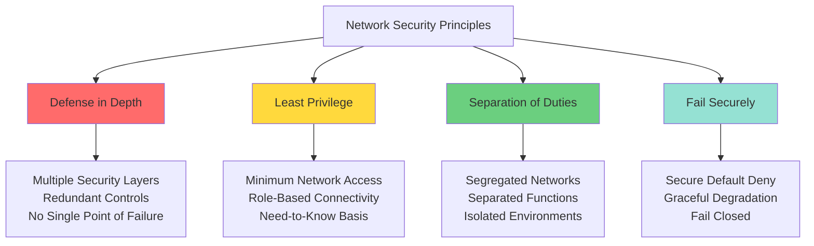

### CIA Triad in Network Context

| Principle | Network Application | Implementation |
|-----------|-------------------|----------------|
| **Confidentiality** | Protect data from eavesdropping | Encryption, VPNs, secure protocols |
| **Integrity** | Prevent data tampering | Digital signatures, checksums, secure routing |
| **Availability** | Ensure network uptime | Redundancy, DDoS protection, load balancing |

## Network Security Fundamentals

### OSI Model Security Considerations

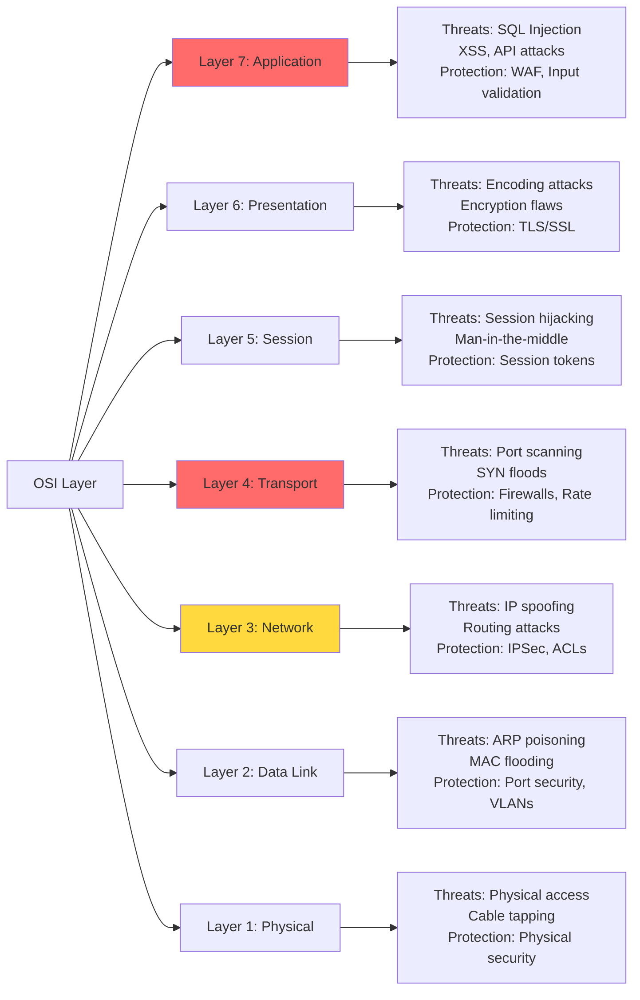

### Security at Each Layer

**Application Layer (L7)**
- Web Application Firewalls (WAF)
- API gateways and rate limiting
- Content filtering and inspection
- See [application_security.md](application_security.md) for application-level protections

**Transport Layer (L4)**
- Stateful firewall inspection
- Port-based filtering
- TCP/UDP security considerations
- TLS/SSL termination

**Network Layer (L3)**
- IP packet filtering
- Routing security (BGP security)
- Network Address Translation (NAT)
- IPSec for VPNs

**Data Link Layer (L2)**
- VLAN segmentation
- MAC address filtering
- Port security
- 802.1X network access control

## Network Architecture and Segmentation

### Traditional Three-Tier Architecture

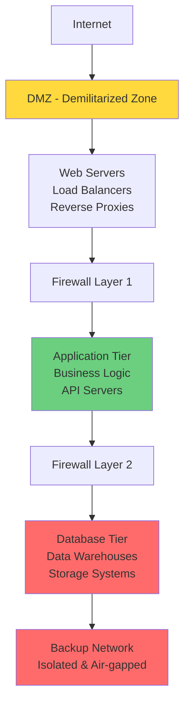

### Network Segmentation Strategies

**1. Physical Segmentation**
- Separate physical networks
- Complete isolation between segments
- Highest security, highest cost
- Used for highly sensitive environments

**2. Logical Segmentation (VLANs)**
- Software-defined network boundaries
- Shared physical infrastructure
- Cost-effective and flexible
- Requires proper configuration

**3. Micro-segmentation**
- Workload-level isolation
- Dynamic security policies
- Common in cloud and containerized environments
- Enables zero-trust architectures

### Segmentation Benefits

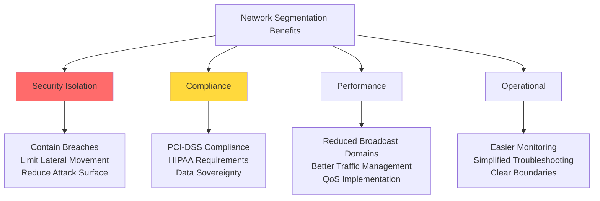

### Common Segmentation Models

**By Function**
- Production network
- Development/Testing network
- Management network
- Guest/Public WiFi network

**By Data Classification**
- Public data network
- Internal data network
- Confidential data network
- Restricted data network (see [data_security.md](data_security.md))

**By Trust Level**
- Trusted internal network
- Semi-trusted partner network
- Untrusted external network
- DMZ for internet-facing services

## Perimeter Security

### Firewall Technologies

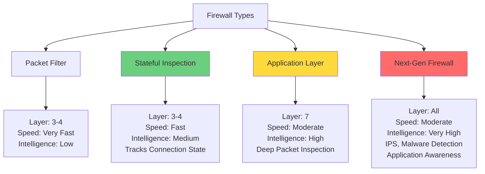

### Firewall Rules Philosophy

**Default Deny Approach**
- Block all traffic by default
- Explicitly allow only necessary traffic
- Reduces attack surface
- More secure but requires careful planning

```javascript
// Conceptual firewall rule structure
const firewallRules = [
  { priority: 1, action: 'ALLOW', protocol: 'TCP', port: 443, source: 'ANY', dest: 'WEB_SERVERS' },
  { priority: 2, action: 'ALLOW', protocol: 'TCP', port: 80, source: 'ANY', dest: 'WEB_SERVERS' },
  { priority: 3, action: 'ALLOW', protocol: 'TCP', port: 22, source: 'ADMIN_NETWORK', dest: 'ALL_SERVERS' },
  { priority: 999, action: 'DENY', protocol: 'ALL', source: 'ANY', dest: 'ANY' }
];
```

### Intrusion Prevention Systems (IPS)

**IDS vs IPS**

| Feature | IDS (Detection) | IPS (Prevention) |
|---------|----------------|------------------|
| Action | Monitors and alerts | Blocks threats |
| Deployment | Out-of-band (passive) | Inline (active) |
| Performance Impact | Minimal | Moderate |
| False Positive Risk | Alert fatigue | Blocking legitimate traffic |
| Use Case | Forensics, monitoring | Active protection |

**Detection Methods**

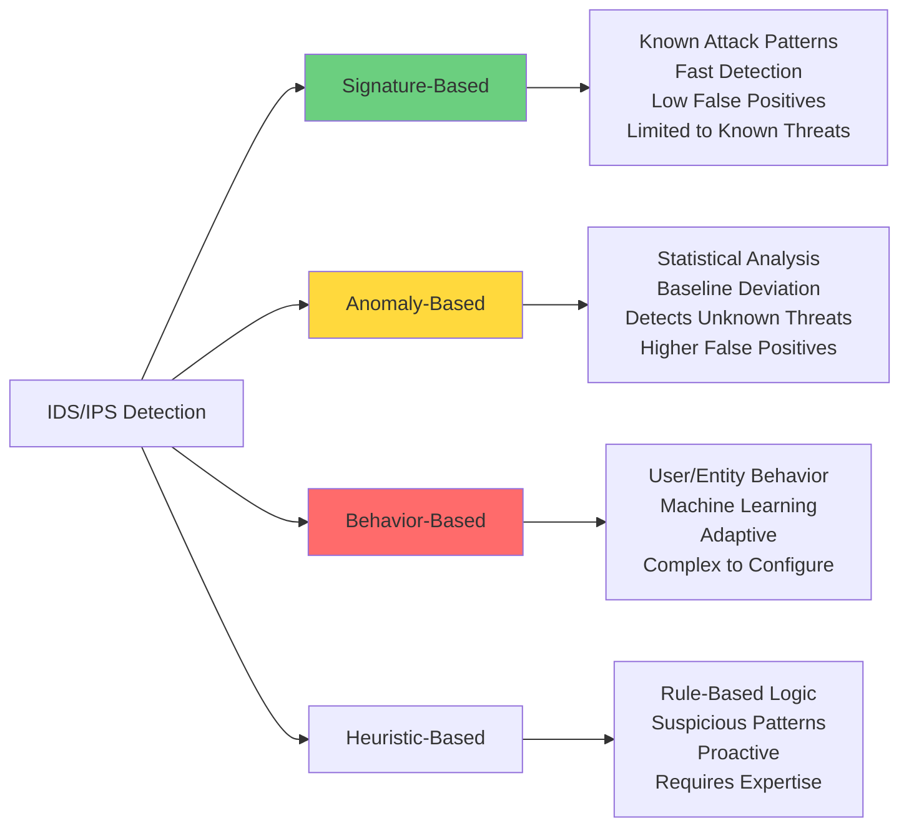

## Network Access Control

### 802.1X Authentication

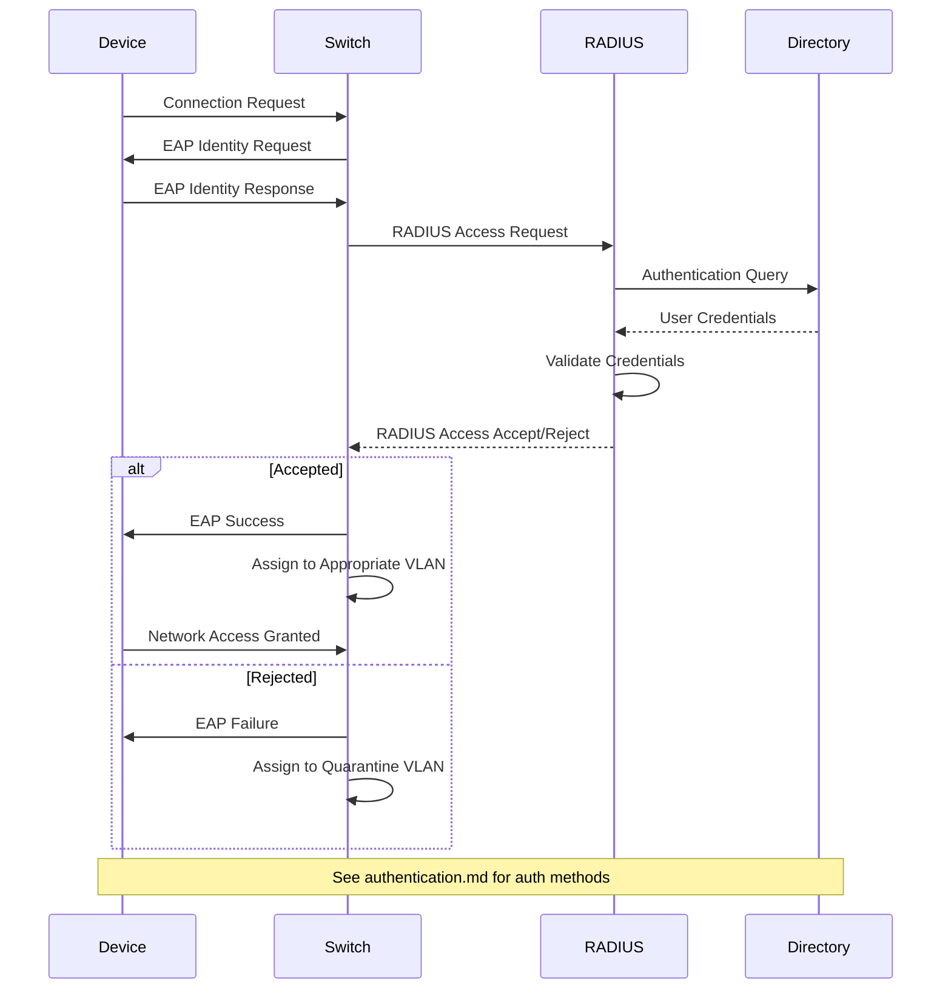

### NAC Components

**1. Authentication**
- User/device identity verification
- Certificate-based authentication
- Multi-factor authentication (see [authentication.md](authentication.md))

**2. Authorization**
- Policy-based access decisions
- Role-based network access (see [authorization.md](authorization.md))
- Dynamic VLAN assignment

**3. Endpoint Compliance**
- Security posture assessment
- Patch level verification
- Antivirus status check
- Configuration compliance

**4. Guest Network Management**
- Isolated guest networks
- Captive portal authentication
- Time-limited access
- Bandwidth restrictions

## Traffic Security

### Secure Communication Protocols

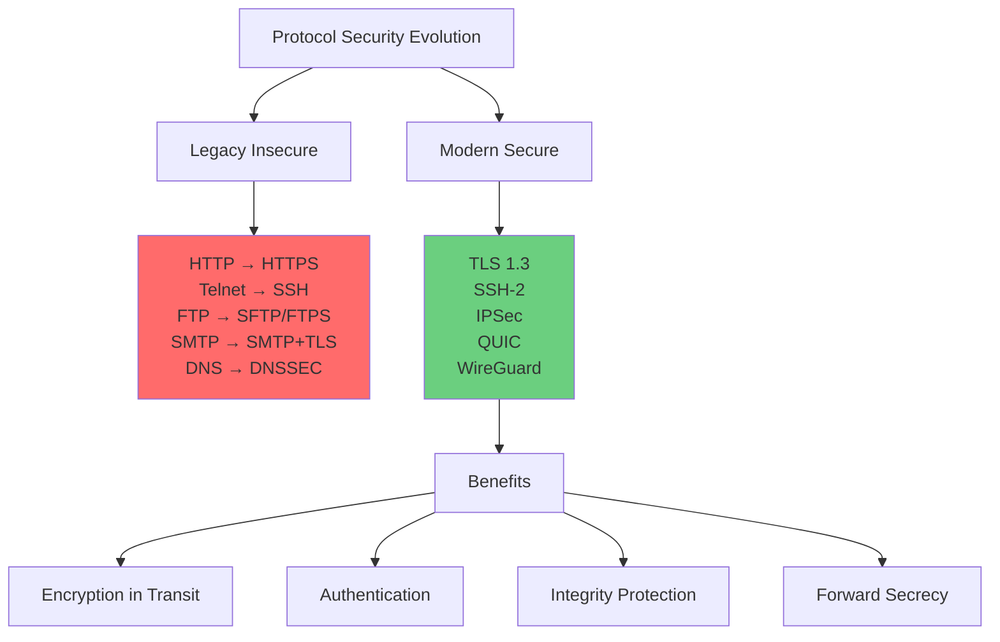

### TLS/SSL Deep Dive

**TLS Handshake Process**

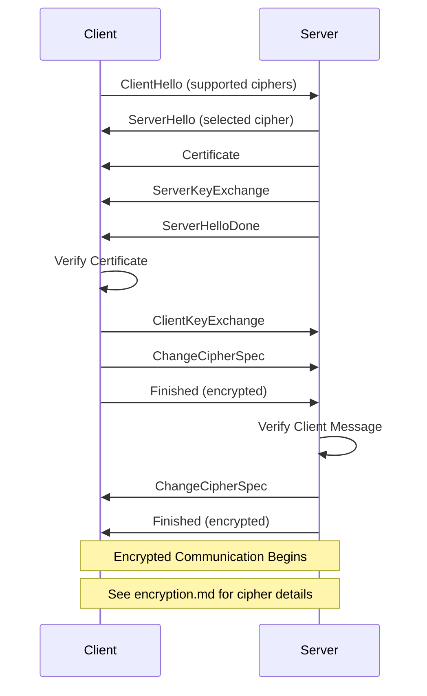

**TLS Best Practices**
- Use TLS 1.3 (disable TLS 1.0, 1.1)
- Strong cipher suites only
- Perfect Forward Secrecy (PFS)
- Certificate pinning for critical connections
- Regular certificate rotation
- See [encryption.md](encryption.md) for detailed cryptographic standards

### Network Protocol Security

**DNS Security (DNSSEC)**
- Cryptographic validation of DNS responses
- Prevents DNS spoofing and cache poisoning
- Chain of trust from root to domain
- DANE (DNS-Based Authentication of Named Entities)

**BGP Security**
- Route Origin Validation (ROV)
- BGP Route Filtering
- RPKI (Resource Public Key Infrastructure)
- Preventing route hijacking

**ARP Security**
- Dynamic ARP Inspection (DAI)
- Static ARP entries for critical systems
- ARP spoofing detection
- IP-MAC binding

## Virtual Private Networks (VPNs)

### VPN Types and Use Cases

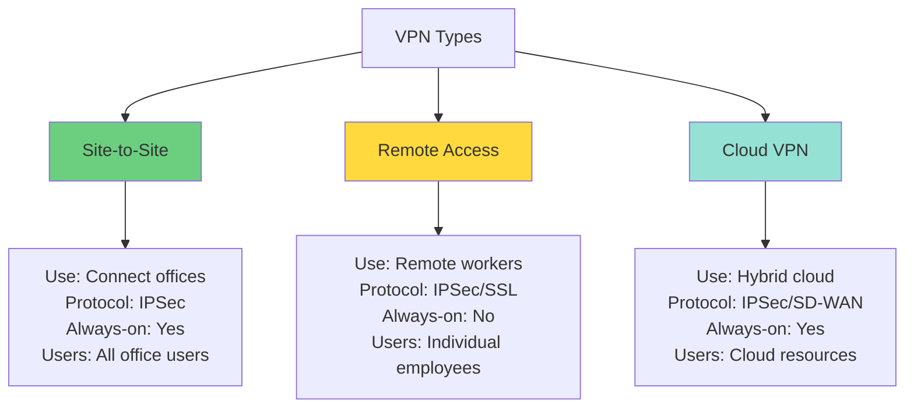

### VPN Protocols Comparison

| Protocol | Layer | Encryption | Speed | Use Case |
|----------|-------|------------|-------|----------|
| **IPSec** | L3 | Strong (AES) | Fast | Site-to-site, enterprise |
| **SSL/TLS VPN** | L7 | Strong (TLS) | Moderate | Remote access, browser-based |
| **OpenVPN** | L2/L3 | Strong (OpenSSL) | Moderate | Cross-platform, flexible |
| **WireGuard** | L3 | Modern (ChaCha20) | Very Fast | Modern deployments |
| **PPTP** | L2 | Weak (MPPE) | Fast | ❌ Deprecated, insecure |
| **L2TP/IPSec** | L2 | Strong (IPSec) | Moderate | Legacy compatibility |

### VPN Security Considerations

**Split Tunneling vs Full Tunneling**

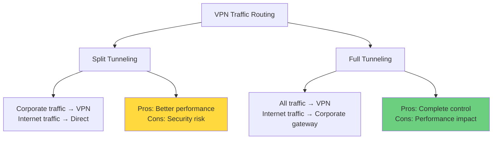

**VPN Security Best Practices**
- Enforce multi-factor authentication (see [authentication.md](authentication.md))
- Implement least-privilege access (see [authorization.md](authorization.md))
- Regular credential rotation
- Monitor VPN logs for anomalies
- Use kill switches to prevent data leakage
- Implement split-tunneling policies carefully

## Wireless Network Security

### WiFi Security Evolution

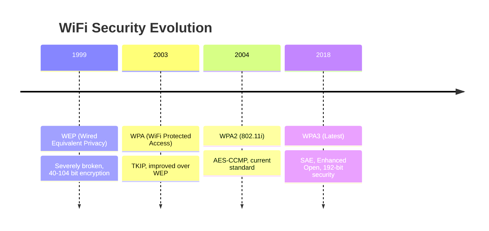

### Wireless Security Protocols

**WPA2 vs WPA3**

| Feature | WPA2 | WPA3 |
|---------|------|------|
| Encryption | AES-CCMP | AES-GCM |
| Authentication | PSK (Pre-Shared Key) | SAE (Simultaneous Authentication of Equals) |
| Brute Force Protection | Vulnerable | Protected |
| Forward Secrecy | No | Yes |
| Open Network Protection | No | Enhanced Open (OWE) |
| Enterprise Security | 802.1X/EAP | 802.1X/EAP + 192-bit |

### Wireless Attack Vectors

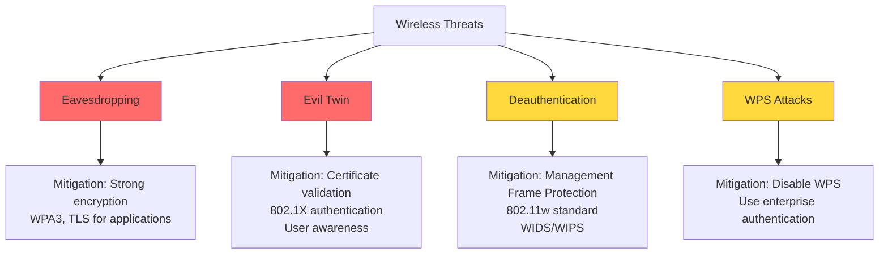

### Enterprise Wireless Security

**802.1X Enterprise Architecture**
- Centralized authentication via RADIUS
- Per-user credentials (not shared PSK)
- Certificate-based authentication
- Dynamic encryption keys per session
- Integration with corporate directory (see [authentication.md](authentication.md))

**Wireless Intrusion Detection/Prevention (WIDS/WIPS)**
- Rogue access point detection
- Unauthorized client detection
- Attack pattern recognition
- Automatic countermeasures
- RF spectrum monitoring

## Network Monitoring and Detection

### Network Visibility Strategy

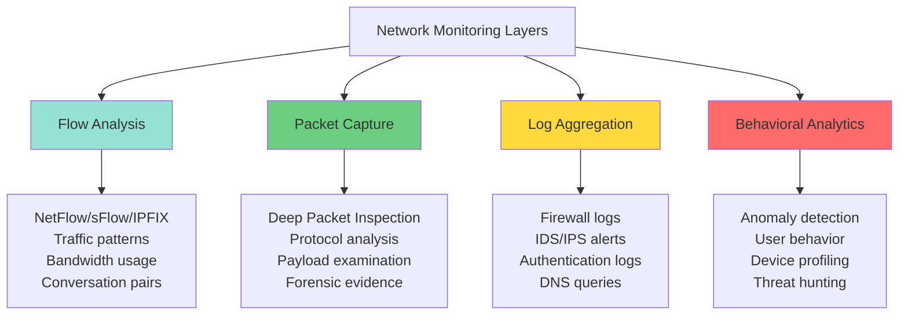

### Security Information and Event Management (SIEM)

**SIEM Architecture**

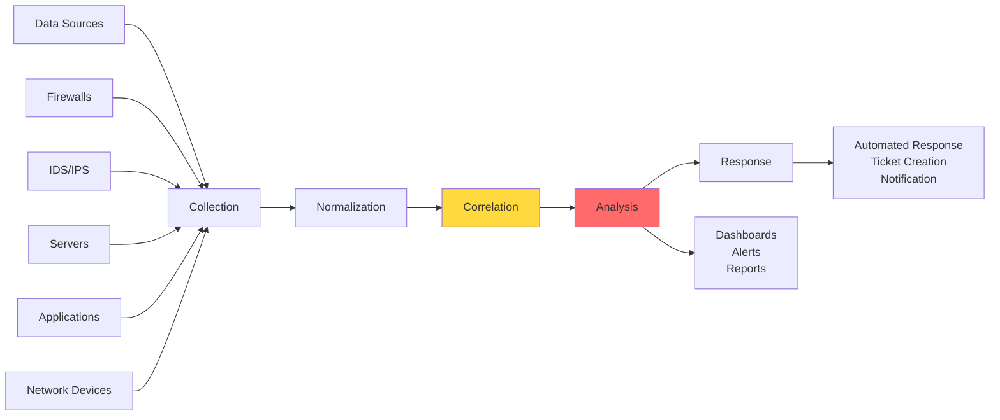

See [monitoring_auditing.md](monitoring_auditing.md) for comprehensive logging and SIEM strategies.

### Network Traffic Analysis

**Key Metrics to Monitor**
- Bandwidth utilization trends
- Protocol distribution anomalies
- Connection attempts to unusual ports
- Unexpected geographic connections
- Failed authentication attempts
- DNS query anomalies
- Certificate validation failures

**Behavioral Baselines**
```javascript
// Conceptual network baseline analysis
const networkBaseline = {
  normalTraffic: {
    avgBandwidth: '500 Mbps',
    peakHours: '9am-5pm',
    topProtocols: ['HTTPS', 'DNS', 'SSH'],
    typicalDestinations: ['SaaS providers', 'Cloud services']
  },
  anomalyDetection: {
    bandwidthThreshold: '150%', // Alert if 1.5x normal
    unusualPorts: [6667, 31337, 12345], // IRC, backdoors
    suspiciousPatterns: ['port scanning', 'data exfiltration']
  }
};
```

## DDoS Protection

### DDoS Attack Types

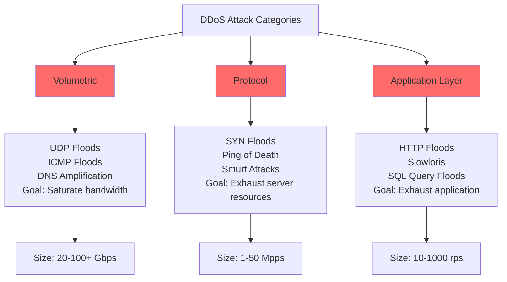

### Defense Strategies

**Multi-Layer DDoS Protection**

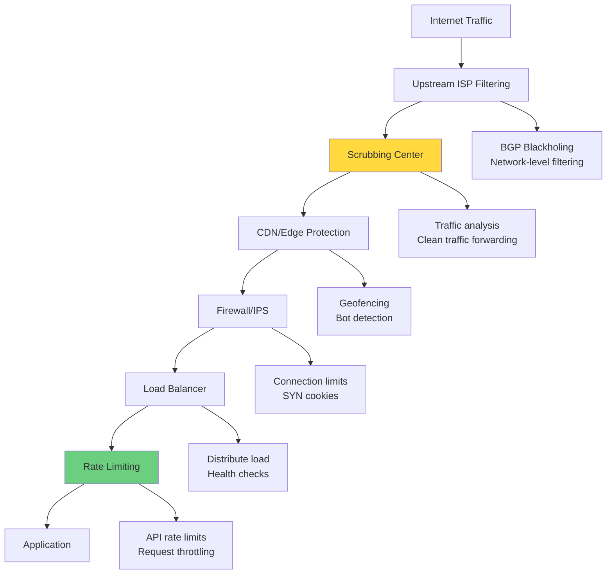

**DDoS Mitigation Techniques**

1. **Traffic Analysis and Filtering**
   - Distinguish legitimate from malicious traffic
   - GeoIP filtering for targeted attacks
   - Behavioral analysis and reputation scoring

2. **Rate Limiting and Throttling**
   - Per-IP connection limits
   - Request rate limits
   - Progressive delays for suspicious sources

3. **Anycast Network Distribution**
   - Distribute attack across multiple locations
   - No single point of failure
   - Automatic traffic routing to nearest node

4. **Capacity Planning and Over-provisioning**
   - Maintain excess capacity (2-10x normal)
   - Elastic scaling capabilities
   - Redundant infrastructure

## Cloud Network Security

### Cloud Network Architecture

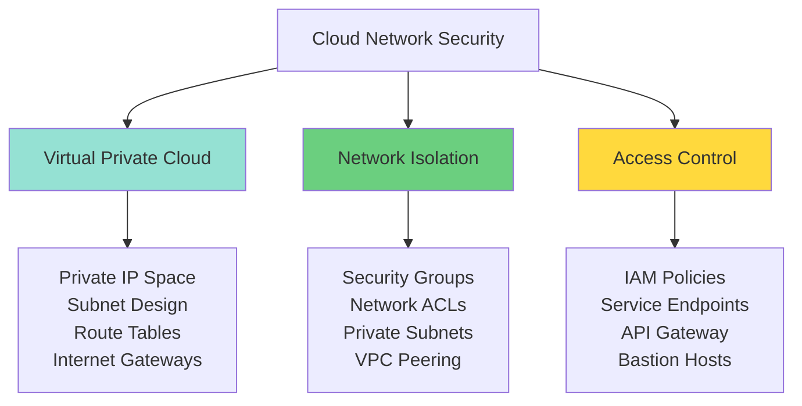

### Cloud-Specific Security Controls

**Security Groups vs Network ACLs**

| Feature | Security Groups | Network ACLs |
|---------|----------------|--------------|
| **Scope** | Instance level | Subnet level |
| **State** | Stateful | Stateless |
| **Rules** | Allow only | Allow and Deny |
| **Rule Evaluation** | All rules | Order-based |
| **Default** | Deny all inbound | Allow all |

**Shared Responsibility Model**

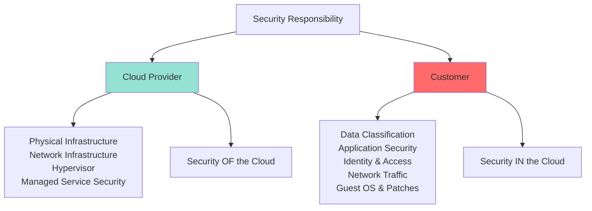

### Hybrid Cloud Connectivity

**Connection Methods**
- **VPN over Internet**: Cost-effective, variable performance
- **Direct Connect/Express Route**: Dedicated connection, predictable performance
- **SD-WAN**: Intelligent routing, multiple paths, application-aware

**Hybrid Security Considerations**
- Consistent security policies across environments
- Identity federation (see [authentication.md](authentication.md))
- Data classification and protection (see [data_security.md](data_security.md))
- Unified monitoring and logging
- Compliance across cloud and on-premise

## Zero Trust Network Architecture

### Zero Trust Principles

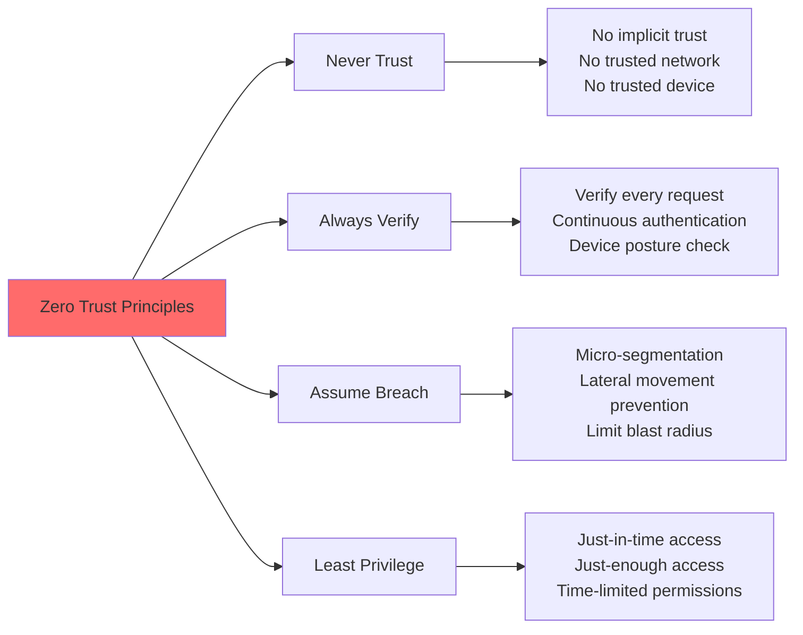

### Zero Trust Network Access (ZTNA)

**Traditional Perimeter vs Zero Trust**

```mermaid
flowchart TD
    subgraph Traditional["Traditional Castle-and-Moat"]
        T1[Trusted Internal Network] --> T2[Full Access Once Inside]
        T3[VPN Authentication] --> T1
        T4[Implicit Trust] --> T2
    end
    
    subgraph ZeroTrust["Zero Trust Model"]
        Z1[No Trusted Network] --> Z2[Per-Request Verification]
        Z3[Continuous Authentication] --> Z2
        Z2 --> Z4[Micro-perimeters Around Assets]
        Z4 --> Z5[Context-Based Access]
    end
    
    style Traditional fill:#ff6b6b,opacity:0.3
    style ZeroTrust fill:#6bcf7f,opacity:0.3
```

### Implementing Zero Trust

**Software-Defined Perimeter (SDP)**
- Application infrastructure is "dark" (not discoverable)
- Authentication before network connection
- Dynamic, identity-based network boundaries
- Integration with identity providers (see [authentication.md](authentication.md))

**Identity-Centric Security**
```javascript
// Conceptual zero trust access decision
function evaluateAccess(request) {
  const factors = {
    user: verifyIdentity(request.user),
    device: checkDevicePosture(request.device),
    location: analyzeLocation(request.location),
    behavior: assessBehavior(request.user, request.action),
    context: evaluateContext(request.time, request.resource)
  };
  
  const riskScore = calculateRisk(factors);
  const requiredTrust = getResourceSensitivity(request.resource);
  
  return riskScore <= requiredTrust ? 'ALLOW' : 'DENY';
}
```

**Zero Trust Maturity Stages**

1. **Traditional**: Perimeter-based security
2. **Advanced**: Enhanced identity controls, some segmentation
3. **Optimal**: Micro-segmentation, continuous verification
4. **Progressive**: Dynamic policies, AI-driven decisions

## Related Security Domains

Network security is interconnected with multiple security disciplines:

### 1. Data Security
- [data_security.md](data_security.md) - Protecting data in transit:
  - TLS/SSL encryption
  - VPN tunneling
  - Protocol security
  - Network-level data loss prevention

### 2. Encryption
- [encryption.md](encryption.md) - Cryptographic protocols:
  - TLS/SSL cipher suites
  - IPSec encryption
  - VPN protocols
  - Certificate management

### 3. Authentication & Authorization
- [authentication.md](authentication.md) - Network access authentication:
  - 802.1X authentication
  - VPN authentication
  - WiFi authentication
  - Certificate-based authentication

- [authorization.md](authorization.md) - Network access policies:
  - Network access control
  - VLAN assignment
  - Firewall rules
  - Zero trust policies

### 4. Application Security
- [application_security.md](application_security.md) - Network-facing applications:
  - API gateway security
  - Web application firewalls
  - DDoS protection at application layer
  - Secure communication protocols

### 5. Monitoring and Auditing
- [monitoring_auditing.md](monitoring_auditing.md) - Network visibility:
  - Network traffic analysis
  - SIEM integration
  - Intrusion detection
  - Flow logging
  - Anomaly detection

### 6. Compliance
- [compliance.md](compliance.md) - Regulatory requirements:
  - PCI-DSS network segmentation
  - HIPAA network security
  - SOC 2 network controls
  - Network audit requirements

### 7. Best Practices
- [best_practises.md](best_practises.md) - Implementation guidelines and industry standards

## Advanced Network Security Concepts

### Software-Defined Networking (SDN) Security

```mermaid
graph TB
    A[SDN Architecture] --> B[Application Layer]
    A --> C[Control Layer]
    A --> D[Infrastructure Layer]
    
    B --> B1[Network Applications<br/>Security Apps<br/>Analytics<br/>Orchestration]
    
    C --> C1[SDN Controller<br/>Centralized Control<br/>Policy Engine<br/>Network Intelligence]
    
    D --> D1[Physical Switches<br/>Virtual Switches<br/>Data Plane<br/>Forwarding]
    
    B --> E{Northbound APIs}
    E --> C
    C --> F{Southbound APIs<br/>OpenFlow}
    F --> D
    
    style C fill:#ff6b6b
    style B fill:#ffd93d
```

**SDN Security Benefits**
- **Centralized Policy Management**: Single point for security policy enforcement
- **Dynamic Response**: Rapid reconfiguration to threats
- **Automated Threat Mitigation**: Programmable responses to attacks
- **Visibility**: Complete network traffic insight

**SDN Security Challenges**
- **Controller as Single Point of Failure**: Requires redundancy and hardening
- **East-West Traffic**: Traditional perimeter controls insufficient
- **API Security**: Northbound/Southbound API vulnerabilities
- **Configuration Errors**: Centralized mistakes have widespread impact

### Network Function Virtualization (NFV)

**Virtual Network Functions**

```mermaid
flowchart LR
    A[Physical Appliances] --> B[Virtualized Functions]
    
    A1[Hardware Firewall] --> B1[Virtual Firewall]
    A2[Hardware Load Balancer] --> B2[Virtual Load Balancer]
    A3[Hardware IPS] --> B3[Virtual IPS]
    A4[Hardware Router] --> B4[Virtual Router]
    
    B1 --> C[Benefits]
    B2 --> C
    B3 --> C
    B4 --> C
    
    C --> C1[Elastic Scaling]
    C --> C2[Cost Reduction]
    C --> C3[Rapid Deployment]
    C --> C4[Automated Management]
    
    style A fill:#ff6b6b
    style B fill:#6bcf7f
```

**NFV Security Considerations**
- **Hypervisor Security**: Secure the virtualization layer
- **VM Escape Prevention**: Isolate virtual functions
- **Resource Exhaustion**: Prevent DoS on shared infrastructure
- **Secure Orchestration**: Protect NFV management plane

### Intent-Based Networking (IBN)

**Business Intent to Network Configuration**

```mermaid
sequenceDiagram
    participant Admin
    participant IBN System
    participant Network
    participant Verification
    
    Admin->>IBN System: Define Business Intent<br/>"Ensure all PCI traffic is encrypted"
    IBN System->>IBN System: Translate Intent to Policy
    IBN System->>Network: Configure Network Elements
    Network->>Network: Implement Configuration
    Network->>Verification: Report Status
    Verification->>Verification: Validate Intent
    
    alt Intent Not Met
        Verification->>IBN System: Report Discrepancy
        IBN System->>Network: Remediate Configuration
    else Intent Met
        Verification->>Admin: Compliance Confirmed
    end
    
    Note over Admin,Verification: Continuous Validation Loop
```

**IBN Security Advantages**
- Policy expressed in business terms, not technical rules
- Automatic compliance verification
- Self-healing network configuration
- Reduced human error

## Network Security in Emerging Technologies

### 5G Network Security

```mermaid
graph TD
    A[5G Security Enhancements] --> B[Network Slicing]
    A --> C[Edge Computing]
    A --> D[Enhanced Encryption]
    
    B --> B1[Isolated Virtual Networks<br/>Per-Service Security<br/>Independent Policies]
    
    C --> C1[Distributed Security<br/>Local Processing<br/>Reduced Latency]
    
    D --> D1[256-bit Encryption<br/>Enhanced Privacy<br/>Improved Authentication]
    
    A --> E[Challenges]
    E --> E1[Larger Attack Surface<br/>IoT Device Security<br/>Supply Chain Risks]
    
    style A fill:#6bcf7f
    style E fill:#ff6b6b
```

**5G Security Architecture**
- **Service-Based Architecture (SBA)**: Microservices approach requiring API security
- **Network Slicing**: Isolation between slices critical for multi-tenant security
- **Standalone (SA) Mode**: Enhanced security over Non-Standalone (NSA)
- **SUPI Concealment**: Subscriber privacy protection

### IoT Network Security

**IoT-Specific Challenges**

```mermaid
flowchart TD
    A[IoT Security Challenges] --> B[Device Constraints]
    A --> C[Scale]
    A --> D[Heterogeneity]
    A --> E[Lifecycle]
    
    B --> B1[Limited Processing<br/>Low Memory<br/>Power Constraints<br/>Can't Run Security Software]
    
    C --> C1[Billions of Devices<br/>Management Complexity<br/>Update Distribution]
    
    D --> D1[Multiple Protocols<br/>Various Vendors<br/>Different Standards]
    
    E --> E1[Long Deployment<br/>Rare Updates<br/>End-of-Life Issues]
    
    style B fill:#ff6b6b
    style C fill:#ff6b6b
```

**IoT Network Segmentation Strategy**

```javascript
// Conceptual IoT network segmentation
const iotNetworkDesign = {
  networks: {
    iot_sensors: {
      vlan: 100,
      subnet: '10.100.0.0/24',
      allowOutbound: ['mqtt_broker', 'time_server'],
      denyOutbound: ['internet', 'corporate_network'],
      allowInbound: ['management_network']
    },
    iot_controllers: {
      vlan: 101,
      subnet: '10.101.0.0/24',
      allowOutbound: ['iot_sensors', 'cloud_api'],
      denyOutbound: ['corporate_network']
    },
    iot_management: {
      vlan: 102,
      subnet: '10.102.0.0/24',
      allowOutbound: ['all_iot_networks'],
      requireMFA: true
    }
  }
};
```

**IoT Security Best Practices**
- Dedicated IoT network segment (no access to corporate network)
- Default-deny firewall rules
- Certificate-based device authentication
- Encrypted communication (TLS/DTLS)
- Regular firmware updates via secure channels
- Network behavior monitoring for anomalies

### Container and Kubernetes Network Security

**Container Network Security Model**

```mermaid
graph TB
    A[Container Network Security] --> B[Network Policies]
    A --> C[Service Mesh]
    A --> D[Ingress/Egress Control]
    
    B --> B1[Pod-to-Pod Rules<br/>Namespace Isolation<br/>Label-Based Policies]
    
    C --> C1[Mutual TLS<br/>Traffic Encryption<br/>Service Authentication<br/>Observability]
    
    D --> D1[Ingress Controllers<br/>Egress Gateways<br/>API Gateway]
    
    style B fill:#6bcf7f
    style C fill:#ffd93d
    style D fill:#95e1d3
```

**Kubernetes Network Policy Example**
```javascript
// Kubernetes network policy (YAML represented as object)
const networkPolicy = {
  apiVersion: 'networking.k8s.io/v1',
  kind: 'NetworkPolicy',
  metadata: { name: 'deny-all-except-allowed' },
  spec: {
    podSelector: { matchLabels: { app: 'backend' } },
    policyTypes: ['Ingress', 'Egress'],
    ingress: [{
      from: [{ podSelector: { matchLabels: { app: 'frontend' } } }],
      ports: [{ protocol: 'TCP', port: 8080 }]
    }],
    egress: [{
      to: [{ podSelector: { matchLabels: { app: 'database' } } }],
      ports: [{ protocol: 'TCP', port: 5432 }]
    }]
  }
};
```

**Service Mesh Security**
- **Istio/Linkerd**: Automatic mTLS between services
- **Traffic Management**: Encrypted service-to-service communication
- **Policy Enforcement**: Fine-grained access control
- **Observability**: Traffic inspection and monitoring

## Network Security Testing and Validation

### Penetration Testing Methodology

```mermaid
flowchart TD
    A[Network Penetration Testing] --> B[1. Reconnaissance]
    B --> C[2. Scanning]
    C --> D[3. Vulnerability Assessment]
    D --> E[4. Exploitation]
    E --> F[5. Post-Exploitation]
    F --> G[6. Reporting]
    
    B --> B1[OSINT<br/>DNS Enumeration<br/>Network Mapping]
    
    C --> C1[Port Scanning<br/>Service Detection<br/>OS Fingerprinting]
    
    D --> D1[Vulnerability Scanning<br/>Configuration Review<br/>Patch Assessment]
    
    E --> E1[Exploit Execution<br/>Privilege Escalation<br/>Lateral Movement]
    
    F --> F1[Data Exfiltration Test<br/>Persistence<br/>Cleanup]
    
    G --> G1[Findings Documentation<br/>Risk Assessment<br/>Remediation Guidance]
    
    style E fill:#ff6b6b
    style F fill:#ff6b6b
```

### Network Security Assessment Tools

**Categories and Use Cases**

| Category | Tools | Purpose |
|----------|-------|---------|
| **Port Scanning** | Nmap, Masscan | Discover open ports and services |
| **Vulnerability Scanning** | Nessus, OpenVAS, Qualys | Identify known vulnerabilities |
| **Packet Analysis** | Wireshark, tcpdump | Deep packet inspection |
| **Wireless Testing** | Aircrack-ng, Kismet | WiFi security assessment |
| **Exploitation** | Metasploit, Core Impact | Validate vulnerabilities |
| **Traffic Analysis** | Zeek (Bro), Suricata | Network behavior analysis |

### Security Validation Techniques

**Red Team vs Blue Team**

```mermaid
graph LR
    A[Security Teams] --> B[Red Team]
    A --> C[Blue Team]
    A --> D[Purple Team]
    
    B --> B1[Offensive Security<br/>Simulate Attacks<br/>Test Defenses<br/>Find Weaknesses]
    
    C --> C1[Defensive Security<br/>Monitor Systems<br/>Detect Threats<br/>Respond to Incidents]
    
    D --> D1[Collaboration<br/>Share Knowledge<br/>Improve Together<br/>Feedback Loop]
    
    style B fill:#ff6b6b
    style C fill:#6bcf7f
    style D fill:#ffd93d
```

**Continuous Security Validation**
- Automated breach and attack simulation
- Regular penetration testing (quarterly/annually)
- Red team exercises
- Chaos engineering for network resilience
- Bug bounty programs

## Network Security Incident Response

### Incident Response Lifecycle

```mermaid
stateDiagram-v2
    [*] --> Preparation
    Preparation --> Detection
    Detection --> Analysis
    Analysis --> Containment
    Containment --> Eradication
    Eradication --> Recovery
    Recovery --> PostIncident
    PostIncident --> Preparation
    
    Preparation: 1. Preparation<br/>• Policies & Procedures<br/>• Tools & Training<br/>• Playbooks
    Detection: 2. Detection<br/>• Monitoring<br/>• Alerts<br/>• Threat Intelligence
    Analysis: 3. Analysis<br/>• Scope Assessment<br/>• Impact Analysis<br/>• Root Cause
    Containment: 4. Containment<br/>• Isolate Systems<br/>• Block Threats<br/>• Limit Damage
    Eradication: 5. Eradication<br/>• Remove Threat<br/>• Patch Vulnerabilities<br/>• Close Gaps
    Recovery: 6. Recovery<br/>• Restore Services<br/>• Monitor for Recurrence<br/>• Validate Security
    PostIncident: 7. Post-Incident<br/>• Lessons Learned<br/>• Update Procedures<br/>• Improve Defenses
```

### Network-Specific Incident Scenarios

**DDoS Attack Response**
```javascript
// Conceptual DDoS response playbook
const ddosResponse = {
  detection: {
    triggers: ['Traffic spike > 500%', 'Connection exhaustion', 'Service degradation'],
    tools: ['NetFlow analysis', 'SIEM alerts', 'CDN reports']
  },
  
  containment: {
    immediate: [
      'Enable DDoS mitigation service',
      'Implement rate limiting',
      'Block obvious attack IPs',
      'Enable SYN cookies'
    ],
    shortTerm: [
      'Reroute through scrubbing center',
      'Scale infrastructure',
      'Contact ISP for upstream filtering'
    ]
  },
  
  communication: {
    internal: ['Incident team', 'Management', 'Affected teams'],
    external: ['Customers', 'Partners', 'Law enforcement if needed']
  }
};
```

**Network Intrusion Response**
- **Isolate**: Disconnect compromised systems from network
- **Preserve**: Capture network traffic and logs for forensics
- **Analyze**: Determine attack vector and scope
- **Contain**: Block attacker access, patch vulnerabilities
- **Eradicate**: Remove malware, close backdoors
- **Monitor**: Enhanced monitoring post-incident

## Network Security Metrics and KPIs

### Measuring Network Security Effectiveness

```mermaid
graph TD
    A[Security Metrics] --> B[Preventive Metrics]
    A --> C[Detective Metrics]
    A --> D[Response Metrics]
    
    B --> B1[Patch Coverage: 95%+<br/>Firewall Rule Review: Monthly<br/>Vulnerability Closure: <30 days<br/>Security Training: 100% completion]
    
    C --> C1[MTTD: Mean Time to Detect<br/>False Positive Rate<br/>Coverage: % monitored assets<br/>Alert Quality Score]
    
    D --> D1[MTTR: Mean Time to Respond<br/>MTTC: Mean Time to Contain<br/>Incident Severity Distribution<br/>Recovery Time]
    
    style B fill:#6bcf7f
    style C fill:#ffd93d
    style D fill:#ff6b6b
```

### Key Performance Indicators

| Metric | Target | Measurement |
|--------|--------|-------------|
| **Mean Time to Detect (MTTD)** | < 5 minutes | From breach to detection |
| **Mean Time to Respond (MTTR)** | < 15 minutes | From detection to response action |
| **Mean Time to Contain (MTTC)** | < 1 hour | From response to containment |
| **Security Event Volume** | Decreasing trend | Daily/weekly alert volume |
| **False Positive Rate** | < 5% | Alerts that aren't real threats |
| **Vulnerability Remediation** | Critical: 7 days<br/>High: 30 days | Time from discovery to fix |
| **Network Coverage** | 100% | Assets with security monitoring |
| **Compliance Score** | 100% | Policy adherence rate |

### Security Posture Dashboard

```javascript
// Conceptual security dashboard metrics
const securityMetrics = {
  realtime: {
    activeThreats: 3,
    blockedConnections: 1247,
    bandwidthUtilization: '65%',
    firewallThroughput: '8.2 Gbps'
  },
  
  performance: {
    mttd: '3.5 minutes',
    mttr: '12 minutes',
    mttc: '45 minutes',
    uptime: '99.98%'
  },
  
  coverage: {
    assetsMonitored: '100%',
    logSources: 156,
    vulnerabilities: {
      critical: 0,
      high: 2,
      medium: 15,
      low: 43
    }
  }
};
```

## Future Trends in Network Security

### Artificial Intelligence and Machine Learning

```mermaid
flowchart LR
    A[AI/ML in Network Security] --> B[Threat Detection]
    A --> C[Automated Response]
    A --> D[Predictive Security]
    
    B --> B1[Anomaly Detection<br/>Pattern Recognition<br/>Zero-Day Detection<br/>Behavioral Analysis]
    
    C --> C1[Automated Blocking<br/>Self-Healing Networks<br/>Dynamic Policies<br/>Rapid Mitigation]
    
    D --> D1[Risk Prediction<br/>Proactive Defense<br/>Threat Intelligence<br/>Vulnerability Prediction]
    
    style B fill:#6bcf7f
    style C fill:#ffd93d
    style D fill:#95e1d3
```

**AI/ML Applications**
- **Unsupervised Learning**: Detect unknown threats through anomaly detection
- **Supervised Learning**: Classify traffic patterns and attack signatures
- **Deep Learning**: Advanced pattern recognition in network behavior
- **Reinforcement Learning**: Optimize security policies through trial and error

### Quantum Computing and Post-Quantum Cryptography

**Quantum Threat to Current Encryption**

```mermaid
timeline
    title Quantum Computing Impact
    Today : Current RSA/ECC Safe
          : Symmetric: 256-bit AES sufficient
    2030s : Quantum Computers Capable
          : RSA/ECC Breakable
          : Need Post-Quantum Crypto
    2040s : Quantum-Safe Standard
          : Lattice-based cryptography
          : Hash-based signatures
```

**Post-Quantum Network Security**
- Lattice-based cryptography for key exchange
- Hash-based signatures for authentication
- Hybrid classical-quantum approaches
- Crypto-agility: ability to quickly switch algorithms

### Edge Computing Security

**Distributed Security Architecture**
- Security processing at edge locations
- Reduced latency for security decisions
- Local threat detection and mitigation
- Privacy-preserving local data processing

### Network Automation and Orchestration

**Security Automation Benefits**
- Faster incident response
- Consistent policy enforcement
- Reduced human error
- Scale security operations

**Orchestration Challenges**
- Configuration drift
- Automation security (securing the automation)
- Change management
- Audit and compliance

## Implementation Roadmap

### Phased Network Security Implementation

```mermaid
gantt
    title Network Security Implementation Roadmap
    dateFormat  YYYY-MM
    section Phase 1: Foundation
    Network Assessment           :2024-01, 1M
    Segmentation Design         :2024-02, 1M
    Firewall Deployment         :2024-03, 2M
    
    section Phase 2: Enhancement
    IDS/IPS Implementation      :2024-04, 2M
    VPN Deployment             :2024-05, 1M
    WiFi Security Upgrade      :2024-06, 1M
    
    section Phase 3: Advanced
    Zero Trust Architecture    :2024-07, 3M
    SIEM Integration          :2024-08, 2M
    Automation & Orchestration:2024-10, 2M
    
    section Phase 4: Optimization
    AI/ML Security Tools      :2024-12, 3M
    Continuous Improvement    :2025-03, 6M
```

### Quick Wins vs Long-term Strategy

**Quick Wins (0-3 months)**
- Enable logging on all network devices
- Implement basic firewall rules (default deny)
- Deploy network segmentation (VLANs)
- Disable unnecessary services
- Update network device firmware
- Strong WiFi encryption (WPA3)

**Medium-term (3-12 months)**
- Deploy IDS/IPS
- Implement centralized authentication (802.1X)
- Deploy SIEM for log aggregation
- Network access control (NAC)
- VPN infrastructure
- Regular penetration testing

**Long-term (12+ months)**
- Zero trust architecture
- AI-powered threat detection
- Automated incident response
- Advanced threat hunting
- Integration with threat intelligence
- Continuous security validation

## Best Practices Summary

### Network Security Checklist

#### Architecture & Design
- [ ] Network segmentation implemented (DMZ, internal zones)
- [ ] Principle of least privilege enforced
- [ ] Default deny firewall policies
- [ ] Defense in depth strategy
- [ ] Redundancy for critical components
- [ ] Documented network architecture

#### Access Control
- [ ] Strong authentication (MFA where possible)
- [ ] 802.1X for network access control
- [ ] Role-based access control (RBAC)
- [ ] Regular access reviews
- [ ] Guest network isolation
- [ ] VPN for remote access

#### Monitoring & Detection
- [ ] Comprehensive logging enabled
- [ ] SIEM deployment and tuning
- [ ] IDS/IPS deployed and monitored
- [ ] Network traffic analysis
- [ ] Anomaly detection
- [ ] 24/7 monitoring capability

#### Protection Mechanisms
- [ ] Next-generation firewalls deployed
- [ ] DDoS protection in place
- [ ] TLS/SSL for all sensitive traffic
- [ ] Wireless security (WPA3)
- [ ] Email security gateway
- [ ] Web content filtering

#### Maintenance & Operations
- [ ] Regular security assessments
- [ ] Patch management process
- [ ] Change management process
- [ ] Backup and disaster recovery
- [ ] Incident response plan
- [ ] Security awareness training

#### Compliance & Governance
- [ ] Regulatory compliance verified
- [ ] Security policies documented
- [ ] Regular audits conducted
- [ ] Compliance monitoring automated
- [ ] Risk assessments performed
- [ ] Documentation maintained

## Conclusion

Network security is a critical foundation of any organization's cybersecurity posture. As networks become more complex with cloud adoption, IoT devices, and remote work, the attack surface continues to expand. A comprehensive network security strategy must:

1. **Start with Strong Architecture**: Proper network segmentation and design
2. **Implement Defense in Depth**: Multiple layers of security controls
3. **Embrace Zero Trust**: Never trust, always verify
4. **Maintain Visibility**: Comprehensive monitoring and logging
5. **Automate Where Possible**: Scale security operations
6. **Continuously Improve**: Regular testing and updates
7. **Stay Current**: Adapt to emerging threats and technologies

Network security is not a destination but a continuous journey requiring constant vigilance, adaptation, and improvement.

---

## Case Studies

For real-world network security implementations, architecture examples, and lessons learned, see the [case-studies](case-studies/) directory.

**Recommended Reading:**
- Case Study: Enterprise Zero Trust Implementation
- Case Study: DDoS Mitigation at Scale
- Case Study: Cloud Migration Network Security
- Case Study: IoT Network Segmentation

---

**Document Version**: 1.0  
**Last Updated**: 2025  
**Related Documentation**: See links throughout document  
**For Questions**: Refer to [best_practises.md](best_practises.md) for implementation guidance